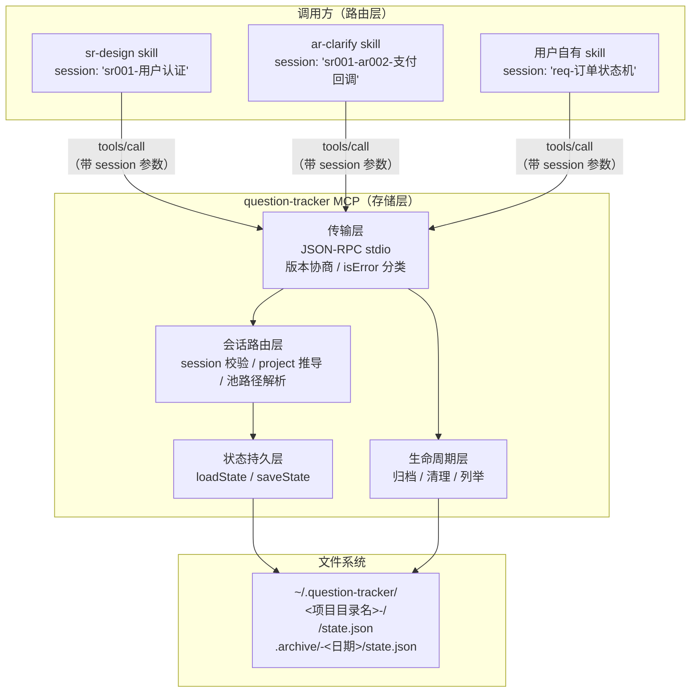
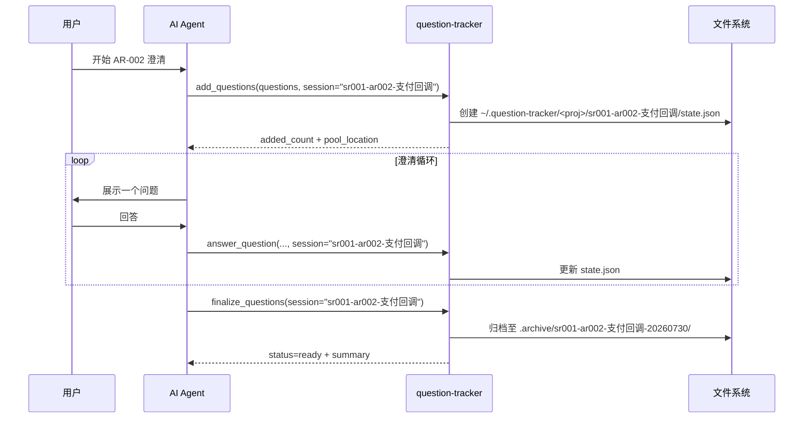
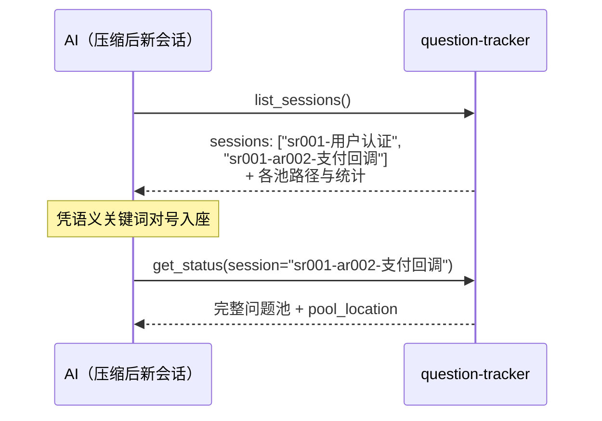
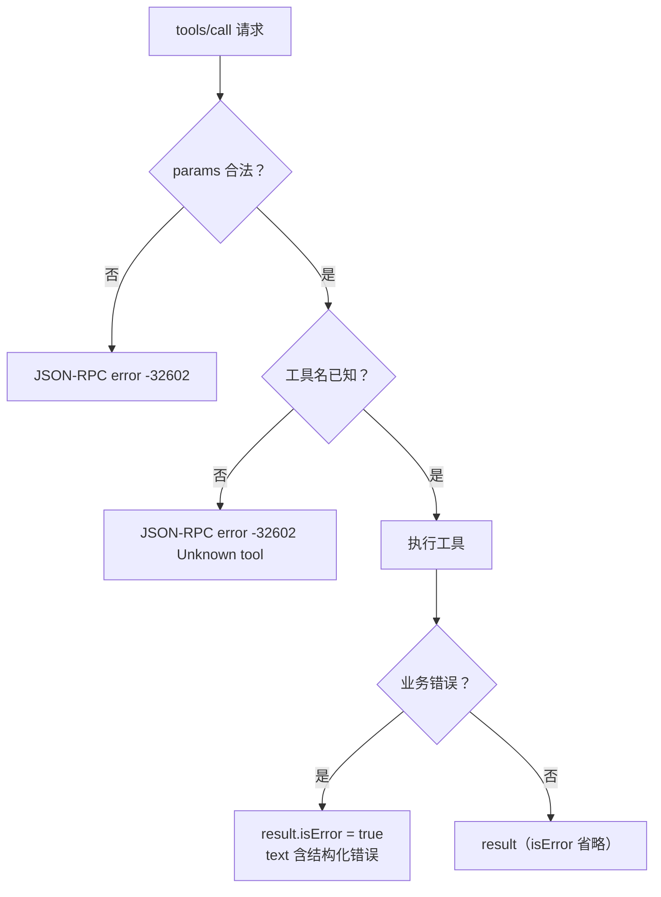
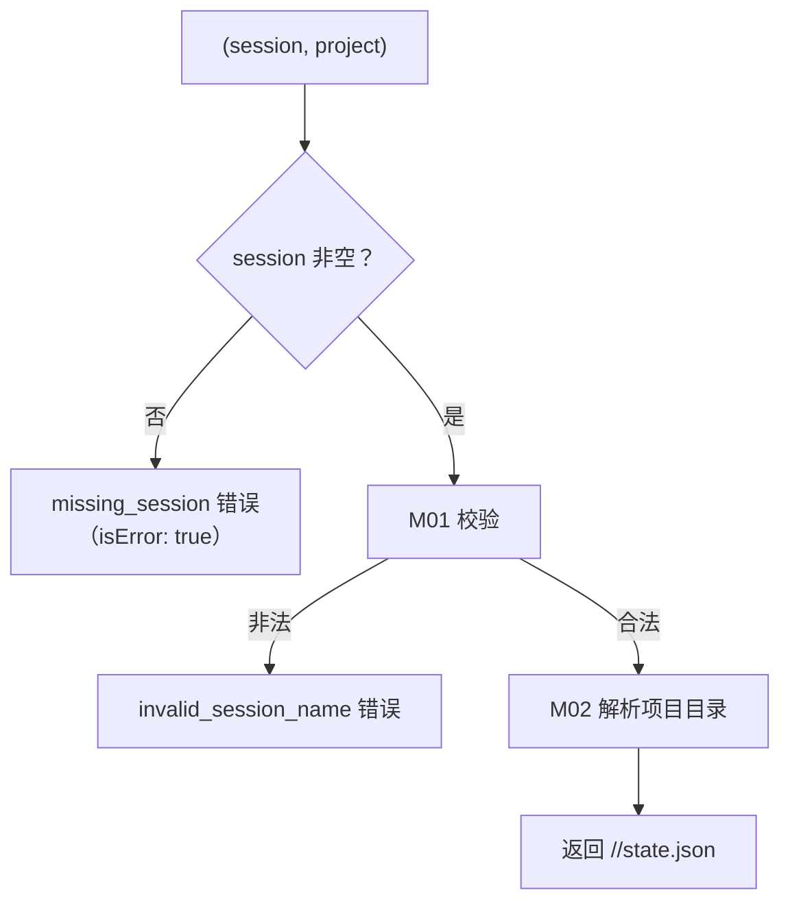
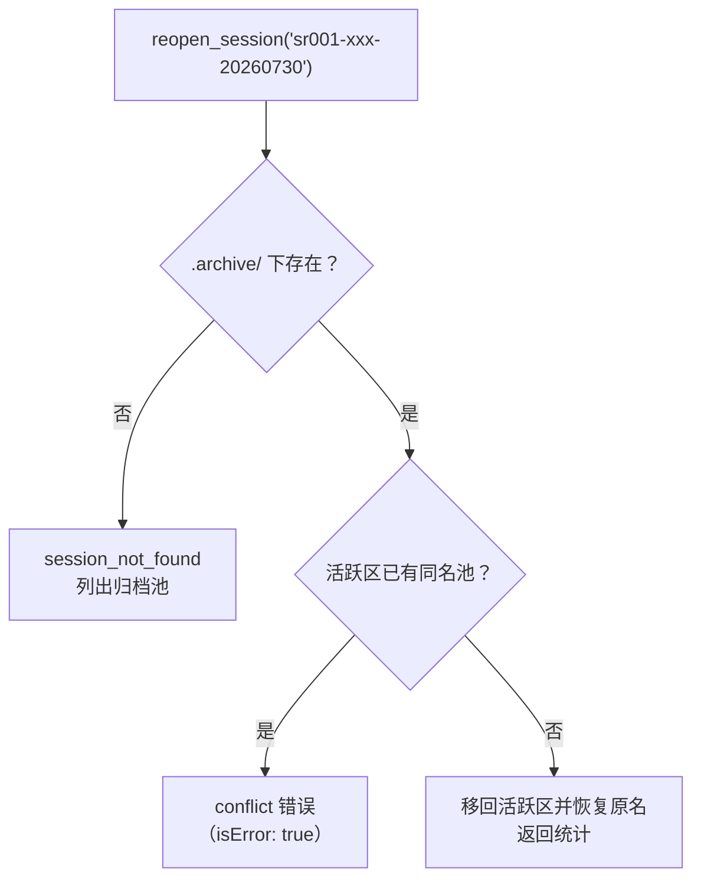
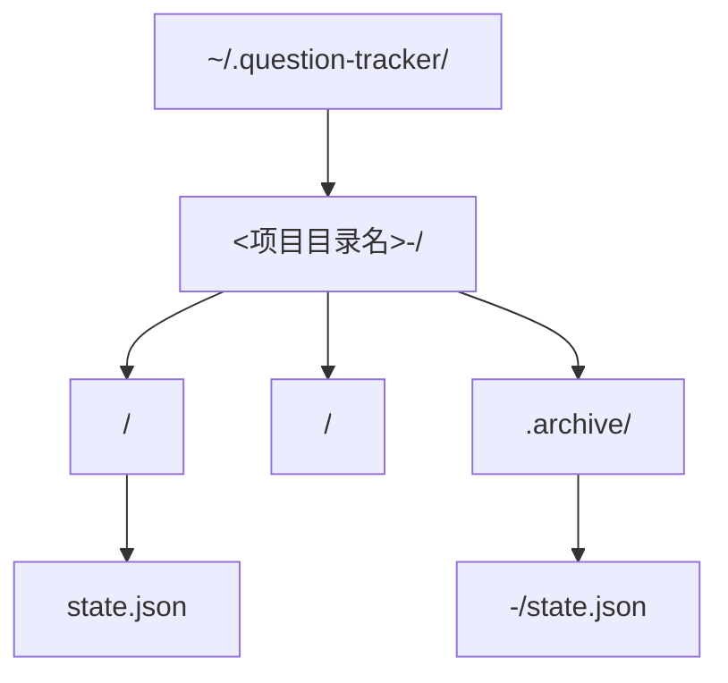

# 《question-tracker 会话隔离重构》功能设计说明书

| 文档版本 | V2.1 |
|---|---|
| 编写日期 | 2026-07-30 |
| 编写人 | sdfang1053 |
| 审核人 | |
| 批准人 | |
| 文档状态 | 草稿 |

**修订记录**

| 版本 | 日期 | 修改人 | 修改说明 |
|---|---|---|---|
| V1.0 | 2026-07-30 | sdfang1053 | 初稿 |
| V2.0 | 2026-07-30 | sdfang1053 | 按 GB/T 8567 结构整改；纳入 MCP 协议合规要求与双实现处置决策 |
| V2.1 | 2026-07-30 | sdfang1053 | 审核意见整改：session 改必填去除 default 回退；新增 reopen/delete 工具；补充并发安全与敏感信息约束 |

---

## 1. 引言

### 1.1 编写目的

本文档描述 question-tracker MCP 服务器会话隔离机制的重构设计：将问题池的存储与路由从 AAW 目录约定（`.sdd/`）中解耦，改为 **MCP 自有存储 + 调用方语义化命名** 的模型，并使协议实现 100% 符合 MCP 官方规范（2025-06-18 版）。

预期读者：开发人员、测试人员、审核人员、维护人员。

### 1.2 项目背景

- 软件系统名称：question-tracker MCP Server
- 所属项目：Awesome-Agent-Workflow（AAW）
- 任务提出者：sdfang1053
- 开发者：sdfang1053
- 用户：AAW 各 skill（sr-design / ar-clarify / module-boundary-design）、用户自有 skill、各 Agent 宿主（Claude Code / Chrys / Codex / OpenCode）的最终用户
- 与其他系统的关系：
  - 作为 MCP stdio 子进程被 Agent 宿主拉起
  - Go 实现为唯一生产运行时（bin/ 二进制，随 install.sh 与自动更新 zip 分发）
  - Python 实现冻结为 legacy（决策 D-PY-01）

### 1.3 用户反馈的问题

| 编号 | 反馈 | 现象 |
|---|---|---|
| P1 | 多 SR 并行混乱 | 同时进行两个 SR 设计时，`.sdd/.current_session` 只有一个，多会话互相覆盖标记，问题池串扰 |
| P2 | AR 间互相影响 | ar-clarify 之后工作围绕单个 AR，但问题池是 SR 维度，池内混着其他 AR 的决策记录；且 ar-clarify 读"前序池"作为上下文时把其他 AR 的决策一并读入 |
| P3 | 脱离 AAW 不可用 | 用户自有的需求分析 skill（不在 AAW 体系）想用 MCP 做决策点持久化，因无标记文件全部工具报错；持久化失败导致 Agent 上下文压缩后决策记录丢失 |
| P4 | 问题池不可见 | 用户想知道问题池文件位置，审计 AI 是否记错答案 |
| P5 | 废弃池堆积 | 长期使用后产生大量历史问题池，缺少清理机制 |

### 1.4 术语与缩略语

| 术语/缩略语 | 定义 |
|---|---|
| 问题池 | 一个 session 对应的全部问题、答案及其历史的持久化集合（一个 state.json 文件） |
| session | 问题池的逻辑标识，由调用方语义化命名（如 `sr001-用户认证`） |
| project | 项目维度隔离标识，默认由 MCP 进程工作目录推导 |
| 活跃池 | 未完成 finalize 的池，位于 `<project>/<session>/` |
| 归档池 | finalize 完成后的池，位于 `<project>/.archive/` |
| MCP | Model Context Protocol，模型上下文协议 |
| 工具执行错误 | MCP 规范中的 Tool Execution Errors，载体为 `result.isError: true` |
| 协议错误 | MCP 规范中的 Protocol Errors，载体为 JSON-RPC `error` 字段 |

### 1.5 参考资料

| 序号 | 文档名称 | 版本 | 来源 |
|---|---|---|---|
| 1 | 《question-tracker 会话隔离重构-详细设计说明书》 | V1.0 | AAW docs/ |
| 2 | MCP Specification — Lifecycle | 2025-06-18 | modelcontextprotocol.io |
| 3 | MCP Specification — Transports | 2025-06-18 | modelcontextprotocol.io |
| 4 | MCP Specification — Tools | 2025-06-18 | modelcontextprotocol.io |
| 5 | GB/T 8567 计算机软件文档编制规范 | — | 国家标准 |
| 6 | main.go / mcp_server.py 源码 | 当前 | skills/question-tracker-mcp/ |

---

## 2. 总体设计

### 2.1 设计目标

| 编号 | 目标 | 对应反馈 |
|---|---|---|
| G1 | 与 AAW 彻底解耦：question-tracker 成为通用决策点持久化 MCP，任意 skill 可用 | P3 |
| G2 | 语义化 session 隔离：调用方按工作单元命名池，多 SR 并行、AR 独立互不干扰 | P1、P2 |
| G3 | 容错自愈：session 传错时不报错死路，列出现有池供 AI 选择 | P1、P3 |
| G4 | 用户可审计：池位置可读、可查、路径可透露 | P4 |
| G5 | 池生命周期管理：finalize 自动归档保持活跃列表干净；提供受控清理，绝不自动删除工作产物 | P5 |
| G6 | 路由显式化：session 为必填参数，无隐式回退；发现与操作分离（list_sessions 发现，其余工具按名操作） | P1、P3 |
| G7 | MCP 协议 100% 合规：修复 `isError` 缺失、未知工具路径、版本协商三项差距 | — |
| G8 | Go 为唯一演进运行时，Python 冻结 legacy | — |
| G9 | 并发安全：同一进程内同池读写串行化，消除 read-modify-write 竞态 | — |

### 2.2 设计原则与约束

- **存储层归 MCP，路由层归调用方**：MCP 拥有目录体系与文件格式；session 标识由调用方**显式传入且必填**，MCP 不猜、不设隐式回退
- **发现与操作分离**：`list_sessions` 无需 session 即可浏览全部池（失忆时的发现入口）；其余工具必须显式指定目标池
- **决策经文档传递，不经池传递**：SR 阶段决策通过 `SR-design.md` 传递，ar-clarify 不读前序池，各起炉灶
- **误删零容忍**：任何自动机制不得删除用户数据；删除必须显式确认
- **技术约束**：Go 单文件二进制、零外部依赖、stdio 传输；不得引入新框架
- **规范约束**：MCP 官方规范 2025-06-18 版（lifecycle / transports / tools）为合规基线

### 2.3 总体架构设计



**分层说明**：

| 层 | 职责 | 对应反馈 |
|---|---|---|
| 传输层 | JSON-RPC 协议、版本协商、错误分类（isError）、工具注册 | G7 |
| 会话路由层 | session/project 合法性校验、路径解析、池列举 | G2、G3 |
| 状态持久层 | state.json 读写、池自动创建 | G1 |
| 生命周期层 | finalize 归档、受控清理、list_sessions | G4、G5 |

### 2.4 功能结构

| 模块编号 | 模块名称 | 功能概述 | 优先级 |
|---|---|---|---|
| M01 | session 命名与校验 | 语义化命名的合法性校验（防路径穿越） | 高 |
| M02 | 项目维度解析 | project 参数或 CWD 推导项目目录 | 高 |
| M03 | 会话路由 | (session, project) → state.json 绝对路径 | 高 |
| M04 | 问题池存取 | state.json 读写、空池初始化、目录自动创建 | 高 |
| M05 | 容错与池列举 | 读改类工具池缺失时返回现有池列表 | 高 |
| M06 | 六工具参数化 | 既有工具增加 session/project 参数 | 高 |
| M07 | list_sessions | 枚举池（名称/路径/统计/归档标记），**无需 session 参数的发现入口** | 高 |
| M08 | finalize 归档 | ready 后池移入 `.archive/` | 高 |
| M09 | cleanup_sessions | 归档池的受控清理（默认只列不删） | 中 |
| M10 | 传输层合规 | isError 分类、版本协商、协议错误路径 | 高 |
| M11 | AAW skill 适配 | 三个 skill 的调用指导更新 | 高 |
| M12 | reopen_session | 归档池重开回活跃区 | 中 |
| M13 | delete_session | 活跃池的受控删除（confirm 强制） | 中 |

### 2.5 处理流程

#### 2.5.1 标准调用流程（以 ar-clarify 为例）



#### 2.5.2 失忆恢复流程



**发现与操作分离**：失忆的 AI 先调 `list_sessions`（无需 session）浏览，凭语义命中后再按名操作。session 为必填参数，无 default 回退——避免"忘传参数全部挤入默认池"的重蹈 P1 覆辙。

#### 2.5.3 错误分类流程（MCP 合规）



### 2.6 运行环境

| 类别 | 配置要求 |
|---|---|
| 操作系统 | Linux、Windows、macOS |
| 运行时 | Go 静态编译二进制，零外部依赖 |
| 传输 | stdio（JSON-RPC 2.0，换行分隔，UTF-8） |
| 存储 | 用户主目录可写（`~/.question-tracker/`） |
| 协议基线 | MCP 2025-06-18 |

### 2.7 人工处理过程

| 场景 | 人工动作 |
|---|---|
| 审计问题池 | 用户直接浏览 `~/.question-tracker/`，或要求 AI 调用 `list_sessions` 展示 |
| 清理历史池 | 用户要求 AI 调用 `cleanup_sessions`（先 list_expired 审阅，再 confirm purge） |
| 删除误建的池 | 用户要求 AI 调用 `delete_session`（confirm 确认） |
| 重开已归档的池 | 用户要求 AI 调用 `reopen_session` |

### 2.8 尚未解决的问题

| 编号 | 问题 | 说明 |
|---|---|---|
| U1 | CWD 推导 project 的固化 | MCP 进程 CWD 启动后不变，Agent /chdir 后新调用落到旧 project 目录；缓解：`project` 参数覆盖 + 文档建议一会话一项目 |

---

## 3. 功能模块设计

### 3.1 模块 M01：session 命名与校验

#### 3.1.1 功能描述

校验 session/project 命名的合法性，使其可安全作为文件系统单层目录名。对应 G2。

#### 3.1.2 输入 / 输出

| 类型 | 名称 | 数据类型 | 约束条件 | 说明 |
|---|---|---|---|---|
| 输入 | name | string | 任意 | 待校验名称 |
| 输出 | 校验结果 | error / nil | — | nil 为合法 |

#### 3.1.3 业务规则

| 规则 | 说明 | 拒绝示例 |
|---|---|---|
| 非空 | 去首尾空白后非空 | `""`、`"   "` |
| 长度 | ≤ 128 字符 | 超长串 |
| 无路径分隔 | 不含 `/`、`\\` | `"a/b"` |
| 无穿越 | 不为 `.`、`..`，不含 `..` 段 | `".."`、`"../x"` |
| 非绝对路径 | 不含 `:`，不以 `/` 开头 | `"C:\\x"`、`"/abs"` |
| 无控制字符 | 不含 < 0x20 字符 | 换行、制表符 |

允许：中文、空格、连字符、下划线、点号（非开头）、数字。

#### 3.1.4 异常处理

| 异常场景 | 系统响应 | 提示信息 |
|---|---|---|
| 名称非法 | 工具执行错误（isError: true） | `invalid_session_name` + 具体规则 |

---

### 3.2 模块 M02：项目维度解析

#### 3.2.1 功能描述

将调用解析到项目目录 `<poolRoot>/<project-slug>/`。对应 G1。

#### 3.2.2 业务规则

| 规则 | 说明 |
|---|---|
| 池根目录 | 环境变量 `QUESTION_TRACKER_HOME` 优先；否则 `~/.question-tracker` |
| project 参数 | 非空时经 M01 校验后直接使用 |
| CWD 推导 | project 为空时：`<CWD目录名>-<CWD绝对路径hash前6位>` |

---

### 3.3 模块 M03：会话路由

#### 3.3.1 功能描述

将 `(session, project)` 解析为 state.json 绝对路径。**session 为必填参数，无隐式回退**。对应 G2、G6。

#### 3.3.2 处理流程



#### 3.3.3 业务规则

| 规则 | 说明 |
|---|---|
| session 必填 | 为空 → `missing_session` 工具执行错误，提示调用方先 `list_sessions` 浏览或直接命名 |
| 无 default 池 | 不创建、不回退任何默认池（防止"忘传参数全部挤入默认池"的 P1 翻版） |

---

### 3.4 模块 M04：问题池存取

#### 3.4.1 功能描述

state.json 的读写。**读时文件不存在返回空池；写时父目录自动创建**（池的唯一出生机制）。对应 G1。

#### 3.4.2 业务规则

| 规则 | 说明 |
|---|---|
| 空池初始化 | 文件不存在 → `{questions: [], next_id: 1}` |
| 自动建目录 | save 前 `MkdirAll` 父目录 |
| 格式 | JSON 缩进 2 空格、UTF-8 不转义、结构同现状（questions + next_id） |

---

### 3.5 模块 M05：容错与池列举

#### 3.5.1 功能描述

读改类工具（answer/get_status/finalize/update/reset）目标池不存在时，返回错误与现有池列表。对应 G3、G6。

#### 3.5.2 业务规则

| 规则 | 说明 |
|---|---|
| 读写分流 | `add_questions` 池不存在 → 创建；其余五工具池不存在 → 报错并列池 |
| 列池内容 | `available_sessions`：当前 project 下全部活跃池名 |
| 列表为空 | 无任何池时 `available_sessions: []`，hint 引导 add |

#### 3.5.3 异常返回结构

| 字段 | 说明 |
|---|---|
| `error` | `"session_not_found"` |
| `requested` | 请求的 session 名 |
| `available_sessions` | 现有活跃池名数组（为空时 hint 引导 add_questions 创建） |
| `hint` | 引导语（从列表选择、add 创建、或 list_sessions 浏览详情） |

---

### 3.6 模块 M06：六工具参数化

#### 3.6.1 功能描述

既有六个工具统一增加 `session`（**必填**）、`project`（可选）参数，返回值统一增加 `pool_location`。对应 G1、G2、G4、G6。

#### 3.6.2 参数与返回变更

| 项 | 变更 |
|---|---|
| 入参 | 每个工具增加 **必填** `session`；可选 `project`（缺省 CWD 推导） |
| 出参 | 正常返回中增加 `pool_location`（state.json 绝对路径） |
| 行为 | add → M04 建池；其余 → M05 容错；session 缺失 → `missing_session`（M03） |

---

### 3.7 模块 M07：list_sessions

#### 3.7.1 功能描述

枚举当前 project 下的池，**无需 session 参数**——失忆恢复与用户审计的发现入口。对应 G4、G6。

#### 3.7.2 输入 / 输出

| 类型 | 名称 | 数据类型 | 约束条件 | 说明 |
|---|---|---|---|---|
| 输入 | include_archived | bool | 可选，默认 false | 是否含归档池 |
| 输入 | project | string | 可选 | 项目维度覆盖 |
| 输出 | sessions | array | — | SessionInfo 列表 |
| 输出 | project_dir | string | — | 项目目录绝对路径 |

#### 3.7.3 SessionInfo 结构

| 字段 | 类型 | 说明 |
|---|---|---|
| name | string | 池名（归档含日期后缀） |
| path | string | state.json 绝对路径 |
| archived | bool | 是否归档 |
| updated_at | string | 修改时间 ISO8601 |
| total / pending | int | 问题总数 / 待答数 |

---

### 3.8 模块 M08：finalize 归档

#### 3.8.1 功能描述

`finalize_questions` 返回 `ready` 后，将池目录从 `<project>/<session>/` 移入 `<project>/.archive/<session>-<yyyyMMdd>/`。对应 G5。

#### 3.8.2 业务规则

| 规则 | 说明 |
|---|---|
| 触发条件 | 仅 `status: "ready"`；`blocked` 不归档 |
| 重名处理 | 目标已存在 → 追加 `-<HHmmss>` |
| 失败处理 | rename 失败仅 stderr warning，不影响 ready 返回，池保持原位 |
| 返回路径 | `pool_location` 为归档后路径 |

---

### 3.9 模块 M09：cleanup_sessions

#### 3.9.1 功能描述

归档池的受控清理。对应 G5。

#### 3.9.2 输入 / 输出

| 类型 | 名称 | 数据类型 | 约束条件 | 说明 |
|---|---|---|---|---|
| 输入 | action | string | `list_expired`（默认）/ `purge_archived` | 行为选择 |
| 输入 | older_than_days | int | 默认 90 | 归档时间过滤 |
| 输入 | confirm | bool | purge 时必须 true | 删除确认 |
| 输入 | project | string | 可选 | 项目维度覆盖 |
| 输出 | candidates / deleted | array | — | 待删列表 / 已删列表 |

#### 3.9.3 业务规则（安全铁律）

| 规则 | 说明 |
|---|---|
| 作用域 | 仅 `<project>/.archive/`，活跃池永不触碰 |
| 默认不删 | action 缺省 list_expired 只列不删 |
| 删除需确认 | `confirm != true` → `confirm_required` 错误 |
| 无自动任务 | 不做 TTL、不做定时清理 |

---

### 3.10 模块 M10：传输层合规

#### 3.10.1 功能描述

MCP 2025-06-18 规范 100% 合规。对应 G7。

#### 3.10.2 业务规则

| 规则 | 说明 |
|---|---|
| 错误分类 | 协议错误（未知 method/工具、params 非法）→ JSON-RPC error；业务错误 → `result.isError: true` + text 结构化错误 |
| 版本协商 | `SUPPORTED_VERSIONS = ["2024-11-05"]`；client 版本命中则返回相同，否则返回 server 最新支持版本 |
| stdio | 换行分隔、stdout 纯净、stderr 日志（现状已合规，保持） |

#### 3.10.3 异常处理

| 异常场景 | 系统响应 |
|---|---|
| 未知工具名 | JSON-RPC error -32602 `Unknown tool: <name>` |
| params 反序列化失败 | JSON-RPC error -32602 Invalid params |
| 未知 method | JSON-RPC error -32601 |
| 非法 JSON 行 | JSON-RPC error -32700 |
| 业务错误 | result.isError=true + text 错误 JSON |

---

### 3.11 模块 M11：AAW skill 适配

#### 3.11.1 功能描述

三个 AAW skill 的调用指导更新。对应 G2。

#### 3.11.2 变更清单

| 文件 | 变更 |
|---|---|
| `sr-design/SKILL.md` | 调用 MCP 时传 `session="sr编号-语义关键词"`；**启动时先 `list_sessions` 检查是否已有同名池，存在则续用，不存在再 `add_questions` 新建** |
| `ar-clarify/SKILL.md` | **删除"检查前序问题池"整段**；同样先 `list_sessions` 确认后，再 `add_questions(session="sr编号-ar编号-关键词")` 另起新池 |
| `module-boundary-design/SKILL.md` | 与同 AR 的 ar-clarify 使用相同 session 名 |
| `question-tracker-mcp/INSTALL.md` | 更新目录结构与新工具说明 |

#### 3.11.3 skill 调用纪律（统一写入三个 SKILL.md）

| 纪律 | 说明 |
|---|---|
| list-first | 任何工作流启动时，先 `list_sessions` 浏览现有池，确认目标池是否存在，再决定续用还是新建——避免凭记忆猜池名 |
| 命名规范 | `<工作单元编号>-<语义关键词>`（如 `sr001-ar002-支付回调`），编号精确索引、关键词助失忆联想 |
| 必传 session | 所有池操作必传 session；忘记池名时先 `list_sessions`，不得随意起名另开新池 |

---

### 3.12 模块 M12：reopen_session

#### 3.12.1 功能描述

将归档池重开回活跃区。覆盖"finalize 后发现仍需修改答案"的场景。

#### 3.12.2 输入 / 输出

| 类型 | 名称 | 数据类型 | 约束条件 | 说明 |
|---|---|---|---|---|
| 输入 | session | string | 必填，归档池名（含日期后缀） | 目标归档池 |
| 输入 | project | string | 可选 | 项目维度覆盖 |
| 输出 | reopened | string | — | 重开后的活跃池名（去除日期后缀） |
| 输出 | pool_location | string | — | 重开后 state.json 路径 |
| 输出 | total / pending | int | — | 重开池的问题统计 |

#### 3.12.3 业务规则



| 规则 | 说明 |
|---|---|
| 名称还原 | 归档名 `<session>-<yyyyMMdd>` 重开时去除日期后缀恢复原名 |
| 冲突保护 | 活跃区已存在同名池 → `conflict` 错误，不覆盖 |
| 不存在 | 归档区无此池 → `session_not_found` + 归档池列表 |

---

### 3.13 模块 M13：delete_session

#### 3.13.1 功能描述

删除活跃池（如误建、拼错的池）。与 G4"可审计"闭环：看得见也删得掉。

#### 3.13.2 输入 / 输出

| 类型 | 名称 | 数据类型 | 约束条件 | 说明 |
|---|---|---|---|---|
| 输入 | session | string | 必填 | 目标活跃池名 |
| 输入 | confirm | bool | **必须 true** | 删除确认 |
| 输入 | project | string | 可选 | 项目维度覆盖 |
| 输出 | deleted | string | — | 被删池名 |
| 输出 | total / pending / answered | int | — | 删除前统计（审计记录） |

#### 3.13.3 业务规则

| 规则 | 说明 |
|---|---|
| confirm 强制 | `confirm != true` → `confirm_required` 错误 |
| 仅活跃池 | 目标必须位于 `<project>/<session>/`；归档池由 M09 管理，本工具不触碰 |
| 审计返回 | 返回删除前问题统计，供用户核对删对了 |
| 不存在 | 池不存在 → `session_not_found` + 活跃池列表 |

---

## 4. 接口设计

### 4.1 用户接口

| 使用方 | 方式 |
|---|---|
| AI Agent | 通过宿主 Agent 的 MCP 客户端调用 10 个 tools（tools/list 发现，tools/call 调用） |
| 最终用户 | 浏览 `~/.question-tracker/` 审计；通过自然语言要求 AI 列池/清理/删除/重开 |

### 4.2 外部接口

| 接口编号 | 接口名称 | 对接系统 | 协议/方式 | 数据格式 | 说明 |
|---|---|---|---|---|---|
| IF-01 | MCP stdio | Agent 宿主（Claude/Chrys/Codex/OpenCode） | JSON-RPC 2.0 over stdio | JSON（换行分隔） | 10 个工具 |
| IF-02 | 池文件系统 | 本地文件系统 | 文件读写 | JSON（state.json） | `~/.question-tracker/` |

### 4.3 内部接口

| 接口名称 | 提供方 | 调用方 | 说明 |
|---|---|---|---|
| validateSessionName | M01 | M03 | 命名校验 |
| resolveProjectDir | M02 | M03、M05、M07、M09 | 项目目录解析 |
| resolveStateFilePath | M03 | M04、M05 | 池路径解析 |
| listAvailableSessions | M05 | M06（五工具）、M07、M09 | 池枚举 |
| loadState / saveState | M04 | M06（六工具） | 池读写 |

---

## 5. 数据设计

### 5.1 数据模型



### 5.2 主要数据结构设计

**state.json（问题池文件，结构不变）**

| 数据项名称 | 类型 | 约束 | 说明 |
|---|---|---|---|
| questions | array | 可为空 | 问题列表 |
| questions[].id | int | 池内唯一自增 | 问题 ID |
| questions[].question | string | 非空 | 问题原文 |
| questions[].status | string | `pending`/`answered` | 状态 |
| questions[].answer | string? | 可空 | 答案 |
| questions[].source | string? | `user`/`derived` | 答案来源 |
| questions[].derivation_note | string? | 可空 | 推导依据 |
| questions[].history | array | 可为空 | 答案变更历史 |
| next_id | int | ≥ 1 | 下一问题 ID |

**SessionInfo（M07 输出元素）**

| 数据项名称 | 类型 | 约束 | 说明 |
|---|---|---|---|
| name | string | 非空 | 池名 |
| path | string | 绝对路径 | state.json 位置 |
| archived | bool | — | 归档标记 |
| updated_at | string | ISO8601 | 修改时间 |
| total | int | ≥ 0 | 问题总数 |
| pending | int | ≥ 0 | 待答数 |

### 5.3 数据结构与程序的关系

| 数据结构 | M03 | M04 | M05 | M06 | M07 | M08 | M09 |
|---|---|---|---|---|---|---|---|
| state.json | 路由 | 读写 | 存在性检查 | 经 M04 读写 | 统计 | 移动 | 删除（仅归档） |
| SessionInfo | — | — | 产出（名称） | 消费 | 产出（完整） | — | 产出 |

---

## 6. 运行设计

### 6.1 运行模块组合

| 运行模式 | 涉及模块 | 说明 |
|---|---|---|
| 正常澄清流程 | M01-M06、M08、M10 | add → answer×N → finalize（归档） |
| 失忆恢复 | M07 → M05、M06、M10 | list_sessions 浏览 → 按名操作 |
| 用户审计 | M07 | list_sessions |
| 池清理 | M09 | list_expired → purge_archived(confirm) |
| 池删除/重开 | M12、M13 | delete_session(confirm) / reopen_session |

### 6.2 运行控制

- 单进程 stdio 循环，Agent 宿主拉起即服务、关闭即退出
- 无后台线程、无定时任务、无网络

### 6.3 运行时间

| 操作 | 量级 |
|---|---|
| 单次工具调用 | < 10ms（本地文件读写） |
| list_sessions | < 50ms（百池规模） |
| 归档 rename | < 5ms |

---

## 7. 安全与可靠性设计

### 7.1 安全性设计

| 项 | 措施 |
|---|---|
| 路径穿越 | M01 六条命名规则，禁止分隔符/穿越段/绝对路径/盘符 |
| 删除安全 | M09/M13 均 confirm 强制；M09 仅作用 `.archive/`、M13 仅作用活跃池；默认只列不删 |
| 并发安全 | 同一进程内按池路径持内存锁（sync.Mutex），loadState→修改→saveState 临界区串行化，消除并行调用的 read-modify-write 竞态 |
| 池名敏感信息 | 池名是会话索引，**同 project 下对所有调用方可见**；SKILL.md 与设计约束：池名不得包含密码、密钥、个人隐私等敏感信息 |
| stdout 纯净 | 仅写 MCP 消息，日志全走 stderr |
| 输入校验 | 工具入参按 schema 校验；业务层二次校验（问题列表非空串等） |

### 7.2 出错处理设计

#### 7.2.1 出错信息

| 错误/故障情况 | 系统输出 | 载体 | 处理方法 |
|---|---|---|---|
| session 未传 | `missing_session` | isError: true | 先 list_sessions 浏览或显式命名 |
| session 名非法 | `invalid_session_name` | isError: true | 按提示修正命名 |
| 池不存在（读改类） | `session_not_found` + available_sessions | isError: true | 从列表选择或 add 创建 |
| 未知工具 | `Unknown tool: <name>` | JSON-RPC -32602 | 检查工具名 |
| purge/delete 未确认 | `confirm_required` | isError: true | 加 confirm: true |
| reopen 目标冲突 | `conflict` | isError: true | 活跃区已有同名池，先处理冲突 |
| 归档 rename 失败 | stderr warning | 日志 | 池保持原位，ready 结果不受影响 |
| 配置文件不可写 | 写失败错误 | isError: true | 检查目录权限 |

#### 7.2.2 补救措施

- 池文件损坏（JSON 非法）→ 按空池处理（与现状一致），不阻断调用
- 归档失败不阻断 finalize 结果
- 任何失败不删除用户数据

### 7.3 系统维护设计

| 项 | 设计 |
|---|---|
| 日志 | stderr 输出关键操作（建池、归档、清理、异常） |
| 版本标识 | initialize 响应 serverInfo.version |
| 兼容基线 | SUPPORTED_VERSIONS 显式声明，新增协议版本时追加 |

---

## 8. 需求追踪矩阵

| 反馈/要求 | 设计章节 | 状态 |
|---|---|---|
| P1 多 SR 并行混乱 | 2.4（M03）、3.3 | 已覆盖 |
| P2 AR 互相影响 | 2.3（另起炉灶）、3.11 | 已覆盖 |
| P3 脱离 AAW 不可用 | 2.3（两层分离）、3.2、3.3 | 已覆盖 |
| P4 池不可见 | 3.6（pool_location）、3.7、4.1 | 已覆盖 |
| P5 废弃池堆积 | 3.8（归档）、3.9（清理） | 已覆盖 |
| G6 AI 失忆恢复 | 2.5.2、3.5、3.7 | 已覆盖 |
| G7 MCP 合规（isError/未知工具/版本协商） | 3.10 | 已覆盖 |
| G8 Python 冻结 legacy | 1.2、9.2（附录） | 已覆盖 |
| G9 并发安全 | 7.1 | 已覆盖 |
| 归档重开（审核建议 2） | 3.12（M12） | 已覆盖 |
| 活跃池删除（审核建议 3） | 3.13（M13） | 已覆盖 |
| 池名敏感信息（审核建议 5） | 7.1 | 已覆盖 |

---

## 9. 附录

### 9.1 目录结构示例

```
~/.question-tracker/
  Awesome-Agent-Workflow-a1b2c3/
    sr001-用户认证/state.json
    sr001-ar002-支付回调/state.json
    .archive/
      sr000-旧需求-20260715/state.json
```

### 9.2 迁移与退役清单

| 项 | 处置 |
|---|---|
| `.sdd/.current_session` 标记读取 | 整体移除 |
| `SessionNotFoundError` | 删除 |
| `.sdd/<SR>/.question_state.json` 旧数据 | 不迁移、不删除 |
| 业务错误塞 text（无 isError） | 改为 `result.isError: true` + text 保留结构化错误 |
| 版本硬编码无协商 | 改为 SUPPORTED_VERSIONS + 协商算法 |
| `python/` 目录（486 行 + 46 用例） | 冻结 legacy（D-PY-01），增加 `LEGACY.md` 标记，测试退役 |
| ar-clarify "检查前序问题池"流程 | 整段删除（3.11） |
