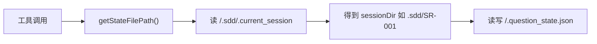
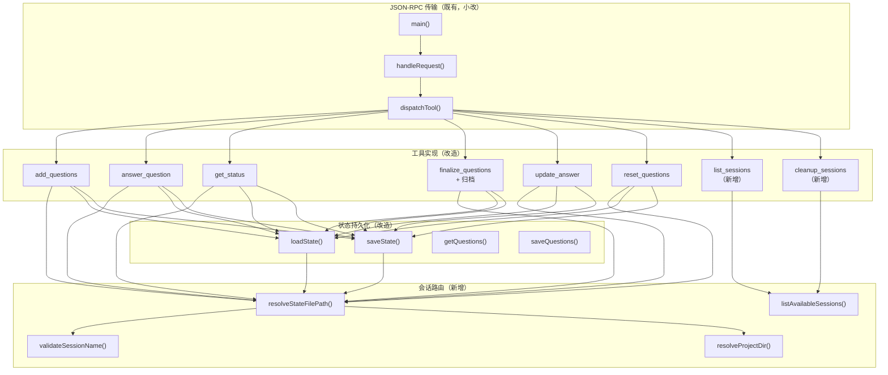
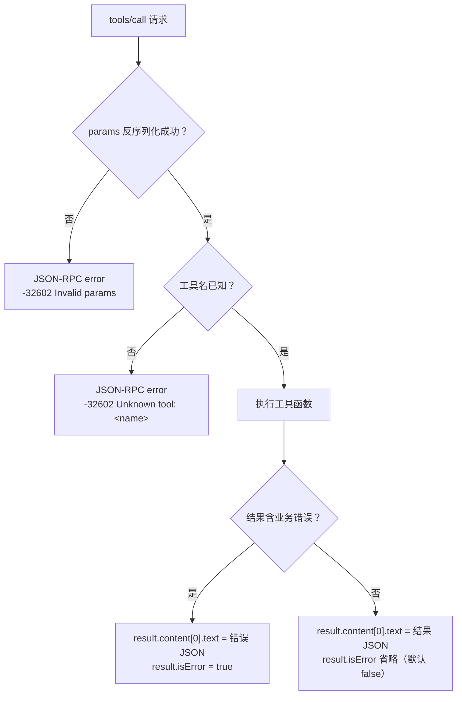

# 《question-tracker 会话隔离重构》详细设计说明书

| 文档版本 | V1.1 |
|---|---|
| 编写日期 | 2026-07-30 |
| 编写人 | sdfang1053 |
| 审核人 | |
| 批准人 | |
| 文档状态 | 草稿 |

**修订记录**

| 版本 | 日期 | 修改人 | 修改说明 |
|---|---|---|---|
| V1.0 | 2026-07-30 | sdfang1053 | 初稿 |
| V1.1 | 2026-07-30 | sdfang1053 | 审核意见整改：session 改必填；新增 reopen/delete 工具；PG05 并发锁；敏感信息约束 |

---

## 1. 引言

### 1.1 编写目的

本文档是《question-tracker 会话隔离重构》功能设计说明书的配套详细设计文档，为编码实现提供全部技术细节。预期读者：编码人员、测试人员、维护人员。

### 1.2 项目背景

- 软件系统名称：question-tracker MCP Server（Go 实现）
- 所属项目：Awesome-Agent-Workflow（AAW）
- 任务提出者：sdfang1053
- 运行环境：作为 MCP stdio 子进程，被 Claude Code / Chrys / Codex / OpenCode 等 Agent 宿主拉起

### 1.3 术语与缩略语

| 术语/缩略语 | 定义 |
|---|---|
| 问题池 | 一个 session 对应的全部问题、答案、历史的持久化集合（一个 state.json 文件） |
| session | 问题池的逻辑标识，调用方语义化命名 |
| project | 项目维度隔离标识，默认由 MCP 进程 CWD 推导 |
| 活跃池 | 未完成 finalize 的池，位于 `<project>/<session>/` |
| 归档池 | finalize 完成后的池，位于 `<project>/.archive/` |
| CWD | 进程工作目录（Current Working Directory） |

### 1.4 参考资料

| 序号 | 文档名称 | 版本 | 来源 |
|---|---|---|---|
| 1 | 《question-tracker 会话隔离重构-功能设计说明书》 | V1.0 | AAW docs/ |
| 2 | main.go 源码 | 当前 | skills/question-tracker-mcp/go/ |
| 3 | main_test.go / session_isolation_test.go / blackbox_test.go | 当前 | skills/question-tracker-mcp/go/ |
| 4 | GB/T 8567 计算机软件文档编制规范 | — | 国家标准 |

---

## 2. 现状分析

### 2.1 现有程序结构

现有实现为单文件 Go 程序 `skills/question-tracker-mcp/go/main.go`（约 960 行），结构如下：

| 区段 | 组成 | 职责 |
|---|---|---|
| 常量 | `stateFileName`、`.question_state.json`；`sessionMarker`、`.sdd/.current_session` | 路径锚点 |
| 错误类型 | `MatchError`、`ValidationError`、`SessionNotFoundError` | 业务错误 |
| 数据类型 | `Question`、`HistoryEntry` | 问题与答案历史模型 |
| 状态持久化 | `getStateFilePath`、`loadState`、`saveState`、`getQuestions`、`saveQuestions`、`getNextID`、`setNextID` | 问题池读写 |
| 问题匹配 | `matchQuestion`、`validateQuestionsInput` | 精确/包含匹配 |
| 工具实现 | `addQuestionsTool`、`answerQuestionTool`、`getStatusTool`、`finalizeQuestionsTool`、`updateAnswerTool`、`resetQuestionsTool` | 6 个 MCP 工具 |
| JSON-RPC 传输 | `handleRequest`、`dispatchTool`、`writeResponse`、`main` | stdio 协议 |

### 2.2 现有会话隔离机制



**特征**：
1. 标记文件是全局单例，由 aaw-workflow 写入，MCP 只读不写
2. 路径为相对路径，依赖 MCP 进程 CWD
3. 标记不存在 → `SessionNotFoundError`，6 个工具全部不可用

### 2.3 现有工具接口

| 工具 | 参数 | 返回值要点 |
|---|---|---|
| `add_questions` | `questions: string[]` | `added_count`、`total_pending` |
| `answer_question` | `question`、`answer`、`source?`、`derivation_note?` | `matched_question`、`total_pending`、`action_required` |
| `get_status` | `detail?: summary\|full` | `total`、`pending`、`answered`、`questions?` |
| `finalize_questions` | 无 | `status: ready\|blocked`、`summary` 或 `pending_questions` |
| `update_answer` | `question`、`answer`、`reason?` | `matched_question`、`previous_answer`、`action_required` |
| `reset_questions` | `only_pending?: bool` | `cleared_count`、`remaining_count` |

### 2.4 现有测试资产

| 文件 | 用例数 | 覆盖 |
|---|---|---|
| `main_test.go` | 25 | matchQuestion（4）、validateQuestionsInput（3）、完整流程 IT（18） |
| `session_isolation_test.go` | 11 | getStateFilePath（6）、状态持久化（5） |
| `blackbox_test.go` | — | MCP stdio 协议端到端 |

### 2.5 现状缺陷（与功能设计 P1-P5 对应）

| 缺陷 | 代码位置 | 表现 |
|---|---|---|
| 单例标记路由 | `getStateFilePath()` 读 `.sdd/.current_session` | 多 SR 并行互相覆盖（P1） |
| 粒度错配 | 池落在 `.sdd/<SR>/` | AR 间决策混杂（P2） |
| 隐式猜测无兜底 | `SessionNotFoundError` | 非 AAW 场景全灭（P3） |
| 位置不可见 | 池藏在 `.sdd/` 深处 | 用户无法审计（P4） |
| 无生命周期 | 无归档/清理 | 池只增不减（P5） |

### 2.6 MCP 协议合规性核查

核查基准：MCP 官方规范 `modelcontextprotocol.io` 2025-06-18 版（basic/lifecycle、basic/transports、server/tools）。

#### 2.6.1 合规项

| 规范条款 | 规范要求 | main.go 实现 | 证据 |
|---|---|---|---|
| stdio 消息分隔 | 换行分隔，不嵌换行 | `bufio.Scanner` 按行读、`Fprintf("%s\n")` 单行输出 | main.go:936, 734 |
| stdout 纯净 | stdout 只写 MCP 消息 | 唯一写入点 `writeResponse` | main.go:728 |
| stderr 日志 | stderr 可用于日志 | `log.SetOutput(os.Stderr)` | main.go:933 |
| initialize 结构 | protocolVersion + capabilities + serverInfo | 三字段齐全 | main.go:739-753 |
| initialized 通知 | client 发 `notifications/initialized` | case 存在 | main.go:755 |
| ping | 响应空 result | case "ping" | main.go:792 |
| tools/list 结构 | name + description + inputSchema（JSON Schema） | `toolDef` + `inputSchema` | main.go:632-642 |
| JSON-RPC 错误码 | -32700 / -32601 / -32602 | 三处正确使用 | main.go:951, 771, 803 |

#### 2.6.2 不合规项（必须修复）

**NC-01：工具执行错误未使用 `isError: true`**

规范（server/tools → Error Handling）明确区分两类错误：

| 类别 | 用途 | 载体 |
|---|---|---|
| Protocol Errors | 未知工具、参数无效、server 内部错误 | JSON-RPC `error` 字段 |
| Tool Execution Errors | API 失败、**输入数据无效、业务逻辑错误** | `result.isError: true` |

规范示例：

```json
{"jsonrpc": "2.0", "id": 4, "result": {
  "content": [{"type": "text", "text": "Failed to fetch weather data: API rate limit exceeded"}],
  "isError": true
}}
```

现状：所有业务错误（未匹配到问题、已回答、尚未回答等）全部塞进 `content[0].text` 的 JSON 字符串里（`{"error": "..."}`），无 `isError` 字段。Agent 客户端无法程序化区分执行失败与正常返回。

**NC-02：未知工具走 text 而非协议错误**

规范示例将未知工具归为协议错误（-32602）。现状 `dispatchTool` 的 default 分支把 `{"error": "Unknown tool"}` 塞 text。

#### 2.6.3 差距项（不违规但粗糙）

| 编号 | 项 | 规范要求 | 现状 |
|---|---|---|---|
| GP-01 | 版本协商 | server 支持请求版本→返回相同版本；否则→返回自己支持的最新版本 | 硬编码 `2024-11-05`，无协商逻辑 |

### 2.7 双实现处置决策

question-tracker 存在 Go 与 Python 双实现：

| | Go 实现 | Python 实现 |
|---|---|---|
| 位置 | `go/main.go`（~960 行） | `python/mcp_server.py`（486 行，fastmcp 框架） |
| 测试资产 | 36 用例 | 46 用例 |
| 生产链路 | **唯一使用**：bin/ 二进制，install.sh + 自动更新 + zip 分发 | 已不被引用 |

**决策（D-PY-01）：Python 实现冻结为 legacy。** 不加新功能、不再保证与 Go 行为一致、Go 为唯一演进路径。`python/` 目录保留作为历史参考，目录内增加 `LEGACY.md` 标记。理由：exe 化的初衷即消除 Python/fastmcp 运行时依赖，双轨维护违背初衷；46 个 Python 测试随冻结退役，不再纳入 CI。

---

## 3. 程序系统的组织结构

### 3.1 模块结构图



### 3.2 程序清单

| 程序标识符 | 程序（模块）名称 | 所属层次 | 新建/改造/保留 |
|---|---|---|---|
| PG01 | `validateSessionName` | 会话层 | 新建 |
| PG02 | `resolveProjectDir` | 会话层 | 新建 |
| PG03 | `resolveStateFilePath` | 会话层 | 新建（替代 `getStateFilePath`） |
| PG04 | `listAvailableSessions` | 会话层 | 新建 |
| PG05 | `loadState` / `saveState` / `getQuestions` / `saveQuestions` | 存储层 | 改造（参数化路径） |
| PG06 | `addQuestionsTool` | 工具层 | 改造（+session/project 参数、建池） |
| PG07 | `answerQuestionTool` | 工具层 | 改造（+session/project 参数、列池容错） |
| PG08 | `getStatusTool` | 工具层 | 改造（同上） |
| PG09 | `finalizeQuestionsTool` | 工具层 | 改造（同上 + 归档） |
| PG10 | `updateAnswerTool` | 工具层 | 改造（同上） |
| PG11 | `resetQuestionsTool` | 工具层 | 改造（同上） |
| PG12 | `listSessionsTool` | 工具层 | 新建 |
| PG13 | `cleanupSessionsTool` | 工具层 | 新建 |
| PG14 | 传输层合规改造（`dispatchTool` / `handleRequest` / `toolDefinitions` / 版本协商 / `isError`） | 传输层 | 改造 |
| PG15 | `main` | 传输层 | 保留 |
| PG16 | `reopenSessionTool` | 工具层 | 新建（归档重开） |
| PG17 | `deleteSessionTool` | 工具层 | 新建（活跃池删除） |

---

## 4. 程序N（标识符）设计说明

### 4.1 程序 PG01：validateSessionName

#### 4.1.1 程序描述

纯函数，校验 session 名的合法性。session 名最终成为文件系统单层目录名，必须杜绝路径穿越与非法字符。

#### 4.1.2 功能

| 输入 | 处理 | 输出 |
|---|---|---|
| `name string` | 逐条规则校验 | `error`（nil 表示合法） |

#### 4.1.3 业务规则

| 规则编号 | 规则 | 拒绝示例 |
|---|---|---|
| R1 | 非空且去除首尾空白后非空 | `""`、`"   "` |
| R2 | 不得包含 `/` 或 `\` | `"a/b"`、`"a\\b"` |
| R3 | 不得为 `.`、`..` 或包含 `..` 段 | `".."`、`"../x"` |
| R4 | 不得为绝对路径 | `"/abs"`、`"C:\\x"`（含盘符冒号） |
| R5 | 不得包含控制字符（< 0x20） | 换行、制表符 |
| R6 | 长度 ≤ 128 字符 | 超长串 |

允许：中文、空格、连字符、下划线、点号（非开头）、数字。

#### 4.1.4 输入项

| 名称 | 标识 | 类型 | 有效范围 | 来源 |
|---|---|---|---|---|
| session 名 | `name` | string | 见 4.1.3 | 调用方 |

#### 4.1.5 输出项

| 名称 | 标识 | 类型 | 说明 |
|---|---|---|---|
| 校验结果 | 返回值 | error | nil = 合法；否则为 `ValidationError` 的变体消息 |

#### 4.1.6 算法

```
Step 1: trimmed = TrimSpace(name); 若为空 → 返回错误
Step 2: 若 len(trimmed) > 128 → 返回错误
Step 3: 若 trimmed 含 "/" 或 "\\" 或 控制字符 → 返回错误
Step 4: 若 trimmed == "." 或 trimmed == ".." 或含 ".." 路径段 → 返回错误
Step 5: 若 trimmed 含 ":" 或以 "/" 开头 → 返回错误（绝对路径/盘符）
Step 6: 返回 nil
```

#### 4.1.7 接口

| 接口类型 | 模块 | 参数 | 说明 |
|---|---|---|---|
| 调用方 | PG03 `resolveStateFilePath` | name | 唯一调用方 |

#### 4.1.8 限制条件

- 不做 Unicode 规范化（NFC/NFKC 不强制），同名不同形视为不同池
- 空格允许出现在名称中间，不允许仅为空格

---

### 4.2 程序 PG02：resolveProjectDir

#### 4.2.1 程序描述

解析项目维度目录：确定 `<poolRoot>/<project-slug>/` 的路径。project-slug 由 `project` 参数（可选）或进程 CWD 推导。

#### 4.2.2 功能

| 输入 | 处理 | 输出 |
|---|---|---|
| `project string`（可空） | project 非空 → 直接使用（经合法性校验）；为空 → CWD 推导 `<dirname>-<hash6>` | 项目目录绝对路径 |

#### 4.2.3 算法

```
Step 1: root = poolRoot()（见 4.2.4）
Step 2: 若 project != "":
           若 validateSessionName(project) 通过 → return root/project
           否则 → 返回错误
Step 3: cwd = 进程工作目录绝对路径
Step 4: slug = filepath.Base(cwd) + "-" + sha256(cwd)[:6]
Step 5: return root/slug
```

#### 4.2.4 poolRoot 解析规则

```
若环境变量 QUESTION_TRACKER_HOME 非空 → 使用该值（测试与高级部署）
否则 → os.UserHomeDir()/.question-tracker
```

#### 4.2.5 接口

| 接口类型 | 模块 | 说明 |
|---|---|---|
| 调用方 | PG03、PG04、PG13 | 三处使用 |

#### 4.2.6 限制条件

- CWD 推导在进程生命周期内稳定（进程启动后 CWD 不变）
- project 参数与 session 参数共用同一套命名校验（复用 PG01）

---

### 4.3 程序 PG03：resolveStateFilePath

#### 4.3.1 程序描述

会话路由核心。将 `(session, project)` 解析为 state.json 的绝对路径。**session 为必填参数，无隐式回退**。

#### 4.3.2 功能

| 输入 | 处理 | 输出 |
|---|---|---|
| `session string`、`project string`（可空） | session 非空检查 → 校验 → 推导项目目录 → 拼接 | state.json 绝对路径，或 MissingSessionError / ValidationError |

#### 4.3.3 算法

```
Step 1: 若 TrimSpace(session) 为空 → 返回 MissingSessionError
         （调用方必须先 list_sessions 浏览或显式命名）
Step 2: validateSessionName(session)；不通过 → 返回 ValidationError
Step 3: projectDir = resolveProjectDir(project)；出错 → 返回错误
Step 4: return projectDir/session/state.json
```

#### 4.3.4 业务规则

| 规则 | 说明 |
|---|---|
| session 必填 | 空值返回 `missing_session` 错误，**不创建、不回退任何默认池**（防止"忘传参数全部挤入默认池"的 P1 翻版） |
| 无 default 概念 | 目录结构中不存在 default 池；所有池均由调用方显式命名 |

#### 4.3.5 接口

| 接口类型 | 模块 | 说明 |
|---|---|---|
| 调用方 | PG05 全部、PG04 | 会话路由唯一入口 |

---

### 4.4 程序 PG04：listAvailableSessions

#### 4.4.1 程序描述

枚举指定 project 下的活跃池（及可选归档池）。供容错返回与 `list_sessions` 工具使用。

#### 4.4.2 功能

| 输入 | 处理 | 输出 |
|---|---|---|
| `project string`、`includeArchived bool` | 扫描 `<projectDir>/` 一级子目录（排除 `.archive`）；归档则扫描 `.archive/` | `[]SessionInfo` |

#### 4.4.3 SessionInfo 结构

| 字段 | 类型 | 说明 |
|---|---|---|
| `name` | string | session 目录名（归档池含日期后缀） |
| `path` | string | state.json 绝对路径 |
| `archived` | bool | 是否归档 |
| `updated_at` | string | state.json 修改时间（ISO8601） |
| `total` / `pending` | int | 问题总数 / 待答数（读 state.json 统计；读取失败记 -1） |

#### 4.4.4 算法

```
Step 1: projectDir = resolveProjectDir(project)
Step 2: 若目录不存在 → 返回空列表（非错误）
Step 3: 遍历一级子目录：
           跳过 .archive 与非目录项
           若 <dir>/state.json 存在 → 加入结果（archived=false）
Step 4: 若 includeArchived 且 .archive/ 存在：
           遍历其一级子目录，同样收集（archived=true）
Step 5: 按 updated_at 降序排序返回
```

#### 4.4.5 接口

| 接口类型 | 模块 | 说明 |
|---|---|---|
| 调用方 | PG07~PG11（容错）、PG12、PG13 | — |

---

### 4.5 程序 PG05：状态持久化族

#### 4.5.1 程序描述

`loadState` / `saveState` / `getQuestions` / `saveQuestions` 四个函数的改造：路径来源从 `getStateFilePath()`（读标记文件）改为 `resolveStateFilePath(session, project)`（参数路由）；**并按池路径引入进程内互斥锁**。

#### 4.5.2 改造点

| 函数 | 原签名 | 新签名 | 变化 |
|---|---|---|---|
| `loadState` | `()` | `(session, project string)` | 路径参数化 |
| `saveState` | `(state)` | `(state, session, project)` | 同上；`MkdirAll` 保留 |
| `getQuestions` | `()` | `(session, project)` | 透传 |
| `saveQuestions` | `(questions)` | `(questions, session, project)` | 透传 |

#### 4.5.3 并发安全设计

MCP 规范不禁止客户端在收到响应前发送下一个请求；`loadState → 修改 → saveState` 是 read-modify-write，并行调用同一池会后写覆盖先写。设计：

```
锁粒度：按 state.json 绝对路径一把 sync.Mutex
锁管理：sync.Map（key = poolPath，value = *sync.Mutex），懒加载
临界区：loadState → 业务修改 → saveState 全程持锁（由工具函数在调用 PG05 前统一加锁，而非 PG05 内部各自加锁——避免同一线程嵌套死锁）
```

| 规则 | 说明 |
|---|---|
| 同池并行 | 串行化（持同一锁） |
| 异池并行 | 不互斥（不同锁），无性能损失 |
| 进程边界 | 仅保护单进程内并发；跨进程（多个 Agent 各自拉起 MCP）由文件系统目录天然隔离 project，同 project 同池跨进程并行为已知限制（见 U1） |

#### 4.5.4 行为不变项

- state.json 结构：`questions` + `next_id`
- 文件不存在 → 返回空池（`questions: []`、`next_id: 1`）
- 写文件前 `MkdirAll` 父目录（池目录自动创建）
- JSON 缩进 2 空格、UTF-8 不转义

---

### 4.6 程序 PG06：addQuestionsTool

#### 4.6.1 程序描述

批量添加问题到指定池。**池不存在时创建**（池的唯一出生点）。

#### 4.6.2 功能（IPO）

| 输入 | 处理 | 输出 |
|---|---|---|
| `questions: string[]`、`session: string`（必填）、`project?: string` | session 检查 → 校验问题列表 → 解析池路径（不存在即建）→ 追加问题 → 持久化 | `added_count`、`total_pending`、`pool_location` |

#### 4.6.3 算法

```
Step 0: session 为空 → 返回 missing_session 错误（isError: true）
Step 1: validateQuestionsInput(questions)；失败 → 返回错误
Step 2: resolveStateFilePath(session, project)；失败 → 返回 ValidationError 消息
Step 3: 持池锁；loadState（文件不存在 → 空池，由 PG05 保证）
Step 4: 逐个追加问题（id 自增、status=pending）
Step 5: saveQuestions + setNextID；释放锁
Step 6: 返回 {added_count, total_pending, pool_location}
```

#### 4.6.4 输出项新增字段

| 名称 | 类型 | 说明 |
|---|---|---|
| `pool_location` | string | state.json 绝对路径（可发现性设计） |

---

### 4.7 程序 PG07：answerQuestionTool

#### 4.7.1 程序描述

记录答案。**池不存在时不创建**，返回错误与现有池列表（容错自愈）。

#### 4.7.2 功能

| 输入 | 处理 | 输出 |
|---|---|---|
| `question`、`answer`、`source?`、`derivation_note?`、`session`（必填）、`project?` | session 检查 → 池存在性检查 → 匹配问题 → 记录答案 | 同现有 + `pool_location`；或 `missing_session` / `session_not_found` 错误 |

#### 4.7.3 算法

```
Step 0: session 为空 → 返回 missing_session 错误（isError: true）
Step 1: resolveStateFilePath(session, project)；失败 → 返回错误
Step 2: 若 state.json 不存在：
           avail = listAvailableSessions(project, false)
           返回 {
             "error": "session_not_found",
             "requested": <session>,
             "available_sessions": [avail 中各 name],
             "hint": "从 available_sessions 中选择目标会话，或用 add_questions 创建新会话，或 list_sessions 浏览详情"
           }（isError: true）
Step 3-N: 与现有逻辑一致（持锁；匹配 → 记录 → 持久化；释放锁）
```

#### 4.7.4 接口

| 接口类型 | 模块 | 说明 |
|---|---|---|
| 调用 | PG03、PG04、PG05 | 新增 PG04 依赖 |

---

### 4.8 程序 PG08：getStatusTool

#### 4.8.1 程序描述

查看池状态。容错规则同 PG07（不存在 → 列池）。

#### 4.8.2 功能

| 输入 | 处理 | 输出 |
|---|---|---|
| `detail?: summary\|full`、`session: string`（必填）、`project?: string` | session 检查 → 池存在性检查 → 读取统计 | 同现有 + `pool_location`；或 `missing_session` / `session_not_found` |

---

### 4.9 程序 PG09：finalizeQuestionsTool

#### 4.9.1 程序描述

最终确认所有问题已澄清。新增：**返回 ready 后自动归档**——将池目录从 `<project>/<session>/` 移入 `<project>/.archive/<session>-<yyyyMMdd>/`。

#### 4.9.2 算法

```
Step 1-2: 池存在性检查（同 PG07，不存在 → 列池）
Step 3: 若有 pending → 返回 blocked（不归档）
Step 4: 全部已闭环 → 组装 summary（与现有逻辑一致）
Step 5: 归档：
   a. archiveDir = <projectDir>/.archive/
   b. target = archiveDir/<session>-<yyyyMMdd>
   c. 若 target 已存在 → target = <session>-<yyyyMMdd>-<HHmmss>
   d. os.Rename(<projectDir>/<session>, target)
   e. 归档失败（跨盘/占用）→ 仅 warning 记录，不影响 ready 返回
Step 6: 返回 {status: "ready", summary, pool_location: <归档后路径>}
```

#### 4.9.3 异常处理

| 场景 | 处理 |
|---|---|
| 归档 rename 失败 | 不影响 ready 结果；stderr 记录 warning；池保持原位 |

---

### 4.10 程序 PG10：updateAnswerTool

#### 4.10.1 程序描述

修改已回答问题的答案，追加历史记录。容错规则同 PG07。

#### 4.10.2 功能

| 输入 | 处理 | 输出 |
|---|---|---|
| `question`、`answer`、`reason?`、`session: string`（必填）、`project?: string` | session 检查 → 池存在性检查 → 匹配 → 追加 history → 更新 | 同现有 + `pool_location`；或 `missing_session` / `session_not_found` |

---

### 4.11 程序 PG11：resetQuestionsTool

#### 4.11.1 程序描述

重置问题池。容错规则同 PG07。

#### 4.11.2 功能

| 输入 | 处理 | 输出 |
|---|---|---|
| `only_pending?: bool`、`session: string`（必填）、`project?: string` | session 检查 → 池存在性检查 → 清除指定范围 | 同现有 + `pool_location`；或 `missing_session` / `session_not_found` |

---

### 4.12 程序 PG12：listSessionsTool（新增）

#### 4.12.1 程序描述

列出当前 project 下的所有池。供 AI 浏览/恢复上下文、用户审计。

#### 4.12.2 功能

| 输入 | 处理 | 输出 |
|---|---|---|
| `include_archived?: bool`（默认 false）、`project?` | 枚举池 | `sessions: SessionInfo[]` + `project_dir` |

#### 4.12.3 输出结构

```json
{
  "project_dir": "C:/Users/x/.question-tracker/myproject-a1b2c3",
  "sessions": [
    {
      "name": "sr001-用户认证",
      "path": "C:/.../sr001-用户认证/state.json",
      "archived": false,
      "updated_at": "2026-07-30T10:00:00",
      "total": 12,
      "pending": 0
    }
  ]
}
```

#### 4.12.4 算法

```
Step 1: avail = listAvailableSessions(project, includeArchived)
Step 2: 返回 {project_dir, sessions: avail}
```

---

### 4.13 程序 PG13：cleanupSessionsTool（新增）

#### 4.13.1 程序描述

受控清理归档池。**默认只列不删；删除必须 confirm=true 且仅作用于归档池**。

#### 4.13.2 功能

| 输入 | 处理 | 输出 |
|---|---|---|
| `action?: list_expired\|purge_archived`、`older_than_days?: int`（默认 90）、`confirm?: bool`、`project?` | 扫描归档池 → 按时间过滤 → 列出或删除 | `candidates` 或 `deleted` |

#### 4.13.3 算法

```
Step 1: projectDir = resolveProjectDir(project)
Step 2: archiveDir = projectDir/.archive；不存在 → 返回空 candidates
Step 3: 遍历归档池，按目录 mtime 过滤 older_than_days
Step 4: 若 action == "list_expired"（默认）:
           返回 {candidates: [{name, path, archived_at, size_bytes}], note: "purge_archived + confirm=true 将删除"}
Step 5: 若 action == "purge_archived":
           若 confirm != true → 返回错误 "purge 需要 confirm: true"
           逐个 os.RemoveAll(candidate)
           返回 {deleted: [...], failed: [...]}
Step 6: 任何情况下不触碰活跃池
```

#### 4.13.4 安全约束

| 约束 | 实现 |
|---|---|
| 仅作用 `.archive/` | 路径拼接硬编码 `.archive`，不接受外部目录输入 |
| 默认不删 | action 缺省为 list_expired |
| 删除需确认 | confirm != true 时拒绝 |

---

### 4.14 程序 PG14：传输层合规改造（dispatchTool / handleRequest / toolDefinitions）

#### 4.14.1 程序描述

按 MCP 2025-06-18 规范 100% 合规改造传输层。覆盖四个点：tools/call 错误分类（`isError`）、未知工具的协议错误路径、initialize 版本协商、新工具注册。

#### 4.14.2 错误分类模型（修复 NC-01 / NC-02）



| 错误类别 | 触发场景 | 载体 |
|---|---|---|
| 协议错误 | params 反序列化失败、未知工具名、未知 method | JSON-RPC `error`（-32602 / -32601） |
| 工具执行错误 | `session_not_found`、`invalid_session_name`、`confirm_required`、未匹配到问题、已回答、尚未回答、问题列表含空串等一切业务错误 | `result.isError: true`，text 中保留结构化错误 JSON |

**错误 JSON 在 text 中的结构保持向后兼容**（skill 侧解析习惯不变）：业务错误时 text 仍为 `{"error": ..., ...}` 的序列化结果；`isError` 是新增的程序化通道，不影响 text 内容。

#### 4.14.3 tools/call 响应结构（数据类型变更）

| 字段 | 类型 | 说明 |
|---|---|---|
| `content` | array | 既有，`[{"type": "text", "text": "<结果JSON>"}]` |
| `isError` | bool（omitempty） | **新增**。业务错误时 `true`；正常时省略（默认 false） |

实现上 `dispatchTool` 返回值从单一 `map[string]interface{}` 调整为 `(result map[string]interface{}, isErr bool)`：工具函数返回的 map 中含 `error` 键即视为业务错误（`isErr=true`）。各工具函数内部逻辑不变，仅分发层统一判定。

#### 4.14.4 initialize 版本协商（修复 GP-01）

```
SUPPORTED_VERSIONS = ["2024-11-05"]   // 按日期降序，首项为最新

算法：
Step 1: 读取 client initialize.params.protocolVersion
Step 2: 若 client 版本 ∈ SUPPORTED_VERSIONS → 响应该版本
Step 3: 否则 → 响应 SUPPORTED_VERSIONS[0]（即本 server 支持的最新版本 2024-11-05）
Step 4: client 版本缺失/非字符串 → 同 Step 3（宽容处理，不报协议错误）
```

规范依据（basic/lifecycle → Version Negotiation）：server 支持请求版本则 MUST 返回相同版本；否则 MUST 返回自己支持的另一版本，SHOULD 为最新。本设计两条均满足。

#### 4.14.5 schema 变更要点

| 工具 | 新增属性 | required 变化 |
|---|---|---|
| 既有 6 个 | `session: string`（"目标会话池名，**必填**"）、`project: string`（"项目维度覆盖，通常无需指定"） | **session 加入 required** |
| `list_sessions` | `include_archived: boolean`、`project: string` | 无必填 |
| `cleanup_sessions` | `action`、`older_than_days`、`confirm`、`project` | 无必填 |
| `reopen_session` | `session: string`（必填）、`project: string` | session 必填 |
| `delete_session` | `session: string`（必填）、`confirm: boolean`、`project: string` | session 必填 |

#### 4.14.6 dispatch 映射

```
"add_questions"      → addQuestionsTool(questions, session, project)
"answer_question"    → answerQuestionTool(question, answer, source, derivationNote, session, project)
"get_status"         → getStatusTool(detail, session, project)
"finalize_questions" → finalizeQuestionsTool(session, project)
"update_answer"      → updateAnswerTool(question, answer, reason, session, project)
"reset_questions"    → resetQuestionsTool(onlyPending, session, project)
"list_sessions"      → listSessionsTool(includeArchived, project)
"cleanup_sessions"   → cleanupSessionsTool(action, olderThanDays, confirm, project)
"reopen_session"     → reopenSessionTool(session, project)
"delete_session"     → deleteSessionTool(session, confirm, project)
default              → JSON-RPC error -32602 "Unknown tool: <name>"
```

---

### 4.15 程序 PG16：reopenSessionTool（新增）

#### 4.15.1 程序描述

将归档池重开回活跃区。覆盖"finalize 后发现仍需修改答案"的场景。

#### 4.15.2 功能

| 输入 | 处理 | 输出 |
|---|---|---|
| `session: string`（必填，归档池名含日期后缀）、`project?: string` | 归档区定位 → 冲突检查 → 移回活跃区并还原名称 | `reopened`、`pool_location`、`total`、`pending` |

#### 4.15.3 算法

```
Step 0: session 为空 → missing_session（isError: true）
Step 1: projectDir = resolveProjectDir(project)
Step 2: src = projectDir/.archive/<session>；不存在：
           返回 session_not_found + 归档池列表（isError: true）
Step 3: 还原名称：stripped = 去除 <session> 末尾的 -<yyyyMMdd>（及可选 -<HHmmss>）后缀
Step 4: dst = projectDir/<stripped>；若已存在：
           返回 {error: "conflict", detail: "活跃区已存在同名池", conflicting_session: stripped}（isError: true）
Step 5: os.Rename(src, dst)
Step 6: 读取 dst/state.json 统计，返回 {reopened: stripped, pool_location, total, pending}
```

#### 4.15.4 异常处理

| 场景 | 响应 |
|---|---|
| 归档区无此池 | `session_not_found` + 归档池列表（isError: true） |
| 活跃区同名冲突 | `conflict` 错误（isError: true），不覆盖 |
| rename 失败 | 写失败错误（isError: true），池保持原位 |

---

### 4.16 程序 PG17：deleteSessionTool（新增）

#### 4.16.1 程序描述

删除活跃池（如误建、拼错的池）。confirm 强制，返回删除前统计作为审计记录。

#### 4.16.2 功能

| 输入 | 处理 | 输出 |
|---|---|---|
| `session: string`（必填）、`confirm: bool`（必须 true）、`project?: string` | 定位活跃池 → 确认检查 → 统计 → 删除 | `deleted`、`total`、`pending`、`answered` |

#### 4.16.3 算法

```
Step 0: session 为空 → missing_session（isError: true）
Step 1: 若 confirm != true → 返回 {error: "confirm_required", detail: "delete_session 需要 confirm: true"}（isError: true）
Step 2: poolPath = resolveStateFilePath(session, project)
Step 3: 若 state.json 不存在：
           返回 session_not_found + 活跃池列表（isError: true）
Step 4: 读取统计（total / pending / answered）
Step 5: 持池锁；os.RemoveAll(<projectDir>/<session>)；释放锁
Step 6: 返回 {deleted: session, total, pending, answered}
```

#### 4.16.4 安全约束

| 约束 | 实现 |
|---|---|
| 仅活跃池 | 路径由 PG03 解析（`<project>/<session>/`），不触碰 `.archive/`（归档池由 PG13 管理） |
| confirm 强制 | confirm != true 拒绝执行 |
| 审计返回 | 返回删除前问题统计，供用户核对删对了 |

---

---

## 5. 公共数据结构设计

### 5.1 全局常量

| 名称 | 类型 | 值 | 说明 |
|---|---|---|---|
| `poolDirName` | string | `".question-tracker"` | 用户主目录下的池根目录名 |
| `archiveDirName` | string | `".archive"` | 项目目录下的归档子目录名 |
| `stateFileName` | string | `"state.json"` | 池文件名（**变更**：原 `.question_state.json`） |
| `homeEnvVar` | string | `"QUESTION_TRACKER_HOME"` | 池根目录覆盖环境变量 |
| `maxSessionNameLen` | int | `128` | session 名长度上限 |

### 5.2 state.json 结构（不变）

| 字段 | 类型 | 说明 |
|---|---|---|
| `questions` | array | 问题列表（Question 序列化） |
| `next_id` | number | 下一个问题 ID |

### 5.3 错误返回结构

#### 5.3.1 错误分类（MCP 2025-06-18 合规）

| 类别 | 载体 | 触发场景 |
|---|---|---|
| 协议错误 | JSON-RPC `error` 字段（-32601 / -32602 / -32700） | 未知 method、未知工具名、params 反序列化失败、消息无法解析 |
| 工具执行错误 | `result.isError: true` + `content[0].text` 中的错误 JSON | 一切业务错误 |

#### 5.3.2 工具执行错误清单（isError: true）

| 错误 | text 中的 JSON 结构 | 触发 |
|---|---|---|
| `missing_session` | `{error, hint}` | session 参数缺失或为空 |
| `session_not_found` | `{error, requested, available_sessions[], hint}` | 读改类工具目标池不存在 |
| `invalid_session_name` | `{error, detail}` | session/project 名非法 |
| `confirm_required` | `{error, detail}` | purge/delete 未带 confirm=true |
| `conflict` | `{error, detail, conflicting_session}` | reopen 时活跃区已有同名池 |
| 业务错误（既有） | `{error, ...}` | 未匹配到问题、已回答、尚未回答、问题列表含空串、参数校验失败 |

#### 5.3.3 协议错误清单（JSON-RPC error）

| 错误码 | 触发 |
|---|---|
| -32700 Parse error | 请求行不是合法 JSON |
| -32601 Method not found | method 不在 initialize/tools/list/tools/call/ping/notifications/* |
| -32602 Invalid params | tools/call 的 params 反序列化失败；**未知工具名** |

---

## 6. 接口详细设计

### 6.1 内部接口

| 接口 | 提供方 | 调用方 | 签名 |
|---|---|---|---|
| validateSessionName | PG01 | PG03 | `(string) error` |
| resolveProjectDir | PG02 | PG03、PG04、PG13 | `(project string) (string, error)` |
| resolveStateFilePath | PG03 | PG05 全部、PG04 | `(session, project string) (string, error)` |
| listAvailableSessions | PG04 | PG07~PG11、PG12、PG13 | `(project string, includeArchived bool) []SessionInfo` |

### 6.2 外部接口（MCP tools/call）

见 4.14.2 schema 变更。协议层（JSON-RPC 2.0 over stdio）不变。

---

## 7. 测试计划

### 7.1 测试环境

| 项目 | 要求 |
|---|---|
| Go | 1.21+（含 `-race` 竞态检测） |
| 隔离手段 | `QUESTION_TRACKER_HOME` 指向 `t.TempDir()`；`os.Chdir` 到临时工作目录 |
| 统一约定 | 黑盒测试 session 名统一使用 `test-session`；运行命令 `cd skills/question-tracker-mcp/go && go test -race ./...` |

---

### 7.2 单元测试（`session_pool_test.go`）

#### UT-NS-01：合法 session 名通过校验

- **测试场景**：中文、空格、连字符、下划线、点号（非开头）、数字组成的 session 名均合法
- **前提条件**：无
- **测试步骤**：
  1. 对 `"sr001-用户认证"`、`"sr001-ar002-支付回调"`、`"req-订单状态机"`、`"with space inside"`、`"中文纯文字"`、`"a_b-c.d"` 逐个调用 `validateSessionName`
- **预期结果**：全部返回 nil
- **断言**：
  ```
  for name in validNames:
      assert validateSessionName(name) == nil
  ```

#### UT-NS-02：非法 session 名拒绝

- **测试场景**：路径穿越、分隔符、绝对路径、盘符、控制字符、超长名均被拒绝
- **前提条件**：无
- **测试步骤**：
  1. 对 `".."`、`"../escape"`、`"a/../b"`、`"a/b"`、`"a\\b"`、`"/abs"`、`"C:\\win"`、含换行符串、129 字符长串逐个调用 `validateSessionName`
- **预期结果**：全部返回非 nil 错误，且错误类型为 ValidationError（非 MissingSessionError）
- **断言**：
  ```
  for name in invalidNames:
      err := validateSessionName(name)
      assert err != nil
      assert isValidationError(err) && !isMissingSessionError(err)
  ```

#### UT-NS-03：空串与纯空白返回 MissingSessionError

- **测试场景**：空串、纯空白触发 MissingSessionError，与非法名的 ValidationError 区分
- **前提条件**：无
- **测试步骤**：
  1. 对 `""`、`"   "`、`" \t "` 逐个调用 `resolveStateFilePath(name, "")`
- **预期结果**：全部返回 MissingSessionError；不返回 ValidationError
- **断言**：
  ```
  for name in ["", "   ", " \t "]:
      _, err := resolveStateFilePath(name, "")
      assert isMissingSessionError(err)
      assert !isValidationError(err)
  ```

#### UT-NS-10：resolveStateFilePath 路径结构正确

- **测试场景**：解析结果包含 session 目录且位于池根下
- **前提条件**：`QUESTION_TRACKER_HOME` 指向临时目录；chdir 到临时工作目录
- **测试步骤**：
  1. 调用 `resolveStateFilePath("sr001-auth", "")`
- **预期结果**：返回路径以 `/sr001-auth/state.json` 结尾，且位于 QUESTION_TRACKER_HOME 下
- **断言**：
  ```
  p, err := resolveStateFilePath("sr001-auth", "")
  assert err == nil
  assert strings.HasSuffix(filepath.ToSlash(p), "/sr001-auth/state.json")
  assert strings.HasPrefix(p, os.Getenv("QUESTION_TRACKER_HOME"))
  ```

#### UT-NS-11：project 参数覆盖产生不同路径

- **测试场景**：不同 project 参数映射到不同项目目录
- **前提条件**：同 UT-NS-10
- **测试步骤**：
  1. 分别调用 `resolveStateFilePath("s", "project-alpha")` 与 `resolveStateFilePath("s", "project-beta")`
- **预期结果**：两路径不同；含 project 名的目录
- **断言**：
  ```
  p1, _ := resolveStateFilePath("s", "project-alpha")
  p2, _ := resolveStateFilePath("s", "project-beta")
  assert p1 != p2
  assert strings.Contains(filepath.ToSlash(p1), "project-alpha")
  ```

#### UT-NS-12：不同 session 产生不同路径

- **测试场景**：同 project 下不同 session 映射不同 state.json
- **前提条件**：同 UT-NS-10
- **测试步骤**：
  1. 分别解析 `"sr001"` 与 `"sr002"`
- **预期结果**：两路径不同
- **断言**：
  ```
  p1, _ := resolveStateFilePath("sr001", "")
  p2, _ := resolveStateFilePath("sr002", "")
  assert p1 != p2
  ```

#### UT-NS-13：poolRoot 解析规则

- **测试场景**：env 覆盖优先；无 env 时落在用户主目录
- **前提条件**：场景 A 设 `QUESTION_TRACKER_HOME=/tmp/x`；场景 B 清除该变量
- **测试步骤**：
  1. 场景 A 调用 poolRoot()
  2. 场景 B 调用 poolRoot()
- **预期结果**：A 返回 `/tmp/x`；B 返回 `~/.question-tracker`
- **断言**：
  ```
  assert poolRoot() == "/tmp/x"               // 场景 A
  assert strings.HasSuffix(poolRoot(), ".question-tracker")  // 场景 B
  ```

#### UT-NS-14：纯 CWD 推导 slug 正确且稳定

- **测试场景**：无 env、无 project 参数时，slug 为 `<dirname>-<hash6>` 且同 CWD 两次推导一致
- **前提条件**：chdir 到 `/tmp/someproject`（临时目录）；无 project 参数
- **测试步骤**：
  1. 调用 `resolveProjectDir("")` 两次
- **预期结果**：两次结果相同；basename 以 `someproject-` 开头且后跟 6 位十六进制
- **断言**：
  ```
  d1, _ := resolveProjectDir("")
  d2, _ := resolveProjectDir("")
  assert d1 == d2
  base := filepath.Base(d1)
  assert strings.HasPrefix(base, "someproject-")
  assert len(base) == len("someproject-") + 6
  ```

---

### 7.3 集成测试 — 建池 / 容错 / 隔离 / 并发（真实文件系统，无 mock）

#### IT-NS-20：add_questions 首次建池

- **测试场景**：对不存在的池调用 add_questions 自动创建
- **前提条件**：QUESTION_TRACKER_HOME 为临时目录；无任何池
- **测试步骤**：
  1. `addQuestionsTool(["Q1", "Q2"], "sr001-auth", "")`
- **预期结果**：返回 added_count=2、pool_location；state.json 生成且含 2 问题
- **断言**：
  ```
  r := addQuestionsTool(["Q1","Q2"], "sr001-auth", "")
  assert r["error"] == nil
  assert r["added_count"] == 2
  assert r["pool_location"] != nil
  data := readFile(r["pool_location"])
  assert len(data["questions"]) == 2
  ```

#### IT-NS-21：同池二次 add 幂等

- **测试场景**：对已存在的池再次 add 追加而非报错
- **前提条件**：已执行 IT-NS-20 建池
- **测试步骤**：
  1. 首次 add ["Q1"]
  2. 再次 add ["Q2"]
- **预期结果**：两次均成功；池内 total=2
- **断言**：
  ```
  addQuestionsTool(["Q1"], "s1", "")
  r := addQuestionsTool(["Q2"], "s1", "")
  assert r["error"] == nil
  s := getStatusTool("summary", "s1", "")
  assert s["total"] == 2
  ```

#### IT-NS-22：add 用非法 session 拒绝

- **测试场景**：路径穿越类 session 名在 add 时被拒且不建目录
- **前提条件**：临时环境
- **测试步骤**：
  1. `addQuestionsTool(["Q1"], "../escape", "")`
- **预期结果**：返回错误；文件系统未创建任何目录
- **断言**：
  ```
  r := addQuestionsTool(["Q1"], "../escape", "")
  assert r["error"] != nil
  assert !dirExists(poolRoot + "/../escape")
  ```

#### IT-NS-23：六工具 session 缺失均报 missing_session

- **测试场景**：六个既有工具 session 为空时统一报 missing_session，不创建任何池
- **前提条件**：临时环境
- **测试步骤**：
  1. 依次调用 add/answer/get_status/finalize/update/reset，session 均传 `""`
- **预期结果**：六个均返回 missing_session 错误；文件系统无 default 池
- **断言**：
  ```
  for call in sixCalls:
      r := call(session="")
      assert r["error"] == "missing_session"
  assert !dirExists(anyPoolDir)
  ```

#### IT-NS-24：add 空 project 参数走 CWD 推导

- **测试场景**：project 传空时按 CWD 推导项目目录
- **前提条件**：chdir 到 `/tmp/someproject`
- **测试步骤**：
  1. `addQuestionsTool(["Q1"], "s1", "")`
- **预期结果**：state.json 位于 `someproject-<hash6>/s1/` 下
- **断言**：
  ```
  r := addQuestionsTool(["Q1"], "s1", "")
  assert strings.Contains(filepath.ToSlash(r["pool_location"]), "someproject-")
  ```

#### IT-NS-30~34：读改类工具池不存在时列池

- **测试场景**：get_status / answer_question / finalize / reset / update_answer 对不存在的 session 返回 session_not_found + available_sessions
- **前提条件**：已建两池 `sr001-用户认证`、`sr002-权限模型`
- **测试步骤**：
  1. 五个工具分别对 `"sr001-typo"` 调用
- **预期结果**：均返回 error=session_not_found、requested、available_sessions 含两池名、hint
- **断言**：
  ```
  for call in [getStatus, answer, finalize, reset, updateAnswer]:
      r := call(session="sr001-typo")
      assert r["error"] == "session_not_found"
      assert r["requested"] == "sr001-typo"
      assert "sr001-用户认证" in r["available_sessions"]
      assert "sr002-权限模型" in r["available_sessions"]
      assert r["hint"] != nil
  ```

#### IT-NS-35：answer_question 成功返回 pool_location

- **测试场景**：answer 成功路径携带 pool_location
- **前提条件**：已建池 s1 含问题 Q1
- **测试步骤**：
  1. `answerQuestionTool("Q1", "A1", "user", "", "s1", "")`
- **预期结果**：返回成功且含 pool_location 指向 s1 的 state.json
- **断言**：
  ```
  r := answerQuestionTool("Q1", "A1", "user", "", "s1", "")
  assert r["error"] == nil
  assert strings.HasSuffix(filepath.ToSlash(r["pool_location"]), "/s1/state.json")
  ```

#### IT-NS-36：get_status 成功返回 pool_location

- **测试场景**：get_status 成功路径携带 pool_location
- **前提条件**：同 IT-NS-35
- **测试步骤**：
  1. `getStatusTool("summary", "s1", "")`
- **预期结果**：返回成功且含 pool_location
- **断言**：
  ```
  r := getStatusTool("summary", "s1", "")
  assert strings.HasSuffix(filepath.ToSlash(r["pool_location"]), "/s1/state.json")
  ```

#### IT-NS-37：update_answer 成功返回 pool_location

- **测试场景**：update_answer 成功路径携带 pool_location
- **前提条件**：池 s1 含已答问题 Q1
- **测试步骤**：
  1. `updateAnswerTool("Q1", "新答案", "纠正", "s1", "")`
- **预期结果**：返回成功且含 pool_location 指向 s1 的 state.json
- **断言**：
  ```
  r := updateAnswerTool("Q1", "新答案", "纠正", "s1", "")
  assert r["error"] == nil
  assert strings.HasSuffix(filepath.ToSlash(r["pool_location"]), "/s1/state.json")
  ```

#### IT-NS-38：reset_questions 成功返回 pool_location

- **测试场景**：reset_questions 成功路径携带 pool_location
- **前提条件**：池 s1 含 1 已答 + 1 pending
- **测试步骤**：
  1. `resetQuestionsTool(true, "s1", "")`
- **预期结果**：返回成功且含 pool_location 指向 s1 的 state.json
- **断言**：
  ```
  r := resetQuestionsTool(true, "s1", "")
  assert r["error"] == nil
  assert strings.HasSuffix(filepath.ToSlash(r["pool_location"]), "/s1/state.json")
  ```

#### IT-NS-40：双池完全隔离

- **测试场景**：sr001 与 sr002 两池互不可见、互不影响
- **前提条件**：两池各含 1 问题
- **测试步骤**：
  1. sr001 add "Q-sr1"；sr002 add "Q-sr2"
  2. 各自 get_status(full)
  3. sr001 answer 其问题
  4. 再查 sr002 summary
- **预期结果**：各池仅见自己问题；sr001 answer 后 sr002 pending 仍为 1
- **断言**：
  ```
  s1 := getStatusTool("full", "sr001", "")["questions"]
  s2 := getStatusTool("full", "sr002", "")["questions"]
  assert len(s1) == 1 && s1[0]["question"] == "Q-sr1"
  assert len(s2) == 1 && s2[0]["question"] == "Q-sr2"
  answerQuestionTool("Q-sr1", "A1", "user", "", "sr001", "")
  assert getStatusTool("summary", "sr002", "")["pending"] == 1
  ```

#### IT-NS-42：list_sessions 列全部池含中文名

- **测试场景**：list_sessions 返回全部池及 SessionInfo 字段
- **前提条件**：已建 alpha、beta、中文会话 三池
- **测试步骤**：
  1. `listSessionsTool(false, "")`
- **预期结果**：返回 3 池；每个含 name/path/updated_at/total/pending/archived=false
- **断言**：
  ```
  r := listSessionsTool(false, "")
  names := [s["name"] for s in r["sessions"]]
  assert set(names) == {"alpha", "beta", "中文会话"}
  for s in r["sessions"]:
      assert s["path"] != "" && s["total"] != nil && s["pending"] != nil
      assert s["archived"] == false
  ```

#### IT-NS-43：list_sessions 项目目录不存在返回空列表

- **测试场景**：项目目录不存在时返回空列表而非错误
- **前提条件**：临时环境，未建任何池
- **测试步骤**：
  1. `listSessionsTool(false, "")`
- **预期结果**：返回 sessions=[]，无 error
- **断言**：
  ```
  r := listSessionsTool(false, "")
  assert r["error"] == nil
  assert r["sessions"] == []
  ```

#### IT-NS-50：同名 session 跨 project 隔离

- **测试场景**：同名池在不同 project 下内容独立
- **前提条件**：临时环境
- **测试步骤**：
  1. project-a 的 s 池 add "Q-projA"；project-b 的 s 池 add "Q-projB"
  2. 各自 get_status(full)
- **预期结果**：各 project 池仅含各自问题
- **断言**：
  ```
  qa := getStatusTool("full", "s", "project-a")["questions"]
  qb := getStatusTool("full", "s", "project-b")["questions"]
  assert qa[0]["question"] == "Q-projA"
  assert qb[0]["question"] == "Q-projB"
  ```

#### IT-NS-60：并发同池 answer 串行化

- **测试场景**：同池 10 路并行 answer_question 无数据竞争、无覆盖
- **前提条件**：池 s 含 10 个 pending 问题 Q1..Q10
- **测试步骤**：
  1. 10 个 goroutine 分别 answer 不同问题（同池）
- **预期结果**：全部成功；最终 10 问题均 answered；`-race` 无告警
- **断言**：
  ```
  parallel(10, i => answerQuestionTool("Q"+i, "A"+i, "user", "", "s", ""))
  s := getStatusTool("summary", "s", "")
  assert s["pending"] == 0 && s["answered"] == 10
  // go test -race 无输出
  ```

#### IT-NS-61：并发异池 add 互不阻塞

- **测试场景**：10 个不同池并行 add 全部成功
- **前提条件**：临时环境
- **测试步骤**：
  1. 10 个 goroutine 分别对 pool-0..pool-9 add
- **预期结果**：全部成功；10 个池各自生成
- **断言**：
  ```
  parallel(10, i => addQuestionsTool(["Q"], "pool-"+i, ""))
  r := listSessionsTool(false, "")
  assert len(r["sessions"]) == 10
  ```

#### IT-NS-62：并发同池首次 add 建池无竞态

- **测试场景**：多路并行对同一不存在池首次 add，建池与计数无竞态
- **前提条件**：临时环境，目标池不存在
- **测试步骤**：
  1. 5 个 goroutine 同时对 "race-pool" add 各 2 个问题
- **预期结果**：全部成功；池内问题总数 = 10；`-race` 无告警
- **断言**：
  ```
  parallel(5, i => addQuestionsTool(["Q"+i+"a", "Q"+i+"b"], "race-pool", ""))
  s := getStatusTool("summary", "race-pool", "")
  assert s["total"] == 10
  ```

---

### 7.4 集成测试 — 归档与清理（`archive_test.go`）

#### IT-AR-01：finalize ready 后自动归档

- **测试场景**：全部问题闭环后 finalize 将池移入 .archive
- **前提条件**：池 s 含 2 问题且均已回答
- **测试步骤**：
  1. `finalizeQuestionsTool("s", "")`
- **预期结果**：返回 ready；原 `<proj>/s/` 不存在；`.archive/s-<yyyyMMdd>/state.json` 存在；pool_location 为归档后路径
- **断言**：
  ```
  r := finalizeQuestionsTool("s", "")
  assert r["status"] == "ready"
  assert !dirExists("<proj>/s")
  assert dirExists("<proj>/.archive/s-" + today())
  assert strings.Contains(r["pool_location"], ".archive")
  ```

#### IT-AR-02：finalize blocked 不归档

- **测试场景**：有 pending 问题时 finalize 不归档，且 pool_location 指向原路径
- **前提条件**：池 s 含 1 已答 + 1 pending
- **测试步骤**：调用 finalize
- **预期结果**：返回 blocked；池保持原位；**pool_location 指向原活跃路径（非 .archive）**
- **断言**：
  ```
  r := finalizeQuestionsTool("s", "")
  assert r["status"] == "blocked"
  assert dirExists("<proj>/s")
  assert !dirExists("<proj>/.archive")
  assert strings.HasSuffix(filepath.ToSlash(r["pool_location"]), "/s/state.json")
  assert !strings.Contains(r["pool_location"], ".archive")
  ```

#### IT-AR-03：归档后 list_sessions 默认不列归档

- **测试场景**：归档池不出现在默认列表，include_archived=true 可见
- **前提条件**：池 s 已归档
- **测试步骤**：
  1. `listSessionsTool(false, "")`
  2. `listSessionsTool(true, "")`
- **预期结果**：第一次 sessions 不含 s；第二次含 s 且 archived=true
- **断言**：
  ```
  r1 := listSessionsTool(false, "")
  assert "s" not in names(r1["sessions"])
  r2 := listSessionsTool(true, "")
  s := findByName(r2["sessions"], contains="s-")
  assert s["archived"] == true
  ```

#### IT-AR-04：归档重名加时间后缀

- **测试场景**：同名池两次归档目录名不冲突
- **前提条件**：池 s 已归档一次；重建同名池 s 并再次 finalize
- **测试步骤**：两次 finalize 同名池
- **预期结果**：`.archive/` 下两个目录，名称不同
- **断言**：
  ```
  entries := listDir("<proj>/.archive")
  assert len(entries) == 2
  assert entries[0].name != entries[1].name
  ```

#### IT-AR-05：cleanup list_expired 只列不删

- **测试场景**：默认 action 仅列出候选不执行删除
- **前提条件**：`.archive/` 下有 1 个归档池（mtime 构造为 100 天前）
- **测试步骤**：`cleanupSessionsTool("list_expired", 90, false, "")`
- **预期结果**：candidates 含该池；目录仍存在
- **断言**：
  ```
  r := cleanupSessionsTool("list_expired", 90, false, "")
  assert len(r["candidates"]) == 1
  assert dirExists(candidatePath)
  ```

#### IT-AR-06：purge 无 confirm 拒绝

- **测试场景**：purge_archived 未带 confirm=true 返回 confirm_required
- **前提条件**：同 IT-AR-05
- **测试步骤**：`cleanupSessionsTool("purge_archived", 90, false, "")`
- **预期结果**：返回 confirm_required；目录仍在
- **断言**：
  ```
  r := cleanupSessionsTool("purge_archived", 90, false, "")
  assert r["error"] == "confirm_required"
  assert dirExists(candidatePath)
  ```

#### IT-AR-07：purge confirm 仅删归档

- **测试场景**：confirm=true 时仅删除归档池，活跃池完好
- **前提条件**：1 归档池（100 天前）+ 1 活跃池
- **测试步骤**：`cleanupSessionsTool("purge_archived", 90, true, "")`
- **预期结果**：归档目录删除；活跃池目录与内容完好
- **断言**：
  ```
  r := cleanupSessionsTool("purge_archived", 90, true, "")
  assert len(r["deleted"]) == 1
  assert !dirExists(archivePath)
  assert dirExists(activePath)
  assert getStatusTool("summary", "active", "")["total"] == 1
  ```

#### IT-AR-08：older_than_days 过滤

- **测试场景**：仅列出归档时间超过阈值的池，新归档不列入
- **前提条件**：归档池 A（100 天前）、归档池 B（今天）
- **测试步骤**：`cleanupSessionsTool("list_expired", 90, false, "")`
- **预期结果**：candidates 仅含 A
- **断言**：
  ```
  r := cleanupSessionsTool("list_expired", 90, false, "")
  names := [c["name"] for c in r["candidates"]]
  assert names == ["A"]
  ```

#### IT-AR-09：finalize 已归档的池再次 finalize

- **测试场景**：对已归档池重复 finalize，返回与 IT-NS-30~34 一致的完整容错结构
- **前提条件**：池 s 已 finalize 并归档；活跃区另有池 other
- **测试步骤**：再次 `finalizeQuestionsTool("s", "")`
- **预期结果**：返回 session_not_found + available_sessions + hint（isError: true）
- **断言**：
  ```
  r := finalizeQuestionsTool("s", "")
  assert r["error"] == "session_not_found"
  assert r["available_sessions"] != nil
  assert "other" in r["available_sessions"]
  assert r["hint"] != nil
  ```

#### IT-AR-10：cleanup 时 .archive 目录不存在

- **测试场景**：无 .archive 目录时 cleanup 返回空 candidates 而非错误
- **前提条件**：项目目录存在但无 .archive
- **测试步骤**：`cleanupSessionsTool("list_expired", 90, false, "")`
- **预期结果**：candidates=[]，无 error
- **断言**：
  ```
  r := cleanupSessionsTool("list_expired", 90, false, "")
  assert r["error"] == nil
  assert r["candidates"] == []
  ```

---

### 7.5 集成测试 — reopen / delete（`reopen_delete_test.go`）

#### IT-RD-01：reopen 正常流程

- **测试场景**：finalize 归档 → reopen → update_answer 成功
- **前提条件**：池 s 已 finalize 归档（含 1 已答问题）
- **测试步骤**：
  1. `reopenSessionTool("s-<yyyyMMdd>", "")`
  2. `updateAnswerTool("Q1", "新答案", "纠正", "s", "")`
- **预期结果**：reopen 返回原名 s 与统计；池位于活跃区；update 成功
- **断言**：
  ```
  r := reopenSessionTool("s-"+today(), "")
  assert r["reopened"] == "s"
  assert dirExists("<proj>/s")
  assert !dirExists("<proj>/.archive/s-"+today())
  u := updateAnswerTool("Q1", "新答案", "纠正", "s", "")
  assert u["error"] == nil
  ```

#### IT-RD-01b：reopen 后可再次 finalize 并二次归档

- **测试场景**：reopen 的池修改答案后可再次 finalize 并再次归档
- **前提条件**：IT-RD-01 完成后（池已重开且答案已修改）
- **测试步骤**：
  1. `finalizeQuestionsTool("s", "")`
- **预期结果**：返回 ready；池再次进入 .archive
- **断言**：
  ```
  r := finalizeQuestionsTool("s", "")
  assert r["status"] == "ready"
  assert dirExists("<proj>/.archive/s-"+today())
  ```

#### IT-RD-02：reopen 归档不存在

- **测试场景**：对不存在的归档池 reopen 返回 session_not_found + 归档列表
- **前提条件**：.archive 下仅有 other-20260701
- **测试步骤**：`reopenSessionTool("nonexistent-20260730", "")`
- **预期结果**：session_not_found；available_sessions 含 other-20260701
- **断言**：
  ```
  r := reopenSessionTool("nonexistent-20260730", "")
  assert r["error"] == "session_not_found"
  assert "other-20260701" in r["available_sessions"]
  ```

#### IT-RD-03：reopen 活跃区同名冲突

- **测试场景**：活跃区已有同名池时 reopen 返回 conflict 且两池不动
- **前提条件**：活跃区有池 s（含内容 A）；归档区有 s-20260715（含内容 B）
- **测试步骤**：`reopenSessionTool("s-20260715", "")`
- **预期结果**：返回 conflict；活跃池内容仍为 A；归档池仍在
- **断言**：
  ```
  r := reopenSessionTool("s-20260715", "")
  assert r["error"] == "conflict"
  assert getStatusTool("full", "s", "")["questions"][0]["answer"] == "A"
  assert dirExists("<proj>/.archive/s-20260715")
  ```

#### IT-RD-04：reopen 后 list_sessions 可见

- **测试场景**：重开的池出现在活跃列表
- **前提条件**：IT-RD-01 完成
- **测试步骤**：`listSessionsTool(false, "")`
- **预期结果**：活跃列表含 s
- **断言**：
  ```
  r := listSessionsTool(false, "")
  assert "s" in names(r["sessions"])
  ```

#### IT-RD-05：delete 无 confirm 拒绝

- **测试场景**：delete_session 未带 confirm=true 拒绝且池完好
- **前提条件**：活跃池 s 存在
- **测试步骤**：`deleteSessionTool("s", false, "")`
- **预期结果**：confirm_required；池目录与内容完好
- **断言**：
  ```
  r := deleteSessionTool("s", false, "")
  assert r["error"] == "confirm_required"
  assert getStatusTool("summary", "s", "")["total"] >= 0  // 池仍可读
  ```

#### IT-RD-06：delete confirm 删除并返回审计统计

- **测试场景**：confirm=true 删除活跃池并返回删除前统计
- **前提条件**：活跃池 s 含 3 问题（2 answered + 1 pending）
- **测试步骤**：`deleteSessionTool("s", true, "")`
- **预期结果**：目录删除；返回 deleted=s、total=3、pending=1、answered=2
- **断言**：
  ```
  r := deleteSessionTool("s", true, "")
  assert r["deleted"] == "s"
  assert r["total"] == 3 && r["pending"] == 1 && r["answered"] == 2
  assert !dirExists("<proj>/s")
  ```

#### IT-RD-07：delete 不存在的池

- **测试场景**：删除不存在的池返回 session_not_found + 活跃列表
- **前提条件**：仅有活跃池 other
- **测试步骤**：`deleteSessionTool("ghost", true, "")`
- **预期结果**：session_not_found；available_sessions 含 other
- **断言**：
  ```
  r := deleteSessionTool("ghost", true, "")
  assert r["error"] == "session_not_found"
  assert "other" in r["available_sessions"]
  ```

#### IT-RD-08：delete 不触碰归档池

- **测试场景**：对归档池名调用 delete_session 在活跃区查找失败
- **前提条件**：仅有归档池 s-20260715（活跃区无 s）
- **测试步骤**：`deleteSessionTool("s", true, "")`
- **预期结果**：session_not_found；归档池完好
- **断言**：
  ```
  r := deleteSessionTool("s", true, "")
  assert r["error"] == "session_not_found"
  assert dirExists("<proj>/.archive/s-20260715")
  ```

#### IT-RD-09：reopen_session 缺 session 报 missing_session

- **测试场景**：reopen_session 传空 session 报 missing_session
- **前提条件**：临时环境
- **测试步骤**：`reopenSessionTool("", "")`
- **预期结果**：missing_session（isError: true）
- **断言**：
  ```
  r := reopenSessionTool("", "")
  assert r["error"] == "missing_session"
  ```

#### IT-RD-10：delete_session 缺 session 报 missing_session

- **测试场景**：delete_session 传空 session 报 missing_session
- **前提条件**：临时环境
- **测试步骤**：`deleteSessionTool("", true, "")`
- **预期结果**：missing_session（isError: true）
- **断言**：
  ```
  r := deleteSessionTool("", true, "")
  assert r["error"] == "missing_session"
  ```

---

### 7.6 黑盒测试 helper 改造设计

现有 helper 全部绑定 `.sdd/` 标记机制且丢失 `isError`，整体重写：

| helper | 现状 | 改造后 |
|---|---|---|
| `bbSetup` | 创建 `.sdd/.current_session` | 删除标记逻辑；`QUESTION_TRACKER_HOME=t.TempDir()`；chdir 临时目录 |
| `bbCleanupState` | 删 `.sdd/test/.question_state.json` | 按 session 名删除 `<poolRoot>/<proj>/<session>/` |
| `testBBSI_SetupWithMarker` | 创建标记+目标目录 | **删除**（机制退役） |
| `callTool` | 不传 session；返回值丢弃 isError | **签名改为 `callTool(name, args) (result map, isError bool)`**；所有调用显式带 session；从 `result.isError` 提取 |

---

### 7.7 黑盒测试（stdio 协议端到端）

#### BB-01：stdio 全流程

- **测试场景**：initialize → add_questions → answer → finalize 完整链路
- **前提条件**：QUESTION_TRACKER_HOME=临时目录；chdir 临时目录；无 .sdd 依赖
- **测试步骤**：
  1. initialize（版本 2024-11-05）
  2. tools/call add_questions(session="test-session", questions=["Q1"])
  3. tools/call answer_question(session="test-session", question="Q1", answer="A1")
  4. tools/call finalize_questions(session="test-session")
- **预期结果**：各步协议响应正确；finalize 后池归档；各返回含 pool_location
- **断言**：
  ```
  initResp := sendInitialize("2024-11-05")
  assert initResp["result"]["protocolVersion"] == "2024-11-05"
  r1, isErr1 := callTool("add_questions", {session:"test-session", questions:["Q1"]})
  assert !isErr1 && r1["pool_location"] != nil
  r2, isErr2 := callTool("answer_question", {session:"test-session", question:"Q1", answer:"A1"})
  assert !isErr2
  r3, _ := callTool("finalize_questions", {session:"test-session"})
  assert r3["status"] == "ready"
  assert dirExists(archiveOf("test-session"))
  ```

#### BB-02：容错自愈（M05 路径）

- **测试场景**：get_status 传错名 → 从错误返回 available_sessions 选名 → 再调成功
- **前提条件**：已建池 "sr001-用户认证" 含历史
- **测试步骤**：
  1. get_status(session="sr001-支付")
  2. 从返回 available_sessions 中选 "sr001-用户认证" 再调 get_status
- **预期结果**：第一次 isError=true 且含列表；第二次成功读出完整历史
- **断言**：
  ```
  r1, isErr1 := callTool("get_status", {session:"sr001-支付"})
  assert isErr1 == true
  assert "sr001-用户认证" in r1["available_sessions"]
  r2, isErr2 := callTool("get_status", {session:"sr001-用户认证"})
  assert !isErr2 && r2["total"] > 0
  ```

#### BB-03：无 .sdd 目录（非 AAW 场景）

- **测试场景**：工作目录无 .sdd 时全流程可用
- **前提条件**：chdir 到无 .sdd 的临时目录
- **测试步骤**：add → answer → get_status
- **预期结果**：全部成功，无 SessionNotFoundError
- **断言**：
  ```
  r, isErr := callTool("add_questions", {session:"test-session", questions:["Q1"]})
  assert !isErr
  ```

#### BB-04：tools/list schema 断言

- **测试场景**：tools/list 包含 10 个工具且六个既有工具 session 为 required
- **前提条件**：initialize 完成
- **测试步骤**：tools/list
- **预期结果**：返回 10 个工具；add/answer/get_status/finalize/update/reset 的 inputSchema.required 含 "session"；list_sessions/cleanup 的 required 不含 "session"
- **断言**：
  ```
  tools := callRaw("tools/list")["result"]["tools"]
  assert len(tools) == 10
  for name in ["add_questions","answer_question","get_status","finalize_questions","update_answer","reset_questions"]:
      assert "session" in tools[name]["inputSchema"]["required"]
  assert "session" not in tools["list_sessions"]["inputSchema"]["required"]
  ```

#### BB-05：业务错误 isError=true

- **测试场景**：get_status 传错 session 时 result.isError=true
- **前提条件**：已建一池
- **测试步骤**：get_status(session="nonexistent")
- **预期结果**：isError=true；text 中仍含 available_sessions
- **断言**：
  ```
  r, isErr := callTool("get_status", {session:"nonexistent"})
  assert isErr == true
  assert r["available_sessions"] != nil
  ```

#### BB-06：正常调用无 isError

- **测试场景**：正常工具调用 result 无 isError 字段或为 false
- **前提条件**：已建池 test-session
- **测试步骤**：get_status(session="test-session")
- **预期结果**：isError 为 false 或字段缺失
- **断言**：
  ```
  _, isErr := callTool("get_status", {session:"test-session"})
  assert isErr == false
  ```

#### BB-07：未知工具名走协议错误

- **测试场景**：tools/call 未知工具名返回 JSON-RPC error -32602
- **前提条件**：initialize 完成
- **测试步骤**：tools/call name="no_such_tool"
- **预期结果**：error.code == -32602；无 result 字段
- **断言**：
  ```
  resp := callRaw("tools/call", {name:"no_such_tool", arguments:{}})
  assert resp["error"]["code"] == -32602
  assert resp["result"] == nil
  ```

#### BB-08a/08b/08c：版本协商三态

- **测试场景**：分别验证请求命中版本、请求更新版本、缺失版本的协商结果
- **前提条件**：三个独立 client 会话（或逐次重启 server）
- **测试步骤**：
  1. 08a：initialize(protocolVersion="2024-11-05")
  2. 08b：initialize(protocolVersion="2025-06-18")
  3. 08c：initialize（无 protocolVersion 字段）
- **预期结果**：三者响应 protocolVersion 均为 "2024-11-05"
- **断言**：
  ```
  for req in ["2024-11-05", "2025-06-18", nil]:
      resp := sendInitialize(req)
      assert resp["result"]["protocolVersion"] == "2024-11-05"
  ```

#### BB-09a/09b：协议错误路径

- **测试场景**：未知 method 与非法 JSON 的错误码
- **前提条件**：initialize 完成
- **测试步骤**：
  1. 09a：发送 method="unknown/method"
  2. 09b：发送一行非法 JSON（如 `{broken`）
- **预期结果**：09a 返回 -32601；09b 返回 -32700
- **断言**：
  ```
  assert sendRaw({method:"unknown/method"})["error"]["code"] == -32601
  assert sendRawText("{broken")["error"]["code"] == -32700
  ```

#### BB-10：list_sessions stdio 全流程

- **测试场景**：经 stdio 建两池后 list_sessions 返回完整 SessionInfo
- **前提条件**：经 tools/call 建池 alpha、beta
- **测试步骤**：tools/call list_sessions
- **预期结果**：返回 2 池；名称/路径/统计/归档标记齐全
- **断言**：
  ```
  r, _ := callTool("list_sessions", {})
  assert len(r["sessions"]) == 2
  for s in r["sessions"]:
      assert s["name"] != "" && s["path"] != "" && s["total"] != nil
  ```

#### BB-11：reopen + delete stdio 全流程

- **测试场景**：finalize 归档 → reopen → delete confirm 全链路经 stdio
- **前提条件**：经 stdio 建池并答完全部问题
- **测试步骤**：
  1. finalize_questions → 归档
  2. reopen_session(归档名)
  3. delete_session(session, confirm=true)
- **预期结果**：三步协议响应均正确；最终池目录删除
- **断言**：
  ```
  r1, _ := callTool("finalize_questions", {session:"test-session"})
  assert r1["status"] == "ready"
  r2, _ := callTool("reopen_session", {session:"test-session-"+today()})
  assert r2["reopened"] == "test-session"
  r3, isErr3 := callTool("delete_session", {session:"test-session", confirm:true})
  assert !isErr3 && r3["deleted"] == "test-session"
  assert !dirExists(poolOf("test-session"))
  ```

#### BB-12：失忆恢复（M07 主动发现路径）

- **测试场景**：list_sessions 发现 → 凭关键词选池 → get_status 恢复
- **前提条件**：已建池 "sr001-ar002-支付回调" 含历史
- **测试步骤**：
  1. list_sessions()
  2. 从列表中选出含"支付"的池
  3. get_status(选中名)
- **预期结果**：发现与操作分离；恢复完整历史
- **断言**：
  ```
  r1, _ := callTool("list_sessions", {})
  target := findByKeyword(r1["sessions"], "支付")
  assert target == "sr001-ar002-支付回调"
  r2, isErr := callTool("get_status", {session:target})
  assert !isErr && r2["total"] > 0
  ```

---

### 7.8 旧测试处置

| 文件 | 处置 |
|---|---|
| `session_isolation_test.go` | **整体删除**（标记文件机制已退役） |
| `main_test.go` | 保留 matchQuestion/validateQuestionsInput 用例；IT 用例全部改为带 session 参数（setupCleanState 改为建池式 setup） |
| `blackbox_test.go` | 按 7.6 / 7.7 整体重写 |
| `python/`（46 用例） | **冻结退役**：不再运行、不再维护，随 legacy 标记保留 |

---

### 7.9 覆盖率矩阵

| 功能点 | UT | IT | BB |
|---|---|---|---|
| session 名校验 | UT-NS-01/02 | IT-NS-22 | BB-01 |
| session 必填（8 工具，无 default） | UT-NS-03 | IT-NS-23、IT-RD-09/10 | BB-04 |
| 路径解析/project 覆盖 | UT-NS-10~14 | IT-NS-24、IT-NS-50 | — |
| 建池（add） | — | IT-NS-20/21、IT-NS-62 | BB-01/03 |
| 列池容错（5 工具） | — | IT-NS-30~34 | BB-02 |
| pool_location 全工具 | — | IT-NS-20/35/36/37/38、IT-AR-01/02 | BB-01 |
| 池隔离 | — | IT-NS-40/50 | BB-01 |
| 并发安全 | — | IT-NS-60/61/62（-race） | — |
| list_sessions | — | IT-NS-42/43 | BB-10/12 |
| 归档 | — | IT-AR-01~04、IT-AR-09 | BB-01 |
| 清理 | — | IT-AR-05~08、IT-AR-10 | — |
| reopen | — | IT-RD-01~04、IT-RD-01b | BB-11 |
| delete | — | IT-RD-05~08 | BB-11 |
| 非 AAW 可用 | — | IT-NS-20（无 .sdd 前提） | BB-03 |
| isError 错误分类 | — | — | BB-05/06/07 |
| 版本协商 | — | — | BB-08a/08b/08c |
| 协议错误路径 | — | — | BB-09a/09b |

---

## 8. 需求追踪矩阵

| 反馈 | 详细设计章节 | 状态 |
|---|---|---|
| P1 多 SR 并行混乱 | PG03、PG06-PG11（参数路由） | 已覆盖 |
| P2 AR 互相影响 | 功能设计 4.2（skill 层另起炉灶，本文档无代码依赖） | 已覆盖 |
| P3 脱离 AAW 不可用 | PG02、PG03、5.6 | 已覆盖 |
| P4 池不可见 | 4.2.4、PG06 `pool_location`、PG12 | 已覆盖 |
| P5 废弃池堆积 | PG09（归档）、PG13（清理） | 已覆盖 |
| NC-01 isError 缺失 | PG14（4.14.2/4.14.3）、5.3 | 已覆盖 |
| NC-02 未知工具路径 | PG14（4.14.2/4.14.6）、5.3.3 | 已覆盖 |
| GP-01 版本协商 | PG14（4.14.4） | 已覆盖 |
| 审核建议 1：session 必填 | PG03（4.3）、PG06-PG11、4.14.5 | 已覆盖 |
| 审核建议 2：归档重开 | PG16（4.15） | 已覆盖 |
| 审核建议 3：活跃池删除 | PG17（4.16） | 已覆盖 |
| 审核建议 4：并发安全 | PG05（4.5.3） | 已覆盖 |
| 审核建议 5：敏感信息约束 | 7.1（功能设计） | 已覆盖 |

---

## 9. 附录

### 9.1 目录结构示例

```
~/.question-tracker/
  Awesome-Agent-Workflow-a1b2c3/
    sr001-用户认证/state.json
    sr001-ar002-支付回调/state.json
    .archive/
      sr000-旧需求-20260715/state.json
```

### 9.2 迁移与退役清单

| 项 | 处置 |
|---|---|
| `getStateFilePath()` | 删除，由 PG03 替代 |
| `SessionNotFoundError` | 删除（不再有此错误类） |
| `.sdd/.current_session` 读取 | 整体移除 |
| `.sdd/<SR>/.question_state.json` 旧数据 | 不迁移、不删除 |
| `stateFileName` 常量 | 值从 `.question_state.json` 改为 `state.json`（仅影响新池） |
| default 池回退 | **移除**：session 改必填，空值返回 missing_session |
| 业务错误塞 text | 改为 `result.isError: true` + text 保留结构化错误（PG14） |
| `dispatchTool` 返回值 | 从单 map 改为 `(map, isErr bool)` |
| 版本硬编码无协商 | 改为 SUPPORTED_VERSIONS 列表 + 协商算法（PG14） |
| `python/` 目录 | 冻结 legacy，增加 `LEGACY.md` 标记；46 用例退役 |
