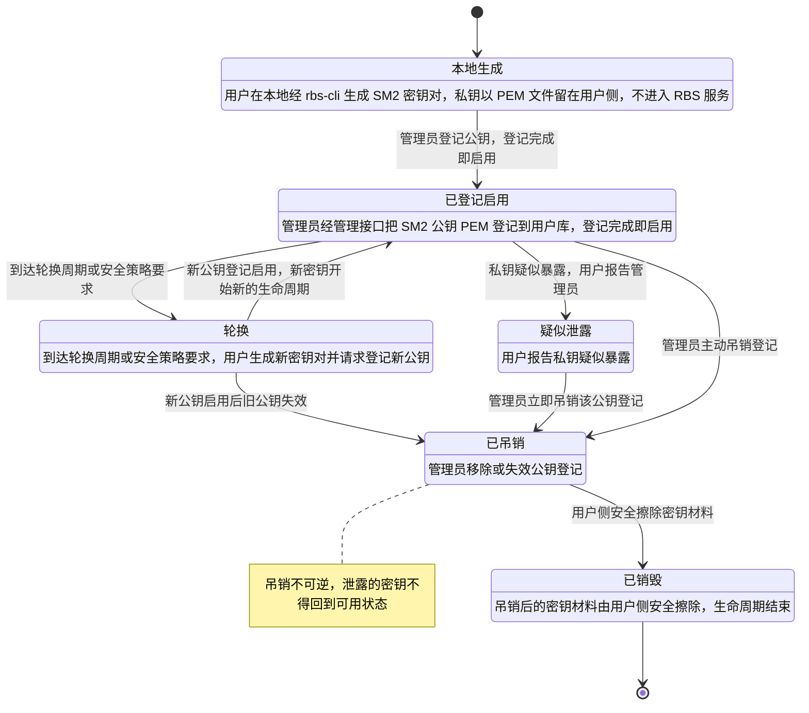
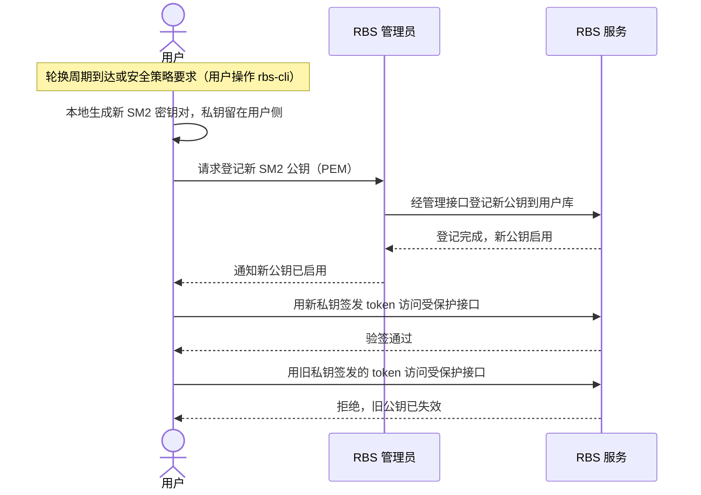

# SM2 用户密钥生命周期设计补充图（SR-1）

> 用途：补齐 SR-1 设计在「敏感参数安全」维度缺失的表达——用户 SM2 密钥的生命周期状态及合法转换，
> 以及跨参与方交互顺序。
>
> 事实来源：`.sdd/SR-1/key-lifecycle-context.md`、`.sdd/SR-1/original-requirement.md`。
>
> 范围：只覆盖**用户 SM2 密钥**（rbs-cli 生成、用于签名 token）；GTA 签发 attestation token 的验签密钥不在本图范围。

## 图 1：用户 SM2 密钥生命周期——状态与合法转换

**回答的评审问题**：密钥从产生到销毁经历哪些状态、在什么条件下发生转换。

**覆盖事实**：生成（F1）、登记与启用（F2）、轮换（F3）、泄露处置（F4）、吊销（F5）、销毁（F6）、失败约束（F7）。

图 1 说明：

- **轮换是双出口的过渡态**。走到 `轮换` 后，新密钥回到 `已登记启用` 开启新一轮生命周期，旧密钥则因新公钥启用而进入 `已吊销`；两条出口都要画，否则旧密钥的失效路径会悬空。
- **fail-closed 由拓扑表达**。`已吊销` 与 `疑似泄露` 没有任何回到 `已登记启用` 的边，即"泄露密钥不得回到可用状态""吊销不可逆"；`已吊销 --> 已销毁` 使处置状态可达终态，但"吊销不是终点"。
- **吊销的时点语义**。授权判定以"吊销时刻"为准，`已吊销` 状态一经进入，该密钥在吊销前签发但尚未过期的 token 也一律拒绝——这是 `已吊销` 与 `轮换` 出口共享的判定规则，图中不再重复连线。
- **私钥不出用户侧**。`本地生成` 是唯一产生私钥的状态，RBS 服务只接触公钥 PEM，因此图中不存在"私钥进入服务"的转换。

## 图 2：密钥轮换——各参与方交互顺序

**回答的评审问题**：轮换时用户、RBS 管理员、RBS 服务按什么顺序交互。

**覆盖事实**：参与方（F8）、轮换（F3）。

图 2 说明：

- **顺序约束**：新公钥必须先在 `RBS 服务` 的用户库登记并启用，用户才开始用新私钥签发 token；启用发生在旧公钥失效之前（同一登记动作的原子效果），避免出现两者同时有效的窗口。
- **失败归属**：旧密钥 token 的拒绝发生在 `RBS 服务` 的验签环节，而不是用户侧；因此即使旧 token 未过期，也在验签阶段被 fail-closed 拒绝。
- **私钥始终不离开用户**：`用户` 与 `RBS 管理员`、`RBS 服务` 之间传递的只有公钥 PEM 与登记/启用通知，没有任何私钥材料。
- 泄露/疑似泄露的处置与轮换共享"登记—验签"这条链路，差异只在触发条件与是否可逆（见 图 1），故不另画时序图。
