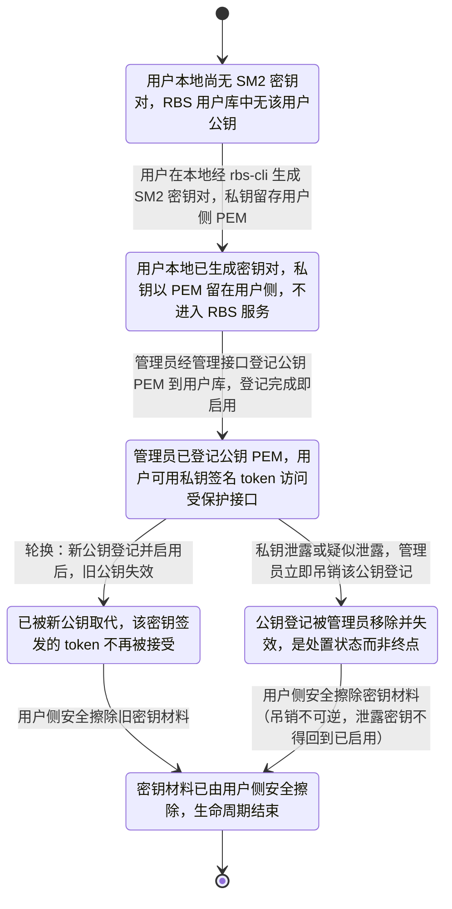
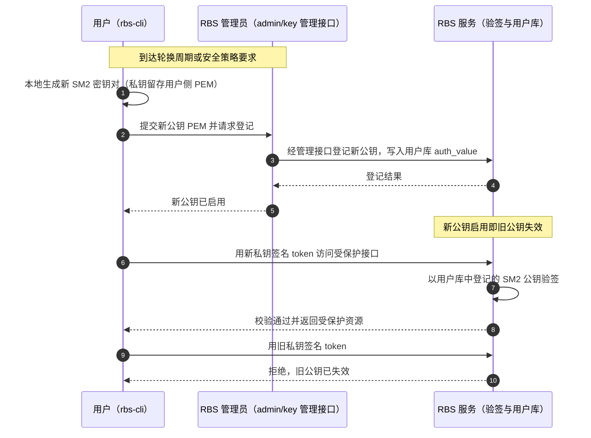
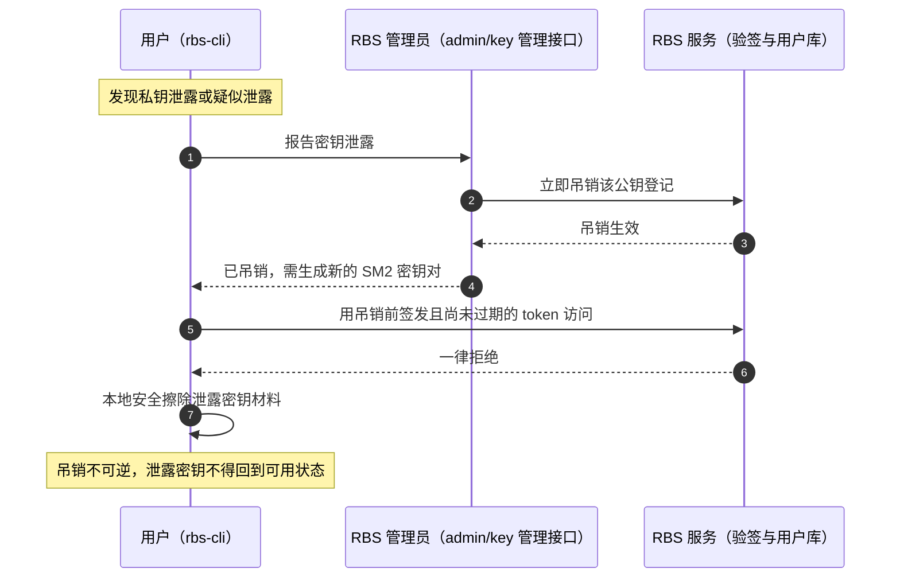

# SM2 用户密钥生命周期 —— 设计补充图表（SR-1）

本文件是 SR-1「用户认证支持 SM2」的设计补充材料，用于闭合 SR 设计门禁在
「敏感参数安全」维度的缺口：用户 SM2 密钥的生命周期状态、合法转换与轮换时序此前
未被设计表达。图表只覆盖密钥生命周期本身，不展开 SM2 验签算法细节。

## 本文件回答的评审问题

| 编号 | 评审问题 | 图 |
| --- | --- | --- |
| Q1 | 用户 SM2 密钥从产生到销毁经历哪些状态；什么条件下发生状态转换 | 图 1 |
| Q2 | 轮换时各参与方按什么顺序交互；旧公钥何时失效 | 图 2 |
| Q3 | 泄露或疑似泄露时各参与方如何联动处置；吊销如何作用到 token 校验 | 图 3 |

## 图 1：用户 SM2 密钥生命周期状态与转换



图的语义与约束：

- 状态以**单个密钥对**为单位。轮换涉及两对密钥：新密钥对走
  `未生成 → 已生成 → 已启用`，旧密钥对同时由 `已启用` 转入 `已失效`，两个过程并发但不共享状态。
- `已吊销` 是处置状态而非终态：唯一出口是 `已销毁`，图中不存在任何回到 `已启用` 的转换，
  对应「泄露密钥不得回到可用状态、吊销不可逆」的约束。
- `已生成 → 已启用` 是唯一的启用入口；启用条件是管理员完成公钥登记，与用户是否已生成密钥对无关。

## 图 2：密钥轮换的参与方交互顺序



关键顺序约束：**新公钥启用先于旧公钥失效**（先启用后失效，避免轮换窗口内出现无可用密钥）；
旧私钥在轮换后签发的 token 由 RBS 服务拒绝，拒绝发生在验签阶段，与被访问接口无关。

## 图 3：泄露/吊销的联动处置时序



关键顺序约束：**吊销先于擦除**，且吊销自生效时刻起对存量 token 生效——包括吊销前签发、
尚未过期的 token（fail-closed）。用户报告是触发条件，但吊销动作的归属方是管理员，
不依赖用户是否已完成本地擦除。

## 业务事实落点对照

| 业务事实 | 落点 |
| --- | --- |
| 1. 生成：用户本地经 rbs-cli 生成，私钥 PEM 留用户侧、不进 RBS 服务 | 图 1 `未生成 → 已生成`；图 2 生成步骤 |
| 2. 登记与启用：管理员经管理接口登记公钥 PEM 到用户库，登记完成即启用 | 图 1 `已生成 → 已启用`；图 2 登记与启用步骤 |
| 3. 轮换：到周期或策略要求时生成新密钥对并登记新公钥，新公钥启用后旧公钥失效 | 图 1 `已启用 → 已失效`；图 2 全图 |
| 4. 泄露处置：用户报告、管理员立即吊销，自吊销时刻起该密钥 token 一律拒绝 | 图 1 `已启用 → 已吊销`；图 3 全图 |
| 5. 吊销：管理员移除/失效公钥登记；吊销是处置状态，不是终点 | 图 1 `已吊销` 状态及 `已吊销 → 已销毁` |
| 6. 销毁：吊销后密钥材料由用户侧安全擦除，生命周期结束 | 图 1 `已吊销 → 已销毁 → [*]`；图 3 擦除步骤 |
| 7. 失败约束：泄露密钥不得回到可用状态；吊销不可逆 | 图 1 中不存在自 `已吊销` 回 `已启用` 的转换，及 `已吊销 → 已销毁` 标注；图 3 图下约束 |
| 8. 参与方：用户（rbs-cli）、RBS 管理员（管理接口）、RBS 服务（验签与用户库） | 图 2、图 3 的 participant 定义 |

## 离线编译验证

按 mermaid-diagram skill 的规定，交付前用 skill 内置的固定版本 Mermaid 离线校验全部图块
（不调用 npx、包管理器或远程渲染服务）：

```bash
python <skill-dir>/scripts/check_mermaid.py docs/SM2-密钥生命周期-图.md
```

校验结果：3 个图块全部 `[OK]`，退出码 `0`。
