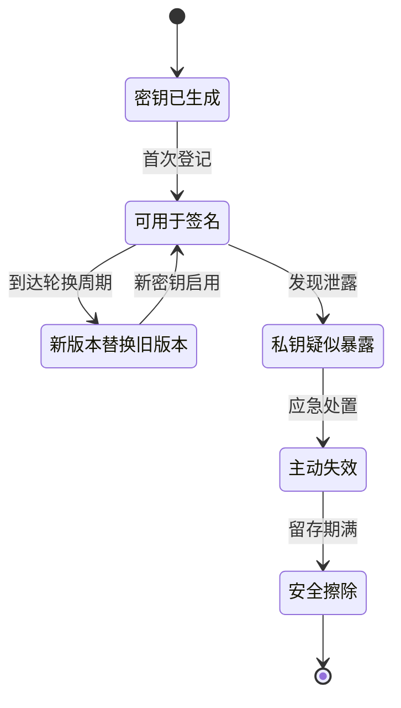

# SM2 密钥生命周期图

```mermaid
stateDiagram-v2
    生成 : 密钥已生成
    启用 : 可用于签名
    轮换 : 新版本替换旧版本
    吊销 : 主动失效
    泄露 : 私钥疑似暴露
    销毁 : 安全擦除
    [*] --> 生成
    生成 --> 启用 : 首次登记
    启用 --> 轮换 : 到达轮换周期
    轮换 --> 启用 : 新密钥启用
    启用 --> 泄露 : 发现泄露
    泄露 --> 吊销 : 应急处置
    吊销 --> 销毁 : 留存期满
    销毁 --> [*]

```
