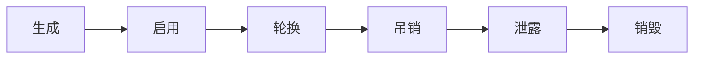
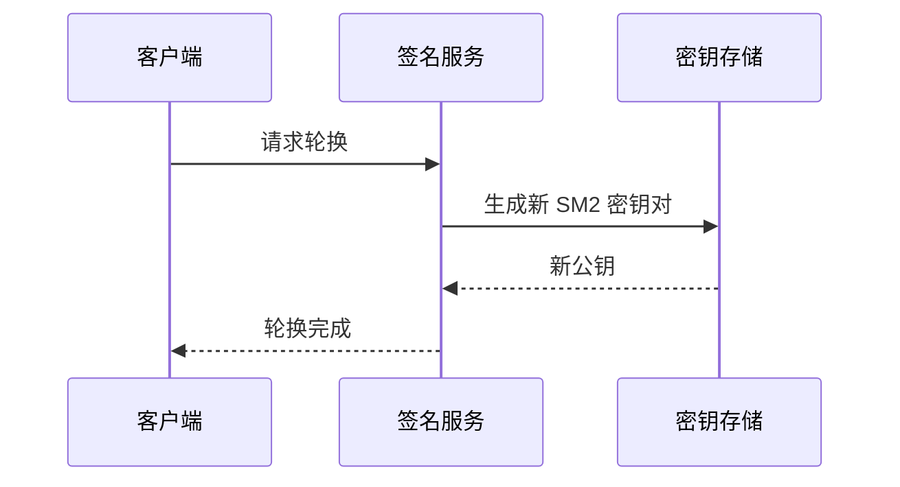

# SM2 密钥生命周期图

```mermaid
flowchart LR
    生成 --> 启用 --> 轮换 --> 吊销 --> 泄露 --> 销毁

```

```mermaid
sequenceDiagram
    participant C as 客户端
    participant S as 签名服务
    participant K as 密钥存储
    C->>S: 请求轮换
    S->>K: 生成新 SM2 密钥对
    K-->>S: 新公钥
    S-->>C: 轮换完成

```
