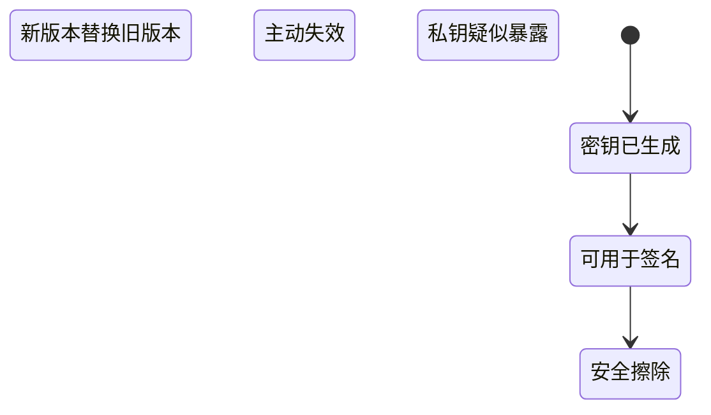
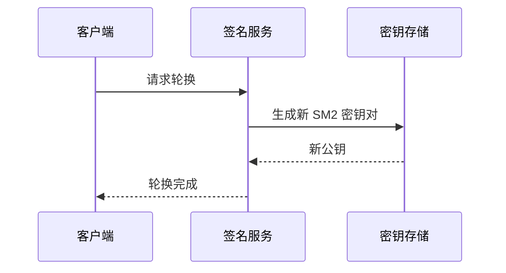

# SM2 密钥生命周期图

```mermaid
stateDiagram-v2
    生成 : 密钥已生成
    启用 : 可用于签名
    轮换 : 新版本替换旧版本
    吊销 : 主动失效
    泄露 : 私钥疑似暴露
    销毁 : 安全擦除
    [*] --> 生成
    生成 --> 启用
    启用 --> 销毁

```

```mermaid
sequenceDiagram
    participant C as 客户端
    participant S as 签名服务
    participant K as 密钥存储
    C->>S: 请求轮换
    S->>K: 生成新 SM2 密钥对
    K-->>S: 新公钥
    S-->>C: 轮换完成

```
