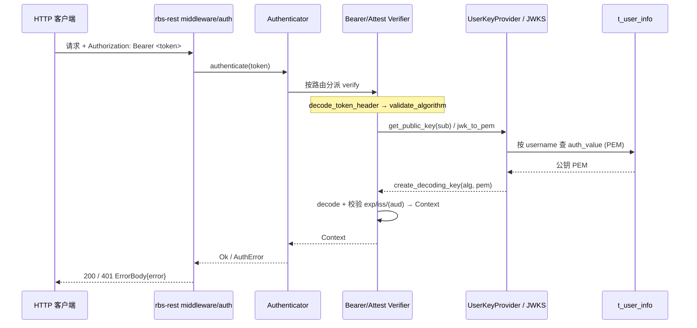

# 模块详细设计上下文（ASIS）

> 本文件为 ASIS 阶段产物，服务后续 `module-tobe-design` 与门禁。ASIS 阶段不创建、不编辑正式《模块详细设计说明书.md》。

## C1. ASIS 状态与阅读说明

| 项目 | 内容 |
|---|---|
| 本次需求/AR/变更点 | SR-1 / AR-1（SM2 用户认证）；切片：rbs-core 内 SM2 用户认证与公钥登记相关部分（现有验签入口、算法分派、用户公钥登记链路、配置与测试现状） |
| 变更类型 | 既有行为改造（认证算法集合扩展；检索确认 rbs-core 当前无任何 SM2 代码/配置/测试，见 A13/E13） |
| 目标模块 | rbs-core（`rbs/core/`） |
| 仓库范围 | globaltrustauthority-rbs（Rust workspace），本次只分析 `rbs/core/` |
| 模块边界来源 | `.sdd/software_architecture.md`（模块清单行 `rbs-core` → `rbs/core/`） |
| 边界来源类型 | declared by software_architecture.md |
| 本次 ASIS 分析范围 | 需求相关切片（SM2 用户认证、算法分派、用户公钥登记链路、配置与测试现状） |
| 是否发生范围扩展 | 否（仅向相邻装配点与配置/DDL 扩展用于解释行为，见 C2.2） |
| ASIS 状态 | 完成 |
| 分析置信度 | 高（认证与登记主链均在 `rbs/core/src` 内直接读证；SM2 现状缺失已用全仓检索确认） |
| 后续 TOBE 可引用结论 | A1–A17 |
| 不得定稿的结论 | A11/A12 依赖 rbs-rest 装配返回文案；SM2 具体 `alg`/`crv`/签名编码/Z 值等互操作取值 A16 标为待确认；A15 为 TOBE 决策输入，不构成 ASIS 定论 |
| 阻塞或待确认项 | C6.1 待确认 2 项（互操作取值、算法-密钥一致性约束）；无 ASIS 阻塞 |

> 执行方式标注：未使用 SubAgent，原因：环境不支持（本环境无法启动 SubAgent，按 skill 规定由主 Agent 自行查证）。本环境不提供 MCP 工具，网络不可用；`grep`/`glob` 工具的 `rg` 二进制不可用，内容检索改用 PowerShell `Select-String` 完成（检索方式见 C7）。

## C2. 模块边界确认

| 来源 | 发现 | 边界来源类型 | 影响 |
|---|---|---|---|
| `.sdd/software_architecture.md` | 模块清单声明 `rbs-core` → `rbs/core/`，职责含「认证与验签（`src/auth/`）、用户公钥登记（`src/admin/key.rs`）、attestation 验证」 | declared by software_architecture.md | 本次分析范围限定在 `rbs/core/`；认证与登记均归属 rbs-core，无边界冲突 |
| `.sdd/software_architecture.md` 关键边界规则 | 规则1：密码学运算只在 rbs-core（服务端验签）与 rbs-cli（客户端签名）；规则2：用户认证公钥持久化归 rbs-core（`t_user_info`），登记入口 `admin/key`，由 rbs-rest 管理路由暴露；规则3：GTA 验签公钥归 rbs-core 的 attestation/authn 链路，配置经 rbs 壳加载 | declared by software_architecture.md | SM2 验签实现应落在 rbs-core；rbs-rest 只编排 |

### C2.1 模块边界

| 分类 | 路径或组件 | 判断依据 | 证据编号 |
|---|---|---|---|
| 确定属于模块 | `rbs/core/src/auth/`（`authn/`、`authz/`、`context.rs`、`error.rs`） | 架构文档职责声明 | E1 |
| 确定属于模块 | `rbs/core/src/admin/`（`key.rs`、`manager.rs`、`entity.rs`） | 架构文档职责声明 | E1 |
| 确定属于模块 | `rbs/core/src/attestation/`、`policy/`、`resource/`、`infra/`、`system/` | 架构文档「核心域逻辑」整体归属 `rbs/core/` | E1 |
| 外部依赖 | `rbs/api-types/`（`src/config/`、`src/user.rs`） | 架构文档：纯类型，无行为；被 rbs-core 引用 | E1 |
| 外部依赖 | `rbs/rest/`（`src/middleware/auth.rs`、`src/server/http.rs`） | 架构文档：只编排 rbs-core，不实现密码学 | E1 |
| 外部依赖 | `rbs/`（`src/bin/main.rs`、`conf/rbs.yaml`） | 架构文档：服务装配、配置加载、启动入口 | E1 |
| 外部依赖 | `tools/`（rbs-cli）、`rbc/` | 架构文档：工具层/资源加密，本次与 rbs-core 认证链路无交互 | E1 |
| 外部依赖 | 用户库 `t_user_info`、GTA 服务 | 架构文档规则2/3 | E1 |

### C2.2 本次需求相关分析范围

| 分类 | 路径、组件或行为 | 纳入/排除原因 | 证据编号 |
|---|---|---|---|
| 需求相关 | `rbs/core/src/auth/authn/common.rs` | 算法白名单、header 解析、错误映射——SM2 必须在此扩展 | E2,E3,E4 |
| 需求相关 | `rbs/core/src/auth/authn/bearer_token.rs` | BearerToken 验签入口（用户认证主路径） | E7,E8 |
| 需求相关 | `rbs/core/src/auth/authn/token.rs` | AttestToken（GTA attestation）验签入口 | E9,E10 |
| 需求相关 | `rbs/core/src/auth/authn/jwks.rs` | GTA JWKS 公钥解析与选键（`kty=EC` 现被拒） | E13,E14 |
| 需求相关 | `rbs/core/src/auth/authn/authenticator.rs`、`authn/mod.rs` | 算法分派与 `TokenVerifier`/`UserKeyProvider` trait | E32,E33 |
| 需求相关 | `rbs/core/src/admin/key.rs` | 公钥校验与 alg 推导、JWK→PEM（SM2 曲线现被拒） | E16,E17,E18 |
| 需求相关 | `rbs/core/src/admin/manager.rs`（`UserKeyProvider` 实现与用户 CRUD） | 用户公钥登记与按 `sub` 取公钥链路 | E19,E20,E22,E23,E34 |
| 需求相关 | `rbs/core/src/admin/entity.rs`、`rbs/rdb_sql/sqlite_rbs.sql` | `t_user_info.auth_value/auth_alg` 承载 SM2 公钥与算法串 | E21,E27 |
| 需求相关 | `rbs/core/src/auth/error.rs`、`context.rs` | 认证错误语义与上下文类型（SM2 失败需归入同类 401） | E37,E38 |
| 疑似相关 | `rbs/api-types/src/config/mod.rs`、`config/validation.rs`、`rbs/conf/rbs.yaml` | 认证/登记所需配置项与启动校验（本次不新增配置项） | E24,E25,E26 |
| 疑似相关 | `rbs/rest/src/server/http.rs`、`rbs/src/bin/main.rs` | 认证器装配与 `key_provider` 委派（用于解释 C4 调用链） | E29,E30 |
| 本次不分析 | `rbs/core/src/resource/`、`policy/`、`policy_engine/` | 与 SM2 认证无关，未发现交互 | E1 |
| 本次不分析 | `rbs/core/src/attestation/gta/rest.rs` | 本次只验签 GTA 返回的 token，不改 GTA REST 契约 | E1 |
| 本次不分析 | `rbs/rest/src/middleware/auth.rs` 细节、`tools/`（rbs-cli）、`rbc/` | 属 rbs-rest / 工具层模块，另由对应模块 ASIS 覆盖；本文件仅引用其装配事实 | E1 |

## C3. 关键 ASIS 事实

> 阶段 2 的初步线索（L1–L8）已由阶段 4 查证、阶段 5 复核吸收，结论见下表（A1–A17）。未采纳的查证结果不在此列出。

| 编号 | 关键现状结论 | 类型 | 对 TOBE/AICoding 的影响 | 来源探索 | 证据编号 |
|---|---|---|---|---|---|
| A1 | 认证算法集合硬编码为 `PS256/PS384/PS512/EdDSA`（`SUPPORTED_ALGORITHMS`，错误文案串 `SUPPORTED_ALGORITHMS_STR`）；Bearer 与 Attest 验签都先调用 `validate_algorithm` 校验。SM2 不在集合内。 | 事实 | SM2 需在算法分派/白名单处扩展或前置分流 | Q1,Q2 | E2,E3,E7,E10 |
| A2 | JWT header 统一经 `decode_token_header`（`jsonwebtoken::decode_header`）解析；`jsonwebtoken` 无 SM2 变体，`alg=SM2` 在该步即失败，映射为 `AuthError::TokenInvalid{reason:"failed to decode token header: ..."}`。 | 事实 | SM2 不能沿用既有解码路径，需在解码前做原始 `alg` 预解析 | Q1,Q2 | E4,E2,E6 |
| A3 | Bearer 验签固定 5 步（`BearerTokenVerifier::verify`）：解析 header→校验算法→**未验签**解析 payload 取 `sub`（要求 token 恰为 3 段）→按 `sub` 取用户公钥 PEM→构造解码密钥并 `decode` 校验（required claims `exp/iss/sub`，校验 issuer/audience），成功返回 `BearerContext`。密钥类型由 `header.alg` 决定，不使用库中 `auth_alg`。 | 事实 | SM2 分支需在取公钥后走独立验签，并复用 claims 重校验 | Q1,Q3 | E7,E8 |
| A4 | Attest 验签（`AttestTokenVerifier::verify`）：解析 header→校验算法→`get_decoding_key(kid,alg)`（优先用配置直读密钥，否则按 `kid`/首个 JWKS 键 `jwk_to_pem` 后构造）→`decode` 校验（required claims `exp/iss`，issuer 必校验、audience 配置存在时校验）。 | 事实 | SM2 attestation 验签需同时覆盖 PEM 直读与 JWKS 两分支 | Q1,Q4 | E9,E10,E11 |
| A5 | JWKS `jwk_to_pem` 仅支持 `kty=RSA` 与 `kty=OKP`（OKP 仅 `crv=Ed25519`）；`kty=EC` 显式返回 `unsupported key type: ...`。`Jwk` 结构字段为 `kty/kid/alg/n/e/crv/x`，**无 `y` 字段**。 | 事实 | GTA 若以 EC/SM2 JWK 下发，需扩展解析并新增 `y` 坐标字段 | Q4 | E13b,E14,E15 |
| A6 | 用户公钥 alg 推导 `validate_and_derive_alg`：RSA→`RS256`；EC→`P-256/P-384/P-521`→`ES256/ES384/ES512`；其他 EC 曲线返回 `InvalidParameter("Unsupported EC curve")`。SM2 曲线当前命中该错误。 | 事实 | 登记链路需为 SM2 曲线新增 alg 取值 | Q3 | E16 |
| A7 | 用户 JWK→PEM（`admin::key::jwk_to_pem`）支持 `kty=RSA`/`kty=EC`（`crv` 仅 `P-256/P-384/P-521`），不认 `SM2`；输入规模上限 `MAX_KEY_SIZE=10240` 字节（PEM 与 JWK 均校验）。 | 事实 | JWK 登记 SM2 需扩展 `crv` 分支；上限约束可复用 | Q3 | E17,E18 |
| A8 | 用户公钥以 PEM 文本存 `t_user_info.auth_value`、算法串存 `auth_alg`；`AdminManager` 实现 `UserKeyProvider::get_public_key(sub)`，仅按 `username`(=sub) 查库返回 `auth_value`，不校验 status、不使用 `auth_alg`。 | 事实 | SM2 公钥登记无需 DDL 变更；取键接口签名无需改 | Q3 | E19,E21,E27 |
| A9 | 存储的 `auth_alg` 仅在登记/更新时写入，认证路径从不读取；Bearer 验签密钥类型完全由 token `header.alg` 决定。且 `validate_and_derive_alg` 对 RSA 返回 `RS256`，而认证白名单不含 `RS256`（仅 `PS*`）——存储算法串与可验证算法集合本就不一致。 | 事实 | TOBE 需明确 `auth_alg` 是否参与算法-密钥一致性约束；扩展 SM2 时注意既有不一致 | Q2,Q3 | E20,E3,E16 |
| A10 | Bearer 公钥查找/解码密钥构造失败统一掩码为 `TokenInvalid{reason:"invalid token"}`（防用户枚举），详细原因仅进日志（`error!`/`debug!`）；Attest 选键失败返回具体 `reason`。 | 事实 | SM2 分支失败应沿用掩码策略 | Q1 | E7,E11 |
| A11 | 认证失败经 rbs-rest 中间件以 HTTP 401 返回，响应体 `ErrorBody{ error: AuthError 的 Display }`（如 `token is invalid: unsupported algorithm: ...`），非裸 reason 串。 | 事实（依赖 rbs-rest 装配） | 验收断言需按实际文案（含 `token is invalid: ` 前缀） | Q1 | E31,E37 |
| A12 | `AttestTokenVerifier::new` 在构造期读取 PEM/JWKS 文件；配置缺失/文件不可读/JWKS 解析失败均返回 `Err`，经 `Authenticator::new` 上传，认证器在 rbs-rest 每 worker `.expect(...)` 构造——即启动期快速失败。 | 事实 | SM2 公钥配置错误应在启动期失败，语义与既有一致 | Q5 | E9,E29,E32 |
| A13 | 认证与登记**不涉及新增配置项**：Attest 公钥复用既有 `auth.attest_token.public_key_path`/`jwks_file`；用户 SM2 公钥复用既有 `public_key`/`jwk` 登记字段；无算法开关。启动校验已强制 `attest_token` 与 `admin.admin_key` 各自二选一。 | 事实 | 仅扩展取值语义，不新增配置键 | Q5 | E24,E25,E26 |
| A14 | 仓库已引入并 vendor OpenSSL（workspace `openssl = "0.10.45"` + `vendored`，`Cargo.lock` 锁 `0.10.79`，OpenSSL 3.x，含 SM2/SM3 能力）；`jsonwebtoken` 锁 `10.3.0`（无 SM2 变体）；`josekit 0.10.3` 在 rbs-core 仅用于资源 JWE，不参与认证。 | 事实 | 现状即可复用既有 OpenSSL 做 SM2/SM3，不新增密码三方件 | Q6 | E28,E12,E15 |
| A15 | 现有代码的 EC 处理只存在于登记侧（`admin/key.rs`，仅 P-256/384/521），验签侧无任何 EC/SM2 路径；`jsonwebtoken::DecodingKey` 无 SM2/EC 构造分支。SM2 验签的实现落点（扩展现有 `authn` 还是独立模块）、是否复用 `create_decoding_key` 等存在多条可选路径。 | 决策输入 | TOBE 需决定 SM2 验签的模块落点与复用边界 | Q1,Q2,Q6 | E5,E3,E2 |
| A16 | SM2 在 JWS/JWK 层的互操作取值（`header.alg` 名称、JWK `crv` 名、签名编码 `r||s`、SM2 用户标识 Z 值、SM3 摘要）仅见于上游 `SR-design.md` 约定，仓库代码中不存在对应实现或常量可佐证。 | 待确认 | 需与上游/GTA 确认取值后方可定稿验收断言 | Q8 | E38 |
| A17 | rbs-core 及全仓相关目录当前不存在任何 SM2/SM3 相关代码、常量、配置或测试（大小写敏感检索 `sm2`/`SM2`/`Sm2` 结果为空）。 | 事实 | 明确本次为在既有链路上新增算法分支，无既有 SM2 实现可复用 | Q8 | E13 |

## C4. 调用链与数据流

| 链路/数据对象 | 当前行为 | 与本次需求/变更的关系 | 对 TOBE 的约束 | 证据编号 |
|---|---|---|---|---|
| Bearer 用户认证（`BearerToken`） | HTTP 请求 → rbs-rest 中间件 → `Authenticator` 按路由分派 → `BearerTokenVerifier::verify` → 解析 header/校验算法/取 `sub`/查用户公钥 PEM/构造解码密钥并 `decode` → `BearerContext` | SM2 用户认证主路径（AR-1） | SM2 分支须在取公钥后接入独立验签，并复用既有 required claims 与 issuer/audience 校验语义 | E7,E8,E29,E31 |
| Attest 验签（GTA token） | HTTP 请求 → 中间件 → `Authenticator` 分派 → `AttestTokenVerifier::verify` → `get_decoding_key` 选键（配置 PEM 直读 或 JWKS 解析）→ `decode` | R2 验证 GTA SM2 attestation token 的承载链路 | SM2 attestation token 的两条选键分支（配置直读 / JWKS）都需可解析 SM2 公钥 | E9,E10,E11 |
| 用户公钥登记 → 认证读键（写后读） | 管理路由 → `AdminManager` 登记（校验并推导 alg、JWK→PEM、事务写 `t_user_info`）→ 认证时 `UserKeyProvider::get_public_key(sub)` 反查 `auth_value` | SM2 用户公钥登记链路 | 登记写入的 SM2 公钥形态必须与认证侧解析分支一致；认证侧仅按 `username`(=sub) 取 `auth_value` | E16,E18,E19,E22,E27 |
| 认证器装配与公钥委派 | 启动期 rbs-rest 每 worker `Authenticator::new(...).expect(...)`；`CoreKeyProvider` 委派 `AdminManager::get_public_key` | 影响 SM2 引入后配置/公钥加载失败的暴露时机 | SM2 相关配置与公钥加载错误须保持启动期快速失败语义 | E29,E30,E32 |

## C5. 配置、数据、测试与依赖现状

| 主题 | 现状 | 风险或限制 | 与本次需求/变更的关系 | 证据编号 |
|---|---|---|---|---|
| 配置 | 认证/登记所需配置项已存在且本次不新增：`auth.attest_token.{public_key_path|jwks_file,issuer,audience}`、`auth.bearer_token.{issuer,audience}`、`admin.max_users`(1..=100)、`admin.admin_key.{public_key_path|jwks_file}`；无“算法开关”配置项 | 无 SM2 专用配置入口，SM2 复用既有键位（仅取值语义变化） | A13 结论来源；SM2 不需要新配置键 | E24,E26 |
| 参数校验 / 启动校验 | 启动期校验强制 `attest_token` 与 `admin.admin_key` 各自“PEM 或 JWKS”二选一，缺失即启动失败 | 校验逻辑不含算法维度，对 SM2 无额外分支 | SM2 引入不改变启动校验结构 | E25 |
| 事务 | 用户登记写入（`insert_user_in_txn`）与更新（`apply_user_update`）在事务中完成；唯一约束冲突回滚 | 无 | SM2 公钥登记走同一事务路径 | E22,E23 |
| 并发 | 认证器在 rbs-rest 每 worker 各构造一份（`Authenticator::new(...).expect(...)`）；`get_public_key` 每次按 username 查库 | `AttestTokenVerifier` 构造期读取 PEM/JWKS 文件并缓存于实例 | SM2 公钥来源若走文件/JWKS，需注意实例级缓存与 worker 数 | E29,E32 |
| 异常 / 错误语义 | `AuthError` 变体：`TokenMissing/TokenInvalid{reason}/TokenExpired/TokenNotYetValid/TokenUnknown/UserDisabled/ProviderNotFound`；Bearer 取键/建钥失败统一掩码 `TokenInvalid{"invalid token"}`（防枚举），Attest 选键失败返回具体 `reason`；对外 401 体为 `ErrorBody{error: AuthError 的 Display}` | 失败文案与掩码策略是既有安全约定 | SM2 失败需归入 `TokenInvalid` 类并通过中间件 401 暴露 | E10,E37,E31 |
| 数据 / 持久化 | `t_user_info`（`user_id/username(PK)/role/auth_type/auth_value/auth_alg/status/created_at/updated_at`）；`auth_value` 存公钥 PEM 文本、`auth_alg` 存算法串 | `get_public_key` 不校 `status`、不使用 `auth_alg` | SM2 公钥登记无需 DDL 变更 | E21,E27,E19 |
| 幂等 / 重试 / 降级 | 认证与登记链路无重试/降级机制；GTA 调用侧不属本切片 | 无 | 对 SM2 无新增要求 | E9,E19 |
| 外部依赖（密码学） | workspace 已 vendor OpenSSL（`openssl = "0.10.45"` + `vendored`，锁定 0.10.79，OpenSSL 3.x，含 SM2/SM3）；`jsonwebtoken` 锁定 10.3.0（无 SM2 变体）；`josekit 0.10.3` 在 rbs-core 仅用于资源 JWE，不参与认证 | `jsonwebtoken` 无法直接验 SM2；SM2 需依赖 OpenSSL 能力 | TOBE 决定 SM2 验签所用密码学路径 | E28,E12,E15 |
| 依赖（模块内） | `rbs-core` 依赖 `api-types`（配置/用户类型）；`AttestTokenVerifier` 构造期读文件（PEM/JWKS） | 文件依赖在构造期解析，路径错误即启动失败 | 与 SM2 公钥加载时机相关 | E9,E32 |

### C5.1 测试覆盖现状

| 测试文件或套件 | 覆盖行为 | 与本次需求的关系 | 未覆盖风险 | 证据编号 |
|---|---|---|---|---|
| `rbs/core/src/auth/authn/common.rs`（内嵌 `#[cfg(test)]`） | 算法白名单常量、错误映射（畸形 token） | SM2 需扩展白名单，测试须同步 | 无 SM2 算法/验签用例 | E36 |
| `rbs/core/src/auth/authn/bearer_token.rs`（内嵌测试） | 畸形 token、段数不符、缺配置等失败路径 | Bearer 为 SM2 用户认证主路径 | 无真实 SM2 公钥/token 的成功/失败验签用例 | E36 |
| `rbs/core/src/auth/authn/token.rs`（内嵌测试） | Attest Token 选键失败、claims 缺失 | GTA SM2 attestation token 的承载 | 无 EC/SM2 JWKS 用例、无 SM2 验签成功用例 | E36 |
| `rbs/core/src/auth/authn/jwks.rs`（内嵌测试） | `kty=RSA/OKP` 解析、`kty=EC` 拒绝 | JWKS 是 SM2 attestation token 的选键来源之一 | 无 `kty=EC` 正例、无 `y` 字段用例 | E36 |
| `rbs/core/src/admin/key.rs`（内嵌测试） | `validate_and_derive_alg`、`jwk_to_pem` 的 RSA/EC 分支与非法输入 | 登记侧需新增 SM2 分支 | 无 SM2 曲线/alg 推导用例 | E36 |
| `rbs/core/src/admin/manager.rs`（内嵌测试） | 用户 CRUD、`get_public_key` 按 username 取键 | 登记→读键链路正确性 | 无 SM2 公钥登记→验签端到端用例 | E36 |
| `rbs/core/tests/`（`policy_*`、`resource_*`、`logging_tests.rs`、`version_test.rs`） | 策略/资源/日志/版本 | — | 目录内无 auth 相关集成测试 | E35 |
| `rbs/rest/tests/handler_tests.rs` | 用 stub `Auth` 覆盖 handler 行为，非真实验签 | SM2 对外暴露为 401 文案时无法由此验证 | 无真实认证中间件端到端用例 | E39 |

## C6. 规格漂移、待确认与阻塞

| 编号 | 类型 | 现状/漂移/风险 | 影响 | 后续关注点 | 证据编号 |
|---|---|---|---|---|---|
| D1 | 规格漂移 | 上游 `SR-design.md` 第 10 章称“`.sdd/software_architecture.md` 不存在”，但该文件实际存在（本次模块边界的唯一来源） | 上游边界描述与实际不符，TOBE 需以实际 `software_architecture.md` 为准 | 与上游确认文档状态 | E38,E1 |
| D2 | 规格漂移 | 上游 `SR-design.md` 引用的若干代码行号（如 `admin/key.rs`、`jwks.rs`、`common.rs`）与当前代码存在轻微偏移，但描述内容与代码一致 | 引用行号不可直接沿用 | TOBE/Gate 引用时以当前代码行号为准 | E38,E2,E13,E16 |
| D3 | 隐藏约束 | 存储的 `auth_alg` 仅在登记/更新时写入、认证路径从不读取；Bearer 验签密钥类型由 token `header.alg` 决定；且 `admin/key.rs` 对 RSA 返回 `RS256`，而认证白名单仅含 `PS256/PS384/PS512/EdDSA`，既有算法串与可验证集合本就不一致 | 算法-密钥一致性无现行约束，SM2 扩展需明确是否沿用此行为 | 确认 `auth_alg` 是否应参与一致性校验 | E3,E16,E20 |
| D4 | 隐藏约束 | Bearer 验签在取 `sub` 时要求 token 恰为 3 段（`extract_sub_from_payload`），并在未验签前解析 payload | 非 JWS 紧凑格式或段数异常会在取 `sub` 前失败 | SM2 token 编码形态须与取 `sub` 逻辑兼容 | E8 |
| D5 | 安全 | Bearer 取键/建钥失败统一掩码为 `TokenInvalid{"invalid token"}`（防用户枚举），详细原因仅入日志；Attest 选键失败返回具体 `reason` | 对外错误文案受既有掩码策略约束 | 验收断言需按实际文案（含中间件 `token is invalid: ` 前缀） | E7,E10,E31 |
| D6 | 数据 / 兼容 | `t_user_info` 以 PEM 文本存公钥于 `auth_value`；认证侧只按 `username` 取键，不区分算法 | 现有存储形态可承载 SM2 公钥，无需 DDL 变更 | 登记侧写入的 SM2 公钥形态须与认证侧解析一致 | E19,E21,E27 |
| D7 | 测试 | 认证/登记相关测试均为内嵌单测（畸形 token、缺配置、常量断言），无真实 SM2 覆盖；`rbs/core/tests/` 无 auth 用例；REST 层用 stub `Auth` | 无既有 SM2 用例可回归复用 | TOBE 需规划 SM2 验签与登记的测试补充 | E35,E36,E39 |

### C6.1 待确认问题

| 问题 | 类型 | 为什么影响 TOBE/AICoding | 当前线索 | 建议确认对象 |
|---|---|---|---|---|
| SM2 在 JWS/JWK 层的互操作取值（`header.alg` 名称、JWK `crv` 名、签名编码 `r‖s`、用户标识 Z 值、SM3 摘要） | 需前置确认 | 直接决定验签实现、公钥解析分支与验收断言，取值错误无法互操作 | 仅上游 `SR-design.md` 有约定，仓库代码/常量无佐证 | 上游设计 / GTA 侧 |
| `auth_alg` 是否应参与算法-密钥一致性约束（当前仅写入不读取，且 RSA→`RS256` 与白名单不一致） | 需前置确认 | 决定登记/认证是否需要新增一致性校验及回归范围 | A9/D3 已查明既有不一致 | 代码负责人 / 用户 |
| SM2 验签的实现落点与复用边界（扩展现有 `authn` 还是独立模块、是否复用 `create_decoding_key`） | TOBE 决策输入 | 影响改动面、回归范围与错误语义一致性 | A15 已列出现状可选项 | 上游设计 |

### C6.2 ASIS 阻塞项

不适用，原因：ASIS 状态为“完成”，未发现阻断后续 TOBE 的 ASIS 阻塞项；影响定稿的仅为 C6.1 中 2 项「需前置确认」。

## C7. 证据索引

| 编号 | 证据类型 | 位置 | 检索方式 | 支撑结论 |
|---|---|---|---|---|
| E1 | 文档（模块边界声明） | `.sdd/software_architecture.md:13-27` | 直接阅读 | A1、边界确认 |
| E2 | 文件/常量 | `rbs/core/src/auth/authn/common.rs:20-24` | 直接阅读 | A1,A2,A15 |
| E3 | 函数 | `rbs/core/src/auth/authn/common.rs:34-42`（`validate_algorithm`） | 直接阅读 | A1,A9 |
| E4 | 函数 | `rbs/core/src/auth/authn/common.rs:52-56`（`decode_token_header`） | 直接阅读 | A2 |
| E5 | 函数 | `rbs/core/src/auth/authn/common.rs:69-79`（`create_decoding_key`） | 直接阅读 | A15 |
| E6 | 函数 | `rbs/core/src/auth/authn/common.rs:91-117`（`map_jwt_error`） | 直接阅读 | A2 |
| E7 | 函数 | `rbs/core/src/auth/authn/bearer_token.rs:81-158`（`BearerTokenVerifier::verify`） | 直接阅读 | A1,A3,A10 |
| E8 | 函数 | `rbs/core/src/auth/authn/bearer_token.rs:168-194`（`extract_sub_from_payload`） | 直接阅读 | A3 |
| E9 | 函数 | `rbs/core/src/auth/authn/token.rs:58-86`（`AttestTokenVerifier::new`） | 直接阅读 | A4,A12 |
| E10 | 函数 | `rbs/core/src/auth/authn/token.rs:93-125`（`verify`） | 直接阅读 | A1,A4 |
| E11 | 函数 | `rbs/core/src/auth/authn/token.rs:129-157`（`get_decoding_key`） | 直接阅读 | A4,A10 |
| E12 | 函数 | `rbs/core/src/auth/authn/token.rs:162-177`（`create_decoding_key_for_pem`，openssl 判 ED25519） | 直接阅读 | A14 |
| E13 | 类/结构 | `rbs/core/src/auth/authn/jwks.rs:23-46`（`Jwk` 字段，无 `y`） | 直接阅读 | A5 |
| E14 | 函数 | `rbs/core/src/auth/authn/jwks.rs:66-74`（`jwk_to_pem` kty 分派） | 直接阅读 | A5 |
| E15 | 函数 | `rbs/core/src/auth/authn/jwks.rs:105-125`（`jwk_okp_to_pem`，仅 Ed25519） | 直接阅读 | A5,A14 |
| E16 | 函数 | `rbs/core/src/admin/key.rs:26-53`（`validate_and_derive_alg`） | 直接阅读 | A6,A9 |
| E17 | 函数 | `rbs/core/src/admin/key.rs:100-133`（`jwk_ec_to_pem`） | 直接阅读 | A7 |
| E18 | 函数 | `rbs/core/src/admin/key.rs:56-76`（`jwk_to_pem`） | 直接阅读 | A7 |
| E19 | 函数/trait 实现 | `rbs/core/src/admin/manager.rs:596-620`（`impl UserKeyProvider for AdminManager`） | 直接阅读 | A8 |
| E20 | 函数 | `rbs/core/src/admin/manager.rs:294-320`（`extract_auth_material`/`extract_update_key_material`） | 直接阅读 | A9 |
| E21 | 结构/Entity | `rbs/core/src/admin/entity.rs:78-101`（`t_user_info` Model） | 直接阅读 | A8 |
| E22 | 函数（事务） | `rbs/core/src/admin/manager.rs:322-376`（`insert_user_in_txn`） | 直接阅读 | A8 |
| E23 | 函数（事务） | `rbs/core/src/admin/manager.rs:393-437`（`apply_user_update`） | 直接阅读 | A8 |
| E24 | 结构 | `rbs/api-types/src/config/mod.rs:473-542`（`AuthConfig`/`AttestTokenVerificationConfig`/`BearerTokenVerificationConfig`/`AdminConfig`/`AdminKeyConfig`） | 直接阅读 | A13 |
| E25 | 函数 | `rbs/api-types/src/config/validation.rs:530-579`（配置启动校验） | 直接阅读 | A13 |
| E26 | 配置文件 | `rbs/conf/rbs.yaml:32-48`（`auth.attest_token`/`auth.bearer_token`/`admin`） | 直接阅读 | A13 |
| E27 | DDL | `rbs/rdb_sql/sqlite_rbs.sql:5-15`（`t_user_info` 建表） | 直接阅读 | A8 |
| E28 | 依赖清单 | `Cargo.toml:34,43` + `Cargo.lock`（openssl 0.10.79、jsonwebtoken 10.3.0、josekit 0.10.3） | 直接阅读 + `Select-String 'name = "..."'` | A14 |
| E29 | 文件/装配点 | `rbs/rest/src/server/http.rs:173-181`（每 worker 构造 `Authenticator`） | 直接阅读 | A12 |
| E30 | 文件/装配点 | `rbs/src/bin/main.rs:33-47,79-93`（`CoreKeyProvider` 委派 + `bootstrap_admin`） | 直接阅读 | C4 调用链 |
| E31 | 函数 | `rbs/rest/src/middleware/auth.rs:161-173`（失败映射 401 `ErrorBody{error}`） | 直接阅读 | A11 |
| E32 | 函数 | `rbs/core/src/auth/authn/authenticator.rs:57-87`（`Authenticator::new` 与分派） | 直接阅读 | A12 |
| E33 | trait | `rbs/core/src/auth/authn/mod.rs:28-53`（`UserKeyProvider`/`TokenVerifier`） | 直接阅读 | A3,A4 |
| E34 | 函数 | `rbs/core/src/admin/manager.rs:529-593`（`read_admin_key`） | 直接阅读 | A13 |
| E35 | 目录/测试清单 | `rbs/core/tests/`（`policy_*`、`resource_*`、`logging_tests.rs`、`version_test.rs`，无 auth 用例） | 文件列表 | C5.1 |
| E36 | 测试 | `rbs/core/src/auth/authn/common.rs:119-157`、`bearer_token.rs:196-273`、`token.rs:179-263`、`jwks.rs:181-238`、`admin/key.rs:135-222`、`admin/manager.rs:677-825`（内嵌单元测试） | 直接阅读 | C5.1 |
| E37 | 枚举 | `rbs/core/src/auth/error.rs:18-39`（`AuthError` 变体） | 直接阅读 | A11 |
| E38 | 文档（上游设计） | `.sdd/SR-1/SR-design.md:77-87,1303,1411-1413`（SM2 互操作约定与「无架构文档」表述） | 直接阅读 | A16、C6 漂移 |
| E39 | 测试 | `rbs/rest/tests/handler_tests.rs:12-71`（stub `Auth`，非真实验签） | 直接阅读 | C5.1 |
| E40 | 命令输出 | 全仓 SM2 检索：`Get-ChildItem rbs,tools,rbc,docs,... -Recurse -Include *.rs,*.toml,*.yaml,*.yml,*.md` + `Select-String 'SM2|sm2|Sm2'` → 结果为空 | PowerShell Select-String（递归） | A17 |

> 主要检索路径说明：本环境 `grep`/`glob` 工具的 `rg` 二进制不可用，内容检索统一改用 PowerShell `Select-String`（配合 `Get-ChildItem -Recurse`）；关键检索词：`SM2|sm2|Sm2`（大小写敏感）、`auth_alg`、`UserKeyProvider|get_public_key`、`Authenticator::new`、`josekit|jsonwebtoken|openssl::`、`name = "openssl"`（Cargo.lock）。

## C8. 需求/AR 追溯矩阵

| 编号 | 需求/AR/功能点/影响点 | 本模块相关性 | ASIS 结论编号 | 证据编号 | 覆盖状态 |
|---|---|---|---|---|---|
| R1 | 用户认证支持 SM2（AR-1） | 需求相关 | A1,A2,A3,A15,A16 | E2,E3,E4,E7,E8 | 已覆盖 |
| R2 | 验证 GTA 下发的 SM2 attestation token | 需求相关 | A4,A5,A12,A16 | E9,E10,E11,E13,E14,E15 | 部分覆盖（SM2 互操作取值待确认，见 C6.1） |
| R3 | 用户 SM2 公钥登记（Bearer 认证取公钥来源） | 需求相关 | A6,A7,A8,A9,A13 | E16,E17,E18,E19,E21,E27 | 已覆盖 |
| R4 | rbs-cli 生成 SM2 token（客户端签名） | 不涉及本模块 | A17 | E13 | 不涉及本模块（`tools/` 属工具层） |
| R5 | 认证失败对外语义与配置/启动约束 | 疑似相关 | A11,A12,A13 | E24,E25,E29,E31 | 已覆盖 |
