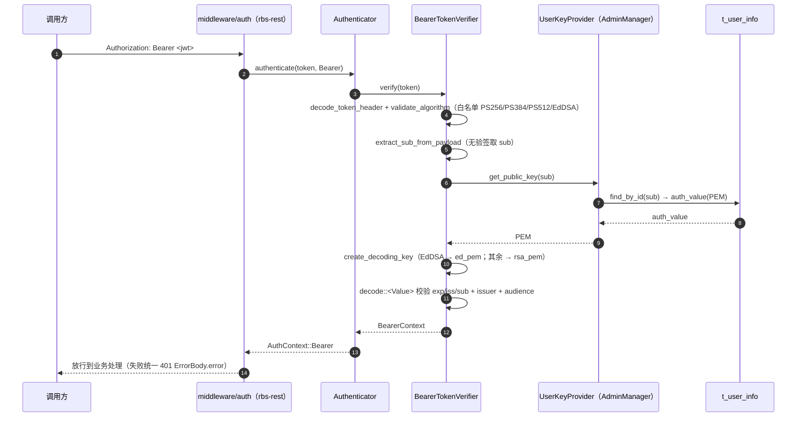
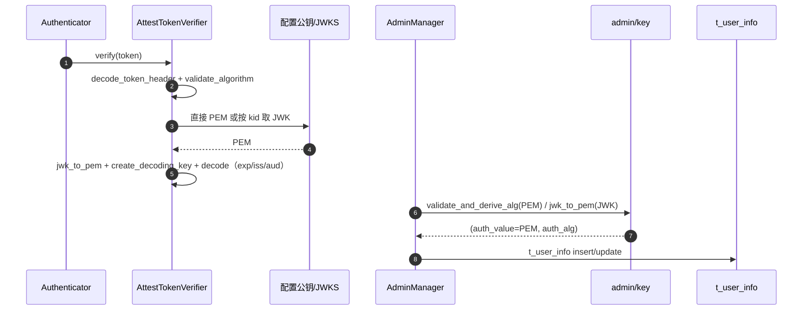

# 模块详细设计 ASIS context 模板

> 本文件为 `rbs-core` 模块在 SR-1 / AR-1（SM2 用户认证）切片下的 ASIS 详细设计上下文。
> ASIS 阶段只维护本 context，不创建、不编辑、不覆盖同目录下的正式《模块详细设计说明书.md》。

## C1. ASIS 状态与阅读说明

| 项目 | 内容 |
|---|---|
| 本次需求/AR/变更点 | SR-1 / AR-1「SM2 用户认证」：用户认证支持 SM2、验证 GTA 签发的 SM2 attestation token、rbs-cli 生成 SM2 token。本次切片 = rbs-core 的 SM2 用户认证与公钥登记相关部分 |
| 变更类型 | 混合变更（既有认证/公钥登记链路上扩展算法分支，同时存在当前不存在的新增对象，见 C3 的 A7） |
| 目标模块 | `rbs-core`（`rbs/core/`） |
| 仓库范围 | 当前 workspace 全仓（单一 Rust workspace）；本次只分析 rbs-core 相关切片 |
| 模块边界来源 | `.sdd/software_architecture.md` |
| 边界来源类型 | declared by software_architecture.md |
| 本次 ASIS 分析范围 | 需求相关切片（rbs-core 内 SM2 用户认证与公钥登记相关区域） |
| 是否发生范围扩展 | 是，原因：为解释 Bearer 验签公钥的来源、登记与放行路径，向 rbs-core 内 admin 公钥登记、配置类型（`rbs-api-types`，外部依赖）与 `rbs-rest` 中间件入口做了必要的相邻查证；这些扩展仅用于解释 rbs-core 现状行为 |
| ASIS 状态 | 完成 |
| 分析置信度 | 中（核心验签/登记事实为直接代码证据；SM2 表示法与 GTA 侧约定无法在仓库内确认，见 C6.1） |
| 后续 TOBE 可引用结论 | A1 / A2 / A3 / A4 / A5 / A6 / A7 / A8 / A9 / A10 / A11 / A12 / A13 / A14 / A15 / A16 |
| 不得定稿的结论 | SM2 算法分派方式、SM2 验签实现位置与形态、JWKS EC/SM2 表示法、公钥 PEM 编码约定等均属 TOBE 决策输入（见 C3 标 `决策输入` 与 C6.1），ASIS 不给出实现方案 |
| 阻塞或待确认项 | 无 ASIS 阻塞；待确认项见 C6.1（均为 `需前置确认` 或 `TOBE 决策输入`，不阻断 ASIS 定稿） |
| SubAgent 使用 | 未使用 SubAgent，原因：环境不支持（无 SubAgent 启动能力），本次由主 Agent 自行查证 |

## C2. 模块边界确认

| 来源 | 发现 | 边界来源类型 | 影响 |
|---|---|---|---|
| `.sdd/software_architecture.md` | 声明单一 Rust workspace（根 `Cargo.toml`，resolver="2"），`rbs-core` 路径 `rbs/core/`，职责含认证与验签（`src/auth/`，`authn/` 各算法 Verifier、`authz/`）、用户公钥登记（`src/admin/key.rs`）、attestation 验证（`src/attestation/`）、策略与资源域；不直接暴露 HTTP；不读写终端用户私钥 | declared by software_architecture.md | 本次 SM2 用户认证与公钥登记的模块归属判定为 `rbs-core`；边界内 ASIS 事实按该声明收敛 |
| `.sdd/SR-1/SR-design.md` | 第 1.2 节称「仓库无 `software_architecture.md`，缺少显式架构文档」 | declared by software_architecture.md | 与现状不符：当前 workspace 已存在 `.sdd/software_architecture.md`（v1.0，随 SR-1 测评夹具建立）。记录为规格漂移，见 C6 的 D1；不影响边界来源类型判定 |

### C2.1 模块边界

| 分类 | 路径或组件 | 判断依据 | 证据编号 |
|---|---|---|---|
| 确定属于模块 | `rbs/core/src/auth/authn/`（`common.rs`、`bearer_token.rs`、`token.rs`、`jwks.rs`、`authenticator.rs`、`mod.rs`） | `software_architecture.md` 声明 rbs-core 职责含「认证与验签（`src/auth/`，含 `authn/` 各算法 Verifier）」 | E1, E2, E3, E4, E5 |
| 确定属于模块 | `rbs/core/src/admin/`（`key.rs` 公钥校验/JWK→PEM、`manager.rs` 用户生命周期与 `UserKeyProvider` 实现、`entity.rs` 用户表实体） | `software_architecture.md` 声明「用户公钥登记（`src/admin/key.rs`）」「用户认证公钥的持久化归 rbs-core（用户库 `t_user_info`）」 | E6, E7, E8, E9 |
| 确定属于模块 | `rbs/core/src/auth/error.rs`、`rbs/core/src/auth/context.rs`、`rbs/core/src/auth/mod.rs` | 属 `src/auth/` 认证域，被 `authn/` 与 `admin/` 直接使用 | E10, E11 |
| 确定属于模块 | `rbs/core/Cargo.toml` | rbs-core crate 依赖清单（含 `openssl`、`jsonwebtoken`、`josekit`） | E12 |
| 疑似属于模块 | `rbs/core/src/attestation/`（`manager.rs`、`provider.rs`、`gta/`） | 架构声明属 rbs-core；本次仅与「GTA 签发 token 如何进入验签」间接相关，未展开其内部实现 | E13 |
| 外部依赖 | `rbs-api-types`（`rbs/api-types/src/config/mod.rs`、`user.rs`、`config/validation.rs`） | 架构声明为独立模块「纯类型，无行为」；被 rbs-core 依赖，提供 `AuthConfig`/`UserCreateRequest` 等类型与配置校验 | E14, E15, E16 |
| 外部依赖 | `rbs-rest`（`rbs/rest/src/middleware/auth.rs`） | 架构声明「只编排 rbs-core 能力，不实现密码学」；认证入口调用 rbs-core 的 `Auth::authenticate` | E17 |
| 外部依赖 | `openssl`（vendored，0.10.79/OpenSSL 3.x）、`jsonwebtoken` 10.3.0、`josekit` 0.10.3 | 第三方依赖，非本仓模块；为 rbs-core 现有密码学/验签能力来源 | E12 |
| 外部依赖 | `t_user_info` 用户表（DDL：`rbs/rdb_sql/mysql_rbs.sql`、`rbs/rdb_sql/sqlite_rbs.sql`） | 架构声明用户认证公钥持久化归 rbs-core；表结构由 rdb_sql 定义 | E18 |
| 本次不分析 | `rbs/core/src/policy/`、`rbs/core/src/resource/`、`rbs/core/src/policy_engine/`、`rbs/core/src/system/`、`rbs/core/src/infra/logging/`、`rbs/core/src/auth/authz/` | 属 rbs-core 但不在 SM2 用户认证与公钥登记切片；仅在被认证链路直接调用处（如 `AuthzFacade`）作为边界事实引用 | E19 |
| 本次不分析 | `rbs-cli`（`tools/`）、`rbc`（`rbc/`） | 架构声明为独立模块；`tools/` 对应 SR-1 的「rbs-cli 生成 SM2 token」目标，不属 rbs-core；`rbc` 明确不在 SR-1 范围 | E20 |

### C2.2 本次需求相关分析范围

| 分类 | 路径、组件或行为 | 纳入/排除原因 | 证据编号 |
|---|---|---|---|
| 需求相关 | `rbs/core/src/auth/authn/common.rs`：`SUPPORTED_ALGORITHMS`/`validate_algorithm`/`decode_token_header`/`create_decoding_key` | SM2 认证的算法白名单与解码入口现状，是「用户认证支持 SM2」的直接改造面 | E1, E2 |
| 需求相关 | `rbs/core/src/auth/authn/bearer_token.rs`：`BearerTokenVerifier::verify` 全流程 | BearerToken 验签主链（算法校验→sub 提取→按 sub 取公钥→构造 DecodingKey→验签→claims） | E3 |
| 需求相关 | `rbs/core/src/auth/authn/token.rs`：`AttestTokenVerifier::verify`、`get_decoding_key`、`create_decoding_key_for_pem` | 「验证 GTA 签发的 SM2 attestation token」的验签主链现状 | E4 |
| 需求相关 | `rbs/core/src/auth/authn/jwks.rs`：`Jwk`/`jwk_to_pem`/`jwk_okp_to_pem`/`format_ed25519_public_key` | GTA SM2 验签公钥若以 JWK 下发需经此解析；现状仅支持 RSA/OKP(Ed25519) | E5 |
| 需求相关 | `rbs/core/src/admin/key.rs`：`validate_and_derive_alg`、`jwk_to_pem`、`jwk_ec_to_pem` | 管理员登记 SM2 公钥时的 alg 推导与 JWK→PEM 现状 | E6 |
| 需求相关 | `rbs/core/src/admin/manager.rs`：`extract_auth_material`、`insert_user_in_txn`、`get_public_key`（`UserKeyProvider` 实现） | 用户公钥登记链路与 Bearer 验签公钥取数现状 | E7 |
| 需求相关 | `rbs/core/src/admin/entity.rs`：`Model`（`auth_value`/`auth_alg` 字段） | 用户公钥落库字段形态（PEM + 算法串），决定是否需要结构变更 | E9 |
| 疑似相关 | `rbs/api-types/src/config/mod.rs`、`config/validation.rs`：`AuthConfig`/`AttestTokenVerificationConfig`/`BearerTokenVerificationConfig`/`AdminConfig` 及校验 | 配置形态与启动期校验是否需随 SM2 扩展；属外部依赖模块，仅作 rbs-core 输入约束记录 | E14, E16 |
| 疑似相关 | `rbs/rest/src/middleware/auth.rs`：token 类型分派与放行 | 认证入口（调用 rbs-core `Auth::authenticate`），用于确认调用链起点；不属 rbs-core | E17 |
| 本次不分析 | 策略/资源/策略引擎/系统版本/日志基础设施/鉴权（authz）内部实现；`tools/`、`rbc/` 全部 | 与 SM2 用户认证与公钥登记切片无直接关系；已在 C2.1 归类 | E19, E20 |

## C3. 关键 ASIS 事实

| 编号 | 关键现状结论 | 类型 | 对 TOBE/AICoding 的影响 | 来源探索 | 证据编号 |
|---|---|---|---|---|---|
| A1 | 认证入口按 token 类型分派：`Authenticator::authenticate(token, token_type)` 依据 `TokenType` 路由到 `BearerTokenVerifier::verify` 或 `AttestTokenVerifier::verify`；两者均为 `TokenVerifier` trait 实现；`UserKeyProvider` 与 `TokenVerifier` 为既有扩展点 | 事实 | SM2 分派点唯一且已抽象为 trait，TOBE 可沿用既有扩展方式 | Q1 | E11, E21, E22 |
| A2 | 算法白名单硬编码为 `[PS256, PS384, PS512, EdDSA]`（`SUPPORTED_ALGORITHMS`），错误文案 `SUPPORTED_ALGORITHMS_STR = "PS256, PS384, PS512, EdDSA"`；`validate_algorithm` 对不在白名单的 alg 返回 `AuthError::TokenInvalid{unsupported algorithm: ...}`；Bearer 与 Attest 两条路径都先调用它 | 事实 | SM2 必须在算法准入处被接纳，否则在验签前即失败；错误文案与白名单是同一处改动面 | Q1 | E1, E3, E4 |
| A3 | `create_decoding_key(alg, pem)` 只二分：`alg == EdDSA` 走 `DecodingKey::from_ed_pem`，**其余一律走 `DecodingKey::from_rsa_pem`**；`AttestTokenVerifier::create_decoding_key_for_pem` 同样以「OpenSSL PKey 是否为 ED25519」二分为 Ed/RSA | 事实 | 既有 key 构造路径无法表达 EC/SM2 公钥；SM2 需要独立的密钥构造/验签入口，不能复用该函数 | Q2, Q3 | E2, E4 |
| A4 | `decode_token_header(token)` 直接调用 `jsonwebtoken::decode_header` 并返回 `Result<Header, AuthError>`；`Header.alg` 为 `jsonwebtoken::Algorithm` 类型，该枚举不含 SM2 变体 | 推断 | 若 `alg` 为 SM2 无法映射为 `Algorithm`，header 解码本身可能先失败，SM2 需在进入 `jsonwebtoken` 解码前做原始 alg 预解析。**推断依据**：代码使用 `jsonwebtoken::Algorithm` 类型与 `decode_header` 返回 Result；仓库内无 `jsonwebtoken` crate 源码可核验（离线、无 registry 缓存），故不升级为事实 | Q1 | E2 |
| A5 | BearerToken 验签为 5 步固定顺序：①`decode_token_header` ②`validate_algorithm` ③`extract_sub_from_payload`（**无验签**解 base64url payload 取 `sub`，非 3 段或缺失 sub 即失败）④`key_provider.get_public_key(sub)` ⑤`create_decoding_key` + `decode::<Value>` 并校验必备 claims `exp/iss/sub`、issuer、audience，最后取 `iss`/`role` 组装 `BearerContext` | 事实 | SM2 Bearer 验签需保持同顺序（尤其「先取 sub 再取公钥再验签」与「验签后重新校验 claims」的安全模型） | Q2 | E3, E11 |
| A6 | AttestToken 验签：`decode_token_header` → `validate_algorithm` → `get_decoding_key(kid, alg)`（直接 PEM 优先，否则按 `kid` 查 JWKS，缺省取首个 key）→ `jwk_to_pem`+`create_decoding_key` → `decode` 校验必备 claims `exp/iss`、issuer、可选 audience；错误经 `map_jwt_error` 映射（含 `TokenExpired`/`TokenNotYetValid`/`InvalidIssuer`/`InvalidAudience`） | 事实 | SM2 attestation 验签的现有两条公钥来源与 claim 校验语义；`map_jwt_error` 的错误映射依赖 `jsonwebtoken::ErrorKind` | Q3 | E4, E23 |
| A7 | JWKS 解析仅支持 `kty=RSA` 与 `kty=OKP(crv=Ed25519)`；`jwk_to_pem` 对其他 kty 返回 `unsupported key type: {kty}`；OKP 分支对 `crv != "Ed25519"` 返回 `unsupported curve`；`Jwk` 结构体字段仅 `kty/kid/alg/n/e/crv/x`，**无 EC 所需的 `y` 字段**；Ed25519 PEM 由 `format_ed25519_public_key` 手工拼 DER 生成 | 事实 | GTA SM2 公钥若以 JWK(EC) 下发，需要新增 kty/crv 分支与 `y` 字段，且不能复用现有 DER 拼装逻辑 | Q4 | E5 |
| A8 | 用户公钥登记 alg 推导 `validate_and_derive_alg(pem)`：先做 `MAX_KEY_SIZE = 10240` 字节上限校验与 PEM 解析，再按 `PKey::id()` 推导——`RSA→"RS256"`，`EC` 仅 `P-256/P-384/P-521 → ES256/ES384/ES512`，其它曲线返回 `Unsupported EC curve`，其它类型返回 `Unsupported key type` | 事实 | 管理员登记 SM2 公钥当前会命中「Unsupported EC curve」而失败；SM2 曲线的 alg 推导是登记链路的改动面 | Q5 | E6 |
| A9 | 用户公钥 JWK→PEM `admin/key.rs::jwk_to_pem` 支持 `kty=RSA` 与 `kty=EC` 两类；`jwk_ec_to_pem` 的 `crv` 白名单为 `P-256/P-384/P-521`，其它返回 `Unsupported JWK EC curve`；RSA/EC 分支均用 OpenSSL 生成 SPKI PEM | 事实 | 与 A7 是两套独立 JWKS/EC 实现（`authn/jwks.rs` 与 `admin/key.rs`），SM2 需同时评估两者 | Q5 | E7 |
| A10 | 用户公钥落库形态：`t_user_info.auth_value`（PEM 文本）+ `auth_alg`（算法串），两列均为 `TEXT NOT NULL`，**无数据库层算法枚举/CHECK 约束**；`AdminManager::extract_auth_material` 对同一份 key 调用两次 `validate_and_derive_alg`，最终写入 `(auth_value, auth_alg)` | 事实 | 承载 SM2 无需 DDL/结构变更，只需扩展算法取值与推导；这是「无结构变更」判断的直接证据 | Q5 | E8, E9, E18 |
| A11 | Bearer 验签只读取 `auth_value`（PEM），**不使用 `auth_alg` 列**：`AdminManager` 的 `UserKeyProvider::get_public_key` 仅返回 `model.auth_value`；验签算法取自 JWT header 的 `alg` | 事实 | 登记时写入的 `auth_alg` 与验签实际算法之间没有强制校验，SM2 登记/验签一致性由 TOBE 关注 | Q5 | E8, E3 |
| A12 | 认证/管理的配置形态：`auth.bearer_token{issuer,audience}`、`auth.attest_token{public_key_path|jwks_file, issuer, audience}`、`admin.admin_key{public_key_path|jwks_file}` 均**不含算法字段**；启动期 `RbsConfig::validate()` 仅校验必填、必填项互斥、`issuer` 非空、`max_users∈[1,100]`，不校验 key 的类型/曲线/算法 | 事实 | SM2 是否需要新增配置项属 TOBE 决策；现有配置校验不会因 SM2 公钥而拦截也不做算法级校验 | Q7 | E14, E16, E24 |
| A13 | 认证相关测试全为错误路径/形制测试，无真实签名验签正向用例：`common.rs` 测白名单；`bearer_token.rs` 测 malformed token 与 `extract_sub` 边界；`token.rs` 测 malformed/missing config；`jwks.rs` 有用例断言 **EC kty 被拒**；`admin/key.rs` 测 RSA 推导与各类拒绝分支；`manager.rs` 测 key material 提取与白名单；`rbs-rest` 用 `MockAuthAlwaysOk/AlwaysFail` 绕过真实验签 | 事实 | 既无 EC/SM2 正向覆盖，也无跨模块端到端验签覆盖；SM2 变更的回归基线薄弱 | Q8 | E25, E26, E27 |
| A14 | 失败语义与用户枚举防护：Bearer 分支对「公钥查找失败」「DecodingKey 构造失败」以及除 `ExpiredSignature`/`ImmatureSignature` 外的 `decode` 错误统一返回 `AuthError::TokenInvalid{reason:"invalid token"}`，并对明细仅记日志；`UserKeyProvider::get_public_key` 在用户不存在时返回 `user '{sub}' not found`（由上层统一遮蔽）；`AttestTokenVerifier` 则通过 `map_jwt_error` 保留较细的错误种类 | 事实 | SM2 失败路径需与既有遮蔽策略保持一致，避免新增信息泄露面 | Q2, Q5 | E3, E8, E23 |
| A15 | 用户/管理员公钥文件的读取与校验在 rbs-core 内有两处独立实现：`AttestTokenVerifier::new` 读 `public_key_path`（`create_decoding_key_for_pem` 检测 Ed/RSA）或 `jwks_file`（`authn::jwks::parse_jwks_file`），二者互斥；`AdminManager::read_admin_key` 读 `admin_key.public_key_path`（PEM→`validate_and_derive_alg`）或 `jwks_file`（`Value`→admin `jwk_to_pem`→`validate_and_derive_alg`），二者互斥；`AdminManager::bootstrap_admin` 在用户表为空时用 `read_admin_key` 建立 `Administrator` | 事实 | 存在两条独立「读 PEM/JWKS → 得 alg」实现，SM2 扩展需明确覆盖范围，避免只改一处 | Q3, Q5 | E4, E28 |
| A16 | **新增对象当前不存在**：全仓检索 `SM2|sm2|SM3|sm3|国密` 在代码/配置/DDL/脚本中均无命中（仅命中 `.sdd/SR-1/` 下需求与设计文档）；`rbs/core/Cargo.toml` 与根 `Cargo.toml` 无 SM2 相关依赖；`authn/` 下无 `sm2` 模块；`rbs-cli` 的 `token gen` 算法枚举为 `PS256/PS384/PS512/ES256/ES384/ES512/EdDSA`，无 SM2。已检索范围：全仓 `*.rs/*.toml/*.yaml/*.yml/*.sql/*.md`（排除 `.git`、`target`） | 事实 | 确认本次为「既有链路 + 新增 SM2 能力」的混合变更；TOBE 需新建 SM2 校验能力与约定，ASIS 阶段不预设其形态 | Q6 | E20, E29 |

## C4. 调用链与数据流

| 链路/数据对象 | 当前行为 | 与本次需求/变更的关系 | 对 TOBE 的约束 | 证据编号 |
|---|---|---|---|---|
| 链路 L1：BearerToken 认证（同一 rbs-core 进程内，同步、本地、无网络） | `rbs-rest` `auth_middleware` 按 `Authorization: Bearer ` 前缀取 token → `Authenticator::authenticate(token, TokenType::Bearer)` → `BearerTokenVerifier::verify` → `UserKeyProvider::get_public_key(sub)`（`AdminManager` 实现，查 `t_user_info`）→ 用返回的 PEM 构造 `DecodingKey` → `jsonwebtoken::decode` 验签并校验 claims → 返回 `AuthContext::Bearer(BearerContext)` → 中间件把 `AuthContext` 注入请求扩展 | SM2 用户认证的**主目标链**；该链每一步都可能因 SM2 而需要分支 | SM2 分支须在既有 5 步顺序内接入，并保持「未验签取 sub → 可信来源取公钥 → 验签 → 重新校验 claims」的安全模型 | E3, E8, E11, E17, E22 |
| 链路 L2：AttestToken 认证（GTA attestation） | `auth_middleware` 按 `Authorization: Attest ` 前缀（且路径为资源 GET）取 token → `Authenticator::authenticate(token, TokenType::Attest)` → `AttestTokenVerifier::verify` → `get_decoding_key(kid, alg)`：有直接 PEM 用之，否则按 `kid` 从 JWKS 取 `Jwk` 并 `jwk_to_pem` → `create_decoding_key` → `decode` 校验 `exp/iss(/aud)` → `AuthContext::Attest` | SM2 attestation 验签的**主目标链**（GTA 为外部签发方，RBS 只验签） | SM2 公钥来源（PEM/JWKS）与 claim 校验语义须与既有保持一致；GTA 侧不参与验签 | E4, E5, E13, E17, E22 |
| 链路 L3：用户公钥登记（管理面） | REST 管理路由 → `AdminManager::create_user`/`update_user` → `UserCreateRequest::validate_key_pair`/`UserUpdateRequest::validate_cross_fields` → `extract_auth_material`/`extract_update_key_material`：`public_key` 走 `validate_and_derive_alg` 得 alg，`jwk` 走 `jwk_to_pem` 后再 `validate_and_derive_alg` → 事务内 `insert_user_in_txn`/`apply_user_update` 写 `t_user_info(auth_value, auth_alg)` | 「支持管理员登记 SM2 公钥」的直接改造面 | SM2 公钥需能被 `validate_and_derive_alg`（PEM）与 `jwk_to_pem`（JWK）识别并推导出算法串 | E6, E7, E8, E9, E15 |
| 链路 L4：管理员首启引导 | 启动时 `AdminManager::bootstrap_admin` 在 `t_user_info` 为空时调 `read_admin_key`：`admin_key.public_key_path`（PEM）或 `admin_key.jwks_file`（`Value`→admin `jwk_to_pem`）→ `validate_and_derive_alg` → 插入 `Administrator`（`role=admin`） | 决定「首个管理员能否用 SM2 公钥引导」；当前 alg 推导会拒绝 SM2 曲线 | SM2 引导能力取决于 `admin/key` 的 alg 推导扩展 | E8, E28 |
| 数据对象：用户公钥材料 | `t_user_info.auth_value`（PEM 文本）+ `auth_alg`（算法串，`TEXT NOT NULL`，无 CHECK 约束）；Bearer 验签只消费 `auth_value` | 承载 SM2 公钥的落点；无需结构变更的判断依据 | SM2 仅扩展 `auth_alg` 取值与写入时的推导逻辑 | E8, E9, E18 |
| 数据对象：GTA 验签公钥资料 | 由配置 `auth.attest_token.public_key_path`（PEM 文件，读入即构造 key）或 `auth.attest_token.jwks_file`（JWKS 文件，按 `kid` 选键）提供，二者互斥；启动期 `AttestTokenVerifier::new` 加载 | SM2 attestation 公钥的下发形态（PEM/JWKS）决定改动面 | 若走 JWKS 需扩展 `kty=EC/crv` 解析；若走 PEM 需扩展 key 构造 | E4, E5, E12, E14 |

补充时序（AttestToken 与登记链，用以说明另两条路径的公钥来源）：

## C5. 配置、数据、测试与依赖现状

| 主题 | 现状 | 风险或限制 | 与本次需求/变更的关系 | 证据编号 |
|---|---|---|---|---|
| 配置：`auth.bearer_token` | 只有 `issuer`、`audience` 两个字段（`BearerTokenVerificationConfig`），无算法/公钥字段；Bearer 公钥完全来自用户库 | 配置层不表达允许的算法集合 | 若 SM2 无需配置项则零配置改动；若要限制算法集合则属 TOBE 决策 | E14, E24 |
| 配置：`auth.attest_token` | `public_key_path` 与 `jwks_file` 互斥且必选其一，`issuer` 必填，`audience` **可选**（`Option<String>`，未配置则不校验 aud）；启动期加载失败即 `AuthError`，`Authenticator::new` 返回 Err | `audience` 可缺省意味着 attestation token 的 aud 可能不被校验（既有行为，非本次引入） | SM2 attestation 验签将继承同一配置形态与 aud 可选语义 | E4, E14, E16, E24 |
| 配置：`admin.admin_key` | `public_key_path` 与 `jwks_file` 互斥且必选其一；`AdminManager::read_admin_key` 读 PEM→`validate_and_derive_alg` 或 JWK→`jwk_to_pem`→`validate_and_derive_alg` | 引导管理员的 key 若为 SM2 曲线当前会失败 | SM2 管理员引导能力的依赖点 | E8, E14, E16 |
| 配置：启动期校验风格 | `RbsConfig::validate()` 及各段 `validate()` 一律 **panic**（fail-fast），不返回 Result；`max_users∈[1,100]`；未知顶层键被 `deny_unknown_fields` 拒绝 | 新增配置项需同步改类型与校验；错误只能通过 panic 表现 | 若 SM2 引入配置项，须遵循同一 fail-fast 模式 | E16 |
| 参数校验：用户登记 | `UserCreateRequest`/`UserUpdateRequest` 走 `validator`（用户名 `[a-zA-Z0-9_-]{1,36}`、role 白名单）+ 跨字段校验（`public_key`/`jwk` 互斥且至少一者）；`public_key` 为空串视为未提供 | 无「算法与 key 匹配」的二次校验；`auth_alg` 仅由推导产生 | SM2 公钥需通过同一套校验 | E8, E15 |
| 参数校验：密钥材料 | `admin/key.rs::MAX_KEY_SIZE = 10240`（PEM 与 JWK 序列化串各检查一次）；`authn/jwks.rs` 无大小上限 | 两处 key 解析实现的上限与支持集合不一致 | SM2 公钥（PEM ≤130 字节）远低于上限，无新增限制 | E6, E7, E5 |
| 异常/失败语义 | `AuthError` 变体：`TokenMissing`/`TokenInvalid{reason}`/`TokenExpired`/`TokenNotYetValid`/`TokenUnknown`/`UserDisabled`/`ProviderNotFound`；Bearer 遮蔽细节，Attest 经 `map_jwt_error` 保留较细错误；中间件把 `e.to_string()` 写入 `ErrorBody.error` 并返回 401 | 错误文案直接来自 `AuthError` 的 Display，Bearer 用统一 "invalid token" | SM2 失败路径需与既有遮蔽/文案策略一致 | E3, E10, E17, E23 |
| 权限/鉴权 | `admin` 操作经 `AuthzFacade`（`Action::List`+`RequiredRole::AdminOnly` / `Action::Get`+`UserScope`）后 `ensure_enabled(sub)` 查 `t_user_info.status`；`Attest` 上下文在管理面被拒（`extract_bearer`） | 鉴权基于 `BearerContext.role`/`sub`，与签名算法无关 | SM2 认证成功后进入既有鉴权，无额外改造要求 | E8 |
| 事务/并发/幂等 | 用户创建在事务内做 `max_users` 计数与重名检查（`insert_user_in_txn`），并用 `DbErr::Custom("max_users"/"duplicate")` 区分；更新为事务内 SELECT→UPDATE；验签为无状态纯函数（幂等，无重试/降级） | 认证热路径无缓存，无 TTL/失效逻辑 | SM2 验签保持无状态即可，无事务交互 | E8 |
| 外部依赖 | `openssl`（vendored，`0.10.79`/OpenSSL 3.x，根 `Cargo.toml` 声明 `openssl = 0.10.45 + vendored`）、`jsonwebtoken 10.3.0`、`josekit 0.10.3`；`rbs-core` 依赖 `rbs-api-types` 与 git 依赖 `policy_engine` | 无 `software_architecture` 之外的三方件约束；SR-design 约束「不新增密码学三方件」 | SM2/SM3 能力须由既有 OpenSSL 提供；`jsonwebtoken`/`josekit` 均无 SM2 | E12 |
| 数据：用户表 | `t_user_info`：`username` PK、`auth_value TEXT NOT NULL`、`auth_alg TEXT NOT NULL`、`role`/`auth_type`/`status`/`created_at`/`updated_at`；`auth_type` 枚举仅 `jwt`；`auth_alg` 无枚举/CHECK 约束 | `auth_alg` 无约束，可写任意算法串 | SM2 仅需扩展 `auth_alg` 取值，无 DDL 变更 | E9, E18 |
| 数据：公钥资料文件 | attestation 公钥/JWKS 与 admin key 文件均为**只读启动加载**，运行期不重载（`AttestTokenVerifier` 在 `new` 时读入并缓存 `DecodingKey`/`Jwks`） | 轮换公钥需重启 | SM2 公钥资料同样为启动加载语义 | E4, E8 |
| 日志/可观测 | 认证与登记大量使用 `log::info!/debug!/warn!/error!`（含 `[DEBUG]` 前缀的临时级日志）；无指标/告警埋点 | `admin/manager.rs` 存在以 `[DEBUG]` 手工前缀的 info 级日志 | 不影响 SM2 设计，但新增 SM2 路径需沿用既有日志风格 | E3, E8 |

### C5.1 测试覆盖现状

| 测试文件或套件 | 覆盖行为 | 与本次需求的关系 | 未覆盖风险 | 证据编号 |
|---|---|---|---|---|
| `rbs/core/src/auth/authn/common.rs`（`mod tests`） | 白名单命中/未命中、`SUPPORTED_ALGORITHMS` 长度与不含 RS*/HS* | SM2 纳入白名单后需同步扩展/调整断言 | 无 SM2/EC 用例 | E25 |
| `rbs/core/src/auth/authn/bearer_token.rs`（`mod tests`） | malformed token 报错、`extract_sub_from_payload` 的正/负用例、白名单常量断言 | SM2 Bearer 分支无对应用例 | **无任何真实签名验签正向用例；无 EC/SM2 用例** | E25 |
| `rbs/core/src/auth/authn/token.rs`（`mod tests`） | malformed token、缺配置报错；测试中用 OpenSSL 生成 Ed25519 key 写临时文件 | SM2 attestation 分支无对应用例 | 无 JWKS 路径、无真实验签正向、无 SM2 | E25 |
| `rbs/core/src/auth/authn/jwks.rs`（`mod tests`） | RSA JWKS 解析、`find_key_by_kid`、**断言 `kty=EC` 被拒** | SM2 若扩展 `kty=EC`，该断言与用例语义需重审 | 该用例会与新行为冲突，是明确的回归触点 | E25 |
| `rbs/core/src/admin/key.rs`（`mod tests`） | RSA PEM 推导为 `RS256`、非法 PEM、超长 key、JWK 缺 `kty`/`oct`/EC 缺字段等拒绝分支 | 缺「EC 曲线推导成功」的正向用例；SM2 需新增 | 无 EC 正向、无 SM2 | E25 |
| `rbs/core/src/admin/manager.rs`（`mod tests`） | `extract_auth_material`/`extract_update_key_material`、`enforce_whitelist`、uuid/时间戳工具函数 | SM2 公钥登记走同一函数，需补 SM2 用例 | 无 SM2、无 DB 事务级测试 | E25 |
| `rbs/rest/tests/handler_tests.rs` | 中间件 401/放行路径，使用 `MockAuthAlwaysOk`/`MockAuthAlwaysFail` 替换真实 `Auth` | 端到端 SM2 认证无覆盖 | **真实验签在 REST 层无任何覆盖** | E27 |
| `rbs/core/tests/`（集成测试目录） | 仅 policy/resource/logging/version/DB 相关 | 无认证集成测试 | 认证链路无跨模块集成基线 | E26 |

## C6. 规格漂移、待确认与阻塞

| 编号 | 类型 | 现状/漂移/风险 | 影响 | 后续关注点 | 证据编号 |
|---|---|---|---|---|---|
| D1 | 规格漂移 | `.sdd/SR-1/SR-design.md` 在第 1.2 节、第 8 章说明行、第 10 章声明「仓库无 `.sdd/software_architecture.md`」「架构基线缺失（存量代码无架构文档）」，并按「情况B」以代码现状为基线；但当前 workspace 实际存在 `.sdd/software_architecture.md`（v1.0，随 SR-1 测评夹具建立），并声明了 `rbs-core` 等模块边界 | 上游设计对现状基线的描述与实际仓库不一致；第 8 章的模块名以 crate/module 代替模块名，第 10 章走的是「缺架构文档」分支 | 本 ASIS 已按 skill 规则以 `.sdd/software_architecture.md` 作为唯一边界来源；TOBE/门禁引用模块边界时应以该文档为准，并请上游确认基线版本 | E30 |
| D2 | 隐藏约束 | rbs-core 内存在**两处同名但语义不同**的 `jwk_to_pem`：`authn/jwks.rs::jwk_to_pem`（支持 `kty=RSA`/`kty=OKP(Ed25519)`，**不支持 EC**）与 `admin/key.rs::jwk_to_pem`（支持 `kty=RSA`/`kty=EC`，**不支持 OKP**）；SR-design 第 1.2 节与第 7 章分别引用二者 | SM2 扩展须分别评估两处；只改一处会出现「登记成功但验签失败」（或反之）的不一致 | TOBE 需明确两处 `jwk_to_pem` 各自的覆盖范围，并避免依赖命名推断职责 | E5, E7 |
| D3 | 隐藏约束 | Bearer 验签的安全模型建立在「先无验签取 `sub` → 从可信存储取公钥 → 验签 → 再校验 claims」之上（`bearer_token.rs:65-80` 以注释显式记录该模型及其安全前提）；另 `rbs/core/src/policy/service.rs:58` 标注 auth 模块仍在演进（`AuthzFacade` API 可能变化）。`.sdd/software_architecture.md` 亦声明 rbs-core「不读写终端用户私钥」 | SM2 分支若改变该顺序或提前信任 payload，会破坏既有安全前提；auth 扩展点存在演进不确定性 | TOBE 必须保持该信任边界与顺序；新增 SM2 分支不得绕过「验签后重新校验 claims」 | E3, E19, E31 |
| D4 | 安全 | `auth.attest_token.audience` 为可选字段，启动期校验不强制其存在；未配置时 `AttestTokenVerifier` 完全不校验 `aud` | 既有行为（非本次引入），但 SM2 attestation 验签会继承同一语义 | 若 SR 验收要求校验 attestation 的 aud，需先确认配置基线 | E4, E14, E16 |
| D5 | 测试 | `authn/jwks.rs` 的 `test_unsupported_key_type_ec` 显式断言 `kty=EC` 被拒；`common.rs`/`bearer_token.rs` 的断言依赖白名单恰为 4 个算法 | SM2/EC 扩展必然使这些既有断言需要修改，属可预期的回归触点 | TOBE 需同步调整既有断言并新增 SM2 正向用例 | E25 |
| D6 | 兼容 | 认证链路在 rbs-core 与 rbs-rest 两层都没有真实签名验签的正向测试基线（REST 层用 Mock `Auth`）；`jsonwebtoken`/`josekit` 均无 SM2；`auth_alg` 列无枚举/CHECK 约束 | SM2 变更缺少可回归的正向基线；登记写入的 `auth_alg` 与验签实际使用的 header `alg` 之间无强制一致性 | TOBE 需自建 SM2 正向验证，并明确 `auth_alg` 与 `alg` 的一致性策略 | E25, E26, E27, E12, E18 |

### C6.1 待确认问题

| 问题 | 类型 | 为什么影响 TOBE/AICoding | 当前线索 | 建议确认对象 |
|---|---|---|---|---|
| SM2 attestation token 的 JWS 表示法约定：header `alg` 取值、JWK 的 `kty`/`crv`、签名值编码（`r‖s` 拼接还是 DER）、SM2 用户标识（Z 值）默认约定 | 需前置确认 | 这些是 rbs-core 之外的外部事实，直接决定 SM2 验签、JWKS 解析（`kty=EC/crv`）与 JWK→PEM 转换的输入契约；不确认则 SM2 验签路径无法定稿 | SR-design 第 3.2/第 6 章给出约定，但自述「Z 值默认约定需与 GTA 对齐」；仓库内无 GTA 侧产物可验证（离线） | 上游设计 / GTA 签发方 |
| `.sdd/software_architecture.md` 是否为本 SR 的正式模块边界基线 | 需前置确认 | 决定模块边界与门禁依据；SR-design 声明其不存在，而当前 workspace 存在该文件 | 本 ASIS 已按 skill 强制规则采用该文件；D1 记录了与 SR-design 的漂移 | 上游设计 / 用户 |
| `jsonwebtoken::decode_header` 对 `alg="SM2"` 的确切行为（是否直接返回 Err、错误种类） | 需前置确认 | 决定是否必须在进入 `jsonwebtoken` 解码前做「原始 alg 预解析」；直接影响改动面与错误映射 | `decode_token_header` 返回 `Result`，`Header.alg` 类型为 `jsonwebtoken::Algorithm`（无 SM2 变体）；本环境离线、无 crate 源码与 registry 缓存，未能构建验证 | 代码负责人（可通过构建/单测验证）/ 运行环境 |
| SM2 场景下 `auth_value`(PEM) 与 `auth_alg`、以及 JWT header `alg` 是否需要强制一致校验 | TOBE 决策输入 | 现状 A11 表明 `auth_alg` 不参与验签，一致性策略会改变登记与验签的行为契约 | A11、D6 | TOBE 阶段 |
| SM2 验签能力在 rbs-core 内的落点（独立模块 / 分散分支）与是否复用既有 `TokenVerifier`、`UserKeyProvider` 扩展点 | TOBE 决策输入 | 存在多个可行路径，选择权属 TOBE；ASIS 只提供扩展点现状 | A1（扩展点现状）、SR-design 第 8 章 | TOBE 阶段 |
| rbs-core 侧与 `tools`(rbs-cli) 侧 SM2 表示法（`alg`、签名编码、Z 值）由谁保证一致，是否需要共享约定 | TOBE 决策输入 | 两侧刻意不共享代码（SR-design 第 8 章说明 rbs-cli 不依赖 rbs-core），独立实现易产生表示法漂移 | A16、E20、SR-design 第 8 章 | TOBE 阶段 |

### C6.2 ASIS 阻塞项

不适用，原因：本次 ASIS 状态为「完成」，未触发 SKILL 的阻塞条件（`.sdd/software_architecture.md` 存在且可读、目标模块可识别、需求切片明确、代码可访问）。所有未确认项已按 `需前置确认` 或 `TOBE 决策输入` 记录在 C6.1，不阻断 ASIS 定稿。

## C7. 证据索引

| 编号 | 证据类型 | 位置 | 检索方式 | 支撑结论 |
|---|---|---|---|---|
| E1 | 文件/常量 | `rbs/core/src/auth/authn/common.rs:18-24`（`SUPPORTED_ALGORITHMS`、`SUPPORTED_ALGORITHMS_STR`） | 直接阅读 | A2 |
| E2 | 文件/函数 | `rbs/core/src/auth/authn/common.rs:34-56`（`validate_algorithm`、`decode_token_header`）、`:69-79`（`create_decoding_key`） | 直接阅读 | A2, A3, A4 |
| E3 | 文件/函数 | `rbs/core/src/auth/authn/bearer_token.rs:81-158`（`verify`）、`:168-194`（`extract_sub_from_payload`） | 直接阅读 | A2, A5, A11, A14 |
| E4 | 文件/函数 | `rbs/core/src/auth/authn/token.rs:56-87`（`new`）、`:93-125`（`verify`）、`:128-177`（`get_decoding_key`/`create_decoding_key_for_pem`） | 直接阅读 | A2, A3, A6, A15 |
| E5 | 文件/结构体与函数 | `rbs/core/src/auth/authn/jwks.rs:24-52`（`Jwk`/`Jwks` 字段）、`:55-74`（`jwk_to_pem` kty 分派）、`:105-125`（`jwk_okp_to_pem` crv 白名单）、`:128-159`（`format_ed25519_public_key`） | 直接阅读 | A7 |
| E6 | 文件/函数 | `rbs/core/src/admin/key.rs:21-53`（`MAX_KEY_SIZE`、`validate_and_derive_alg`） | 直接阅读 | A8 |
| E7 | 文件/函数 | `rbs/core/src/admin/key.rs:56-76`（`jwk_to_pem`）、`:100-133`（`jwk_ec_to_pem` crv 白名单） | 直接阅读 | A9 |
| E8 | 文件/函数 | `rbs/core/src/admin/manager.rs:294-320`（`extract_auth_material`/`extract_update_key_material`）、`:596-620`（`UserKeyProvider::get_public_key`）、`:529-593`（`read_admin_key`） | 直接阅读 | A10, A11, A14, A15 |
| E9 | 文件/实体定义 | `rbs/core/src/admin/entity.rs:78-101`（`t_user_info` 的 `Model`，`auth_value`/`auth_alg`） | 直接阅读 | A10 |
| E10 | 文件/枚举 | `rbs/core/src/auth/error.rs:18-40`（`AuthError` 变体） | 直接阅读 | A14 |
| E11 | 文件/类型 | `rbs/core/src/auth/context.rs:18-64`（`TokenType`、`BearerContext`、`AttestContext`、`AuthContext`） | 直接阅读 | A1, A5 |
| E12 | 配置/依赖清单 | `rbs/core/Cargo.toml:9-30`（`openssl`、`josekit`、`jsonwebtoken` 等）；`Cargo.lock:2767-2770`（`openssl 0.10.79`）；根 `Cargo.toml:17-52`（`openssl = 0.10.45 + vendored`） | 直接阅读 | A4（依赖视角）, C2.1 依赖判定 |
| E13 | 目录/文件列表 | `rbs/core/src/attestation/`（`manager.rs`、`provider.rs`、`gta/rest.rs`、`gta/builtin.rs`、`gta/mod.rs`、`mod.rs`） | 文件列表 | C2.1 疑似属于模块 |
| E14 | 文件/配置类型 | `rbs/api-types/src/config/mod.rs:473-542`（`BearerTokenVerificationConfig`、`AttestTokenVerificationConfig`、`AuthConfig`、`AdminConfig`、`AdminKeyConfig`） | 直接阅读 | A12 |
| E15 | 文件/请求类型 | `rbs/api-types/src/user.rs:41-142`（`UserCreateRequest`/`UserUpdateRequest` 与 key 互斥校验） | 直接阅读 | A10 |
| E16 | 文件/校验逻辑 | `rbs/api-types/src/config/validation.rs:530-596`（`AttestTokenVerificationConfig::validate`、`AuthConfig::validate`、`AdminKeyConfig::validate`、`AdminConfig::validate`、`RbsConfig::validate`） | 直接阅读 | A12 |
| E17 | 文件/函数 | `rbs/rest/src/middleware/auth.rs:102-177`（`auth_middleware` 的 token 类型分派与放行） | 直接阅读 | C2.2（入口确认） |
| E18 | 迁移/DDL | `rbs/rdb_sql/sqlite_rbs.sql:5-16`（`t_user_info` DDL：`username` PK、`auth_value TEXT`、`auth_alg TEXT`）；同构 DDL 见 `rbs/rdb_sql/mysql_rbs.sql` | 直接阅读 | A10 |
| E19 | 代码注释 | `rbs/core/src/policy/service.rs:58`（`TODO: auth module under active development — AuthzFacade API may change.`） | grep（`TODO|FIXME|legacy|deprecated`） | C6 的 D3 |
| E20 | 文件/枚举 | `tools/src/token/cmd.rs:50-78`（`TokenAlg`：`PS256/PS384/PS512/ES256/ES384/ES512/EdDSA`）；`:304-310`（按 alg 校验私钥类型） | 直接阅读 | A16 |
| E21 | 文件/trait | `rbs/core/src/auth/authn/mod.rs:15-53`（`UserKeyProvider`、`TokenVerifier` trait 定义） | 直接阅读 | A1 |
| E22 | 文件/函数 | `rbs/core/src/auth/authn/authenticator.rs:57-87`（`Authenticator::new` 与 `Auth::authenticate` 分派） | 直接阅读 | A1 |
| E23 | 文件/函数 | `rbs/core/src/auth/authn/common.rs:91-117`（`map_jwt_error` 错误映射） | 直接阅读 | A6, A14 |
| E24 | 配置文件 | `rbs/conf/rbs.yaml:31-48`（`auth.attest_token`、`auth.bearer_token`、`admin.admin_key`） | 直接阅读 | A12 |
| E25 | 测试 | 单元测试：`rbs/core/src/auth/authn/common.rs:119-158`；`bearer_token.rs:196-273`；`token.rs:179-263`；`jwks.rs:181-238`；`admin/key.rs:135-222`；`admin/manager.rs:677-825`；`authenticator.rs:89-194` | 直接阅读 | A13 |
| E26 | 测试/目录列表 | `rbs/core/tests/`（`db_policy_client_tests.rs`、`logging_tests.rs`、`policy_*`、`resource_*`、`version_test.rs`）——无认证相关集成测试 | 文件列表 | A13 |
| E27 | 测试 | `rbs/rest/tests/handler_tests.rs:20-71`（`MockAuthAlwaysOk`/`MockAuthAlwaysFail` + `auth_middleware`） | 直接阅读 | A13 |
| E28 | 文件/函数 | `rbs/core/src/admin/manager.rs:63-104`（`bootstrap_admin` 首启建管理员） | 直接阅读 | A15 |
| E29 | 命令输出摘要 | `Get-ChildItem -Recurse -Include *.rs,*.toml,*.yaml,*.yml,*.sql,*.md | Select-String -Pattern 'SM2|sm2|SM3|sm3|国密|gmssl'`：仅命中 `.sdd/SR-1/original-requirement.md`、`.sdd/SR-1/SR-design.md` 与本 context；代码/配置/DDL 零命中 | 命令输出摘要 | A16 |
| E30 | 文件/章节 | `.sdd/SR-1/SR-design.md`：第 1.2 节（「现状约束」）、第 8 章（模块划分说明行）、第 10 章（软件架构）——声明「仓库无 `software_architecture.md`」「架构基线缺失」，按「情况B」以代码现状为基线 | 直接阅读 | C2、C6 的 D1 |
| E31 | 文件/边界规则 | `.sdd/software_architecture.md`（v1.0：单一 Rust workspace 与六模块划分；三条关键边界规则——密码学运算只在 rbs-core 与 rbs-cli、用户认证公钥持久化归 rbs-core 且登记入口 `admin/key`、GTA 验签公钥归 rbs-core；并声明 rbs-core「不读写终端用户私钥」） | 直接阅读 | C1、C2、C6 的 D3 |

## C8. 需求/AR 追溯矩阵

| 编号 | 需求/AR/功能点/影响点 | 本模块相关性 | ASIS 结论编号 | 证据编号 | 覆盖状态 |
|---|---|---|---|---|---|
| R1 | AR-1 需求目标①：用户认证支持 SM2——Bearer 用户认证主链（算法准入 → 按 `sub` 取用户公钥 → 构造 DecodingKey → 验签） | 需求相关 | A1 / A2 / A3 / A5 / A11 / A13 / A14 / A16 | E1, E2, E3, E8, E25, E29 | 部分覆盖（现状无 SM2；既有扩展点与安全模型已具，改造面明确） |
| R2 | AR-1 需求目标②：验证 GTA 签发的 SM2 attestation token——Attest 验签主链（PEM/JWKS 公钥来源 → 验签 → 校验 `exp`/`iss`(/`aud`)） | 需求相关 | A2 / A3 / A4 / A6 / A7 / A12 / A15 | E2, E4, E5, E13, E14 | 部分覆盖（现状仅 RSA/Ed25519；GTA 侧 SM2 表示法待确认） |
| R3 | AR-1 需求目标③（登记面）：管理员登记 SM2 用户公钥——`validate_and_derive_alg` + `jwk_to_pem` → 写入 `t_user_info(auth_value, auth_alg)` | 需求相关 | A8 / A9 / A10 / A11 / A15 | E6, E7, E8, E9, E18 | 部分覆盖（现状 EC 仅 P-256/384/521；SM2 曲线当前会失败） |
| R4 | SR-1 需求目标：rbs-cli 生成 SM2 token | 不涉及本模块（属 `tools/` 的 rbs-cli） | A16 | E20 | 不涉及本模块 |
| R5 | 影响点：认证/管理配置形态与启动期校验（`AuthConfig`/`AttestTokenVerificationConfig`/`AdminKeyConfig`）是否需随 SM2 变化 | 疑似相关（外部依赖模块 `rbs-api-types`，作为 rbs-core 的输入约束） | A12 / A16 | E14, E16, E24 | 待确认（是否新增配置项属 TOBE 决策输入） |
| R6 | 影响点：SM2 验签在 rbs-core 内的落点与既有扩展点复用（`TokenVerifier`、`UserKeyProvider`） | 疑似相关 | A1 / A3 / A7 | E11, E21, E22, E5 | 待确认（落点与形态选择属 TOBE 决策输入） |
