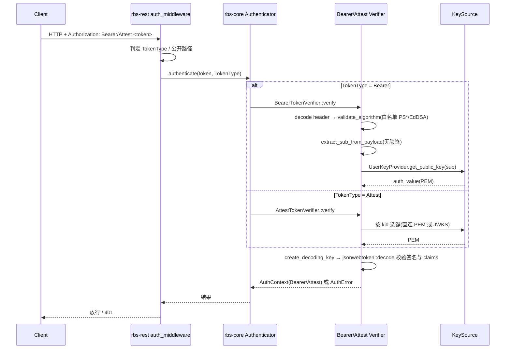

# rbs-core 模块详细设计上下文（ASIS）

> 本文件为 ASIS 阶段产物，记录现状事实、证据索引、调用链、工程约束、规格漂移与待确认/阻塞项，供 `$module-tobe-design` 与门禁引用。
> ASIS 阶段不得创建/编辑同目录下正式《模块详细设计说明书.md》。

## C1. ASIS 状态与阅读说明

| 项目 | 内容 |
|---|---|
| 本次需求/AR/变更点 | SR-1（SM2 国密算法认证与令牌支持）/ AR-1（SM2 用户认证）：用户认证支持 SM2、验证 GTA 签发的 SM2 attestation token、rbs-cli 生成 SM2 token。本次分析切片=rbs-core 内 SM2 用户认证与公钥登记相关部分 |
| 变更类型 | 混合变更（既有认证/登记链路扩展 SM2 + 新增 SM2 验签实现模块） |
| 目标模块 | `rbs-core`（`rbs/core/`） |
| 仓库范围 | 当前工作区（Rust workspace，`globaltrustauthority-rbs`） |
| 模块边界来源 | `.sdd/software_architecture.md` |
| 边界来源类型 | declared（由 `.sdd/software_architecture.md` 直接声明） |
| 本次 ASIS 分析范围 | 需求相关切片（rbs-core 认证与公钥登记子域：`src/auth/authn/*`、`src/admin/*`），并向相邻入口/配置/测试扩展 |
| 是否发生范围扩展 | 是，原因：验签入口位于 rbs-rest 中间件、配置类型位于 rbs-api-types、装配位于 rbs 壳、CLI 生成位于 tools（rbs-cli）；为解释 rbs-core 行为边界与隐藏约束，向这些相邻入口/配置/测试做了只读查证，但结论归属仍以 rbs-core 为分析主体 |
| ASIS 状态 | 完成 |
| 分析置信度 | 高（rbs-core 现状事实均有代码行号证据）；GTA SM2 表示法为外部事实，无法从代码确认（见 C6.1） |
| 执行方式说明 | 未使用 SubAgent，原因：环境不支持（本次由 aaw-workflow 工作单无头调用，运行环境不提供 SubAgent）。主 Agent 自行查证并在本文件留痕 |
| 后续 TOBE 可引用结论 | A1–A24 |
| 不得定稿的结论 | A19（GTA SM2 attestation token 表示法为外部约定，缺代码证据）；A17（auth_alg 与验签白名单的耦合关系需 TOBE 决策） |
| 阻塞或待确认项 | 详见 C6.1（1 项需前置确认：GTA SM2 表示法；另有若干 TOBE 决策输入）；无 ASIS 阻塞（C6.2） |

## C2. 模块边界确认

| 来源 | 发现 | 边界来源类型 | 影响 |
|---|---|---|---|
| `.sdd/software_architecture.md` | `rbs-core` 路径 `rbs/core/`；职责含认证与验签（`src/auth/`，含 `authn/` 各算法 Verifier、`authz/` 鉴权）、用户公钥登记（`src/admin/key.rs`）、attestation 验证（`src/attestation/`）、策略与资源域；不直接暴露 HTTP；不读写终端用户私钥 | declared | 本次 ASIS 以该路径与职责为准界定 rbs-core 边界 |

### C2.1 模块边界

| 分类 | 路径或组件 | 判断依据 | 证据编号 |
|---|---|---|---|
| 确定属于模块 | `rbs/core/src/auth/authn/{mod,common,authenticator,bearer_token,token,jwks}.rs` | architecture 声明 rbs-core 含认证与验签 `src/auth/`（含 `authn/` 各算法 Verifier） | E1,E2 |
| 确定属于模块 | `rbs/core/src/auth/{context,error,authz_checker}.rs`、`src/auth/authz/*` | architecture 声明 rbs-core 含 `authz/` 鉴权 | E1 |
| 确定属于模块 | `rbs/core/src/admin/{mod,key,manager,entity}.rs` | architecture 声明用户公钥登记归 `src/admin/key.rs` | E1,E8,E9 |
| 确定属于模块 | `rbs/core/src/lib.rs`（`RbsCore`/`RbsCoreBuilder`） | architecture 声明 rbs-core 为 `rbs/core/` | E1,E17 |
| 确定属于模块 | `rbs/core/src/attestation/*`（GTA provider 等） | architecture 声明 rbs-core 含 `src/attestation/` | E1 |
| 外部依赖 | `rbs/rest/src/middleware/auth.rs`、`rbs/rest/src/server/http.rs` | architecture 声明 rbs-rest 只编排 rbs-core 能力、不实现密码学；认证中间件属 rbs-rest | E1,E18,E19 |
| 外部依赖 | `rbs/api-types/src/config/*`、`rbs/api-types/src/user.rs` | architecture 声明 rbs-api-types 为纯类型；认证/登记配置与 DTO 类型在此 crate | E1,E12,E14 |
| 外部依赖 | `rbs/src/{lib.rs,bin/main.rs}` | architecture 声明 rbs 壳负责服务装配、配置加载、启动入口 | E1,E16 |
| 外部依赖 | `tools/`（rbs-cli，`tools/src/token/*`） | architecture 声明 rbs-cli 为用户侧工具、私钥只在本模块出现；SM2 生成归属此侧 | E1,E20 |
| 外部依赖 | `openssl`、`jsonwebtoken`、`josekit`（三方件） | 密码学/编解码库，非本仓模块 | E21,E22 |
| 本次不分析（rbs-core 内） | `rbs/core/src/policy/*`、`policy_engine/*`、`resource/*`、`infra/*`、`system/*` | 与 SR-1 认证/公钥登记切片无关 | E1 |

### C2.2 本次需求相关分析范围

| 分类 | 路径、组件或行为 | 纳入/排除原因 | 证据编号 |
|---|---|---|---|
| 需求相关 | `authn/authenticator.rs`（`Authenticator::authenticate` 分派、`new` 装配） | SR-1「用户认证」与「验证 attestation token」的模块内验签总入口 | E3 |
| 需求相关 | `authn/common.rs`（算法白名单、`decode_token_header`、`create_decoding_key`、错误映射） | SM2 需在此扩展识别与密钥构造分支 | E4 |
| 需求相关 | `authn/bearer_token.rs`（`BearerTokenVerifier`） | 「用户认证支持 SM2」的核心验签路径 | E5 |
| 需求相关 | `authn/token.rs`（`AttestTokenVerifier`） | 「验证 GTA 签发的 SM2 attestation token」的核心验签路径 | E6 |
| 需求相关 | `authn/jwks.rs`（JWK 解析/选键/转 PEM） | GTA SM2 公钥若以 JWKS 下发需扩展 `kty=EC,crv=SM2` | E7 |
| 需求相关 | `admin/key.rs`（`validate_and_derive_alg`、`jwk_to_pem`） | 「用户公钥登记支持 SM2」的校验/推导/转 PEM | E8 |
| 需求相关 | `admin/manager.rs`（`extract_*_key_material`、`get_public_key`、`read_admin_key`） | 用户/管理员公钥登记链路与 `UserKeyProvider` 实现 | E9 |
| 需求相关 | `admin/entity.rs` + `rdb_sql/sqlite_rbs.sql`（`t_user_info`） | 承载 SM2 公钥/算法取值的数据结构 | E10,E11 |
| 疑似相关 | `auth/context.rs`（`BearerContext`/`AttestContext`） | 验签成功后的上下文结构；SM2 不改其字段则无需变更 | E2 |
| 本次不分析 | `authz/*`、`policy/*`、`resource/*`、`attestation/gta/rest.rs`、`infra/*` | 授权、策略、资源、GTA 交互、基础设施与本次算法接入无关 | E1 |
| 本次不分析（跨模块，仅作为外部依赖/约束） | `tools/src/token/*`（rbs-cli 生成）、`rbs/rest/*`、`rbs/api-types/*`、`openssl/jsonwebtoken/josekit` | 归属其它模块；仅作为 rbs-core 的边界约束与交互对象被引用 | E18,E19,E20,E21,E22 |

## C3. 关键 ASIS 事实

**ASIS 探索任务（内部维护，编号回填“来源探索”列）**：Q1 验签入口与算法分派；Q2 用户公钥登记链路与 `auth_alg` 使用；Q3 AttestToken JWKS 解析与选键；Q4 认证/登记配置形态与启动校验；Q5 测试覆盖；Q6 依赖与 OpenSSL SM2/SM3 能力；Q7 仓库既有 SM2/SM3 实现检索。查证方式：本 skill 由工作单无头调用，环境不支持 SubAgent（见 C1），由主 Agent 直接阅读源码/配置/测试/DDL 查证并留痕。

### C3 事实表

| 编号 | 关键现状结论 | 类型 | 对 TOBE/AICoding 的影响 | 来源探索 | 证据编号 |
|---|---|---|---|---|---|
| A1 | rbs-core 的验签总入口是 `Authenticator::authenticate(token, TokenType)`（`authn/authenticator.rs:75-86`），按 `TokenType::Bearer/Attest` 分派到 `BearerTokenVerifier`/`AttestTokenVerifier`；`Authenticator::new(config, key_provider)` 在构造期建两个 Verifier（`:62-70`），Attest 构造失败即 Err。入口本身**不做算法分派**，算法判断在各 Verifier 内部。 | 事实 | SM2 作为“算法分支”应挂在各 Verifier 内，而非新增入口 | Q1 | E3 |
| A2 | 算法白名单硬编码：`SUPPORTED_ALGORITHMS = [PS256, PS384, PS512, EdDSA]`（`authn/common.rs:20-21`），`SUPPORTED_ALGORITHMS_STR = "PS256, PS384, PS512, EdDSA"`（`:24`）；`validate_algorithm`（`:34-42`）对白名单外算法返回 `AuthError::TokenInvalid{reason:"unsupported algorithm: ..."}`。WHITELIST 为 `jsonwebtoken::Algorithm` 类型。 | 事实 | SM2 不在 `jsonwebtoken::Algorithm` 枚举内，必须绕开/扩展该白名单 | Q1 | E4 |
| A3 | `decode_token_header`（`authn/common.rs:52-56`）调用 `jsonwebtoken::decode_header`，失败即 `TokenInvalid`。`jsonwebtoken 10.3.0` 的 `Algorithm` 无 SM2 变体，header 中 `alg:"SM2"` 属未知算法（**推断**：解码/反序列化阶段报错）。 | 修正后事实（含一处推断） | 需在进入 `jsonwebtoken` 解码前做“原始 alg 预解析”，命中 SM2 即切换分支 | Q1 | E4,E21 |
| A4 | `create_decoding_key(alg, pem)`（`authn/common.rs:69-79`）仅区分 `EdDSA → DecodingKey::from_ed_pem`，其余一律 `from_rsa_pem`；无 EC/SM2 分支。Bearer token 与 Attest 均经此构造 `jsonwebtoken::DecodingKey`。 | 事实 | SM2 公钥无法经 `DecodingKey` 承载，需独立 SM2 验签路径 | Q1 | E4,E5,E6 |
| A5 | `BearerTokenVerifier::verify`（`authn/bearer_token.rs:81-158`）流程：`decode_token_header` → `validate_algorithm` → 无验签解 payload 取 `sub`（`extract_sub_from_payload`，`:168-194`，按 `'.'` 分 3 段、base64url(no-pad) 解 payload）→ `UserKeyProvider.get_public_key(sub)` → `create_decoding_key` → `jsonwebtoken::decode` 校验（`Validation::new(alg)`，required claims `["exp","iss","sub"]`，校验 issuer/audience）。key lookup 与 decoding key 失败统一 `TokenInvalid{reason:"invalid token"}`；过期/未生效单独映射 `TokenExpired`/`TokenNotYetValid`。 | 事实 | 「用户认证支持 SM2」需在此新增 SM2 分支（取用户公钥→SM2 验签→校验 claims），并沿用错误掩蔽语义 | Q1,Q2 | E5 |
| A6 | `AttestTokenVerifier::new`（`authn/token.rs:58-86`）构造期二选一加载：`config.public_key_path`（读 PEM 文件）或 `config.jwks_file`（读文件并 `jwks::parse_jwks_file`）；二者都为空即 `Err`。`verify`（`:93-125`）用 header 的 `alg`/`kid` 取 key（`get_decoding_key`，`:129-157`：直连 key 优先，否则 JWKS 按 `kid` 或取首个键），`jwk_to_pem` → `create_decoding_key`，校验 required claims `["exp","iss"]` 与 issuer(/audience)。PEM 路径经 `create_decoding_key_for_pem`（`:160-177`）以 OpenSSL 识别 Ed25519，否则按 RSA。 | 事实 | 「验证 GTA SM2 attestation token」需新增 SM2 分支（选键→SM2 验签→校验 claims）；公钥文件在构造期一次性加载 | Q3 | E6 |
| A7 | `authn/jwks.rs`：`Jwk` 结构含 `kty/kid/alg/n/e/crv/x`（**无 `y` 字段**，`:24-46`）；`jwk_to_pem`（`:66-74`）仅支持 `kty=RSA`、`kty=OKP`，其它（含 `EC`）→ `unsupported key type`；`jwk_okp_to_pem`（`:105-125`）仅接受 `crv="Ed25519"`，其余→`unsupported curve`。既有单测 `test_unsupported_key_type_ec`（`:219-237`）固定断言 `kty=EC` 被拒。 | 事实 | GTA SM2 JWKS（`kty=EC,crv=SM2`）需扩展 `Jwk` 结构（补 `y`）与 `jwk_to_pem`；既有“EC 一律拒绝”的测试需相应调整 | Q3 | E7 |
| A8 | 用户公钥登记校验/推导 `admin/key.rs::validate_and_derive_alg`（`:26-53`）：先做 `MAX_KEY_SIZE=10240` 上限与 PEM 合法性检查，再按 `pkey.id()` 分派——`RSA → "RS256"`、`EC → 按曲线 P-256/384/521 → "ES256"/"ES384"/"ES512"`，其余曲线 → `Unsupported EC curve`，非 RSA/EC（含 Ed25519）→ `Unsupported key type`。**SM2 曲线会命中 `Unsupported EC curve`**。 | 事实 | 「用户公钥登记支持 SM2」需在 EC 分支识别 SM2 曲线并返回 `SM2` 算法串 | Q2 | E8 |
| A9 | 用户 JWK 登记 `admin/key.rs::jwk_to_pem`（`:56-76`）支持 `kty=RSA`、`kty=EC`；`jwk_ec_to_pem`（`:100-133`）曲线仅 `P-256/P-384/P-521`，`crv=SM2` → `Unsupported JWK EC curve`；无 `kty=OKP` 分支。 | 事实 | JWK 方式登记 SM2 公钥需扩展 `crv=SM2` 映射（用 OpenSSL SM2 曲线构造 EC 公钥） | Q2 | E8 |
| A10 | 登记链路：`AdminManager::extract_auth_material`（`manager.rs:294-306`）对 `public_key` 先 `validate_and_derive_alg` 校验、对 `jwk` 先 `jwk_to_pem`，再对产物二次 `validate_and_derive_alg` 得 `auth_alg`；`extract_update_key_material`（`:308-320`）同理（可选）。写入走 `insert_user_in_txn`/`apply_user_update` 事务（`:323-376`、`:394-437`）。 | 事实 | SM2 公钥登记路径复用既有 extract→validate/derive→事务写入链路 | Q2 | E9 |
| A11 | **`UserKeyProvider` 实现只返回 `auth_value`（PEM），不读取 `auth_alg`**：`impl UserKeyProvider for AdminManager::get_public_key`（`manager.rs:596-620`）按 `sub`=username 查 `t_user_info`，返回 `model.auth_value`；`auth_alg` 在验签期不被使用（全仓 `auth_alg` 仅出现在写入侧与测试断言，检索证据见 E25）。 | 事实 | 「登记算法」与「令牌算法」当前无强耦合；SM2 验签的算法来源须由令牌 header 决定，`auth_alg` 仅为登记元数据 | Q2 | E9,E25 |
| A12 | 用户表 `t_user_info` 结构（`admin/entity.rs:79-101` + `rdb_sql/sqlite_rbs.sql`）：`user_id`、`username`(PK)、`role`、`auth_type`(默认 `jwt`)、`auth_value`(NOT NULL，PEM)、`auth_alg`(NOT NULL，算法串)、`status`、`created_at`、`updated_at`。无 SM2 专列。 | 事实 | SM2 公钥以 PEM 存 `auth_value`、`SM2` 存 `auth_alg` 即可，**无 DDL 变更** | Q2 | E10,E11 |
| A13 | 配置类型（`api-types/src/config/mod.rs`）：`AuthConfig{attest_token:AttestTokenVerificationConfig, bearer_token:BearerTokenVerificationConfig}`（`:500-510`）；`AttestTokenVerificationConfig{jwks_file:Option, public_key_path:Option, issuer, audience:Option}`（`:484-498`）；`BearerTokenVerificationConfig{issuer, audience}`（`:474-481`）；`AdminConfig{max_users, admin_key:AdminKeyConfig{public_key_path,jwks_file}}`（`:512-542`）。 | 事实 | 无新增配置项需求可复用既有 `auth.attest_token.*` 与用户登记 API | Q4 | E12 |
| A14 | 启动期配置校验 `RbsConfig::validate`（`api-types/src/config/validation.rs:581-595`）失败即 **panic**（fail-fast）；`AttestTokenVerificationConfig::validate`（`:530-547`）要求 `jwks_file`/`public_key_path` 恰一且 `issuer` 非空；`AdminConfig::validate`（`:569-579`）要求 `max_users∈[1,100]` 且 admin_key 恰一；**`AuthConfig::validate` 仅校验 `attest_token`，不校验 `bearer_token`**（`:549-553`）。 | 事实 | SM2 公钥文件缺失/非法会在启动期（Attest 构造或配置校验）失败 | Q4 | E13 |
| A15 | 配置样例 `rbs/conf/rbs.yaml`：`auth.attest_token`（`jwks_file` + `issuer`）、`auth.bearer_token`（`issuer` + `audience`）、`admin.admin_key.public_key_path`、`admin.max_users`（`:28-48`）。`rbs/src/bin/main.rs` 加载流程：`load_config` → `config.validate()`（panic）→ `init_database` → `RbsCoreBuilder::build()` → `bootstrap_admin()` → 起 REST（`:49-97`）。 | 事实 | 运维侧通过既有配置项下发 SM2 公钥，无需改装配流程 | Q4 | E15,E16 |
| A16 | 认证中间件在 rbs-rest（`:24-177`）：按 `Authorization` 前缀判 `Bearer `/`Attest ` 类型，公开路径为 `/rbs/v0/challenge`、`/rbs/v0/attest`、`/rbs/v0/{uri}/retrieve`，`Attest` 仅资源 GET 允许；失败统一 401。rbs-core 的 `Authenticator` 在 rbs-rest `BoundServer::run` 的 app_factory 内**每 worker 构造一次**（`http.rs:173-185`），`key_provider` 由 rbs 壳的 `CoreKeyProvider` 包装 `AdminManager`（`main.rs:33-47`）。 | 事实 | 中间件链路对 SM2 透明（令牌仍是不透明串）；SM2 只需在 rbs-core 内生效 | Q1,Q4 | E18,E19,E16 |
| A17 | **隐藏约束/一致性缺口**：`validate_and_derive_alg` 推导的算法串（`RS256`/`ES256`/`ES384`/`ES512`）与验签白名单（`PS256`/`PS384`/`PS512`/`EdDSA`）**取值不一致**，且 `auth_alg` 在验签期不被读取（见 A11）；即“登记算法串”与“令牌 header alg”当前无强校验耦合，`auth_alg` 为无枚举约束的自由字符串。 | 决策输入 | SM2 接入需决定 `auth_alg="SM2"` 的表示与是否在校验期使用它（防 alg 混淆）；属 TOBE 决策，非 ASIS 事实缺口 | Q2 | E8,E9,E23 |
| A18 | **隐藏约束**：`BearerTokenVerifier` 对 key lookup 失败、decoding key 失败、签名/claims 失败统一返回 `AuthError::TokenInvalid{reason:"invalid token"}`（仅过期/未生效单独映射）；`AttestTokenVerifier` 用 `map_jwt_error` 映射。用户不存在时报 `user '' not found` 但被上游掩蔽。 | 事实 | SM2 接入须沿用既有错误掩蔽语义（SR 4.1.4/3.2.4 亦要求“invalid token”），不得泄漏用户枚举信息 | Q1 | E5,E6,E9 |
| A19 | **外部事实/无代码证据**：GTA 以 SM2 签发 attestation token 的 JWS 表示法（header `alg` 取值、JWK `kty=EC/crv=SM2`、签名 r 与 s 拼接共 64 字节的编码、SM2 用户标识 Z 值默认 `1234567812345678`）来自 SR-design 第 3 章约定，**仓库代码中无任何 SM2/SM3 痕迹**（检索证据 E23），无法从代码确认。 | 待确认 | SM2 验签的互操作参数需与 GTA 对齐；属外部事实缺口，建议前置确认（C6.1） | Q3,Q7 | E23,E24 |
| A20 | **依赖现状**：workspace `Cargo.toml` 声明 `openssl = { version="0.10.45", features=["vendored"] }`、`jsonwebtoken = { version="10.3.0" }`、`josekit = "0.10.3"`；rbs-core `Cargo.toml` 依赖 `openssl`、`jsonwebtoken`、`josekit`。OpenSSL 已 vendored（3.x）。 | 事实 | SM2/SM3 能力可复用既有 OpenSSL 取件，无需新密码库（与 SR 强约束一致） | Q6 | E21,E22 |
| A21 | **跨模块事实（rbs-cli，非本模块）**：`tools/src/token/cmd.rs` 的 `TokenAlg` 仅含 `PS256/PS384/PS512/ES256/ES384/ES512/EdDSA`（`:49-81`），`SUPPORTED_PRIVATE_KEYS` 文案同（`:46-47`），`get_alg` 按私钥类型/曲线推断（`:300+`）。**无 SM2**。 | 事实 | 「rbs-cli 生成 SM2 token」归 `tools`（rbs-cli），与 rbs-core 通过“令牌 alg 契约”耦合；rbs-core 不承担生成 | Q7 | E20 |
| A22 | **规格漂移**：SR-design 第 1.2/8/10 章称“仓库无 `.sdd/software_architecture.md`”“以代码现状为架构基线（情况B）”，但当前工作区**存在** `.sdd/software_architecture.md`（v1.0，随 SR-1 测评夹具建立）。 | 规格漂移 | 模块边界与分层约束应以 `.sdd/software_architecture.md` 为准；SR-design 第 10 章“情况B”结论与现状不符，TOBE 不应再据此推断边界 | Q4 | E1,E24 |
| A23 | 变更类型判定证据：全仓检索 `SM2|SM3|sm2|sm3|国密|gmssl`（`.rs/.toml/.yaml/.sql/.md`）**无任何匹配**，即仓库当前无 SM2/SM3 验签/签名实现。 | 事实（检索证据） | rbs-core 侧 SM2/SM3 验签为**纯新增实现**（非改造既有密码学代码），需 TOBE 新建 `authn/sm2` 之类实现边界 | Q7 | E23 |
| A24 | 测试覆盖现状（rbs-core 认证/登记）：全部为 `#[cfg(test)]` 内联单测（`common`/`bearer_token`/`token`/`authenticator`/`jwks`/`key`/`manager`/`context`，见 E26）；`rbs/core/tests/` 集成测试目录**不含认证、attestation 验签或用户公钥登记**用例（E27）。既有单测以**错误路径与 RSA 为主**：如 `test_validate_algorithm_unsupported`、`test_unsupported_key_type_ec`、`jwk_to_pem_rejects_*`、`test_bearer_token_malformed_format`、`test_attest_token_missing_config`；**无 EC(P-256) 正向验签用例、无 SM2/SM3 用例、无签发→验签端到端正向用例**。 | 事实 | SM2 需新增测试；既有“EC 一律拒绝”断言（`jwks.rs:219-237`）会被 SM2 支持改动直接影响 | Q5 | E5,E6,E7,E8,E9,E26,E27 |

## C4. 调用链与数据流

本章记录 C3 事实未覆盖的流程视角。rbs-core 认证涉及 rbs-rest 中间件、rbs-core `Authenticator`/各 Verifier、密钥源（`UserKeyProvider`/JWKS）多组件协作与异常路径，故提供现状调用链与时序图。

| 链路/数据对象 | 当前行为 | 与本次需求/变更的关系 | 对 TOBE 的约束 | 证据编号 |
|---|---|---|---|---|
| 令牌认证验签链路 | 中间件按 `Authorization` 前缀判定 `TokenType` → rbs-core `Auth::authenticate` 分派 → Bearer/Attest Verifier → 取公钥 → `jsonwebtoken::decode` 校验签名/claims | SM2 用户认证与 SM2 attestation 验证均落在此链路 | SM2 需在 Verifier 边界内新增分支，不改中间件/端点契约 | E3,E5,E6,E18,E19 |
| 用户公钥登记链路 | REST → `AdminManager::extract_*_key_material` → `validate_and_derive_alg`/`jwk_to_pem` → 事务写 `t_user_info` | SM2 用户公钥登记落在此链路 | 需在 key 校验/推导/转 PEM 处扩展 SM2，写入路径与表结构不变 | E8,E9,E10 |

### C4.1 验签调用步骤明细

| 步骤 | 调用点（文件:行） | 输入 | 输出/行为 | 证据 |
|---|---|---|---|---|
| 1 | `rbs/rest/src/middleware/auth.rs:102-177`（`auth_middleware`） | HTTP `Authorization` 头 | 按前缀（`Bearer `/`Attest `）判定 `TokenType`；公开路径直接放行；失败统一 401 | E18 |
| 2 | `rbs/rest/src/server/http.rs:175`（`BoundServer::run` 的 app_factory）→ `Authenticator::new(config, key_provider)` | `AuthConfig`、`CoreKeyProvider`（包装 `AdminManager`） | 每 worker 构造 1 个 `Authenticator`，内含 `BearerTokenVerifier` + `AttestTokenVerifier` | E19,E16 |
| 3 | `rbs/core/src/auth/authn/authenticator.rs:75-86`（`Auth::authenticate`） | `token`、`TokenType` | 分派到对应 Verifier；**不做算法分派** | E3 |
| 4a | `authn/bearer_token.rs:81-158`（`BearerTokenVerifier::verify`） | Bearer token | header 解码 → 白名单校验 → 无验签解 `sub` → 取用户公钥 → 构造 `DecodingKey` → `jsonwebtoken::decode` 校验签名与 claims | E5 |
| 4b | `authn/token.rs:93-125`（`AttestTokenVerifier::verify`） | Attest token | header 解码 → 按 `kid` 选键（直连 PEM 或 JWKS）→ `jwk_to_pem` → `DecodingKey` → `jsonwebtoken::decode` 校验签名与 claims | E6 |
| 5（Bearer 密钥源） | `admin/manager.rs:596-620`（`impl UserKeyProvider::get_public_key`） | `sub`（=username） | 查 `t_user_info`，返回 `auth_value`（PEM）；**不读 `auth_alg`** | E9 |
| 6（Attest 密钥源） | `authn/token.rs:58-86`（构造期加载）+ `authn/jwks.rs:55-74` | `public_key_path`（PEM）或 `jwks_file`（JWKS） | 构造期一次性加载；JWKS 仅支持 `kty=RSA/OKP` | E6,E7 |
| 7（claims 校验） | `authn/bearer_token.rs`/`authn/token.rs` 内 `Validation` | `Validation::new(alg)` | required claims `["exp","iss","sub"]`（Bearer）/`["exp","iss"]`（Attest），校验 issuer（/audience） | E5,E6 |

### C4.2 用户公钥登记步骤明细

| 步骤 | 调用点（文件:行） | 输入 | 输出/行为 | 证据 |
|---|---|---|---|---|
| 1 | REST 层 `create_user`/`update_user`（rbs-rest，属外部模块） | 请求体含 `public_key` 或 `jwk` | 进入 rbs-core `AdminManager` | E18（边界） |
| 2 | `admin/manager.rs:294-306`（`extract_auth_material`）/`:308-320`（`extract_update_key_material`） | `public_key` / `jwk` | 对 PEM 先 `validate_and_derive_alg`、对 JWK 先 `jwk_to_pem`，再二次 `validate_and_derive_alg` 得 `auth_alg` | E9 |
| 3 | `admin/key.rs:26-53`（`validate_and_derive_alg`） | PEM | 校验大小≤`MAX_KEY_SIZE` 与 PEM 合法性，按密钥类型/曲线推导算法串（RSA→RS256；EC→ES256/384/512；其它报错） | E8 |
| 4 | `admin/key.rs:56-76`（`jwk_to_pem`）/`:100-133`（`jwk_ec_to_pem`） | JWK | RSA/EC(仅 P-256/384/521) 转 PEM；其它报错 | E8 |
| 5 | `admin/manager.rs:323-376`（`insert_user_in_txn`）/`:394-437`（`apply_user_update`） | 校验后材料 | 事务写入 `t_user_info`（`auth_value`=PEM，`auth_alg`=算法串） | E9,E10 |

### C4.3 认证时序（现状）

> 关键约束：验签入口不感知算法；密钥源仅提供 PEM；算法判定发生在 Verifier 内（白名单硬编码，见 A2）；SM2 不在任一分支中（见 A3–A8）。SM2 接入应在此链路的 Verifier 边界内新增分支，不改变 rbs-rest 中间件契约。

## C5. 配置、数据、测试与依赖现状

| 主题 | 现状 | 风险或限制 | 与本次需求/变更的关系 | 证据编号 |
|---|---|---|---|---|
| 配置 `auth.attest_token` | `AttestTokenVerificationConfig{jwks_file:Option, public_key_path:Option, issuer, audience:Option}`（`api-types/src/config/mod.rs:484-498`）；启动校验要求密钥源恰一且 `issuer` 非空（`validation.rs:530-547`） | 构造期一次性加载，运行期不可热更新 | SM2 attestation 公钥经此下发（JWKS 或 PEM） | E12,E13,E15 |
| 配置 `auth.bearer_token` | `BearerTokenVerificationConfig{issuer, audience}`（`:474-481`） | **`AuthConfig::validate` 仅校验 `attest_token`，不校验 `bearer_token`**（`validation.rs:549-553`） | SM2 用户认证沿用该 issuer/audience 校验 | E12,E13 |
| 配置 `admin` | `AdminConfig{max_users, admin_key:AdminKeyConfig{public_key_path,jwks_file}}`（`:512-542`）；`max_users∈[1,100]`、admin_key 恰一（`validation.rs:555-579`） | 约束固定 | SM2 公钥登记复用既有管理配置 | E12,E13 |
| 配置加载/启动校验 | `rbs/conf/rbs.yaml:28-48` 提供样例；`main.rs:49-97`：`load_config`→`validate()`（失败 **panic**）→`init_database`→`RbsCoreBuilder::build`→`bootstrap_admin` | fail-fast，配置错误直接终止启动 | SM2 公钥文件缺失/非法会在启动期暴露 | E13,E15,E16 |
| 数据 `t_user_info` | `username`(PK)、`auth_type`(默认 `jwt`)、`auth_value`(PEM, NOT NULL)、`auth_alg`(NOT NULL)、`status`、时间戳（`admin/entity.rs:79-101` + `sqlite_rbs.sql`） | 无 SM2 专列；`auth_alg` 无枚举约束 | SM2 以 `auth_value`=PEM、`auth_alg`=算法串承载，**无 DDL 变更** | E10,E11 |
| 数据 `Jwk` | `kty/kid/alg/n/e/crv/x`，**无 `y`**；仅 `kty=RSA/OKP`（`authn/jwks.rs:24-74`） | 结构无法表达 EC 点坐标 | GTA SM2 JWKS 需扩展（补 `y`、增 `kty=EC` 分支） | E7 |
| 异常语义 | Bearer 对 key lookup/解码/签名失败统一 `TokenInvalid{"invalid token"}`；Attest 经 `map_jwt_error`；用户不存在报 `user '' not found` 但被上游掩蔽 | 不得泄漏用户枚举信息 | SM2 接入须沿用既有错误掩蔽语义 | E5,E6,E9 |
| 外部依赖 | `openssl`(0.10.45, vendored)、`jsonwebtoken`(10.3.0)、`josekit`(0.10.3)（`Cargo.toml`、`rbs/core/Cargo.toml`） | `jsonwebtoken::Algorithm` 无 SM2 | SM2/SM3 复用 OpenSSL vendored 能力 | E21,E22 |

> 编译证据缺口：本环境无 `target/` 且离线，未能执行 `cargo test`/`cargo build`，以上配置/数据/依赖事实均以静态源码、配置样例与行号为准（检索/验证方式说明见 C7 末尾）。

### C5.1 测试覆盖现状

| 测试文件或套件 | 覆盖行为 | 与本次需求的关系 | 未覆盖风险 | 证据编号 |
|---|---|---|---|---|
| `authn/common.rs:119-158` | 算法白名单校验（含 `test_validate_algorithm_unsupported`） | SM2 需加入白名单判定 | 无 SM2 识别/拒绝用例 | E4,E26 |
| `authn/bearer_token.rs:196-273` | Bearer 验签错误路径（如 malformed format） | 「用户认证支持 SM2」核心路径 | **无 EC(P-256) 正向、无 SM2、无签发→验签端到端** | E5,E26 |
| `authn/token.rs:179-263` | Attest 验签（如 missing_config） | 「验证 GTA SM2 attestation token」核心路径 | 无 EC/SM2 JWKS 正向验签 | E6,E26 |
| `authn/jwks.rs:181-238` | `test_unsupported_key_type_ec` 断言 `kty=EC` 被拒 | SM2 走 `kty=EC,crv=SM2` | **既有 EC 拒绝断言与 SM2 支持直接冲突，需调整** | E7,E26 |
| `admin/key.rs:135-222`、`admin/manager.rs:677-825` | 公钥登记校验/推导（`jwk_to_pem_rejects_*`、`auth_alg` 断言） | 「用户公钥登记支持 SM2」 | 无 SM2 曲线/JWK 登记用例 | E8,E9,E26 |
| `rbs/core/tests/*` | policy/resource/logging/version 等 | 认证/登记集成验证 | **无认证/attestation/公钥登记集成测试** | E27 |

## C6. 规格漂移、待确认与阻塞

| 编号 | 类型 | 现状/漂移/风险 | 影响 | 后续关注点 | 证据编号 |
|---|---|---|---|---|---|
| S1 | 规格漂移 | SR-design 第 1.2/8/10 章称“仓库无 `.sdd/software_architecture.md`、以代码现状为基线（情况B）”，但工作区**存在** `.sdd/software_architecture.md`（v1.0） | 模块边界与分层约束应以该文件为准；SR-design“情况B”结论与现状不符 | TOBE 不应再按“情况B”推断模块边界，以 `software_architecture.md` 为唯一边界依据 | E1,E24 |
| S2 | 隐藏约束 | 登记推导算法串（`RS256/ES256/ES384/ES512`）与验签白名单（`PS256/PS384/PS512/EdDSA`）取值不一致，且 `auth_alg` 在验签期不读取 | “登记算法串”与“令牌 header alg”无强校验耦合，存在 alg 混淆面 | SM2 接入须明确 `auth_alg="SM2"` 表示及是否验签期强校验 | E8,E9,E25 |
| S3 | 兼容 | `authn/jwks.rs:219-237` `test_unsupported_key_type_ec` 固定断言 `kty=EC` 被拒 | SM2（`kty=EC,crv=SM2`）支持将与该断言直接冲突 | 需调整该既有测试，不得残留“EC 一律拒绝”约束 | E7 |
| S4 | 安全 | Bearer 对 key lookup/解码/签名失败统一 `TokenInvalid`，用户不存在信息被上游掩蔽（A18） | 错误掩蔽是既有安全不变量 | SM2 分支须沿用，不得泄漏用户枚举信息 | E5,E6,E9 |
| S5 | 测试 | 无 SM2/SM3 用例、无 EC 正向验签、无签发→验签端到端（A24） | 无法回归验证 SM2 互操作与既有算法兼容 | SM2 需新增正向与端到端测试 | E26,E27 |

### C6.1 待确认问题

| 问题 | 类型 | 为什么影响 TOBE/AICoding | 当前线索 | 建议确认对象 |
|---|---|---|---|---|
| GTA 以 SM2 签发 attestation token 的 JWS 表示法：header `alg` 取值、JWK 形态（`kty=EC,crv=SM2`）、签名 r 与 s 拼接（各 32 字节）的编码、SM2 用户标识 Z 值是否默认 `1234567812345678`（A19） | 需前置确认 | 决定 rbs-core SM2 验签的解析与验签参数，缺代码佐证 ASIS 无法自行确定 | 仓库无任何 SM2/SM3 痕迹（E23）；SR-design 第 3 章给出约定但无代码佐证 | 上游设计 / GTA 提供方 |
| `auth_alg="SM2"` 的表示与验签期是否强制校验“令牌 alg 与登记算法一致”（A17） | TOBE 决策输入 | 影响登记写入与验签结合的 alg 混淆防护策略 | 见 C6 表 S2；A11/A17 | TOBE 设计 |
| SM2 公钥登记：`validate_and_derive_alg`/`jwk_ec_to_pem` 需新增 SM2 曲线识别与算法串；`auth_value` 存储形态是否维持 PEM（A8,A9,A12） | TOBE 决策输入 | 决定登记校验/转 PEM 的改造范围 | 见 C4.2、A8/A9 | TOBE 设计 |
| Attest 密钥源：是否需扩展 `Jwk`（补 `y`）与 JWKS `kty=EC` 分支以承载 GTA SM2 公钥（A7） | TOBE 决策输入 | 决定 JWKS 解析的改造范围 | 见 A7、C4.1 步骤 4b/6 | TOBE 设计 |

> 处理说明：本 skill 由 aaw-workflow 工作单无头调用，无人类在旁；A19 依赖外部（GTA）约定，无法从代码确认，按 skill 规定记录为“需前置确认”并以建议确认对象留痕，不阻塞本次 ASIS。

### C6.2 ASIS 阻塞项

不适用，原因：ASIS 状态为 `完成`，未判定阻塞；A19 为外部事实缺口，已在 C6.1 以“需前置确认”登记，不影响本次 ASIS 结论成立。

## C7. 证据索引

| 编号 | 证据类型 | 位置 | 检索方式 | 支撑结论 |
|---|---|---|---|---|
| E1 | 文档（模块边界声明） | `.sdd/software_architecture.md:7-28`（仓库形态、模块清单、关键边界规则） | 直接阅读 | A22, C2 |
| E2 | 文件/行号（trait） | `rbs/core/src/auth/authn/mod.rs:28-53`（`UserKeyProvider`、`TokenVerifier` trait）；`rbs/core/src/auth/context.rs:26-53`（`BearerContext`/`AttestContext`/`AuthContext`） | 直接阅读 | A1, A5, A6 |
| E3 | 文件/行号（函数） | `rbs/core/src/auth/authn/authenticator.rs:28-87`（`Auth::authenticate` 分派 `:75-86`；`Authenticator::new` `:62-70`） | 直接阅读 | A1, A16 |
| E4 | 文件/行号（常量/函数） | `rbs/core/src/auth/authn/common.rs:20-21`（`SUPPORTED_ALGORITHMS`）、`:24`（`SUPPORTED_ALGORITHMS_STR`）、`:34-42`（`validate_algorithm`）、`:52-56`（`decode_token_header`）、`:69-79`（`create_decoding_key`）、`:91-117`（`map_jwt_error`） | 直接阅读 | A2, A3, A4, A18 |
| E5 | 文件/行号（函数/测试） | `rbs/core/src/auth/authn/bearer_token.rs:81-158`（`BearerTokenVerifier::verify`）、`:168-194`（`extract_sub_from_payload`）；测试 `:196-273` | 直接阅读 | A5, A18, A24 |
| E6 | 文件/行号（函数/测试） | `rbs/core/src/auth/authn/token.rs:58-86`（`AttestTokenVerifier::new`）、`:93-125`（`verify`）、`:129-157`（`get_decoding_key`）、`:160-177`（`create_decoding_key_for_pem`）；测试 `:179-263` | 直接阅读 | A6, A18, A24 |
| E7 | 文件/行号（函数/测试） | `rbs/core/src/auth/authn/jwks.rs:24-46`（`Jwk`）、`:55-58`（`parse_jwks_file`）、`:61-63`（`find_key_by_kid`）、`:66-74`（`jwk_to_pem`）、`:105-125`（`jwk_okp_to_pem`）；测试 `:219-237`（`test_unsupported_key_type_ec`） | 直接阅读 | A7, A24 |
| E8 | 文件/行号（函数/测试） | `rbs/core/src/admin/key.rs:21-23`（`MAX_KEY_SIZE`）、`:26-53`（`validate_and_derive_alg`）、`:56-76`（`jwk_to_pem`）、`:100-133`（`jwk_ec_to_pem`）；测试 `:135-222` | 直接阅读 | A8, A9, A17, A24 |
| E9 | 文件/行号（函数/测试） | `rbs/core/src/admin/manager.rs:294-320`（`extract_auth_material`/`extract_update_key_material`）、`:323-376`（`insert_user_in_txn`）、`:394-437`（`apply_user_update`）、`:529-593`（`read_admin_key`）、`:596-620`（`impl UserKeyProvider`）；测试 `:677-825` | 直接阅读 | A10, A11, A18, A24 |
| E10 | 文件/行号（实体） | `rbs/core/src/admin/entity.rs:19-101`（`t_user_info` sea-orm `Model`、`DbRole`/`UserStatus`/`DbAuthType`） | 直接阅读 | A12 |
| E11 | 迁移/DLL | `rbs/rdb_sql/sqlite_rbs.sql`（`CREATE TABLE t_user_info`）；`rbs/rdb_sql/mysql_rbs.sql`（占位，仅 `SELECT * FROM tables;`） | 直接阅读 | A12 |
| E12 | 文件/行号（配置类型） | `rbs/api-types/src/config/mod.rs:474-481`（`BearerTokenVerificationConfig`）、`:484-498`（`AttestTokenVerificationConfig`）、`:500-510`（`AuthConfig`）、`:512-542`（`AdminConfig`/`AdminKeyConfig`） | 直接阅读 | A13 |
| E13 | 文件/行号（配置校验） | `rbs/api-types/src/config/validation.rs:530-547`（`AttestTokenVerificationConfig::validate`）、`:549-553`（`AuthConfig::validate`）、`:555-579`（`AdminKeyConfig`/`AdminConfig::validate`）、`:581-595`（`RbsConfig::validate`） | 直接阅读 | A14 |
| E14 | 文件/行号（DTO 校验） | `rbs/api-types/src/user.rs:41-142`（`UserCreateRequest::validate_key_pair`、`UserUpdateRequest::validate_cross_fields`） | 直接阅读 | A8, A10（登记入参约束） |
| E15 | 配置文件 | `rbs/conf/rbs.yaml:28-48`（`auth`/`admin` 配置样例） | 直接阅读 | A15 |
| E16 | 文件/行号（装配） | `rbs/src/bin/main.rs:33-97`（`CoreKeyProvider`、`load_config`/`validate`/`bootstrap_admin`/`Server::new`）；`rbs/src/lib.rs:25-33`（`load_config`）；`rbs/core/src/lib.rs:98-168`（`RbsCoreBuilder::build`，`AdminManager::new` `:164`） | 直接阅读 | A15, A16 |
| E17 | 文件/行号（crate 导出） | `rbs/core/src/lib.rs:27-52`（`pub use auth::{... UserKeyProvider}` 等） | 直接阅读 | 边界确认 |
| E18 | 文件/行号（中间件） | `rbs/rest/src/middleware/auth.rs:24-47`（`PUBLIC_PATHS`/`is_public_path`）、`:58-95`（`is_resource_get_path`）、`:102-177`（`auth_middleware`） | 直接阅读 | A16 |
| E19 | 文件/行号（服务装配） | `rbs/rest/src/server/http.rs:59-76`（`Server::new`）、`:124-185`（`BoundServer::run`，`Authenticator::new` `:175`，`auth_middleware` `:185`） | 直接阅读 | A16 |
| E20 | 文件/行号（rbs-cli 枚举） | `tools/src/token/cmd.rs:46-47`（`SUPPORTED_PRIVATE_KEYS`）、`:49-81`（`TokenAlg` 枚举与 `Display`）、`:300+`（`get_alg`） | 直接阅读 | A21 |
| E21 | 配置/依赖清单 | `Cargo.toml:19-53`（workspace 依赖：`openssl = 0.10.45 (vendored)`、`jsonwebtoken = 10.3.0`、`josekit = 0.10.3`） | 直接阅读 | A3, A20 |
| E22 | 依赖清单 | `rbs/core/Cargo.toml`（rbs-core 依赖含 `openssl`、`jsonwebtoken`、`josekit`、`sea-orm`、`base64`、`zeroize`） | 直接阅读 | A20 |
| E23 | 命令输出摘要（检索证据） | 检索命令：`Get-ChildItem -Recurse -Include *.rs,*.toml,*.yaml,*.sql,*.md -Path rbs,tools,rbc,tests,service,docs | Select-String -Pattern 'SM2|SM3|sm2|sm3|国密|gmssl'` → **无匹配（exit 0，无输出）** | PowerShell Select-String（rg 不可用） | A19, A23 |
| E24 | 上游文档 | `.sdd/SR-1/original-requirement.md`（原始需求）；`.sdd/SR-1/SR-design.md`（SR 总体设计，第 1.2/3/4/7/8/10 章） | 直接阅读 | A19, A21, A22 |
| E25 | 命令输出摘要（检索证据） | 检索命令：`Get-ChildItem -Recurse -Include *.rs -Path rbs,tools | Select-String -Pattern 'auth_alg'` → 命中仅 `admin/entity.rs:94`（定义）与 `admin/manager.rs`（写入 `:80,90,155,162,304-305,327,336,341,365,418,420`、测试断言 `:719,721,751,753`），**验签读取路径无 `auth_alg`** | PowerShell Select-String | A11, A17 |
| E26 | 测试（内联单测汇总） | `authn/common.rs:119-158`、`authn/bearer_token.rs:196-273`、`authn/token.rs:179-263`、`authn/authenticator.rs:89-194`、`authn/jwks.rs:181-238`、`admin/key.rs:135-222`、`admin/manager.rs:677-825`、`auth/context.rs:66-181` | 直接阅读 | A24 |
| E27 | 测试（集成测试清单） | `rbs/core/tests/`：`db_policy_client_tests.rs`、`logging_tests.rs`、`policy_*`、`resource_*`、`version_test.rs`（**无认证/attestation/公钥登记集成测试**） | 文件列表 | A24 |

> 检索工具说明：本环境未安装 ripgrep（`rg` 不可用），`grep`/`glob` 工具不可用；文件定位用 `Get-ChildItem`，内容检索用 `Select-String`，故 E23/E25 记录的是等价检索方式。

## C8. 需求/AR 追溯矩阵

> 需求来源：`.sdd/SR-1/original-requirement.md`（SR-1：*“目前 SM2 算法没有应用在此代码仓。需要用户认证支持 SM2 算法、验证 GTA 签发的 SM2 attestation token、rbs-cli 生成 SM2 token”*）；上下文：`.sdd/SR-1/SR-design.md`。AR-1=SM2 用户认证；模块组=rbs-core。**覆盖状态**表示现状对需求的支撑程度。

| 编号 | 需求/AR/功能点/影响点 | 本模块相关性 | ASIS 结论编号 | 证据编号 | 覆盖状态 |
|---|---|---|---|---|---|
| R1 | 用户认证支持 SM2（Bearer 用户令牌验签路径） | 需求相关 | A1,A2,A3,A4,A5,A11,A17,A18 | E3,E4,E5,E9,E23,E25 | 部分覆盖（现状不支持，需新增 SM2 分支；A17 待 TOBE 决策） |
| R2 | 验证 GTA 签发的 SM2 attestation token | 需求相关 | A1,A2,A3,A4,A6,A7,A13,A19 | E3,E4,E6,E7,E12,E23,E24 | 部分覆盖（现状不支持；互操作参数依赖 A19 前置确认） |
| R3 | rbs-cli 生成 SM2 token | 不涉及本模块 | A21 | E20,E24 | 不涉及本模块（归 tools/rbs-cli，与 rbs-core 经令牌 alg 契约耦合） |
| R4 | 用户公钥（SM2）登记链路 | 需求相关 | A8,A9,A10,A11,A12,A14 | E8,E9,E10,E11,E12,E13,E14 | 部分覆盖（现状不支持，SM2 曲线命中 `Unsupported EC curve`；复用既有链路，无 DDL 变更） |
| R5 | 既有算法/端点兼容（SM2 与 PS*/EdDSA 并存、不改 HTTP 契约） | 需求相关（约束） | A2,A5,A6,A16 | E4,E5,E6,E18,E19 | 已覆盖（现状为硬编码白名单；SM2 须以新增分支并存，中间件/端点契约不变） |
| R6 | 配置加载与启动期失败语义复用 | 疑似相关（约束） | A13,A14,A15,A20 | E12,E13,E15,E16,E21,E22 | 已覆盖（可复用既有 `auth.attest_token.*`/`admin.*` 配置与 fail-fast，SM2 公钥下发不需改装配流程） |

### C8.1 AR-1（SM2 用户认证）覆盖小结

| 维度 | 现状 | 缺口 | 关联结论 |
|---|---|---|---|
| 验签入口/分派 | `Authenticator` 按 `TokenType` 分派，入口不感知算法 | SM2 分支需落在各 Verifier 内 | A1 |
| 算法识别 | 白名单硬编码 `PS*/EdDSA`；`jsonwebtoken::Algorithm` 无 SM2 | 需在 `jsonwebtoken` 解码前预解析 alg 并切换 SM2 路径 | A2,A3 |
| 密钥构造 | `DecodingKey` 仅 RSA/EdDSA | 需独立 SM2 验签（公钥 → SM2/SM3） | A4 |
| 用户密钥源 | `UserKeyProvider.get_public_key` 返回 PEM，不读 `auth_alg` | 派生算法一致性策略待定 | A11,A17 |
| 登记 | 仅 RSA/EC(P-256/384/521) | 需新增 SM2 曲线/JWK | A8,A9 |
| Attest 密钥源 | JWKS 仅 RSA/OKP；`Jwk` 无 `y` | 需扩展承载 `kty=EC,crv=SM2` | A7,A19 |
| 测试 | 无 SM2/SM3、无 EC 正向、无端到端 | 需新增；并调整既有 EC 拒绝断言 | A24 |
