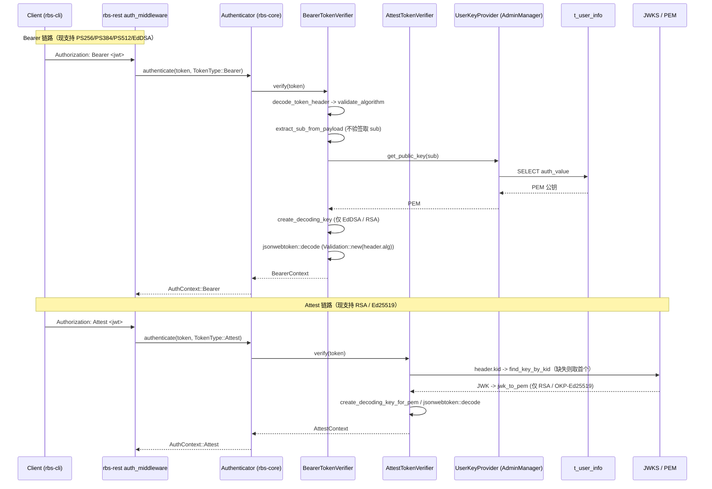

# 模块详细设计上下文（ASIS）

> 本文件是 ASIS 阶段成果物，记录 SR-1 / AR-1 在 `rbs-core` 模块的现状事实、证据索引、调用链与待确认项。
> 正式《模块详细设计说明书.md》不得在 ASIS 阶段创建或编辑，只能由 TOBE 阶段基于本文件生成。
> 本文件只描述"现状是什么"，不描述"应该怎么做"；方案类内容一律标注为 TOBE 决策输入。

## C1. ASIS 状态与阅读说明

- 需求编号：SR-1（SM2 国密算法认证与令牌支持）。
- AR 编号：AR-1（SM2 用户认证）。
- 目标模块：`rbs-core`，路径 `rbs/core/`。
- 本次分析切片：SR-1 中"SM2 用户认证与公钥登记"相关部分——现有验签入口、算法分派、用户公钥登记链路、配置与测试现状。
- 变更类型：混合变更（既有认证/登记行为需改造 + 纯新增对象，如 SM2 验签与 SM2 曲线登记）。
- 仓库范围：当前工作目录（`globaltrustauthority-rbs`，Rust workspace）。
- 模块边界来源：`.sdd/software_architecture.md`（唯一合法边界来源）。
- 边界来源类型：`declared by software_architecture.md`。
- 分析范围：仅需求相关切片，不做全模块扫描；`rbs-core` 中与令牌认证、公钥登记无关的部分（policy、resource、infra、storage 等）不在本次范围。
- 是否扩展：未扩展（严格限定在 SR-1 需求上下文内）。
- ASIS 状态：完成（切片内现状已查证到类/函数/字段/配置/测试粒度）。
- 置信度：高（结论均有文件与行级证据，见 C7；个别外部约定无法在代码中证实的记为"待确认"，见 C6）。
- 子代理使用：未使用 SubAgent，原因：环境不支持。本次由主 Agent 直接执行阶段 1–7 的探索与查证，证据均来自主 Agent 对仓库文件的直接读取。
- 可引用结论：A1–A14（见 C3）。
- 阻塞/待确认项摘要：ASIS 本身无阻塞项（工作区含 `.sdd/software_architecture.md`，边界可确认）。存在需前置确认项（SM2 的外部表示法与曲线标识约定，属上游/GTA 侧事实）与 1 项规格漂移（SR-design 与工作区实际状态冲突），详见 C6。

## C2. 模块边界确认

| 来源 | 发现 | 边界来源类型 | 影响 |
| --- | --- | --- | --- |
| `.sdd/software_architecture.md` | 声明 `rbs-core` 路径为 `rbs/core/`；职责含认证与验签（`src/auth/`，authn/ 各算法 Verifier、authz/）与用户公钥登记（`src/admin/key.rs`） | declared by `software_architecture.md` | 本次分析切片与模块职责一致，边界可确认，非 blocked |
| `.sdd/software_architecture.md` | 关键边界规则：密码学运算只在 `rbs-core`（服务端验签）与 `rbs-cli`（客户端签名）内进行 | declared by `software_architecture.md` | SM2 验签归 `rbs-core`，SM2 签名归 `rbs-cli`（`tools/`），职责不跨模块 |
| `.sdd/software_architecture.md` | 用户认证公钥持久化归 `rbs-core`（表 `t_user_info`）；登记入口为 `rbs-core` 的 `admin/key`，由 `rbs-rest` 管理路由暴露 | declared by `software_architecture.md` | SM2 公钥登记链路落在 `rbs-core` 的 `admin/`，REST 仅做路由暴露 |
| `.sdd/software_architecture.md` | GTA 验签公钥归 `rbs-core` attestation/authn 链路，配置经 `rbs` 壳加载 | declared by `software_architecture.md` | SM2 attestation token 验签归 `rbs-core` `authn/token` 链路 |

### C2.1 模块归属判定

- 确定属于 `rbs-core` 模块的代码：
  - `rbs/core/src/auth/`：认证与验签（`authn/` 下 `common`、`bearer_token`、`token`、`jwks`、`authenticator`；`context.rs`；`error.rs`；`mod.rs`）。
  - `rbs/core/src/admin/`：用户公钥登记（`key.rs`、`manager.rs`、`entity.rs`、`mod.rs`）。
  - `rbs/core/src/lib.rs`：`RbsCore` 装配入口。
  - `rbs/core/src/attestation/`：attestation 相关（本次仅作为 GTA 验签公钥归属方，未深入）。
- 外部依赖（跨模块，仅作为接口使用方/提供方）：
  - `rbs/rest/`：`auth_middleware` 调用 `rbs-core` 的 `Auth::authenticate`；`http.rs` 构造 `Authenticator`。
  - `rbs/api-types/`：`RbsConfig`/`AuthConfig`/`AdminConfig` 等配置 DTO 与 `UserCreateRequest`/`UserUpdateRequest`/`UserResponse`。
  - `tools/`（`rbs-cli`）：SM2 令牌的客户端签名侧（本次仅作参考切片，确认其算法枚举现状）。
  - 第三方：`openssl`、`jsonwebtoken`、`josekit`、`sea-orm`、`base64`。

### C2.2 需求相关性分层

- 需求相关（本次分析）：`rbs/core/src/auth/authn/common.rs`、`bearer_token.rs`、`token.rs`、`jwks.rs`、`authenticator.rs`、`mod.rs`；`rbs/core/src/auth/context.rs`、`error.rs`；`rbs/core/src/admin/key.rs`、`manager.rs`、`entity.rs`；`rbs/api-types/src/config/mod.rs`；`rbs/conf/rbs.yaml`；`rbs/core/Cargo.toml`。
- 本次不分析：policy、resource、infra、storage 等与 SM2 认证/登记无直接关系的模块。

## C3. 关键 ASIS 事实

| 编号 | 关键现状结论 | 类型 | 对 TOBE/AICoding 的影响 | 来源探索 | 证据编号 |
| --- | --- | --- | --- | --- | --- |
| A1 | 验签算法白名单硬编码为 4 种：`SUPPORTED_ALGORITHMS = &[PS256, PS384, PS512, EdDSA]`，字符串常量 `SUPPORTED_ALGORITHMS_STR = "PS256, PS384, PS512, EdDSA"`；`validate_algorithm` 对白名单外算法返回 `unsupported algorithm: {:?}. Supported algorithms: {}`。 | 事实 | 白名单是 SM2 进入 Bearer 验签链路的第一个卡点，TOBE 决策输入 | Q1 | E1 |
| A2 | `decode_token_header` 直接调用 `jsonwebtoken::decode_header`；对未知 `alg`，`jsonwebtoken` 在解析 header 阶段即返回错误，早于 `validate_algorithm`。故 `alg=SM2` 在 header 解码阶段就失败。 | 事实 | SM2 的 `alg` 取值需在 header 解码层被接受，TOBE 决策输入 | Q1 | E1 |
| A3 | `create_decoding_key` 仅支持两类密钥：EdDSA 走 `DecodingKey::from_ed_pem`，其余走 `DecodingKey::from_rsa_pem`；无 EC/SM2 分支。 | 事实 | SM2 公钥（EC 类）无对应解码密钥构造路径，TOBE 决策输入 | Q1 | E1 |
| A4 | `jwks.rs` 的 `Jwk` 结构无 `y` 字段；`jwk_to_pem` 仅识别 `kty="RSA"`（→`jwk_rsa_to_pem`）与 `kty="OKP"`（且仅 `crv=="Ed25519"`），其余一律返回 `unsupported key type: {}. Only RSA and OKP (Ed25519) are supported`；内含测试 `test_unsupported_key_type_ec` 断言 EC 被拒。 | 事实 | JWKS 输入源当前无法承载 EC/SM2 公钥（缺 `y`），TOBE 决策输入 | Q2 | E4 |
| A5 | `rbs/core/src/admin/key.rs` 的 `validate_and_derive_alg` 对 PEM 公钥按类型推导算法：RSA→`RS256`，EC 按曲线 `X9_62_PRIME256V1`→`ES256`、`SECP384R1`→`ES384`、`SECP521R1`→`ES512`，其他曲线返回 `RbsError::InvalidParameter("Unsupported EC curve")`。 | 事实 | SM2 曲线（如 `SM2`/`sm2p256v1`）当前被归入"其他曲线"而拒绝，登记链路存在卡点，TOBE 决策输入 | Q3 | E5 |
| A6 | 同文件的 `jwk_to_pem` 对 JWK 输入仅支持 `kty="RSA"` 与 `kty="EC"`（`jwk_ec_to_pem` 仅识别 `P-256/P-384/P-521`，其他曲线返回 `Unsupported JWK EC curve`），其他 `kty` 返回 `Unsupported JWK key type`。 | 事实 | 通过 JWK 登记 SM2 公钥时 `crv=SM2` 会被拒，TOBE 决策输入 | Q3 | E5 |
| A7 | 用户表 `t_user_info`（sea-orm entity `Model`）字段为 `user_id, username(PK), role, auth_type, auth_value(PEM 字符串), auth_alg(字符串), status, created_at, updated_at`；`auth_alg` 仅在写入与测试断言中被使用。 | 事实 | SM2 登记无需 DDL 结构性变更即可承载新算法取值，TOBE 决策输入 | Q4 | E6 |
| A8 | `auth_alg` 列在验签链路中只写不读：`AdminManager` 作为 `UserKeyProvider` 的 `get_public_key(sub)` 只返回 `model.auth_value`（PEM），不返回 `auth_alg`；`BearerTokenVerifier` 使用 JWT header 的 `alg` 而非该列。 | 事实 | 已登记算法与实际验签算法之间无一致性校验；SM2 若仅依赖该列驱动验签，现有实现不读取，TOBE 决策输入 | Q4 | E6 |
| A9 | `BearerTokenVerifier::verify` 流程为：`decode_token_header` → `validate_algorithm` → `extract_sub_from_payload`（不验签解析 payload 取 `sub`）→ `key_provider.get_public_key(&sub)`（失败统一返回 `AuthError::TokenInvalid{reason:"invalid token"}` 以防用户枚举）→ `create_decoding_key` → `jsonwebtoken::decode`，`Validation::new(header.alg)`，required claims `["exp","iss","sub"]`，`set_issuer`/`set_audience`，返回 `BearerContext{iss,sub,role,claims,TokenType::Bearer}`。 | 事实 | SM2 用户认证的验签入口与校验顺序已固定，TOBE 决策输入 | Q1 | E2 |
| A10 | `AttestTokenVerifier` 由 `config.public_key_path`（PEM）或 `config.jwks_file` 构造，二者都无则报错；`create_decoding_key_for_pem` 用 OpenSSL `PKey::public_key_from_pem` 判断 `Id::ED25519`，否则按 RSA 处理；`verify` 用 header 的 `alg`/`kid` 选密钥（direct key 优先，否则 `jwks::find_key_by_kid`，`kid` 缺失时取 `jwks.keys.first()`）。 | 事实 | GTA SM2 attestation token 验签所走的现有链路，TOBE 决策输入 | Q1 | E3 |
| A11 | `Authenticator::authenticate` 仅按 `TokenType::Bearer` / `TokenType::Attest` 分派到两个 verifier，不涉及算法分派；`rbs-rest` 的 `auth_middleware` 按 `Bearer ` / `Attest ` 前缀确定 token 类型，且 Attest 仅允许资源 GET 端点（否则 401 `AttestToken not allowed for this endpoint`）。 | 事实 | SM2 沿用现有 token 类型分派即可，无需新增 TokenType，TOBE 决策输入 | Q1、Q5 | E7 |
| A12 | 全仓检索 `SM2|sm2|SM3|sm3|国密|sm2p256v1`，仅命中 `.sdd/SR-1/original-requirement.md` 与 `.sdd/SR-1/SR-design.md` 两份文档；代码、配置、测试零命中。即：SM2 验签、SM2 公钥登记、SM2 令牌等新增对象当前不存在。 | 事实 | 属于纯新增对象，需从零建立实现与测试，TOBE 决策输入 | Q6 | E8 |
| A13 | 配置侧无任何 SM2 相关项：`BearerTokenVerificationConfig{issuer,audience}`、`AttestTokenVerificationConfig{jwks_file,public_key_path,issuer,audience}`、`AdminKeyConfig{public_key_path,jwks_file}`（互斥）、`AdminConfig{max_users(默认 10), admin_key}` 均无算法开关；`rbs/conf/rbs.yaml` 亦无 SM2 项。 | 事实 | 现状无需 SM2 配置即可接入（算法由密钥/JWT 决定），TOBE 决策输入 | Q5 | E9、E10 |
| A14 | `.sdd/software_architecture.md` 在工作区中实际存在且声明了 `rbs-core` 边界；而 `.sdd/SR-1/SR-design.md` 的现状约束与章节中称"仓库无 software_architecture.md"（情况 B）。 | 规格漂移 | 上游 SR 设计的边界前提与工作区实际不一致，TOBE 阶段与门禁需知悉该漂移 | Q7 | E11 |

## C4. 调用链与数据流

现状存在两条令牌验签链路，均落在 `rbs-core`；SM2 在两条链路中都没有对应分支。

- 装配点：`rbs/core/src/lib.rs` 构造 `AdminManager::new(self.config.admin)`；`rbs/rest/src/server/http.rs` 每个 worker 构造 `Authenticator::new(auth_config.clone(), key_provider.clone())`。
- 登记链路（写入侧）：`rbs-rest` 管理路由 → `AdminManager::create_user` / `update_user` → `extract_auth_material`（`public_key` 走 `validate_and_derive_alg`，`jwk` 走 `jwk_to_pem`）/ `extract_update_key_material` → 事务内写入 `t_user_info`（`insert_user_in_txn` / `apply_user_update`，含 max_users 与重复校验）。`bootstrap_admin` 通过 `read_admin_key()` 读取 PEM 或 JWKS 并推导 `alg`。
- SM2 缺口：Bearer 链路的算法白名单、header 解码、解码密钥构造（A1–A3）与 Attest 链路的 JWKS 解析（A4）均无 SM2 分支；登记链路的曲线识别（A5、A6）无 SM2 曲线。

## C5. 配置、数据、测试与依赖现状

### C5.1 配置现状

- `rbs/api-types/src/config/mod.rs`：`RbsConfig{rest,logging,storage,attestation,auth,admin,resource}`，枚举 `deny_unknown_fields`。认证相关结构：
  - `BearerTokenVerificationConfig{issuer, audience}`。
  - `AttestTokenVerificationConfig{jwks_file, public_key_path, issuer, audience}`。
  - `AuthConfig{attest_token, bearer_token}`。
  - `AdminConfig{max_users(默认 10), admin_key}`；`AdminKeyConfig{public_key_path, jwks_file}` 二者互斥。
- `rbs/conf/rbs.yaml`：`auth.attest_token.jwks_file: /etc/rbs/attest.jwk`、`issuer: "Global Trust Authority"`；`auth.bearer_token.issuer: "rbs-cli"`、`audience: "globaltrustauthority-rbs"`；`admin.admin_key.public_key_path: /etc/rbs/admin_pub.pem`；`admin.max_users: 10`。
- 结论：现状无任何 SM2/算法开关型配置项（A13）。

### C5.2 数据现状

- 表 `t_user_info`（`rbs/core/src/admin/entity.rs`，sea-orm）：`user_id, username(主键), role(枚举 admin|user), auth_type(枚举 jwt), auth_value(PEM 字符串), auth_alg(字符串), status(0|1), created_at, updated_at`。
- `auth_alg` 只写不读（A8）；API 响应 DTO `UserResponse{id,username,role,enabled,created_at,updated_at}` 不回传 `auth_alg`。
- 登记入参 DTO：`UserCreateRequest{username,role,enabled,auth_type,public_key,jwk}`（含 `validate_key_pair`）、`UserUpdateRequest`（含 `validate_cross_fields`），`public_key` 与 `jwk` 为两种互斥输入形式。

### C5.3 测试覆盖现状

- `rbs/core` 内联测试（`authn/*.rs`、`admin/key.rs` 等）：覆盖畸形 token、unsupported algorithm、RSA→`RS256` 推导、JWKS `kty=EC` 拒绝等；断言 `SUPPORTED_ALGORITHMS.len() == 4`。
- `rbs/rest/tests/handler_tests.rs`：使用 `MockAuthAlwaysOk`/`MockAuthAlwaysFail`，未走真实 `Authenticator` 与真实 JWT 验签。
- `rbs/rest/tests/http_tests.rs`：仅 uri_length_guard 与 https bind 失败用例，使用 `stub_key_provider`。
- `rbs/api-types/tests/auth_test.rs`、`user_test.rs`：DTO 序列化/校验测试。
- `tools/tests/test_token.rs`：覆盖 PS256/384/512、ES256/384/512、EdDSA 令牌生成与 clap 边界；`TokenAlg` 枚举无 SM2；`SUPPORTED_PRIVATE_KEYS` 不含 SM2。
- 结论：认证链路的端到端（真实 JWT + 真实密钥 + 中间件）测试缺位；SM2 相关测试为零（A12）。

### C5.4 依赖现状

- 根 `Cargo.toml`：workspace members 含 `rbs/api-types`、`rbs/core`、`rbs/rest`、`rbs`、`rbc`、`tools`、`tools/rbs-admin-client`；依赖 `openssl = { version = "0.10.45", features = ["vendored"] }`、`jsonwebtoken = "10.3.0"`（features `rust_crypto`）、`josekit = "0.10.3"`、`base64 = "0.22.1"`。
- `rbs/core/Cargo.toml`：直接依赖 `openssl`、`josekit`、`jsonwebtoken`、`base64`、`sea-orm`、`zeroize` 等。
- 结论：OpenSSL 以 `vendored` 方式引入，具备 SM2 能力的底层库已在依赖树中，但现有代码未使用任何 SM2 接口（A12）。

## C6. 规格漂移、待确认与阻塞

### C6.1 待确认问题

| 编号 | 问题 | 类型 | 确认对象 | 说明 |
| --- | --- | --- | --- | --- |
| Q-1 | SM2 在 JWKS/JWK 中的表示法约定：`kty`（如 `EC`）、`crv`（如 `SM2`）、`x`/`y` 坐标长度与编码。 | 需前置确认 | 上游设计 / GTA 服务 | `.sdd/SR-1/SR-design.md` 已作假设，但属外部接口事实；现存 `Jwk` 结构无 `y` 字段（A4），无法在代码中证实该约定。 |
| Q-2 | SM2 签名的编码形式：`r||s` 固定长度拼接还是 DER。 | 需前置确认 | 上游设计 / GTA 服务 | 影响解码密钥与验签调用，属外部令牌格式事实，ASIS 代码无先例。 |
| Q-3 | SM2 用户标识 Z 值的默认取值（如 `1234567812345678`）与是否可配置。 | 需前置确认 | 上游设计 / GTA 服务 | 属 SM2 算法外部约定，代码中无任何 SM2 参数。 |
| Q-4 | Bearer JWT 中 SM2 的 `alg` 取值串（如 `SM2`）及其与 `t_user_info.auth_alg` 取值的一致性。 | 需前置确认 | 上游设计 | `auth_alg` 现有取值语义为 `RS256`/`ES256`/`ES384`/`ES512`（A5、A7），代码侧无 SM2 取值先例。 |

### C6.2 ASIS 阻塞项

无。`.sdd/software_architecture.md` 存在且可读，`rbs-core` 模块声明明确，边界来源类型为 `declared by software_architecture.md`，未命中 blocked 条件。

### C6.3 规格漂移

- 漂移项 D-1（对应 A14 / E11）：`.sdd/SR-1/SR-design.md` 的现状约束章节声称"仓库无 `.sdd/software_architecture.md`"（情况 B），而工作区实际存在该文件并声明了 `rbs-core` 边界。上游设计的边界前提与工作区实际状态不一致。

### C6.4 边界外的相关约束输入

- `rbs-rest` 的 token 类型分派规则（Attest 仅允许资源 GET 端点）属需求相关但模块边界外，作为约束输入记录在 C5/A11，不纳入 `rbs-core` 的 TOBE 改造范围判定。

## C7. 证据索引

| 编号 | 证据类型 | 位置 | 检索方式 | 支撑结论 |
| --- | --- | --- | --- | --- |
| E1 | 源码 | `rbs/core/src/auth/authn/common.rs` | 直接读取（`validate_algorithm`、`decode_token_header`、`create_decoding_key`、`SUPPORTED_ALGORITHMS`） | A1、A2、A3 |
| E2 | 源码 | `rbs/core/src/auth/authn/bearer_token.rs` | 直接读取（`BearerTokenVerifier::verify` 流程） | A9 |
| E3 | 源码 | `rbs/core/src/auth/authn/token.rs` | 直接读取（`AttestTokenVerifier::new`/`verify`、`create_decoding_key_for_pem`） | A10 |
| E4 | 源码 | `rbs/core/src/auth/authn/jwks.rs` | 直接读取（`Jwk` 结构、`jwk_to_pem`、`test_unsupported_key_type_ec`） | A4 |
| E5 | 源码 | `rbs/core/src/admin/key.rs` | 直接读取（`validate_and_derive_alg`、`jwk_to_pem`、`jwk_ec_to_pem`） | A5、A6 |
| E6 | 源码 | `rbs/core/src/admin/entity.rs`；`rbs/core/src/admin/manager.rs` | 直接读取（`Model` 字段；`UserKeyProvider::get_public_key`、`extract_auth_material`、`insert_user_in_txn`、`apply_user_update`、`bootstrap_admin`） | A7、A8 |
| E7 | 源码 | `rbs/core/src/auth/authn/authenticator.rs`；`rbs/rest/src/middleware/auth.rs` | 直接读取（token 类型分派；`auth_middleware` 前缀与端点规则） | A11 |
| E8 | 检索 | 全仓检索 `SM2|sm2|SM3|sm3|国密|sm2p256v1` | `Get-ChildItem -Recurse -File -Include *.rs,*.toml,*.yaml,*.md,*.sql` 后 `Select-String`；仅命中 `.sdd/SR-1` 两份文档 | A12、A13 |
| E9 | 配置 | `rbs/api-types/src/config/mod.rs` | 直接读取（`RbsConfig`、`AuthConfig`、`AdminConfig`、`AdminKeyConfig`） | A13 |
| E10 | 配置 | `rbs/conf/rbs.yaml` | 直接读取（`auth.*`、`admin.*` 各项） | A13 |
| E11 | 文档 | `.sdd/software_architecture.md`；`.sdd/SR-1/SR-design.md` | 直接读取（边界声明 vs. 现状约束章节） | A14 |
| E12 | 源码 | `rbs/rest/src/server/http.rs`；`rbs/core/src/lib.rs` | 直接读取（`Authenticator::new`、`AdminManager::new`） | C4 装配点 |
| E13 | 依赖 | `rbs/core/Cargo.toml`；`Cargo.toml` | 直接读取（workspace members、`openssl`/`jsonwebtoken`/`josekit` 版本与 features） | C5.4 |
| E14 | 测试 | `rbs/rest/tests/handler_tests.rs`；`rbs/rest/tests/http_tests.rs`；`rbs/api-types/tests/auth_test.rs`；`rbs/api-types/tests/user_test.rs`；`tools/tests/test_token.rs` | 直接读取并枚举测试函数 | C5.3 |
| E15 | 源码 | `tools/src/token/cmd.rs` | 直接读取（`TokenAlg` 枚举、`get_alg`、`generate_token`、`SUPPORTED_PRIVATE_KEYS`） | A12、C5.3 |
| E16 | 源码 | `rbs/core/src/auth/context.rs`；`rbs/core/src/auth/error.rs`；`rbs/api-types/src/user.rs` | 直接读取（`TokenType`/`BearerContext`/`AttestContext`；`AuthError`；用户 DTO） | C4、C5.2 |

## C8. 需求/AR 追溯矩阵

| 编号 | 需求/AR/功能点/影响点 | 本模块相关性 | ASIS 结论编号 | 证据编号 | 覆盖状态 |
| --- | --- | --- | --- | --- | --- |
| R1 | SR-1 需求 1：用户认证支持 SM2（Bearer 令牌验签） | 直接相关（`rbs-core` 认证链路） | A1、A2、A3、A7、A8、A9、A11、A12、A13 | E1、E2、E6、E7、E8、E9 | 已覆盖 |
| R2 | SR-1 需求 2：验证 GTA 签发的 SM2 attestation token | 直接相关（`rbs-core` attestation 验签链路） | A4、A10、A12、A13 | E3、E4、E8、E9 | 已覆盖 |
| R3 | SR-1 需求 3：rbs-cli 生成 SM2 令牌（客户端签名侧） | 间接相关（边界外参考切片，仅确认现状算法枚举） | A12 | E8、E15 | 部分覆盖（仅出于边界确认目的查证，`tools/` 非本模块） |
| R4 | SM2 公钥登记链路（`admin/key` 与 `t_user_info`） | 直接相关（`rbs-core` 登记链路） | A5、A6、A7、A8、A12 | E5、E6、E8 | 已覆盖 |
| R5 | 上游边界前提一致性（SR-design 与 `software_architecture.md`） | 相关（影响 TOBE 边界判定） | A14 | E11 | 已覆盖 |
