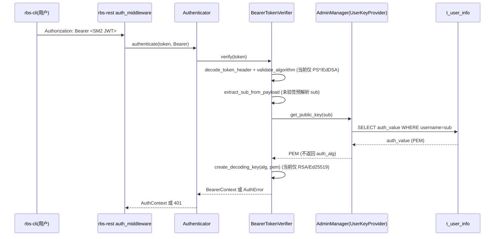
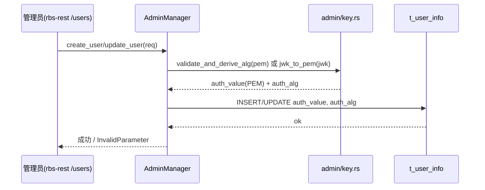

# 模块详细设计 ASIS context 模板

ASIS 阶段只更新模块目录下的 `.context/详细设计上下文.md`，不创建、不编辑、不覆盖同目录下的正式《模块详细设计说明书.md》。正式说明书只能由 TOBE 阶段基于本 context 中的证据和结论生成。

本模板记录 ASIS 查证的现状事实、证据索引、规格漂移和待确认项，供 TOBE 和 Gate 引用。所有会影响 TOBE、AICoding、验证或风险判断的 ASIS 结论，都必须在详细设计上下文中有稳定编号和证据编号。

## 设计原则：只保留下游需要的结论

本模板只输出 TOBE 和 Gate 真正消费的信息——**结论和证据**，不记录 ASIS 自身的工作过程（线索建立、任务分派、SubAgent 查证、复核动作等过程痕迹）。ASIS 的工作纪律（先线索→查证→复核→映射）由 SKILL.md 的工作流程步骤保障，过程痕迹留在主 Agent 内部会话中，不落盘到 context。

这样做的目的：最大化信息密度，避免同一个事实在线索、探索结果、复核记录、关键事实中重复四遍，降低下游阅读成本和上下文压缩风险。

## 固定目录规则

生成或更新 `.context/详细设计上下文.md` 时，必须保留本模板的固定目录 `C1` 至 `C8`。某章暂时没有内容时，不得删除标题，应写：

- `不适用，原因：...`
- `未完成，原因：...；影响：...；下一步需要：...`

## C1. ASIS 状态与阅读说明

本章给读者一个入口摘要：本次 ASIS 分析到了什么程度、能支撑什么、还有什么不能支撑。

| 项目 | 内容 |
|---|---|
| 本次需求/AR/变更点 | SR-1 / AR-1（SM2 用户认证）——SM2 用户认证与公钥登记相关现状 |
| 变更类型 | 混合变更（既有认证/登记链路改造 + 全仓缺失的 SM2 算法能力新增） |
| 目标模块 | rbs-core（`rbs/core/`） |
| 仓库范围 | 单仓 Rust workspace（globaltrustauthority-rbs） |
| 模块边界来源 | `.sdd/software_architecture.md` |
| 边界来源类型 | declared |
| 本次 ASIS 分析范围 | 需求相关切片（SM2 验签入口、算法分派、用户公钥登记链路、配置与测试现状） |
| 是否发生范围扩展 | 是，原因：为确认真实调用链与装配边界，向 rbs-rest（认证中间件/用户路由/server）、rbs（壳装配）、rbs-api-types（配置与 DTO 类型）、tools（rbs-cli 算法枚举）做只读核查；这些属外部依赖，不改变 rbs-core 边界 |
| ASIS 状态 | 完成 |
| 分析置信度 | 高（本模块代码事实）；A19 相关外部事实为 `待确认` |
| 后续 TOBE 可引用结论 | A1–A16（事实）；A17、A18（决策输入）；A19（待确认）；A20（规格漂移） |
| 不得定稿的结论 | A17、A18（验签期 SM2 键识别路径、SM2 签名表示/JWKS EC 解析路径——选择权属 TOBE）；A19（GTA 侧外部表示法——需前置确认） |
| 阻塞或待确认项 | C6.1 第 1 项：GTA 侧 SM2 公钥/JWS 表示法为上游外部事实，需前置确认（不阻断本模块代码事实结论） |
| SubAgent 使用情况 | 未使用 SubAgent，原因：环境不支持（当前执行环境无法启动 SubAgent），由主 Agent 按探索任务口径自行查证并复核 |

当分析置信度为 `低`，或关键结论依赖 `推断/待确认` 时，必须在 C6 中记录影响和所需输入，不能只在摘要区标记低置信度后继续流转。

## C2. 模块边界确认

本章只记录模块边界和本次分析切片。模块边界只能来自 `.sdd/software_architecture.md`；代码结构只能用于边界确认后的 ASIS 事实分析。

| 来源 | 发现 | 边界来源类型 | 影响 |
|---|---|---|---|
| `.sdd/software_architecture.md` | 声明 `rbs-core` 位于 `rbs/core/`，职责为核心域逻辑（认证与验签 `src/auth/`、用户公钥登记 `src/admin/key.rs`、attestation 验证、策略与资源域）；不直接暴露 HTTP，不读写终端用户私钥（第 15、24-27 行） | declared | 本次分析切片落在 `rbs/core/src/auth/authn/**`、`rbs/core/src/admin/**` |

### C2.1 模块边界

| 分类 | 路径或组件 | 判断依据 | 证据编号 |
|---|---|---|---|
| 确定属于模块 | `rbs/core/src/auth/**`（`authn/` 验签、`authz/` 鉴权、`context.rs`、`error.rs`） | 架构文档第 15 行声明 | E1 |
| 确定属于模块 | `rbs/core/src/admin/**`（`key.rs`/`manager.rs`/`entity.rs`/`mod.rs`） | 架构文档第 15、26-27 行声明 | E1 |
| 确定属于模块 | `rbs/core/src/lib.rs`（`RbsCore`/`RbsCoreBuilder` 装配） | 架构文档第 15 行声明 | E1 |
| 疑似属于模块 | `rbs/core/src/attestation/**`（attestation 验证；与 Attest 验签链路相邻） | 架构文档第 15 行声明，仅作调用链关联 | E1 |
| 外部依赖 | `rbs/rest/src/middleware/auth.rs`、`routes/admin.rs`、`server/http.rs` | 架构文档第 16 行：rbs-rest 只编排 rbs-core 能力、不实现密码学 | E1 |
| 外部依赖 | `rbs/src/**`（服务装配、配置加载，不含业务逻辑） | 架构文档第 17 行 | E1 |
| 外部依赖 | `rbs/api-types/**`（配置与 DTO 纯类型） | 架构文档第 18 行 | E1 |
| 外部依赖 | `tools/**`（rbs-cli，私钥只在本模块出现） | 架构文档第 19、24 行 | E1 |
| 外部依赖 | `rbc/**`（资源内容加密，与认证链路无交互） | 架构文档第 20 行 | E1 |

### C2.2 本次需求相关分析范围

| 分类 | 路径、组件或行为 | 纳入/排除原因 | 证据编号 |
|---|---|---|---|
| 需求相关 | `authn/common.rs` 算法白名单与 alg 校验/头解析 | SM2 需纳入算法分派 | E3 / E4 / E5 |
| 需求相关 | `authn/bearer_token.rs`（BearerVerifier） | 「用户认证支持 SM2」的核心验签入口 | E8 / E9 |
| 需求相关 | `authn/token.rs` + `authn/jwks.rs`（AttestVerifier/JWKS） | 「验证 GTA 签发的 SM2 attestation token」 | E11 / E12 / E13 / E15 / E16 |
| 需求相关 | `admin/key.rs`（`validate_and_derive_alg`、`jwk_to_pem`） | 「管理员登记 SM2 公钥」校验/推导/JWK→PEM | E22 / E24 / E25 |
| 需求相关 | `admin/manager.rs`（用户 CRUD、`UserKeyProvider` 实现） | 公钥登记链路与验签取键 | E26 / E27 / E28 |
| 需求相关 | `admin/entity.rs` + `rbs/rdb_sql/sqlite_rbs.sql`（`t_user_info`） | `auth_value`/`auth_alg` 承载 SM2 | E30 / E31 |
| 疑似相关 | `auth/authn/mod.rs` 的 `UserKeyProvider`/`TokenVerifier` trait 契约 | 影响 SM2 键类型如何在验签期被识别 | E18 |
| 疑似相关 | `auth/error.rs`（`UserDisabled` 未使用） | 错误语义完整性 | E21 |
| 外部依赖（只读核查） | `rbs-rest` 中间件/用户路由/server、`rbs` 壳装配、`rbs-api-types` 配置与 DTO | 建立入口与装配调用链，不修改 | E35 / E36 / E37 / E38 / E33 |
| 本次不分析 | `rbs/core/src/resource/**`、`policy/**`、`policy_engine/**`、`infra/**`、`system/**`、`authz/**` | 与本次认证切片无关 | E1 |
| 本次不分析 | `rbc/**`（JWE 加密）、TLS 国密套件 | 需求范围外 | E1 |
| 本次不分析 | `tools/**`（rbs-cli 生成 SM2 token 的实现） | 属 rbs-cli 模块，不在 rbs-core 边界内；仅记录接口约束 | E1 / E45 |

## C3. 关键 ASIS 事实

本章是下游（TOBE 和 Gate）唯一需要的事实来源。每条结论必须有稳定编号、类型、对 TOBE 的影响和证据编号。

- `事实`：已查证且复核通过。
- `修正后事实`：查证发现与初步线索不符，经复核修正。
- `推断`：基于间接证据推导，尚无直接代码证据。
- `待确认`：影响 TOBE 决策但当前无法确认，需前置确认。
- `阻塞相关`：无法确认且阻断后续设计。
- `规格漂移`：上游设计文档（AR/SR）与实际代码不一致。
- `决策输入`：事实已查明，但存在多个设计路径，选择权属于 TOBE。

| 编号 | 关键现状结论 | 类型 | 对 TOBE/AICoding 的影响 | 来源探索 | 证据编号 |
|---|---|---|---|---|---|
| A1 | 全仓（含 `*.rs/*.toml/*.yaml/*.md/*.json`）检索 `sm2`/`sm3`（不区分大小写）在代码与配置中零命中，仅出现在 `.sdd` 需求/设计文档中；rbs-cli（`tools/src/token/cmd.rs`）算法枚举亦无 SM2。SM2 算法能力属「当前不存在」。 | 事实 | 本次为混合变更：SM2 能力须从零新增；除既有认证/登记骨架外无既有 SM2 实现可复用；须为新增约定建立测试与配置组织。 | Q1 | E2 / E45 |
| A2 | 认证算法白名单硬编码为 `SUPPORTED_ALGORITHMS = [PS256, PS384, PS512, EdDSA]`（字符串常量同步）；`validate_algorithm()` 对其余 alg 返回 `AuthError::TokenInvalid{reason:"unsupported algorithm: ..."}`；`decode_token_header()` 走 `jsonwebtoken::decode_header`，未知 `alg` 在头解析阶段即失败。故任何 SM2 命名（如 `SM2`/`ES256-SM2` 等）当前均被拒。 | 事实 | 「用户认证支持 SM2」必须在白名单、头解析、错误映射三处一并评估；TOBE 需确定 SM2 在 JWS 中的 `alg` 表示串。 | Q2 | E3 / E4 / E5 |
| A3 | 验签期「算法→密钥类型」分派只区分 RSA 家族与 Ed25519：`create_decoding_key()` 对 `EdDSA` 走 `from_ed_pem`，其余一律 `from_rsa_pem`；`create_decoding_key_for_pem`（token.rs）仅探测 Ed25519，否则 RSA。初步线索曾假设验签侧也支持 EC（因 admin 侧支持 EC 推导），经复核修正：验签侧**无 EC/SM2 分支**。 | 修正后事实 | SM2（EC 类键）在验签侧无现成分派路径；TOBE 必须新增键类型识别逻辑（见 A17）。 | Q2 | E6 / E13 |
| A4 | Bearer 验签的取键入口 `UserKeyProvider::get_public_key(sub)` 仅返回 `t_user_info.auth_value`（公钥 PEM），**不返回** `auth_alg`；`auth_alg` 全仓只在用户写入链路被写，验签路径无任何读取点。 | 事实 | 若 SM2 键需在验签期依赖登记的算法标记，则当前接口不具备该信息，属 TOBE 决策点（A17）。 | Q3 | E26 / E27 / E46 |
| A5 | Bearer `verify` 在真正验签前，对**未经签名验证**的 payload 做手工解析取 `sub`（`extract_sub_from_payload`：按 `.` 分割要求 3 段、`URL_SAFE_NO_PAD` 解 base64、解析 JSON 取 `sub`），用于先查库取公钥、再验签。 | 事实 | SM2 验签需复用同一「先取 sub→查库→取键→验签」顺序；TOBE 须保证该预解析对 SM2 token 同样可解出 `sub`。 | Q3 | E8 / E9 |
| A6 | Attest（GTA token）验签键来源为 `public_key_path`（PEM）或 `jwks_file` 二选一，缺一即 `Err("AttestToken verification requires either public_key_path or jwks_file to be configured")`；PEM 路径 `create_decoding_key_for_pem` 仅区分 Ed25519 与 RSA。 | 事实 | 「验证 GTA 签发的 SM2 attestation token」需在 Attest 侧补齐 EC/SM2 键识别与 JWKS 分支。 | Q4 | E11 / E12 / E13 |
| A7 | JWKS 解析的 `Jwk` 结构字段为 `kty, kid?, alg?, n?, e?, crv?, x?`（**无 `y` 字段**）；`jwk_to_pem` 仅接受 `kty="RSA"`（`jwk_rsa_to_pem`）与 `kty="OKP"`（`jwk_okp_to_pem`，且 `crv` 仅 `Ed25519`），其余返回 `Err("unsupported key type: ... Only RSA and OKP (Ed25519) are supported")`；已有测试 `test_unsupported_key_type_ec` 断言 `kty=EC`（crv P-256）被拒。 | 事实 | SM2 若以 `kty=EC, crv=SM2` 表达，JWKS 侧需新增 `y` 字段与 EC/SM2 分支；当前既无字段也无分支。 | Q4 | E15 / E16 / E17 |
| A8 | 认证入口 `Authenticator::authenticate(token, TokenType)` 仅按 token **类型**（`Bearer`/`Attest`）分派到对应 verifier，不按算法分派；`Authenticator::new(config, key_provider)` 从 `AuthConfig` 构图两个 verifier。 | 事实 | 算法级分派发生在各 verifier 内部（A2/A3/A6）；TOBE 无需改认证器的类型分派，但需改 verifier 内部。 | Q2 | E18 / E19 |
| A9 | 用户公钥登记侧 `validate_and_derive_alg(pem)` 支持 RSA→`RS256` 与 EC 曲线 `P-256/384/521`→`ES256/384/512`，其它 EC 曲线返回 `InvalidParameter("Unsupported EC curve")`、其它键型返回 `InvalidParameter("Unsupported key type")`；`jwk_to_pem` 接受 `kty=RSA/EC`，`jwk_ec_to_pem` 仅接受 `crv=P-256/P-384/P-521`（其余 `Unsupported JWK EC curve`），并由 `x`/`y` 构造仿射坐标。 | 事实 | SM2 曲线与 `crv=SM2` 当前均落入「unsupported」分支；登记侧需扩展曲线/键型分支。 | Q5 | E22 / E24 / E25 |
| A10 | `MAX_KEY_SIZE = 10240`（10 KB）对 PEM 与 JWK 序列化串做长度上限校验。 | 事实 | SM2 公钥体量在限内，无需调整；作为回归约束保留。 | Q5 | E23 |
| A11 | 登记链路：`create_user`/`update_user` 经 `validate_cross_fields`、`enforce_whitelist`（非管理员不得改 role/enabled）、`extract_auth_material` 后，在事务中写入 `t_user_info.auth_value`（PEM）与 `auth_alg`；`auth_alg` **由存储的 PEM 推导**（`validate_and_derive_alg(&auth_value)`），**不采用 JWK 自己声明的 `alg`**；`create_user` 含 `max_users` 与重复用户校验。 | 事实 | SM2 登记需复用同一事务/校验骨架；`auth_alg` 的推导来源（PEM 反推）是 SM2 键识别的关键约束（见 A17）。 | Q5 | E26 / E28 / E29 |
| A12 | 用户表 `t_user_info`（sqlite）字段含 `auth_value TEXT NOT NULL`、`auth_alg TEXT NOT NULL`（自由文本，无枚举/长度/外键约束）；实体 Model 中 `auth_value`/`auth_alg` 均为 `String`。`mysql_rbs.sql` 为占位（`SELECT * FROM tables;`），非真实建表。 | 事实 | SM2 公钥/算法可直接落入既有列，**无需 DDL 破坏性变更**；mysql 建表脚本缺失属既有现状，与本需求无关但需注意环境差异。 | Q5 | E30 / E31 / E32 |
| A13 | 配置类型 `AuthConfig{BearerTokenVerificationConfig, AttestTokenVerificationConfig}`、`AdminConfig{max_users, admin_key}`、`AdminKeyConfig` 均**无 SM2 专用字段**，且 `RbsConfig` 使用 `deny_unknown_fields`。 | 事实 | 若 SM2 沿用既有键来源/字段（PEM 或 JWKS），可不新增配置字段；若需新开关或新字段，TOBE 须同步配置结构与 `rbs.yaml`，否则 `deny_unknown_fields` 会导致加载失败。 | Q6 | E33 / E34 |
| A14 | 测试现状：rbs-core 内联测试覆盖 `admin/key.rs`(9)、`admin/manager.rs`(11)、`authn/authenticator.rs`(5)、`authn/bearer_token.rs`(6)、`authn/common.rs`(5)、`authn/jwks.rs`(4)、`authn/token.rs`(3)、`auth/context.rs`(8)；`rbs/core/tests/**` 无 authn 相关测试；rbs-rest 测试用 `stub_key_provider` 返回 `TokenInvalid{"stub"}`。现有用例仅覆盖 RSA(PS*) 与 Ed25519，**无 SM2 用例，也无 EC(ES*) 验签用例**。 | 事实 | 新增 SM2 路径缺少既有可对齐的测试基线；TOBE/AICoding 需自建 SM2 用例并保留 RS*/HS* 拒绝回归。 | Q7 | E10 / E14 / E17 / E40 / E41 / E42 |
| A15 | 端到端装配与调用链：`rbs/src/bin/main.rs` 加载配置→初始化数据库→`RbsCoreBuilder::build()`→`bootstrap_admin()`→构造 `CoreKeyProvider`（把 `UserKeyProvider` 委派到 `core.admin()`）→`rbs_rest::Server::new(core, rest_config, auth_config, key_provider)`；HTTP 层在 `app_factory` 中 `Authenticator::new(...)` 并按路由包裹 `auth_middleware`；中间件按 `Authorization` 前缀 `Bearer `/`Attest ` 选择 `TokenType`，并受 PUBLIC_PATHS/`attest_allowed` 门控。 | 事实 | SM2 的能力改造须贯通「壳装配→rest 中间件→core verifier/登记」整链；中间件与装配层不承载密码学，改动应集中在 rbs-core。 | Q6 | E35 / E36 / E37 / E38 |
| A16 | 依赖底座：`openssl` 0.10.79 / `openssl-sys` 0.9.115（OpenSSL 3.x 源），源码中暴露 `#[cfg(ossl111)] Nid::SM2`、`Nid::SM3`、`#[cfg(ossl111)] pkey::Id::SM2`、`MessageDigest::sm3()`（`hash.rs`/`md.rs`），但**无专用 SM2 签名 API、无 `PKey` 上 SM2/SM3 访问器、无 `sm2` 模块**；`jsonwebtoken` 10.3.0 亦不原生支持 SM2。 | 事实 | 具备 SM2/SM3 底座能力（满足 SR §11「不引入新密码学依赖」方向），但缺高层签名/验签封装，SM2 验签实现路径需 TOBE 选定（A18）。 | Q8 | E43 / E44 |
| A17 | 事实已查明：验签期识别 SM2 键存在**多条设计路径**——(a) 扩展 `create_decoding_key`/`create_decoding_key_for_pem` 以识别 EC/SM2 曲线；(b) 经 `auth_alg` 传播算法标记（但当前 `get_public_key` 不返回 `auth_alg`，需改 trait/实现）；(c) 新增独立 SM2 verifier 模块。现状约束：验签副作用入口只拿到 `auth_value`（PEM 字符串）。 | 决策输入 | TOBE 需在 ASIS 约束（A3/A4/A6/A11）下选定键识别与分派路径；ASIS 不预设。 | Q2 / Q3 | E6 / E13 / E26 / E27 |
| A18 | 事实已查明：SM2 签名/JWS 表示的实现路径有多条——`r||s` 编码、Z 值（用户标识 ID）、`alg` 串命名、JWKS `kty=EC,crv=SM2` 需为 `Jwk` 新增 `y` 字段并由 `x/y` 组装点。现状约束：`openssl` 无专用 SM2 验签 API（A16），JWKS 无 EC 分支与 `y` 字段（A7）。 | 决策输入 | TOBE 需选定签名编码与 JWKS 扩展方案；ASIS 不预设。 | Q4 / Q8 | E15 / E16 / E44 |
| A19 | GTA 侧 SM2 attestation token 与公钥的确切表示法（JWS `alg` 取值串、JWK `kty/crv/x/y`、SM2 签名 `r||s` 编码、SM2 用户标识 Z 默认值）属上游 GTA 契约，本仓代码无法自证。 | 待确认 | 阻断 SM2 互操作性定稿；不阻断 rbs-core 内部代码事实结论。需前置确认（C6.1）。 | Q4 / Q9 | E11 / E12 / E15 |
| A20 | SR 设计文档（`.sdd/SR-1/SR-design.md`）第 10 节断言「仓库无 `software_architecture.md`/架构基线缺失」，而工作区实际存在 `.sdd/software_architecture.md`（本次 declared 边界来源）。 | 规格漂移 | SR §10 的边界结论与当前实际边界来源不一致；TOBE 须以实际架构文档为边界依据，并在 SR 更新后复核 §10。 | Q9 | E1 / E47 |

## C4. 调用链与数据流

本章说明当前系统如何运行，只记录 C3 关键事实未覆盖的**流程视角**。

| 链路/数据对象 | 当前行为 | 与本次需求/变更的关系 | 对 TOBE 的约束 | 证据编号 |
|---|---|---|---|---|
| Bearer 用户 token 验签链 | 中间件取 `Authorization: Bearer <jwt>`→`Authenticator`→`BearerTokenVerifier::verify`→预解析 `sub`→`get_public_key(sub)` 查 `t_user_info`→`create_decoding_key(alg, pem)`→`decode` 校验 exp/iss/sub/aud | SM2 用户认证的主改造点 | SM2 token 须能走通同一链路：预解析出 `sub`、取到 SM2 公钥、按 SM2 键型构造验签键 | E8 / E9 / E27 / E37 |
| Attest token 验签链 | 中间件（`attest_allowed` 门控）识别 `Attest ` 前缀→`AttestTokenVerifier::verify`→按 `kid`/算法取键（直接 PEM 或 JWKS）→`decode` 校验 exp/iss(/aud) | 「验证 GTA 签发的 SM2 attestation token」 | Attest 侧须支持 SM2 键（PEM 或 JWKS）并复用既有 claims 校验 | E11 / E12 / E37 |
| 用户公钥登记链 | REST 用户 CRUD 路由→`core.admin()`→`create_user`/`update_user`→校验→`extract_auth_material`（PEM 优先，JWK 兜底，`auth_alg` 由 PEM 推导）→事务写 `t_user_info` | 「管理员登记 SM2 公钥」的主改造点 | SM2 公钥的 PEM/JWK 校验、曲线识别与 `auth_alg` 推导须接入同一事务骨架 | E26 / E28 / E29 / E38 |
| 服务装配链 | `main.rs` 加载配置/初始化数据库→构建 `RbsCore`→`bootstrap_admin`→`CoreKeyProvider`→`Server::new`→`app_factory` 构建 `Authenticator` 并包裹中间件 | SM2 能力须贯通装配→中间件→核心 | 密码学与算法识别应留在 rbs-core；壳/中间件不新增密码学 | E35 / E36 |

## C5. 配置、数据、测试与依赖现状

本章集中记录容易被遗漏但会影响设计的工程约束。

| 主题 | 现状 | 风险或限制 | 与本次需求/变更的关系 | 证据编号 |
|---|---|---|---|---|
| 配置 | `AuthConfig`/`AdminConfig` 无 SM2 字段；`RbsConfig` 用 `deny_unknown_fields`；`rbs.yaml` 现状：bearer `issuer=rbs-cli`/`audience=globaltrustauthority-rbs`；attest `jwks_file=/etc/rbs/attest.jwk`、`issuer=Global Trust Authority`；admin `admin_key.public_key_path=/etc/rbs/admin_pub.pem` | 新增未声明字段会导致配置加载失败 | 决定 SM2 能否沿用既有字段；若需新配置项须同步类型与 yaml | E33 / E34 |
| 参数校验/错误映射 | `RbsError::InvalidParameter(String)` 映射为 400，但对外 `external_message` 为固定「invalid parameter」，**不含** `String` 明细（如 "Unsupported EC curve" 只在日志/内部） | 密码学/曲线相关错误对外不可见，排障依赖日志 | SM2 不支持的曲线/键型在对外响应上表现为通用 400，TOBE 需关注可观测性 | E22 / E39 |
| 事务/幂等 | 用户写入在事务中执行，含 `max_users` 上限与重复用户校验；`update_user` 先 SELECT 再 UPDATE | 并发登记需在同一事务语义内保证 | SM2 登记须复用既有事务/校验，不引入新并发语义 | E28 / E29 |
| 权限 | `enforce_whitelist`：非管理员不得修改 role/enabled；`delete_user` 仅管理员且不可自删；`bootstrap_admin` 在用户数为 0 时用 admin key 建管理员 | 登记入口权限模型不因 SM2 改变 | SM2 登记沿用同一权限校验 | E28 / E29 |
| 数据 | `t_user_info.auth_value/auth_alg` 为自由文本；sqlite 建表脚本真实、mysql 为占位 | mysql DDL 缺失属既有现状 | SM2 无需 DDL 变更（A12） | E30 / E31 / E32 |
| 依赖 | openssl 0.10.79 / openssl-sys 0.9.115 / jsonwebtoken 10.3.0 / josekit 0.10.3；openssl 暴露 `Id::SM2`/`Nid::SM2`/`sm3()`，无专用 SM2 签名 API | 满足「不引入新密码学依赖」方向，但缺高层封装 | 决定 SM2 验签实现路径（A18） | E43 / E44 |
| 禁用用户 | `AuthError::UserDisabled` 声明但全仓无使用点；被禁用用户 `status=Disabled` 不影响验签取键 | 禁用语义可能失效（既有缺口） | 非本次新增，但 TOBE 评估 SM2 时须注意勿放大该缺口 | E21 / E30 |

### C5.1 测试覆盖现状

| 测试文件或套件 | 覆盖行为 | 与本次需求的关系 | 未覆盖风险 | 证据编号 |
|---|---|---|---|---|
| `authn/common.rs` 内联 5 个 | 白名单恰为 4 种、RS*/HS* 被拒、alg 抽取 | SM2 须并入白名单 | 无 SM2/EC 用例 | E10 |
| `authn/bearer_token.rs` 内联 6 个 | Bearer 验签成功/失败、sub 解析 | SM2 用户认证主入口 | 无 SM2 验签用例 | E10 |
| `authn/token.rs` 内联 3 个 | Attest 验签（PEM/JWKS） | GTA token 验签 | 无 SM2/EC 用例 | E14 |
| `authn/jwks.rs` 内联 4 个 | RSA/OKP 解析、EC 被拒（`test_unsupported_key_type_ec`） | SM2 JWK 解析 | 需为 EC/SM2 增设正向用例 | E17 |
| `admin/key.rs` 内联 9 个 | RSA/EC 曲线推导、JWK→PEM、不支持曲线/键型拒绝 | SM2 公钥登记校验 | 需补 SM2 曲线正向与 `crv=SM2` 用例 | E40 |
| `admin/manager.rs` 内联 11 个 | 用户 CRUD、`max_users`、重复、白名单 | 登记链路 | 需补 SM2 键登记端到端 | E40 |
| `rbs/core/tests/**` | 仅 policy/resource 等，无 authn | —— | 无跨界认证集成测试 | E41 |
| `rbs/rest/tests/**` | HTTP/路由/限流/版本；`stub_key_provider` 返回 `TokenInvalid{"stub"}` | 中间件与路由 | 无真实算法端到端，无 SM2 | E42 |

## C6. 规格漂移、待确认与阻塞

| 编号 | 类型 | 现状/漂移/风险 | 影响 | 后续关注点 | 证据编号 |
|---|---|---|---|---|---|
| D1 | 规格漂移 | SR-design §10 断言仓库无 `software_architecture.md`，实际存在 | 上边界结论与实际边界来源不一致 | 以实际架构文档为边界依据，SR 更新后复核 §10 | E1 / E47 |
| D2 | 隐藏约束 | 验签取键只返回 `auth_value`（不返回 `auth_alg`）；算法识别信息在验签期不可得 | 限制 SM2 键识别方案 | TOBE 需决定是否扩展接口或由 PEM 自识别 | E26 / E27 |
| D3 | 兼容/安全 | `validate_algorithm` 与 JWKS/登记侧对未知键型一律拒绝；`UserDisabled` 未使用 | 改造须保留 RS*/HS* 拒绝语义，且不得放大禁用缺口 | 回归测试须覆盖既有拒绝路径 | E4 / E16 / E21 / E22 |
| D4 | 数据/兼容 | 对外 `InvalidParameter` 明细不外露；mysql DDL 为占位 | 排障与环境一致性 | TOBE 关注可观测性与环境脚本 | E32 / E39 |
| D5 | 依赖 | openssl 有 SM2/SM3 底座但无高层 SM2 签名封装 | 决定实现路径与工作量 | 选定路径需遵守 SR §11 不引入新密码学依赖 | E43 / E44 |

### C6.1 待确认问题

| 问题 | 类型 | 为什么影响 TOBE/AICoding | 当前线索 | 建议确认对象 |
|---|---|---|---|---|
| GTA 侧 SM2 attestation token 与公钥的确切外部表示法（JWS `alg` 串、JWK `kty/crv/x/y`、签名 `r||s` 编码、SM2 用户标识 Z 默认值） | 需前置确认 | 直接决定验签互操作与 JWKS 解析实现，无法从本仓代码自证 | 仅能从 `.sdd/SR-1/SR-design.md` 的建议约定推断；代码全仓无 SM2 命中 | 上游设计（GTA 契约方） |
| 验签期 SM2 键识别与算法分派路径（扩展 common 分派 / 经 `auth_alg` / 新增 sm2 模块） | TOBE 决策输入 | 影响 rbs-core 内部结构、trait 契约与改动范围 | 现状验签侧仅 RSA/Ed25519、取键不含 `auth_alg`（A3/A4） | TOBE 阶段决策 |
| SM2 签名编码与 JWKS EC 扩展实现路径（`r||s`、新增 `y` 字段、由 `x/y` 组点） | TOBE 决策输入 | 影响 openssl 封装方式与 JWKS 结构 | openssl 无专用 SM2 API；`Jwk` 无 `y` 字段（A16/A7） | TOBE 阶段决策 |

### C6.2 ASIS 阻塞项

不适用，原因：ASIS 状态为 `完成`，未出现代码不可访问、边界缺失、需求缺失或上游产物无法判断的情形；A19 相关外部事实以 `待确认` 记录，但不阻断本模块代码事实结论。

## C7. 证据索引

本章是 TOBE 和 Gate 反查证据的唯一索引。（检索方式说明：本环境 `rg`/`grep` 工具不可用——`ripgrep not found`，故内容检索改用 PowerShell `Select-String`、文件枚举改用 `Get-ChildItem -Recurse`。）

| 编号 | 证据类型 | 位置 | 检索方式 | 支撑结论 |
|---|---|---|---|---|
| E1 | 文档 | `.sdd/software_architecture.md:15-27` | 直接阅读 | C2 / A20 |
| E2 | 命令输出摘要 | 全仓 `*.rs/*.toml/*.yaml/*.md/*.json` 检索 `sm2|sm3`（不区分大小写）零命中 | Select-String | A1 |
| E3 | 行号 | `rbs/core/src/auth/authn/common.rs:20-24` | 直接阅读 | A2 |
| E4 | 函数 | `rbs/core/src/auth/authn/common.rs:34-42` `validate_algorithm()` | 直接阅读 | A2 / D3 |
| E5 | 函数 | `rbs/core/src/auth/authn/common.rs:52-56` `decode_token_header()` | 直接阅读 | A2 |
| E6 | 函数 | `rbs/core/src/auth/authn/common.rs:69-79` `create_decoding_key()` | 直接阅读 | A3 / A17 |
| E7 | 函数 | `rbs/core/src/auth/authn/common.rs:91-117` `map_jwt_error()` | 直接阅读 | A2 |
| E8 | 函数 | `rbs/core/src/auth/authn/bearer_token.rs:81-158` `BearerTokenVerifier::verify` | 直接阅读 | A5 / C4 |
| E9 | 函数 | `rbs/core/src/auth/authn/bearer_token.rs:168-194` `extract_sub_from_payload` | 直接阅读 | A5 |
| E10 | 测试 | `rbs/core/src/auth/authn/common.rs`、`bearer_token.rs` 内联测试（5/6） | 直接阅读 | A2 / A14 / C5.1 |
| E11 | 函数 | `rbs/core/src/auth/authn/token.rs:58-86` `AttestTokenVerifier::new` | 直接阅读 | A6 / A19 / C4 |
| E12 | 函数 | `rbs/core/src/auth/authn/token.rs:93-125`、`:129-157` `verify`/`get_decoding_key` | 直接阅读 | A6 / A19 |
| E13 | 函数 | `rbs/core/src/auth/authn/token.rs:162-177` `create_decoding_key_for_pem` | 直接阅读 | A3 / A6 / A17 |
| E14 | 测试 | `rbs/core/src/auth/authn/token.rs` 内联 3 个 | 直接阅读 | A14 / C5.1 |
| E15 | 结构/行号 | `rbs/core/src/auth/authn/jwks.rs` `Jwk`（无 `y` 字段） | 直接阅读 | A7 / A18 / A19 |
| E16 | 函数 | `rbs/core/src/auth/authn/jwks.rs:66-74` `jwk_to_pem`（仅 RSA/OKP） | 直接阅读 | A7 / D3 |
| E17 | 测试 | `rbs/core/src/auth/authn/jwks.rs` `test_unsupported_key_type_ec` | 直接阅读 | A7 / A14 / C5.1 |
| E18 | 模块/trait | `rbs/core/src/auth/authn/mod.rs`（`UserKeyProvider`/`TokenVerifier`） | 直接阅读 | A4 / A8 |
| E19 | 函数 | `rbs/core/src/auth/authn/authenticator.rs` `Authenticator::new/authenticate` | 直接阅读 | A8 |
| E20 | 类型 | `rbs/core/src/auth/context.rs`（`TokenType`/`BearerContext`/`AttestContext`/`AuthContext`） | 直接阅读 | A8 |
| E21 | 行号 | `rbs/core/src/auth/error.rs:36` `UserDisabled`（无使用点） | 直接阅读 + Select-String | A10 / D3 |
| E22 | 函数 | `rbs/core/src/admin/key.rs:26-53` `validate_and_derive_alg` | 直接阅读 | A9 / D3 |
| E23 | 常量 | `rbs/core/src/admin/key.rs:23` `MAX_KEY_SIZE` | 直接阅读 | A10 |
| E24 | 函数 | `rbs/core/src/admin/key.rs:56-76` `jwk_to_pem` | 直接阅读 | A9 |
| E25 | 函数 | `rbs/core/src/admin/key.rs:100-133` `jwk_ec_to_pem` | 直接阅读 | A9 |
| E26 | 函数 | `rbs/core/src/admin/manager.rs:294-306` `extract_auth_material` | 直接阅读 | A4 / A11 |
| E27 | 函数 | `rbs/core/src/admin/manager.rs:596-620` `impl UserKeyProvider::get_public_key` | 直接阅读 | A4 / A17 / D2 |
| E28 | 函数 | `rbs/core/src/admin/manager.rs:150-187` `create_user` | 直接阅读 | A11 |
| E29 | 函数 | `rbs/core/src/admin/manager.rs:215-258` `update_user` | 直接阅读 | A11 |
| E30 | 实体/表 | `rbs/core/src/admin/entity.rs` `t_user_info` Model | 直接阅读 | A12 / C5 |
| E31 | 迁移 | `rbs/rdb_sql/sqlite_rbs.sql` `t_user_info` DDL | 直接阅读 | A12 |
| E32 | 迁移 | `rbs/rdb_sql/mysql_rbs.sql`（占位 `SELECT * FROM tables;`） | 直接阅读 | A12 / D4 |
| E33 | 类型 | `rbs/api-types/src/config/mod.rs`（`AuthConfig`/`AdminConfig`/`deny_unknown_fields`） | 直接阅读 | A13 |
| E34 | 配置 | `rbs/conf/rbs.yaml`（auth/admin 现值） | 直接阅读 | A13 / C5 |
| E35 | 装配 | `rbs/src/bin/main.rs`（装配与 `CoreKeyProvider`） | 直接阅读 | A15 / C4 |
| E36 | 装配 | `rbs/rest/src/server/http.rs`（`app_factory`/`Authenticator::new`/中间件包裹） | 直接阅读 | A15 / C4 |
| E37 | 中间件 | `rbs/rest/src/middleware/auth.rs`（前缀解析/门控/401 体） | 直接阅读 | A15 / C4 |
| E38 | 路由 | `rbs/rest/src/routes/admin.rs`（用户 CRUD→`core.admin()`） | 直接阅读 | A15 / C4 |
| E39 | 类型 | `rbs/api-types/src/error.rs`（`InvalidParameter`→400，external_message 无明细） | 直接阅读 | D4 |
| E40 | 命令输出摘要/文件列表 | rbs-core 内联测试分布（key 9、manager 11、authenticator 5、bearer 6、common 5、jwks 4、token 3、context 8） | 文件列表 + Select-String | A14 / C5.1 |
| E41 | 文件列表 | `rbs/core/tests/**`（无 authn 测试） | 文件列表 | A14 / C5.1 |
| E42 | 测试 | `rbs/rest/tests/**`（含 `stub_key_provider` 返回 `TokenInvalid{"stub"}`） | 直接阅读 | A14 / C5.1 |
| E43 | 依赖清单 | `Cargo.lock`（openssl 0.10.79 / openssl-sys 0.9.115 / jsonwebtoken 10.3.0 / josekit 0.10.3） | 直接阅读 | A16 / D5 |
| E44 | 命令输出摘要 | openssl-0.10.79 源码核实：`nid.rs` `Nid::SM2`/`Nid::SM3`（`ossl111`）、`pkey.rs` `Id::SM2`、`hash.rs`/`md.rs` `sm3()`；无专用 SM2 签名 API、无 `PKey` SM2 访问器、无 `sm2` 模块 | 解压 crate 后直接阅读 | A16 / A18 / D5 |
| E45 | 命令输出摘要 | `tools/src/token/cmd.rs`（rbs-cli `TokenAlg` 无 SM2；josekit 仅 EdDSA/ES*） | 直接阅读 | A1 |
| E46 | 扫描摘要 | `auth_alg` 写入点（manager insert/update）与全仓读取点检索（验签路径无读取） | Select-String | A4 |
| E47 | 文档 | `.sdd/SR-1/SR-design.md` §10（架构基线缺失断言） | 直接阅读 | A20 / D1 |

## C8. 需求/AR 追溯矩阵

| 编号 | 需求/AR/功能点/影响点 | 本模块相关性 | ASIS 结论编号 | 证据编号 | 覆盖状态 |
|---|---|---|---|---|---|
| R1 | 用户认证支持 SM2 算法（Bearer 用户 token 以 SM2 验签） | 需求相关 | A2 / A3 / A4 / A5 / A17 | E3 / E4 / E5 / E6 / E8 / E9 / E26 / E27 | 已覆盖（现状已查明；实现路径待 TOBE 决策） |
| R2 | 验证 GTA 签发的 SM2 attestation token | 需求相关 | A6 / A7 / A19 | E11 / E12 / E13 / E15 / E16 / E17 | 部分覆盖（代码现状已覆盖；外部表示法待前置确认） |
| R3 | 管理员登记 SM2 用户公钥（PEM 与 JWK 两种输入） | 需求相关 | A9 / A11 / A12 | E22 / E24 / E25 / E26 / E28 / E29 / E30 / E31 | 已覆盖（现状已查明；曲线/键型分支待扩展） |
| R4 | rbs-cli 生成 SM2 token | 不涉及本模块 | A1 | E45 | 不涉及本模块（rbs-cli 侧；仅记录算法枚举现状） |
| R5 | 不引入新密码学依赖，复用现有 OpenSSL（SR §11） | 需求相关 | A16 / A18 | E43 / E44 | 已覆盖（底座能力已核实；封装路径待 TOBE 决策） |
| R6 | 保持既有算法（RS*/PS*/EdDSA）与未知算法拒绝策略不回退 | 需求相关 | A2 / A14 / D3 | E3 / E4 / E10 / E17 / E22 | 已覆盖（回归约束已记录） |
| R7 | 错误映射与对外响应语义保持一致 | 疑似相关 | A2 / A9 / D4 | E4 / E22 / E39 | 已覆盖 |
| R8 | 用户表/持久化结构无需破坏性变更（数据兼容） | 需求相关 | A12 | E30 / E31 / E32 | 已覆盖 |

---

# 模块详细设计 TOBE context

> 本节由 TOBE 阶段追加，记录 TOBE 如何基于上面的 ASIS 证据形成设计。ASIS 结论编号（A1–A20）、证据编号（E1–E47）、漂移/待确认（D1–D5、C6.1）均沿用上文，不覆盖。

## C14. TOBE 推导依据

| 决策编号 | 输入依据 | 推导过程摘要 | 被采纳原因 |
|---|---|---|---|
| D1 | R1 / R2 / R5 / A1 / A2 / A16 / A18 / D5 | SM2 无法复用 `jsonwebtoken`（A16），但 Bearer 与 Attest 两条路径都需同一套 SM2/SM3 语义；抽出独立 `authn/sm2` 子模块，内部封装 `r||s`→DER 与 OpenSSL 验签。 | 复用既有 OpenSSL（SR §11），避免双份密码学实现漂移；改动面最小。 |
| D2 | R1 / R2 / A2 / A5 / A17 | `decode_header` 对未知 `alg` 即失败（A2），故在既有解码前新增"原始 header 预解析"（取 `alg`/`kid`）；命中 `SM2` 走独立分支，其余保持原路径。 | 对既有算法零回归；SM2 无法进入 `jsonwebtoken` 解码路径，必须前置分派。 |
| D3 | R1 / A4 / A17 / D2 | 现状取键入口 `get_public_key` 只返回 `auth_value`（PEM），不返回 `auth_alg`（A4）；选择由令牌 `alg` 驱动识别 SM2，公钥的 SM2 语义交 OpenSSL 依曲线判定。 | 不改 `UserKeyProvider` trait（影响面大且无必要）；天然实现 alg-密钥一致校验。 |
| D4 | R3 / A9 / A11 / A12 | SM2 曲线与 `crv=SM2` 现落"unsupported"分支（A9）；`auth_alg` 由 PEM 反推（A11）；表列自由文本（A12）。 | 复用既有事务/校验骨架与列，无需新字段或 DDL。 |
| D5 | R1 / R2 / R4 / A18 / A19 | 表示法（`alg=SM2`、`r||s` 64B、SM3、Z 默认、JWK `kty=EC,crv=SM2,x,y`）采用 SR 设计已给约定；GTA 侧最终表示法仍待确认（A19）。 | 与 SR/rbs-cli 互操作需要单点约定；上游已给出，本模块承接并保留待确认标记。 |
| D6 | R5 / R6 / A13 | `RbsConfig` 用 `deny_unknown_fields`（A13），新增字段需同步类型与 yaml；SM2 可复用既有键来源与登记。 | 不新增配置项，避免配置结构与 yaml 同步成本与加载失败风险。 |
| D7 | R8 / A12 | `auth_value`/`auth_alg` 为自由文本，天然承载 SM2 PEM。 | 无 DDL 破坏性变更，数据兼容。 |

## C15. 替代方案与反证记录

| 编号 | 方案/反例 | 结论 | 未采纳或需整改原因 |
|---|---|---|---|
| ALT1 | 扩展 `UserKeyProvider::get_public_key` 返回 `(PEM, auth_alg)`，验签期按 `auth_alg` 选算法 | 不采纳 | 改变既有 trait 契约与全部实现/测试（A4 现状）；且算法可由令牌 `alg` + 公钥曲线判定，无必要引入额外状态。 |
| ALT2 | 在 `jwks.rs` 的 EC 分支支持全部 EC 曲线（P-256/384/521 + SM2） | 不采纳 | SR §3.2.2 明确 `crv` 仅 `Ed25519`/`SM2`；扩大曲线集合会引入非本次范围的算法面并增加回归风险。 |
| ALT3 | 为 SM2 新增专用配置开关或 `crv` 白名单配置 | 不采纳 | A13 `deny_unknown_fields` 需同步类型与 yaml；SM2 可复用既有 `public_key_path`/`jwks_file`，无需开关。 |
| ALT4 | SM2 分支用普通 ECDSA-with-SM3（OpenSSL 通用 EC 验签）替代 SM2 语义 | 不采纳 | 会丢失 SM2 的 Z 值语义，与 GTA/rbs-cli 的 SM2 签名不兼容，导致验签失败；必须使用 SM2 语义。 |
| ALT5 | 反例：SM2 令牌 + 非 SM2 公钥被放行 | 需整改（反证） | 违反"算法-密钥一致"；设计明确跨算法验签一律 401。 |
| ALT6 | 反例：SM2 分支自行简化 claims 校验（漏 `aud`/容差语义） | 需整改（反证） | 会与既有 `Validation` 路径的判定不一致，形成安全/兼容缺口；K4 要求等价。 |
| ALT7 | 反例：新增 `kty=EC` 分支后保留原 `test_unsupported_key_type_ec` 断言不变 | 需整改 | 该用例断言 `kty=EC,crv=P-256` 报"unsupported key type"，改造后错误走 EC 曲线分支，断言必须同步；否则测试与实现冲突。 |

## C16. 完整追踪矩阵

| 需求/AR | ASIS 结论 | 证据 | 契约 | TOBE 决策 | 正式说明书章节 | 可测试性输入 |
|---|---|---|---|---|---|---|
| R1 用户认证支持 SM2 | A2 / A3 / A4 / A5 / A17 | E3 / E4 / E5 / E6 / E8 / E9 / E26 / E27 | K1 / K2 / K3 / K4 | D1 / D2 / D3 | 4.1 / 4.2 / 8 | 主路径 / 失败路径 / 兼容 / 安全 |
| R2 验证 GTA SM2 attestation token | A6 / A7 / A19 | E11 / E12 / E13 / E15 / E16 / E17 | K3 / K5 / K7 | D1 / D2 / D5 | 4.1 / 4.3 / 8 | 主路径 / 失败路径 / 配置失败 / 兼容 |
| R3 登记 SM2 用户公钥 | A9 / A11 / A12 | E22 / E24 / E25 / E26 / E28 / E29 / E30 / E31 | K5 / K6 | D4 / D7 | 4.4 / 6 / 8 | 主路径 / 失败路径 / 兼容 |
| R4 rbs-cli 生成 SM2 token | A1 | E45 | K3 | D5 | 2 / 7 / 9 | 互操作（生产者-消费者线格式一致） |
| R5 不引入新密码学依赖 | A16 / A18 | E43 / E44 | K2 | D1 | 2 / 3.1 / 9 | 依赖清单核验（无新增密码学 crate） |
| R6 既有算法与拒绝策略不回退 | A2 / A14 / D3 | E3 / E4 / E10 / E17 / E22 | K1 / K5 / K6 | D2 / D4 | 4.1 / 4.3 / 4.4 / 5 | 兼容回归 |
| R7 错误映射与对外响应语义一致 | A2 / A9 / D4 | E4 / E22 / E39 | K4 / K6 | D2 / D4 | 4.2 / 4.3 / 4.4 | 失败路径（401/400 语义） |
| R8 用户表无需破坏性变更 | A12 | E30 / E31 / E32 | K6 | D7 | 6 | 数据兼容（无 DDL 变更） |
| 规格漂移 D1 / A20 | A20 / D1 | E1 / E47 | — | — | 1.2 / 7.1 | 边界依据以实际 `.sdd/software_architecture.md` 为准；SR §10 待复核 |
| 待确认 A19 | A19 | E11 / E12 / E15 | K3 / K5 | D5 | 9 | 联合互操作（待 GTA 确认后复核） |

## C16.1 TOBE 状态与阻塞

- TOBE 状态：**已定稿（rbs-core 模块侧）**，含 1 项 `需前置确认`（GTA 侧 SM2 外部表示法，A19）。
- A19 影响联合互操作验收，但不阻断本模块编码与单侧验收；本模块按 SR 已给约定实现 K3/K5，待 GTA 确认后复核。
- A17 / A18 决策输入已由 D1/D2/D3 收敛；ASIS 未预设，TOBE 已选定并记录于 C14。
- 规格漂移 A20/D1：本设计以实际 `.sdd/software_architecture.md` 为边界依据；SR §10 的边界断言待上游复核，不影响本模块设计。
