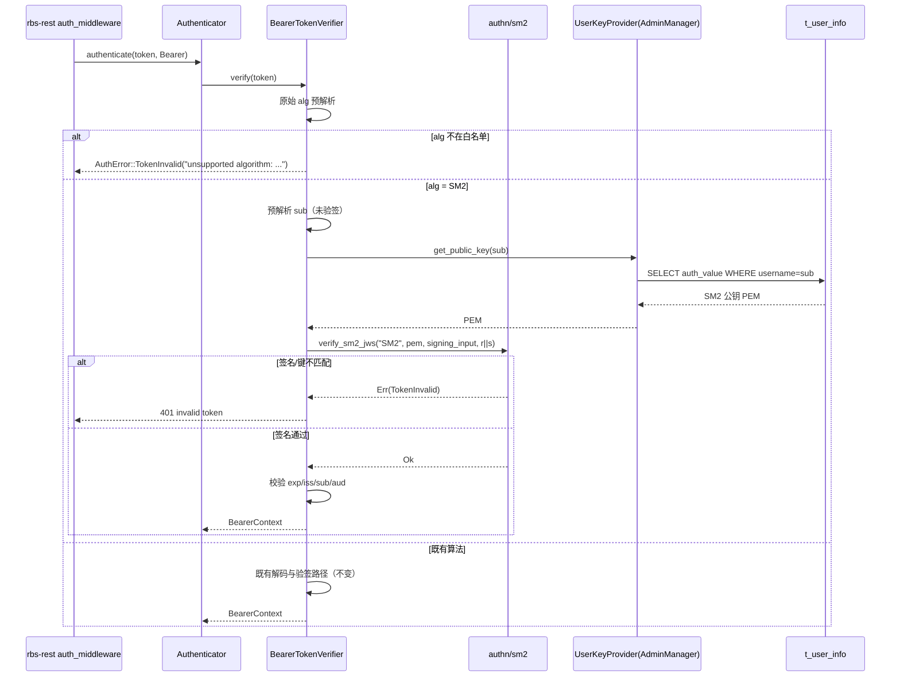

# AR-1-SM2用户认证-rbs-core模块详细设计说明书

> 文档状态：**部分完成**。本模块内部（验签算法分派、SM2/SM3 验签核心、JWKS/登记侧 SM2 键解析、配置兼容）已定稿；与 GTA 的 SM2 外部表示法及 SM2 用户标识（Z 值）最终对齐存在**需前置确认**项，见 3.1（D4/D6）、4.2.4 与第 9 章。

## 1. 需求背景 / 当前 AR 描述

### 1.1 需求与目标

RBS（Resource Broker Service）当前认证链路只接受国际算法（`PS256/PS384/PS512/EdDSA`），`rbs-cli` 的 `token gen` 也只支持 `PS*/ES*/EdDSA`。国密合规场景要求认证链路支持 SM2（配套 SM3 摘要）。本模块（`rbs-core`）承担其中与核心域逻辑相关的部分：

- **目标行为**：`rbs-core` 能对 `alg=SM2` 的用户令牌（BearerToken）与 GTA 签发的 `alg=SM2` attestation 令牌（AttestToken）完成 SM2/SM3 验签；管理员能通过既有用户管理链路登记 SM2 公钥（PEM 或 JWK）。
- **触发条件**：受保护端点请求携带 `Authorization: Bearer/Attest <SM2 JWT>`；管理员调用用户创建/更新接口并提交 SM2 公钥材料。
- **验收口径**：`alg=SM2` 令牌可被认证通过并放行至业务逻辑；GTA 的 SM2 attestation 令牌可被验签通过；SM2 公钥可经 PEM 与 JWK 两种形态登记并被后续验签取用；既有算法行为不变、未知算法仍被拒绝；错误统一映射为 401 且语义类别不变；无数据库结构变更、不引入新的密码学三方件。

### 1.2 范围说明

| 编号 | 需求/AR/变更点 | 本模块处理结论 | 关联详细方案 |
|---|---|---|---|
| R1 | 用户认证支持 SM2（Bearer 用户令牌以 SM2 验签） | 本模块实现 | 4.1 / 4.2 |
| R2 | 验证 GTA 签发的 SM2 attestation 令牌 | 本模块实现 | 4.1 / 4.2 / 4.3 |
| R3 | 管理员登记 SM2 用户公钥（PEM 与 JWK 两种输入） | 本模块实现 | 4.4 |
| R4 | rbs-cli 生成 SM2 令牌 | 不属于本模块（属 `tools`/rbs-cli；本模块仅承接互操作约定，见第 2 章） | 2 / 7.1 |
| R5 | 不引入新密码学三方件，复用既有 OpenSSL | 本模块实现（设计硬约束） | 4.2 / 第 9 章 |
| R6 | 保持既有算法与未知算法拒绝策略不回退 | 本模块实现 | 4.1 |
| R7 | 错误映射与对外响应语义保持一致 | 本模块配合（本模块保证 `AuthError` 语义；HTTP 401 文案由 `rbs-rest` 中间件承载） | 4.1.4 / 7.2 |
| R8 | 用户表/持久化结构无需破坏性变更 | 本模块实现（结构不变，仅算法取值扩展） | 第 6 章 |

## 2. 外部依赖

| 依赖对象 | 本次关联 | 对设计/实现的具体影响 | 失败或兼容处理 | 关联设计点 |
|---|---|---|---|---|
| GTA 侧 SM2 令牌与公钥的**外部表示法**（JWS `alg` 取值、JWK `kty/crv/x/y`、签名 `r\|\|s`、SM2 用户标识 Z） | 上游契约方 | 直接决定验签互操作与 JWKS 解析的键形态；本仓库无法自证 | 本设计按上游已给出的约定（`alg=SM2`、`kty=EC/crv=SM2`、`x/y` 各 32B、`r\|\|s`、Z=默认）落地；与 GTA 的最终一致性列为**需前置确认** | D4 / D6 / 4.2 / 4.3 |
| GTA 验签公钥资料（PEM 文件或 JWKS 文件） | 只读输入资料 | 决定 Attest 侧键解析分支（PEM→SM2 PKey；JWKS→按 `kid` 选键） | 文件缺失/不可读或 JWKS 非法 → 启动期失败并记录原因 | 4.1.4 / 4.3 / K5 |
| 既有 vendored OpenSSL（`openssl` 0.10.79 / OpenSSL 3.x） | 密码学底座 | 提供 SM2/SM3 能力；但**未自动应用标准默认用户标识**，且无高层 SM2 签名封装 | 必须在实现中显式固定 SM2 用户标识（D6）；不引入新三方件 | D6 / 4.2 |
| `jsonwebtoken` 10.3.0 | 既有 JWT 库 | 不支持 SM2；头解析对未知 `alg` 直接失败 | SM2 不能复用其解码路径，需在进入解码前做原始 `alg` 预解析并走独立分支 | D2 / 4.1 |
| `rbs-rest` 认证中间件 | 上层调用方 | 承载 HTTP 401 响应体：把 `AuthError` 的文本形式写入 `error` 字段 | 本模块只保证 `AuthError` 变体与语义不变；对外文案与 SR 期望表述的差异属相邻模块契约，需与 `rbs-rest` 对齐 | R7 / 7.2 |
| `rbs-cli`（`tools`） | SM2 令牌生产者 | 生成 `alg=SM2` 的用户令牌，须与本模块验签约定（SM3、`r\|\|s`、Z）一致 | 属相邻模块；本模块仅记录互操作约束 | R4 / 7.1 |
| GTA REST API（`/challenge`、`/attest`） | 既有 attestation 依赖 | 不改动请求/响应结构，仅其返回令牌的 `alg` 可为 `SM2` | 复用既有错误/重试语义 | 不涉及本模块改动 |

## 3. 整体方案

### 3.1 方案概述

总体思路：把 SM2 作为**新增可接受算法**接入既有认证与用户公钥登记链路，不替换、不移除任何既有算法，也不新增层级、服务或对外端点。SM2 无法复用 `jsonwebtoken` 解码路径（未知 `alg` 直接失败），因此在各验签入口先做**原始 `alg` 预解析**：命中 `SM2` 即切换到独立的 SM2/SM3 验签分支，未命中则保持既有路径，做到对既有算法零改动。SM2 的密码学运算（SM3 摘要、SM2 验签、签名值 `r||s` 编解码、SM2 公钥解析）集中到一个新增模块 `authn/sm2`，由 Bearer 与 Attest 两条验签路径共用，保证语义严格一致。用户公钥登记复用既有事务与校验骨架，仅扩展曲线/键型分支与算法取值。SM2 经既有配置项与既有用户列生效，**不新增配置项、不新增数据库列**。

**兼容/回退策略**：既有算法（`PS*/EdDSA`）路径与其拒绝语义保持不变；未知算法仍被拒绝；无论 SM2 分支成败，既有令牌验签与其他业务逻辑无需改动。回退即移除 SM2 分支与白名单取值（不涉及数据或配置回退）。

| 决策编号 | 设计点 | 设计结论 | 设计依据摘要 | 影响范围 | 评审关注点 | 状态 / 待确认说明 |
|---|---|---|---|---|---|---|
| D1 | 算法接入策略 | SM2 作为新增可接受算法加入白名单；既有算法与未知算法（含 `none`）拒绝语义不变 | 需求要求 SM2；RBS 不允许算法混淆 | 配置/白名单/校验 | 是否为零回归扩展 | 已定稿 |
| D2 | 验签期键识别与分派路径 | 在各验签入口先对原始 `alg` 做预解析，命中 `SM2` 走独立 SM2 分支；**不修改** `UserKeyProvider::get_public_key` 签名、**不依赖** `auth_alg` 传播 | 验签取键入口只拿到公钥 PEM，不带算法标记；SM2 键可直接由 PEM 自识别 | `authn/common`、`bearer_token`、`token` | 键识别是否可靠、是否引入接口破坏 | 已定稿 |
| D3 | SM2 密码学落点 | 新增 `authn/sm2` 模块承载 SM2/SM3 验签与 `r\|\|s`↔DER 转换、SM2 公钥解析；Bearer 与 Attest 共用 | SM2 无法复用 `jsonwebtoken`，两条路径都要用；集中一处避免双份实现漂移 | 新增文件/模块 | 模块装配与依赖方向 | 已定稿 |
| D4 | SM2 公钥表示 | PEM 采用 X.509 SPKI（曲线 OID `1.2.156.10197.1.301`）；JWK 采用 `kty=EC, crv=SM2, x/y`（各 32B base64url 无填充） | 上游给出的公钥资料契约 | `authn/jwks`、`admin/key` | 表示法是否与 GTA 一致 | **需前置确认**：表示法本身须与 GTA 对齐 |
| D5 | SM2 签名编码 | JWS 第三段为 base64url(无填充) 的 `r\|\|s`（各 32B 大端）；`authn/sm2` 内部转换为 DER 交 OpenSSL | 上游互操作约定；OpenSSL 期望 DER | `authn/sm2` | 长度/字节序校验 | 已定稿 |
| D6 | SM2 用户标识（Z 值） | 必须**显式固定**为与 GTA 约定的取值（默认 `1234567812345678`）；不得依赖 OpenSSL 隐式默认 | 当前 vendored OpenSSL 未自动应用标准默认标识；`openssl` crate 未暴露设置接口 | `authn/sm2` | 实现机制与取值对齐 | **需前置确认**：取值与设置路径须与 GTA/平台对齐 |
| D7 | 登记链路扩展 | 复用既有事务/校验骨架；`auth_alg` 仍由存储 PEM 反推；`admin/key` 扩展 SM2 曲线与 `crv=SM2`；无 DDL 变更 | 现状登记骨架已支持多曲线分支，扩展面最小 | `admin/key`、`admin/manager` | 事务/权限/限额语义不变 | 已定稿 |
| D8 | 配置兼容 | **不新增配置项**；SM2 经既有 `auth.attest_token.public_key_path` / `jwks_file` 与既有用户登记生效 | 严格配置（拒绝未知字段）下任何新增字段都会导致加载失败 | 配置/启动期 | 是否需要开关 | 已定稿 |
| D9 | SM2 分支的 claims 校验 | SM2 分支签名通过后，按与既有 `Validation` 相同的规则校验 claims（必需项、`exp`/`iss`/`aud`、60s skew） | 凭证正确性要求；SM2 无法复用既有解码的 claims 校验 | `bearer_token`、`token` | 语义是否漂移 | 已定稿 |
| D10 | 错误语义 | 算法不支持 → “unsupported algorithm: …”；签名/claims 失败 → “invalid token”/过期语义；均映射 401 | 既有语义类别保持不变，SM2 失败归入同类 | 各验签入口 | 对外文案归属 | 已定稿（对外文案由 `rbs-rest` 承载，见 7.2） |

## 4. 模块详细方案

**变化触发表**（决定本章展开范围）：

| 变化类型 | 是否涉及 | 展开位置 |
|---|---|---|
| 包/模块结构变化 | 是（新增 `authn/sm2`，`authn/mod.rs` 注册） | 4.2.2（依赖变更视图） |
| 类/接口变化 | 是（`authn/sm2` 新增；`common`/`bearer_token`/`token`/`jwks`/`admin/key` 修改） | 4.1.3 / 4.2.3 / 4.3.3 / 4.4.3 |
| 业务流程变化 | 是（验签分支、登记分支） | 4.1.2 / 4.4.2 |
| REST 接口变化 | 否，原因：`rbs-core` 不暴露 REST；受影响的对外端点由 `rbs-rest` 提供，其契约变化见第 2 章与第 7 章 | — |
| Kafka/MQ 接口变化 | 否，原因：本需求不涉及消息中间件 | — |
| 内部接口/抽象变化 | 是（`TokenVerifier` 实现内部扩展；`UserKeyProvider` 不变） | 4.1.3 |
| 数据库变化 | 否，原因：仅 `auth_alg` 取值扩展，无结构/DDL 变更 | 第 6 章 |
| 配置/开关变化 | 否，原因：不新增配置项 | 3.1(D8) / 第 2 章 |

### 4.1 验签算法分派扩展（SM2 接入 Bearer 与 Attest）

#### 4.1.1 目标与约束

目标是让两个验签入口在遇到 `alg=SM2` 时切换到 SM2/SM3 验签分支，同时保持既有算法路径与拒绝语义不变。影响设计的现状约束：认证器按 token **类型**（Bearer/Attest）分派而非按算法；两个 verifier 都先解析 JWT 头再建验签键，且都依赖 `jsonwebtoken`（对未知 `alg` 解析即失败）；Bearer 取键接口只返回用户公钥 PEM、不带算法标记。范围已在 1.2 明确，此处不复述。

#### 4.1.2 目标设计

主流程（Bearer，含 SM2 成功与失败分支）：



关键行为与边界：

- **统一入口**：两个 verifier 的第一步改为“原始 `alg` 预解析 + 白名单判定”，再按 `alg` 是否等于 `SM2` 分支。白名单判定后，未知算法（含 `none`）统一返回 `unsupported algorithm: <alg>`；受支持的非 SM2 算法仍走既有 `jsonwebtoken` 路径。这是把“预解析”前置带来的唯一行为细化，不改变既有受支持算法的任何结果。
- **Bearer 分支**：预解析未验签 payload 取 `sub`（复用既有逻辑，SM2 令牌的 payload 为标准 base64url JSON，同样可解）→ 按 `sub` 取用户公钥 PEM → 交 `authn/sm2` 验签 → 校验 claims。取键失败仍以通用 `invalid token` 掩码（防用户枚举）。
- **Attest 分支**：预解析 `alg`/`kid` → 解析 SM2 公钥（`public_key_path` 直接 PEM，或 JWKS 按 `kid` 选键后转 PEM）→ 交 `authn/sm2` 验签 → 校验 claims。SM2 分支所需的键解析与既有 RSA/Ed25519 路径相互独立。
- **算法-密钥一致（防混淆）**：SM2 分支只接受 SM2 曲线公钥；公钥与算法不匹配（如 RSA 公钥配 `alg=SM2`）必须验签失败，不得回退到其他算法。
- **并发/幂等**：验签为纯本地计算、无共享可变状态；同一令牌重复校验结果一致。
- **不做的事**：不改 `Authenticator` 的类型分派；不修改 `UserKeyProvider` 接口；不支持同一用户多算法并存（每用户仍只有一份公钥/算法取值）。

**依赖变更视图**（模块内部依赖 + 分层边界）：

| 依赖关系 | 变化前 | 变化后 | 允许/禁止 | 架构依据 |
|---|---|---|---|---|
| `authn/bearer_token` → `authn/sm2` | 不存在 | 新增 | 允许 | SM2 验签复用同一核心 |
| `authn/token` → `authn/sm2` | 不存在 | 新增 | 允许 | 同上 |
| `authn/common`（算法预解析/白名单） | 被两 verifier 使用 | 保持被使用，职责扩展 | 允许 | 核心层内聚 |
| `rbs-rest` / `rbs` 壳 → 密码学实现 | 无 | 仍无（不改） | 禁止 | 中间件与壳不承载密码学 |
| `rbs-core` → 新增密码学三方件 | 无 | 仍无（复用既有 OpenSSL） | 禁止 | SR 的依赖硬约束 |

#### 4.1.3 契约与工程落点

工程落点：`rbs/core/src/auth/authn/common.rs`、`rbs/core/src/auth/authn/bearer_token.rs`、`rbs/core/src/auth/authn/token.rs`。

**方法 / 函数契约**：

| 对象 | 变化 | 完整签名 | 异常 / 错误语义 | 关联契约 |
|---|---|---|---|---|
| `authn::common::peek_alg` | 新增 | `fn peek_alg(token: &str) -> Result<String, AuthError>` | 令牌非三段/头非 base64url/头非 JSON 或缺 `alg` → `AuthError::TokenInvalid{reason:"invalid token"}` | K2 |
| `authn::common::validate_algorithm` | 修改 | `fn validate_algorithm(alg: &jsonwebtoken::Algorithm) -> Result<(), AuthError>`（签名不变） | 非白名单 → `AuthError::TokenInvalid{reason:"unsupported algorithm: <alg>. Supported algorithms: <列表>"}` | K2 |
| `authn::common::SUPPORTED_ALGORITHMS_STR` | 修改 | `const &str` = `"PS256, PS384, PS512, EdDSA, SM2"` | — | K2 |
| `authn::common::SM2_ALG` | 新增 | `const SM2_ALG: &str = "SM2"` | — | K2 |
| `BearerTokenVerifier::verify` | 修改（行为） | `async fn verify(&self, token: &str) -> Result<BearerContext, AuthError>`（`TokenVerifier::verify` 签名不变） | 见 K8 错误语义 | K3 |
| `AttestTokenVerifier::verify` | 修改（行为） | `async fn verify(&self, token: &str) -> Result<AttestContext, AuthError>`（签名不变） | 见 K8 错误语义 | K4 |
| `AttestTokenVerifier::new` | 修改（行为） | `fn new(config: AttestTokenVerificationConfig) -> Result<Self, AuthError>`（签名不变） | `public_key_path` 指向 SM2 公钥时**必须构造成功**（保留 PEM 供 SM2 分支）；缺两键来源仍返回配置错误 | K4 |

**常量 / 枚举值**：

| 常量名 | 取值 | 说明 | 关联契约 |
|---|---|---|---|
| JWS `alg` 取值 | `PS256` / `PS384` / `PS512` / `EdDSA` / **`SM2`** | 认证可接受算法集合（新增 `SM2`） | K2 / K8 |
| 既有算法拒绝集合 | `RS*` / `HS*` / `none` / 其他 | 仍一律拒绝；不得因 SM2 引入而放宽 | K2 / R6 |

**关键映射规则 / JSON 示例**（认证错误语义，权威定义；HTTP 状态与响应体由 `rbs-rest` 承载）：

| 触发条件 | `AuthError` 语义 | 对外状态 | 说明 |
|---|---|---|---|
| 缺少/格式错误 `Authorization` | （中间件判定，非本模块） | 401 | 文案 `Unauthorized` |
| `alg` 不在白名单（含非 SM2 未知算法、`none`） | `TokenInvalid{reason:"unsupported algorithm: <alg>. Supported algorithms: …"}` | 401 | 预解析阶段即拒绝 |
| 签名校验失败 / 算法-密钥不匹配 | `TokenInvalid{reason:"invalid token"}` | 401 | 对 Bearer 掩码取键失败 |
| `exp/nbf/iss/aud` 校验失败 | `TokenExpired` / `TokenNotYetValid` / `TokenInvalid{reason:"invalid token"}` | 401 | 过期与未生效使用专用变体 |
| Bearer 的 `sub` 在用户库无公钥 | `TokenInvalid{reason:"invalid token"}` | 401 | 掩盖用户枚举 |
| Attest 令牌用于非资源 GET 端点 | （中间件判定，非本模块） | 401 | — |

#### 4.1.4 失败语义、风险与验收

| 验证目标 | 覆盖范围 | 输入 / 触发条件 | 预期行为 | 可观察信号 | 关联契约 / 设计点 |
|---|---|---|---|---|---|
| 主路径 | Bearer SM2 | 已登记 SM2 公钥的用户，携带 `alg=SM2` 且签名正确的令牌 | 验签通过并进入业务逻辑 | 返回 `BearerContext` | K3 / D1 / D2 |
| 主路径 | Attest SM2 | 配置 SM2 公钥/JWKS，携带 `alg=SM2` 的 GTA 令牌（资源 GET 端点） | 验签通过 | 返回 `AttestContext` | K4 / D2 |
| 失败路径 | 算法-密钥不匹配 | `alg=SM2` 但库/配置公钥为非 SM2 | 验签失败 | `TokenInvalid`（401） | K8 / D1 |
| 失败路径 | 签名篡改/编码非法 | `r\|\|s` 长度≠64 或签名不匹配 | 拒绝 | `TokenInvalid`（401） | K8 / D5 |
| 失败路径 | claims 非法 | `exp` 过期 / `iss` 不符 / `aud` 不符 / 缺 `sub` | 拒绝 | `TokenExpired` 或 `TokenInvalid`（401） | K8 / D9 |
| 失败路径 | JWKS 无匹配键 | `kid` 不存在或 JWKS 为空 | 选键失败 | 401 `invalid token` | K5 / K8 |
| 失败路径 | 未知算法/`none` | 令牌 `alg` 非白名单 | 预解析阶段拒绝 | 401 `unsupported algorithm` | K2 / K8 |
| 兼容回归 | 既有算法 | `PS*/EdDSA` 令牌 | 行为完全不变 | 认证通过 | K2 / R6 |
| 兼容回归 | EC 非 SM2 曲线 | JWKS/登记提交非 SM2 曲线 EC 键 | 仍被拒绝 | 错误（验签侧 401；登记侧 400） | K5 / K6 |
| 日志观测 | 认证失败分类 | 各类失败 | 记录失败原因类别，不记录令牌正文与密钥 | `log`（`debug`/`warn`），含 `alg` 维度 | K8 / 5.2 |

### 4.2 SM2/SM3 验签核心与互操作参数（新增 `authn/sm2`）

#### 4.2.1 目标与约束

目标是提供一个可被两条验签路径共用的 SM2/SM3 JWS 验签能力，以及 SM2 公钥解析与签名值 `r||s`↔DER 编解码。现状约束：`jsonwebtoken` 不支持 SM2；既有 vendored OpenSSL 提供 SM2/SM3 能力但无高层 SM2 签名封装，且**不会自动应用标准默认用户标识**；不得引入新的密码学三方件。

#### 4.2.2 目标设计

**核心算法（SM2/SM3 验签，输入/输出/不变量/失败）**：

- 输入：`alg`（必须为 `SM2`）、`key`（SM2 公钥 PEM，X.509 SPKI）、`signing_input`（`base64url(header).base64url(payload)` 的原始 ASCII 字节）、`signature`（JWS 第三段解码后的原始字节，即 `r||s`）。
- 前置条件：`key` 为 SM2 曲线（OID `1.2.156.10197.1.301`）公钥；`signature` 长度为 64 字节（`r`、`s` 各 32 字节大端）。
- 步骤（语言无关，示意）：
  1. 断言 `alg == SM2`，否则失败。
  2. 解析 SM2 公钥；曲线不为 SM2 则失败。
  3. 将 `signature` 切分为 `r`、`s`（各 32B 大端），组装为 `ECDSA-SIG` 并编码为 DER（OpenSSL 期望 DER 输入）。
  4. 以 **SM3** 摘要、**约定的用户标识**、SM2 公钥，对 `signing_input` 执行 SM2 验签。
  5. 成功返回 `Ok(())`，否则失败。
- 关键不变量：
  - 摘要算法固定 SM3；曲线固定 SM2；**用户标识必须显式固定**为与签发方约定的取值，不得依赖 OpenSSL 隐式默认（见 D6）。
  - 验签输入必须是原始 ASCII 字节，不得做二次 base64 编解码。
  - 无共享可变状态；公钥对象可在构造期解析并复用（避免每次请求重复解析 PEM）。
- 失败行为：`alg` 非 SM2、键曲线非 SM2、签名长度≠64、坐标/编码非法、签名不匹配 → 均以 `AuthError::TokenInvalid` 返回（由调用方按 K8 决定对外文案）。
- 复杂度：单次椭圆曲线运算 + 一次 SM3，常量级；无 I/O。

**SM2 用户标识（Z 值）实现约束（关键）**：当前 vendored OpenSSL 在未显式设置用户标识时按**空标识**计算 `Z`，而标准/GM/T 与上游约定使用默认标识 `1234567812345678`；两者会得到不同的摘要，导致与采用默认标识的签发方互不兼容。因此实现必须显式设置 SM2 用户标识。约束：不得引入新的密码学三方件，只能在既有 vendored OpenSSL 能力内实现（`openssl` crate 当前未暴露用户标识设置接口，需借助同一 OpenSSL 的底层上下文参数能力实现）。本项为**实现必须满足的约束**，最终取值与设置路径需与 GTA/平台对齐（见 4.2.4、第 9 章）。

**依赖变更视图**：

| 依赖关系 | 变化前 | 变化后 | 允许/禁止 | 架构依据 |
|---|---|---|---|---|
| `authn/sm2` → `openssl` | 不存在 | 新增（复用既有 `openssl` 依赖） | 允许 | 密码学集中在核心层；不新增三方件 |
| `authn/jwks` → `authn/sm2`（SM2 JWK→PEM） | 不存在 | 新增 | 允许 | 复用同一 SM2 键解析语义 |
| `admin/key` → `authn/sm2` | 不存在 | **禁止**（登记侧保持自包含，沿用自身错误域） | 禁止 | 验签侧与登记侧错误域不同 |

#### 4.2.3 契约与工程落点

工程落点：新增 `rbs/core/src/auth/authn/sm2.rs`，并在 `rbs/core/src/auth/authn/mod.rs` 注册 `pub mod sm2;`。模块职责：提供 SM2/SM3 的 JWS 验签、签名值 `r||s`↔DER 编码转换、SM2 公钥解析（PEM/JWK→密钥）；**不负责**算法分派、claims 语义与公钥查找。

**方法 / 函数契约**：

| 对象 | 变化 | 完整签名 | 异常 / 错误语义 | 关联契约 |
|---|---|---|---|---|
| `authn::sm2::verify_sm2_jws` | 新增 | `fn verify_sm2_jws(alg: &str, key: &[u8], signing_input: &[u8], signature: &[u8]) -> Result<(), AuthError>` | `alg != "SM2"` / 键非 SM2 / 签名长度≠64 / 验签失败 → `AuthError::TokenInvalid` | K1 |
| `authn::sm2::sm2_public_key_from_pem` | 新增 | `fn sm2_public_key_from_pem(pem: &[u8]) -> Result<openssl::pkey::PKey<openssl::pkey::Public>, AuthError>` | 非法 PEM 或非 SM2 曲线 → `AuthError::TokenInvalid` | K1 |
| `authn::sm2::sm2_public_key_from_jwk` | 新增 | `fn sm2_public_key_from_jwk(x: &str, y: &str) -> Result<openssl::pkey::PKey<openssl::pkey::Public>, AuthError>` | base64url 解码失败 / 长度≠32B / 坐标非法 → `AuthError::TokenInvalid` | K1 |

> 说明：`sm2_public_key_from_*` 为上游给定的 `authn/sm2` 键解析族；具体参数/返回类型可在不改变上述语义的前提下由实现细化。

**常量 / 枚举值**：

| 常量名 | 取值 | 说明 | 关联契约 |
|---|---|---|---|
| SM2 曲线 OID | `1.2.156.10197.1.301` | SM2 曲线标识（等价 `Nid::SM2`） | K9 |
| 摘要算法 | `SM3`（256 位） | SM2 验签摘要 | K9 |
| 签名编码 | `r\|\|s` 各 32 字节大端，JWS 段 base64url 无填充 | 与 DER 互转的边界格式 | K9 |
| SM2 用户标识（Z 值） | 默认 `1234567812345678` | 必须显式设置（D6） | K9 |

#### 4.2.4 失败语义、风险与验收

| 验证目标 | 覆盖范围 | 输入 / 触发条件 | 预期行为 | 可观察信号 | 关联契约 / 设计点 |
|---|---|---|---|---|---|
| 安全 | 摘要/曲线/编码固定 | 任取合法 SM2 令牌 | 仅接受 SM3+SM2+`r\|\|s` | 验签结果确定 | K9 / D5 |
| 安全 | 用户标识固定 | 与约定标识不一致的签名 | 拒绝，不得隐式使用其他标识 | 验签失败 | K9 / D6 |
| 失败路径 | 非法签名长度 | `r\|\|s`≠64B | 拒绝 | `TokenInvalid` | K1 / D5 |
| 失败路径 | 非 SM2 键 | RSA/其他曲线 PEM | 拒绝 | `TokenInvalid` | K1 / D1 |
| 性能 | 单次验签开销 | 单核单次验签 | 常量级、无 I/O、无锁 | 延迟与内存占用 | K9 / 5.3 |
| 风险 | 标识设置能力缺口 | 复用既有 OpenSSL 显式设置用户标识 | 满足约束方可定稿 | 实现评审 | **需前置确认**：设置路径须评审确认 |

### 4.3 Attest JWKS SM2 公钥解析扩展

#### 4.3.1 目标与约束

目标是让 JWKS 解析接受 `kty=EC, crv=SM2` 并按 `kid` 选键转 PEM，供 Attest 的 SM2 验签使用；其余 EC 曲线与键型仍被拒绝。现状约束：JWKS 的 `Jwk` 结构无 `y` 字段、仅支持 `RSA`/`OKP(Ed25519)`，`kty=EC` 被显式拒绝；解析失败与非法键在 Attest 侧以 `AuthError` 表达（启动期与验签期语义不同）。

#### 4.3.2 目标设计

- 解析阶段：`Jwks`/`Jwk` 的 JSON 反序列化对未知字段本就宽容，新增可选 `y` 字段后仍向后兼容；`kty=EC` 的键可被解析保留。
- 转换阶段：`jwk_to_pem` 增加 `EC` 分支——仅接受 `crv=SM2`，要求 `x`/`y` 均存在且 base64url 解码为 32 字节，按 SM2 曲线由仿射坐标构造公钥并输出 SPKI PEM；`crv` 为其他取值或字段缺失一律拒绝。`crv=SM2` 的键解析委托 `authn/sm2::sm2_public_key_from_jwk`，与验签侧共用同一曲线/坐标语义。
- 兼容：`RSA`（`n`/`e`）与 `OKP(Ed25519)`（`x`）路径不变；`kty=EC` 的非 SM2 曲线行为仍为“拒绝”，但错误原因由“不支持的 key type”细化为“不支持的曲线”；该错误为内部原因（对外 Attest 401 统一为 `invalid token`），不改变对外契约。

#### 4.3.3 契约与工程落点

工程落点：`rbs/core/src/auth/authn/jwks.rs`。

**数据结构 / JSON 契约**（权威定义）：

| 对象 | 变化 | 字段 / 取值 | 异常 / 错误语义 | 关联契约 |
|---|---|---|---|---|
| `Jwk` | 修改（新增字段） | 现有 `kty`、`kid?`、`alg?`、`n?`、`e?`、`crv?`、`x?`；**新增** `y: Option<String>` | 解析失败 → `AuthError::TokenInvalid` | K5 |
| JWKS `kty` | 修改 | `RSA` / `OKP` / **`EC`（新增）** | 其他 → `unsupported key type: …` | K5 |
| JWKS `crv` | 修改 | `Ed25519`、**`SM2`（新增）**；其他 EC 曲线不支持 | 不支持曲线 → 拒绝 | K5 |
| JWKS `x` / `y` | 新增语义 | base64url 无填充；SM2 各 32 字节；`kty=EC,crv=SM2` 需同时具备 | 缺失/长度非法 → 拒绝 | K5 |
| JWKS `alg` | 不变 | 可选，建议 `SM2` | — | K5 |

**方法 / 函数契约**：

| 对象 | 变化 | 完整签名 | 异常 / 错误语义 | 关联契约 |
|---|---|---|---|---|
| `authn::jwks::jwk_to_pem` | 修改 | `fn jwk_to_pem(jwk: &Jwk) -> Result<Vec<u8>, AuthError>`（签名不变） | `kty=EC,crv=SM2` 且 `x/y` 合法 → SPKI PEM；其余 EC/键型 → `AuthError::TokenInvalid` | K5 |
| `authn::jwks::parse_jwks_file` | 不变 | `fn parse_jwks_file(content: &str) -> Result<Jwks, AuthError>` | 非法 JSON → `AuthError::TokenInvalid` | K5 |
| `authn::jwks::find_key_by_kid` | 不变 | `fn find_key_by_kid<'a>(jwks: &'a Jwks, kid: &str) -> Option<&'a Jwk>` | — | K5 |

**JSON 示例**（JWKS 含 SM2 键）：

```json
{
  "keys": [
    {
      "kty": "EC",
      "kid": "gta-sm2-1",
      "crv": "SM2",
      "alg": "SM2",
      "x": "MKBCTNIcKUSDii11ySs3526iDZ8AiTo7Tu6KPAqv7D4",
      "y": "4Etl6SRW2YiLUrN5vfvVHuhp7x8PxltmWWlbbM4IFyM"
    }
  ]
}
```

#### 4.3.4 失败语义、风险与验收

| 验证目标 | 覆盖范围 | 输入 / 触发条件 | 预期行为 | 可观察信号 | 关联契约 / 设计点 |
|---|---|---|---|---|---|
| 主路径 | SM2 JWKS 选键 | 含 `kty=EC,crv=SM2` 的 JWKS，`kid` 命中 | 选出键并转 PEM | 验签可继续 | K5 / D4 |
| 失败路径 | 非 SM2 EC 曲线 | `kty=EC, crv=P-256` | 拒绝 | 验签 401 `invalid token` | K5 / R6 |
| 失败路径 | 字段缺失/长度非法 | 缺 `x`/`y` 或长度≠32B | 拒绝 | 错误 | K5 |
| 兼容回归 | RSA/OKP 不变 | 既有 RSA/Ed25519 JWKS | 行为不变 | 验签通过 | K5 / R6 |
| 兼容回归 | 既有 EC 拒绝用例 | 提交非 SM2 曲线 EC 键 | 仍被拒绝（错误原因细化） | 返回错误 | K5 / R6 |

### 4.4 用户 SM2 公钥登记链路扩展

#### 4.4.1 目标与约束

目标是让管理员能用 PEM 或 JWK 形态登记 SM2 公钥，并落库为 `auth_value`(PEM) 与 `auth_alg`(`SM2`)，供后续 Bearer 验签取用。影响设计的现状约束：登记侧 `validate_and_derive_alg` 由存储的 PEM **反推** `auth_alg`（不采信 JWK 声明的 `alg`）；`public_key`/`jwk` 互斥且至少其一；`auth_value`/`auth_alg` 为自由文本列，无需 DDL 变更；长度上限 10KB；写入在事务内并含权限/限额校验。

#### 4.4.2 目标设计

- **校验与推导**：`validate_and_derive_alg(pem)` 扩展 SM2——当键为 EC 类且曲线为 SM2 时返回算法串 `SM2`；其余行为不变（RSA→`RS256`，EC 的 `P-256/384/521`→`ES256/384/512`，其他曲线/键型仍拒绝）。键型判定需同时覆盖 OpenSSL 将 SM2 键标识为 EC 与 SM2 两种情形。
- **JWK→PEM**：`jwk_to_pem` 的 `EC` 分支扩展 `crv=SM2`——按 SM2 曲线由 `x`/`y` 构造公钥并输出 SPKI PEM；`crv` 其他取值仍拒绝。登记侧保持自包含（沿用 `RbsError` 错误域）。
- **落库**：`extract_auth_material` / `extract_update_key_material` 骨架不变——先取 PEM（`public_key` 直用，`jwk` 先转 PEM），再由 PEM 反推 `auth_alg`；SM2 因此自动获得 `auth_alg=SM2`。事务、权限、`max_users`、重复用户名等语义均不变。
- **验签取键**：`UserKeyProvider::get_public_key(sub)` 仍只返回 `auth_value`（PEM），签名不变；SM2 键由验签侧的键识别（4.1/4.2）自识别。
- **不做的事**：不新增数据库列/表；不支持同一用户多算法并存（每种用户仍只有一份密钥材料，登记新公钥即替换）。

#### 4.4.3 契约与工程落点

工程落点：`rbs/core/src/admin/key.rs`（校验/推导/JWK→PEM）、`rbs/core/src/admin/manager.rs`（登记骨架，复用）。

**方法 / 函数契约**：

| 对象 | 变化 | 完整签名 | 异常 / 错误语义 | 关联契约 |
|---|---|---|---|---|
| `admin::key::validate_and_derive_alg` | 修改 | `pub fn validate_and_derive_alg(pem: &str) -> Result<String, RbsError>`（签名不变） | SM2 曲线 PEM → `Ok("SM2")`；超长 → `InvalidParameter("Public key exceeds maximum size of …")`；非 SM2 曲线/键型 → `InvalidParameter("Unsupported EC curve"/"Unsupported key type")` | K6 |
| `admin::key::jwk_to_pem` | 修改 | `pub fn jwk_to_pem(jwk: &Value) -> Result<String, RbsError>`（签名不变） | `kty=EC,crv=SM2` 且 `x/y` 合法 → SPKI PEM；`crv` 其他 → `InvalidParameter("Unsupported JWK EC curve")`；超长 → `InvalidParameter("JWK key exceeds maximum size of …")` | K6 |
| `AdminManager::create_user` / `update_user` | 复用（行为随扩展自动生效） | 签名不变 | 同既有 | K7 |
| `UserKeyProvider::get_public_key` | 复用（不变） | `async fn get_public_key(&self, sub: &str) -> Result<String, AuthError>` | 未找到用户 → `TokenInvalid`（对外掩码） | K7 |

**常量 / 枚举值**：

| 常量名 | 取值 | 说明 | 关联契约 |
|---|---|---|---|
| `MAX_KEY_SIZE` | `10240`（10 KB） | PEM/JWK 序列化长度上限，SM2 公钥远低于上限，保持不变 | K6 |
| `auth_alg` 取值 | `RS256` / `ES256/384/512` / **`SM2`（新增）** | 由 PEM 反推后落库 | K7 |

**请求 / 输入契约**（用户登记，权威定义）：

| 字段路径 | 位置 | 类型 | 必填 | 约束 | 业务语义 | 关联契约 |
|---|---|---|---|---|---|---|
| `username` | body | string | 是 | 唯一 | 用户名 | K7 |
| `public_key` | body | string | 条件（与 `jwk` 互斥且至少其一） | PEM(SPKI)；支持 SM2 曲线；≤10KB | 用户认证公钥 | K7 |
| `jwk` | body | object | 条件 | `kty=EC`、`crv=SM2`、`x`/`y` base64url 各 32B | 用户认证公钥（JWK） | K7 |
| `role` | body | string | 否 | `admin`/`user`，默认 `user` | 角色 | K7 |
| `enabled` | body | boolean | 否 | 默认 `true` | 启用状态 | K7 |
| `auth_type` | body | string | 是 | `jwt` | 认证类型 | K7 |

**响应 / 输出契约**：返回 `id`、`username`、`role`、`enabled`、`created_at`/`updated_at`（UTC 时间）；**不回显** `auth_alg`（SM2 由 `public_key`/`jwk` 推导后落库）。

**错误语义**：非法公钥（含不支持曲线）→ 400（对外文案为通用 `invalid parameter`，明细不外露）；`public_key` 与 `jwk` 同时提供 → 400；非管理员越权 → 403；用户名重复 → 409；超过 `max_users` → 限额错误。

#### 4.4.4 失败语义、风险与验收

| 验证目标 | 覆盖范围 | 输入 / 触发条件 | 预期行为 | 可观察信号 | 关联契约 / 设计点 |
|---|---|---|---|---|---|
| 主路径 | PEM 登记 | 提交 SM2 PEM | 创建/更新成功，落库 `auth_alg=SM2` | 返回 200/201；后续 SM2 令牌可验签 | K6 / K7 / D7 |
| 主路径 | JWK 登记 | 提交 `kty=EC,crv=SM2,x,y` | 转 PEM 后落库 | 同上 | K6 / K7 |
| 失败路径 | 非法曲线/键型 | 非 SM2 曲线或非 EC 键 | 400 | 通用 `invalid parameter`（明细仅日志） | K6 / D7 |
| 失败路径 | 互斥字段 | 同时给 `public_key` 与 `jwk` | 400 | 冲突错误 | K7 |
| 边界 | 超长材料 | >10KB | 400 | 长度上限错误 | K6 |
| 兼容回归 | 既有 RSA/EC 登记 | `RS256`/`ES*` 公钥 | 行为不变 | 登记成功 | K6 / R6 |
| 数据一致性 | 公钥更新原子性 | 更新用户 SM2 公钥 | 单事务完成；旧令牌立即失效、新令牌生效 | 事务结果与后续验签 | K7 / R8 |
| 迁移 | 无 DDL | 升级后启动 | 无结构变更，无需迁移 | — | R8 / 第 6 章 |

## 5. 对外接口

本节仅为索引。`rbs-core` 不直接暴露 REST/RPC/MQ 接口；下表为本次受影响的对外端点（由 `rbs-rest` 提供），其实质契约见对应权威位置。

| 接口编号 | 接口类型 | Method / Path / 名称 | 调用方 | 提供方 | 本次变化 | 关联契约 |
|---|---|---|---|---|---|---|
| API1 | REST | `Authorization: Bearer/Attest <JWT>`（作用于 `/rbs/v0/**` 受保护端点） | 外部调用方 / rbs-cli / rbc | `rbs-rest`（调用 `rbs-core` 认证能力） | 修改（可接受 `alg` 新增 `SM2`） | K3 / K4 / K8 |
| API2 | REST | `POST /rbs/v0/users`、`PUT /rbs/v0/users/{username}` | 管理员 / rbs-cli | `rbs-rest`（调用 `rbs-core` 登记能力） | 修改（`public_key`/`jwk` 接受 SM2） | K7 |
| API3 | CLI（文件交换） | `rbs-cli token gen --alg SM2` | 运维/管理员 | `tools`（rbs-cli，非本模块） | 修改（新增 `SM2` 取值） | 见第 2 章互操作约定 |

字段、入参出参、错误码、示例与兼容策略见对应“契约与工程落点”（K3/K4/K7/K8）。

## 6. 数据库 / 表设计

无表/字段/索引/约束/迁移脚本结构变化。`t_user_info` 的 `auth_alg` 为自由文本列，本次仅扩展其取值语义（新增 `SM2`）。

| 对象 | 变化类型 | 变化内容 | 兼容策略 | 回滚策略 |
|---|---|---|---|---|
| 表 `t_user_info` | 不变 | 沿用 `username`(PK)、`auth_value`(公钥 PEM)、`auth_alg`(算法串)、`auth_type`、`role`、`status` 等既有列 | 既有数据不受影响 | 无需回滚（无结构变更） |
| 字段 `t_user_info.auth_alg` | 修改（取值语义） | 取值集合新增 `SM2` | 旧值 `RS256/ES256/384/512` 语义不变 | 无需回滚 |
| 字段 `t_user_info.auth_value` | 不变 | SM2 公钥以 PEM(SPKI) 存入 | 既有列为文本，容量足够 | 无需回滚 |

## 7. 受影响模块与交互

### 7.1 受影响模块

| 模块 | 本次是否修改 | 边界说明（一句） |
|---|---|---|
| `rbs-core`（`auth/authn/**`、`admin/key.rs`） | 是 | 本模块承接 SM2 算法分派、SM2/SM3 验签核心、JWKS/登记侧 SM2 键解析与算法推导 |
| `rbs-rest`（认证中间件、用户路由） | 否 | 只编排认证/登记能力、不实现密码学；401 响应体由中间件承载（见 7.2） |
| `rbs`（服务壳装配） | 否 | 装配既有 `Authenticator`/`CoreKeyProvider`，SM2 无需装配改动 |
| `rbs-api-types`（配置与 DTO 类型） | 否 | 既有 `public_key: Option<String>` / `jwk: Option<Value>` 与配置结构已可承载 SM2，无需改动 |
| `tools`/rbs-cli | 否（相邻模块） | 生成 SM2 令牌，属 rbs-cli 侧；本模块仅承接互操作约定 |
| `rbc` | 否 | 与认证链路无交互 |
| DB `t_user_info` | 否 | 复用既有列 |

### 7.2 模块交互概览

| 交互编号 | 发起方 | 接收方 | 交互方式 | 异常与重试 | 防腐/隔离说明 | 关联契约 |
|---|---|---|---|---|---|---|
| I1 | `rbs-rest` 中间件 | `rbs-core` `Authenticator::authenticate` | 直接调用（进程内） | 认证失败由中间件按 `AuthError` 文本返回 401，不重试 | 中间件不解析令牌内容；密码学与算法识别留在 `rbs-core` | K3 / K4 / K8 |
| I2 | 管理员（经 REST） | `rbs-core` `AdminManager` | 直接调用（进程内） | 校验失败返回 400/403/409，不重试 | 权限/事务/限额语义不变 | K7 |
| I3 | `rbs-core` `AttestTokenVerifier` | GTA 验签公钥资料（PEM/JWKS 文件） | 文件读取（只读） | 缺失/非法 → 启动期失败并记录原因 | 只读、幂等；不引入运行时拉取 | K5 |
| I4 | `rbs-core`（认证能力） | `rbs-rest` 中间件（401 响应体） | 间接（`AuthError` → `error` 字段） | — | **待对齐**：中间件把 `AuthError` 的完整文本写入 `error`，与 SR 期望的 401 文案表述存在差异；该文案归属 `rbs-rest`，本模块不改变 `AuthError` 文本 | K8 |

## 8. 关键契约清单

本节仅为索引；实质内容（字段、签名、错误码）在本表“权威定义位置”给出。

| 契约编号 | 契约类型 | 名称 / Path / 模块 | 权威定义位置 | 可测试性关注点 |
|---|---|---|---|---|
| K1 | Method | `authn::sm2` 模块接口（`verify_sm2_jws`、`sm2_public_key_from_*`） | 4.2.3 | 主路径 / 失败路径 / 安全 |
| K2 | Config/常量 | 认证算法白名单与 `peek_alg`（`PS*/EdDSA/SM2`） | 4.1.3 | 主路径 / 兼容 / 失败路径 |
| K3 | Method | `BearerTokenVerifier::verify`（SM2 分支） | 4.1.3 | 主路径 / 失败路径 |
| K4 | Method | `AttestTokenVerifier::{new,verify}`（SM2 分支） | 4.1.3 | 主路径 / 失败路径 / 兼容 |
| K5 | DTO/Field | `Jwk`（新增 `y`）与 `jwk_to_pem`（`kty=EC,crv=SM2`） | 4.3.3 | 主路径 / 失败路径 / 兼容 |
| K6 | Method | `admin::key::{validate_and_derive_alg,jwk_to_pem}`（SM2） | 4.4.3 | 主路径 / 边界 / 兼容 |
| K7 | DTO/Field | 用户登记请求/响应契约（`public_key`/`jwk`）与 `get_public_key` | 4.4.3 | 主路径 / 失败路径 / 兼容 |
| K8 | ErrorCode | 认证错误语义（401：`unsupported algorithm` / `invalid token` / 过期） | 4.1.3 | 失败路径 / 兼容 / 日志观测 |
| K9 | Config | SM2 互操作参数（曲线 OID、SM3、`r\|\|s`、Z 值） | 4.2.3 | 安全 / 性能 |

## 9. 附录 / 三方件约束

| 主题 | 内容 | 影响 | 处理方式 |
|---|---|---|---|
| 三方件 | `openssl` 0.10.79（vendored，OpenSSL 3.x）：提供 SM2/SM3 能力，无高层 SM2 签名封装 | 决定 SM2 验签实现路径 | 复用既有 OpenSSL；不新增密码学三方件 |
| 三方件 | `jsonwebtoken` 10.3.0：不支持 SM2，未知 `alg` 头解析失败 | 决定“原始 `alg` 预解析 + 独立分支”方案 | SM2 走独立分支；不弱化其既有校验 |
| 三方件 | 本次不引入任何新的密码学三方件 | 依赖与许可证审计成本 | 作为设计硬约束（D3/R5） |
| 已知限制 | vendored OpenSSL 在未显式设置时按**空标识**计算 SM2 的 Z，不自动应用标准默认标识；`openssl` crate 未暴露用户标识设置接口 | 与采用默认标识的签发方可能互不兼容 | 必须显式固定用户标识（D6）；实现机制须评审确认 |
| 待确认 | GTA 侧 SM2 令牌与公钥的最终表示法（`alg` 串、JWK `kty/crv/x/y`、`r\|\|s`、Z 值） | 阻断互操作定稿 | **需前置确认**：与 GTA 契约方对齐后再复核本说明书第 3/4 章相关取值 |
| 待确认 | SM2 用户标识的最终取值与显式设置路径（复用既有 OpenSSL 的哪一底层能力） | 影响安全与互操作 | **需前置确认**：与平台/密码学负责人确认 |
| 待确认 | 401 对外文案归属（`rbs-rest` 中间件是否调整 `error` 字段拼接） | 影响对外契约表述 | 需与 `rbs-rest` 对齐（I4）；本模块保证 `AuthError` 语义不变 |
| 安全/合规 | SM2 曲线（OID `1.2.156.10197.1.301`）、SM3 摘要、`r\|\|s` 编码、算法严格白名单、禁止 `none`、算法决定密钥类型（防算法混淆） | 合规与安全基线 | 由 K1/K8/K9 约束；日志不落令牌与密钥 |
| 术语 | Z 值=SM2 用户标识；`r\|\|s`=SM2 签名的两分量拼接；SPKI=PEM 公钥编码 | 便于评审理解 | — |
