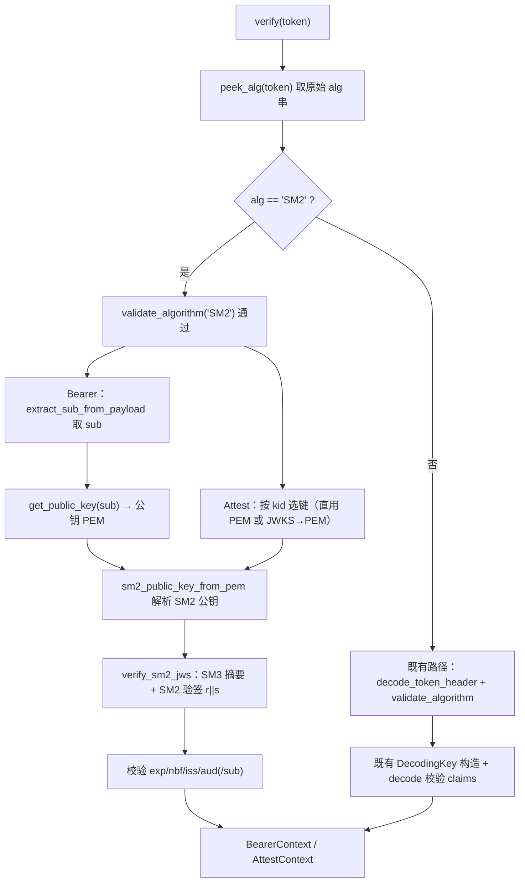
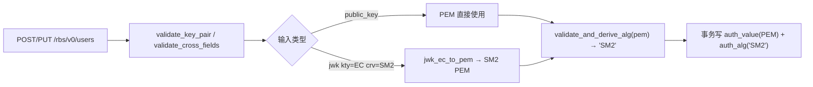

# AR-1-SM2 用户认证-rbs-core模块详细设计说明书

> 文档信息：SR=SR-1，AR=AR-1（SM2 用户认证），目标模块=rbs-core（`rbs/core/`）。
> TOBE 状态：**部分完成**（R2「GTA 签发的 SM2 attestation token」的外部表示法尚待上游前置确认，见 1.3 与第 9 章；不阻断其余设计定稿）。
> 输出模式：**增强**（跨模块、密钥/凭证敏感、核心认证链路）。

## 1. 需求背景 / 当前 AR 描述

### 1.1 需求与目标

RBS（globaltrustauthority-rbs）当前用户认证（BearerToken/AttestToken）只接受国际算法 `PS256/PS384/PS512/EdDSA`。本次需求要求在同一套 RBS 内新增国密 `SM2`（配套 `SM3` 摘要）：

1. **用户认证支持 SM2**：RBS 接受由 SM2 私钥签名的用户 JWT（BearerToken），并支持管理员登记 SM2 公钥；
2. **验证 GTA 签发的 SM2 attestation token**：RBS 能验证由 GTA 以 SM2 签发的 attestation token（AttestToken）；
3.（rbs-cli 生成 SM2 token 属工具层，不在本模块范围内。）

**目标行为**：现有认证入口（`Authorization: Bearer/Attest <JWT>`）在识别到 `alg=SM2` 时走 SM2/SM3 验签路径，验签通过的语义与既有算法完全一致——Bearer 返回该用户的认证上下文，Attest 返回 attestation 上下文，失败统一 401；管理员可通过既有用户管理接口以 PEM 或 JWK 登记 SM2 公钥。

**触发条件**：客户端/调用方携带 `alg=SM2` 的 JWT 访问受保护端点；管理员调用用户管理接口登记 SM2 公钥材料。

**验收口径**：SM2 令牌认证通过；GTA SM2 attestation token 验签通过（依赖外部表示法确认）；SM2 公钥（PEM/JWK）登记成功；既有算法（PS*/EdDSA）与未知算法（`RS*`/`HS*`/`none`）拒绝语义零回退；不引入新的密码学三方件。

**范围边界**：SM2 作为"新增可接受算法"接入既有认证与登记链路，不替换、不移除任何既有算法；不涉及资源内容 JWE 加密、TLS 国密套件与 SM2 密钥生成工具完整国密化。

### 1.2 范围说明

| 编号 | 需求/AR/变更点 | 本模块处理结论 | 关联详细方案 |
|---|---|---|---|
| R1 | 用户认证支持 SM2 算法（Bearer 用户 token 以 SM2 验签） | 本模块实现 | 4.1 |
| R2 | 验证 GTA 签发的 SM2 attestation token | 本模块实现（GTA 外部表示法待前置确认，见 1.3 / 第 9 章） | 4.2 |
| R3 | 管理员登记 SM2 用户公钥（PEM 与 JWK 两种输入） | 本模块实现 | 4.3 |
| R4 | rbs-cli 生成 SM2 token | 不属于本模块（工具层 `tools`/rbs-cli 实现；本模块仅约定其产出 token 的验签形态） | 不适用 |
| R5 | 不引入新密码学依赖，复用现有 OpenSSL | 本模块实现（设计约束） | 4.1 / 9 |
| R6 | 既有算法（RS*/PS*/EdDSA）与未知算法拒绝策略不回退 | 本模块实现（回归约束） | 4.1 |
| R7 | 错误映射与对外响应语义保持一致 | 本模块实现 | 4.4 |
| R8 | 用户表/持久化结构无需破坏性变更（数据兼容） | 本模块实现（兼容约束） | 4.4 |

本模块**不承担**：JWT 的签发（rbs-cli）、HTTP 路由/中间件编排（rbs-rest）、配置与 DTO 类型定义（rbs-api-types）、数据库建表脚本维护（rdb_sql）。

### 1.3 待确认与阻塞（对本次设计的影响）

| 项 | 内容 |
|---|---|
| 阻塞原因 | GTA 侧 SM2 attestation token 与公钥的**确切外部表示法**（JWS `alg` 取值串、JWK `kty/crv/x/y`、SM2 签名 `r\|\|s` 编码、SM2 用户标识 Z 默认值）属上游 GTA 契约，本仓代码无法自证。 |
| 受影响决策 | D9（GTA 外部 SM2 表示法）；并向后影响 4.2 的 JWKS 选键与 Attest 验签互操作结论、R2 的验收。 |
| 需回补的上游输入 | GTA/GTA 契约方对上述表示法的书面确认（可由 SR 设计方回补 `SR-design.md` 第 3 章的确认结论）。 |
| 当前可继续范围 | rbs-core 内部全部代码事实性结论（验签入口改造、算法分派、JWKS 结构、登记链路、配置/数据兼容、失败语义）；本说明书按 SR 已给出的建议约定（`alg=SM2`、`kty=EC,crv=SM2`、`r\|\|s` 各 32 字节、Z 默认 `1234567812345678`）作为**设计基线**，并在 4.2 标注其为待确认。 |
| 不得定稿项 | R2 的"与 GTA 互操作"结论（4.2 中涉及 GTA 外部表示法的部分）不得标记为已定稿，须在上游确认后复核。 |
| 对 AICoding 的影响 | 4.1 / 4.2 / 4.3 中 rbs-core 内部改造（算法分派、SM2 模块、JWKS `y` 字段与 EC 分支、登记侧曲线扩展）可按本设计实现；但"`alg` 串命名、JWK `crv` 取值、`r\|\|s` 编码、Z 值默认"等互操作常量在实现前置确认前应保持可配置/单点定义（见 K2/K3/K5），避免定稿后返工。 |
| 规格漂移提示 | SR 设计文档第 10 章曾断言仓库无架构文档，实际存在 `.sdd/software_architecture.md`；本次设计以实际架构文档为模块边界依据，建议上游同步更新 SR 第 10 章。 |

## 2. 外部依赖

| 依赖对象 | 本次关联 | 对设计 / 实现的具体影响 | 失败或兼容处理 | 关联设计点 |
|---|---|---|---|---|
| GTA 验签公钥资料（PEM 文件 `auth.attest_token.public_key_path`，或 JWKS 文件 `auth.attest_token.jwks_file`） | 修改：JWKS 须支持 `kty=EC,crv=SM2` | 决定 JWKS 结构是否新增 `y` 字段、`jwk_to_pem` 是否新增 EC/SM2 分支、Attest 启动期能否加载 SM2 PEM | 文件缺失/不可读或 JWKS 无法解析 → 启动期快速失败并记录原因（不阻断本模块内部实现） | D5 / 4.2 / K5 / K6 |
| GTA 侧 SM2/JWS 外部表示法约定 | 新增互操作约定 | 决定 `alg` 串、JWK 字段、`r\|\|s` 编码与 Z 值默认；未确认前不得将 R2 互操作结论定稿 | 采用 SR 建议约定为设计基线并标注待确认（见 1.3） | D9 / 4.2 / K2 / K5 |
| OpenSSL（`openssl` crate，vendored OpenSSL 3.x） | 复用 | 提供 SM2 曲线/SM3 摘要底座；无专用 SM2 签名高层 API，需自行组装验签调用 | 曲线/摘要不可用时验签失败 → 掩码 401；构建须启用 SM2/SM3 | D1 / 4.1 / 9 |
| `jsonwebtoken`（10.3.x） | 复用 | 既有算法（PS*/EdDSA）JWT 编解码；**无 SM2 变体**，未知 `alg` 头解析即失败 → 迫使 SM2 走独立分支 | 既有算法路径不变；SM2 不经其解码路径 | D2 / 4.1 |
| `rbs-api-types`（配置与 DTO 纯类型） | 复用（不修改） | `RbsConfig` 使用 `deny_unknown_fields`；本设计不新增配置字段，故类型无需变更 | 若后续需新增字段，须同步类型与 `rbs.yaml`，否则配置加载失败 | D7 / 4.4 / K10 |
| 用户库 `t_user_info` | 复用 | 复用既有 `auth_value`(PEM)/`auth_alg`(算法串) 承载 SM2，无需 DDL 变更 | 无 DDL 变更即无迁移/回滚需求 | D7 / 4.3 / 4.4 / K11 |
| `rbs-rest` 认证中间件与用户路由 | 复用（不修改） | 中间件按 `Authorization` 前缀分派 token 类型、不解析算法；用户路由把请求委派给 rbs-core 用户 CRUD | 无需改动；边界见第 7 章 | 4.1 / 7 |

## 3. 整体方案

### 3.1 方案概述

总体思路：把 SM2 收敛为**独立模块 `authn/sm2`**（仅承载 SM2/SM3 验签、`r||s` 编解码与 SM2 公钥解析），Bearer 与 Attest 两条验签路径复用同一模块；在进入既有 `jsonwebtoken` 解码前做**原始 `alg` 预解析**，`alg=SM2` 切独立分支、其余算法保持既有路径零改动；JWKS 与登记侧分别按"验证公钥来源"与"登记公钥来源"扩展 SM2 曲线支持；不新增配置项、无 DDL 变更。默认无灰度开关，SM2 随版本原子生效。

| 决策编号 | 设计点 | 设计结论 | 设计依据摘要 | 影响范围 | 评审关注点 | 状态 / 待确认说明 |
|---|---|---|---|---|---|---|
| D1 | SM2 能力落点 | 新增 `authn/sm2` 模块，承载 SM2/SM3 验签、`r\|\|s` 编解码与 SM2 公钥解析；Bearer 与 Attest 复用 | SM2 无法复用 `jsonwebtoken`；两条路径须保证 SM2 语义严格一致 | 文件 `rbs/core/src/auth/authn/sm2.rs`（新增）、`authn/mod.rs` | 是否接受新增模块；是否真为单点实现避免双份密码学 | 已定稿 |
| D2 | 验签算法分派 | 进入 `jsonwebtoken` 解码前做原始 `alg` 预解析（`peek_alg`）；`alg=SM2` 走独立分支；白名单语义扩为 `{PS256,PS384,PS512,EdDSA,SM2}`，`RS*`/`HS*`/`none`/未知仍拒绝 | `jsonwebtoken` 对未知 `alg` 头解析即失败；须防算法混淆与 `none` | 文件 `authn/common.rs`、`authn/bearer_token.rs`、`authn/token.rs` | 既有算法零回归；`none` 必须拒 | 已定稿 |
| D3 | SM2 分支 claims 校验 | SM2 签名验证通过后再校验 `exp/nbf/iss/aud/sub`，语义与既有路径一致，不另写 claims 规则 | 需求要求 SM2 令牌同样受 claims 校验保护 | `authn/bearer_token.rs`、`authn/token.rs` | 与既有路径 claims 语义一致性；错误分类 | 已定稿 |
| D4 | 验签期 SM2 键识别 | 由"算法分支（`alg=SM2`） + `authn/sm2` 按 SM2 曲线解析公钥"共同完成；**不**改 `create_decoding_key` 既有 RSA/Ed25519 分派，**不**扩展 `UserKeyProvider` 契约，**不**经 `auth_alg` 传播 | 验签取键仅返回 PEM 字符串；SM2 走独立分支，键类型由算法与曲线共同确定 | `authn/common.rs`、`authn/sm2`、`authn/bearer_token.rs`、`authn/token.rs` | 不改 trait 是否足够识别 SM2；算法-密钥不一致必须拒 | 已定稿 |
| D5 | JWKS EC/SM2 支持 | `Jwk` 新增字段 `y`；`jwk_to_pem` 新增 `kty=EC,crv=SM2`→PEM 分支，非 SM2 EC 曲线仍拒绝 | GTA 可能以含 `kty=EC,crv=SM2` 的 JWKS 下发公钥；现状 `Jwk` 无 `y`、`kty=EC` 一律拒 | `authn/jwks.rs` | 既有 RSA/OKP 与"EC 被拒"回归；`x`/`y` 长度 | 已定稿 |
| D6 | 登记侧 SM2 支持 | `validate_and_derive_alg` 认 SM2 曲线 → 算法串 `SM2`；`jwk_ec_to_pem` 认 `crv=SM2` | 用户公钥登记须接受 SM2；现状 SM2 曲线落 `Unsupported EC curve` | `admin/key.rs` | 既有 RSA/EC 推导不变；不新增请求字段 | 已定稿 |
| D7 | 配置/数据兼容 | 不新增配置项（复用 `auth.attest_token.public_key_path`/`jwks_file`）；无 DDL 变更，`t_user_info.auth_value`(PEM)/`auth_alg` 仅取值扩展 | `RbsConfig` 用 `deny_unknown_fields`；既有表列已可承载 SM2 | `rbs/api-types/src/config`（不变）、`rbs/conf/rbs.yaml`（不变）、`t_user_info`（不变） | 不新增字段是否覆盖 GTA 两条公钥下发路径；环境脚本一致性 | 已定稿 |
| D8 | 失败语义 | 验签失败统一 401（`AuthError::TokenInvalid`，对外掩码 `invalid token`；过期/未生效保留专门语义）；登记参数非法 400（`RbsError::InvalidParameter`，对外固定 `invalid parameter`） | 延续既有掩码与错误映射，防止用户枚举与信息泄漏 | `authn/*`、`admin/*` | 掩码不泄漏选键/曲线细节；`Unsupported EC curve` 等明细仅入日志 | 已定稿 |
| D9 | GTA 外部 SM2 表示法 | 采用约定：JWS `alg=SM2`；JWK `kty=EC,crv=SM2,x,y`（base64url 无填充，各 32 字节）；签名 `r\|\|s` 各 32 字节 base64url；Z 默认 `1234567812345678`；曲线 OID `1.2.156.10197.1.301`、摘要 SM3 | SR 设计第 3/5/6 章建议约定 | 互操作契约（JWKS/JWS/SM2 参数） | 需 GTA 书面确认；确认前 R2 互操作不得定稿 | **需前置确认：GTA 侧 SM2 外部表示法** |

## 4. 模块详细方案

### 4.1 验签算法分派扩展与 SM2 键识别

#### 4.1.1 目标与约束

本设计问题对应 R1（用户认证支持 SM2）、R6（既有算法与未知算法拒绝不回退）。目标：Bearer/Attest 验签入口在保持既有 `PS*/EdDSA` 路径行为完全不变的前提下，识别并处理 `alg=SM2` 令牌，且 `RS*`/`HS*`/`none`/未知算法仍被拒绝。

影响设计的现状约束：认证算法白名单硬编码为 4 种国际算法；`jsonwebtoken::decode_header` 对未知 `alg` 直接报错，故 SM2 不能沿用其解码路径；Bearer 验签取键入口只拿到用户公钥 PEM 字符串（不带算法标记）；验签侧无 EC/SM2 键分支。范围已在 1.2 明确，此处不重复需求清单。

#### 4.1.2 目标设计

**主流程（算法分派）**：验签入口先对 token 做原始 `alg` 预解析（不依赖 `jsonwebtoken`），命中 `SM2` 走独立分支，否则保持既有路径。这样对既有算法**零改动、零回归**。

**必须保持的行为与边界**：

- **算法白名单语义** = `{PS256, PS384, PS512, EdDSA, SM2}`。任何不在集合内的 `alg`（含 `RS*`、`HS*`、`none`、空/未知）一律拒绝，错误语义与现状一致（`unsupported algorithm: ... Supported algorithms: ...`）。
- **算法-密钥一致**：`alg=SM2` 必须用 SM2 公钥验签；密钥类型不符（如 SM2 令牌配 RSA 公钥）在公钥解析/验签阶段失败并被掩码为 401，不做跨算法回退。
- **SM2 语义单点**：SM2/SM3 运算、`r||s` 编解码、Z 值与曲线 OID 只在 `authn/sm2` 定义一次；Bearer 与 Attest 复用，避免双份密码学实现漂移。
- **键识别路径**（D4）：SM2 键类型不通过 `auth_alg` 或扩展 `UserKeyProvider` 传播；验签侧仅凭 `alg=SM2` 与公钥 PEM 的曲线判定即可确定键类型，因此 `UserKeyProvider::get_public_key` 契约与实现保持不变。
- **claims 校验复用**（D3）：SM2 签名通过后，仍须完成 `exp`/`nbf`/`iss`/`aud`（Bearer 另含 `sub`）校验，语义与既有路径一致——`exp` 过期 → `TokenExpired`，`nbf` 未到 → `TokenNotYetValid`，`iss`/`aud`/`sub` 不符 → `TokenInvalid`。实现可复用既有 claims 校验能力，但不得放宽或跳过任何 claim。

**核心算法约束（SM2 验签，行为级）**：

- 输入：SM2 验签公钥、签名字节串、签名输入字节串。**前置条件**：公钥曲线为 SM2；签名输入 = `base64url(header) + "." + base64url(payload)` 的 ASCII 字节。
- 签名值按 JWS 约定为 `r||s`，各 32 字节（共 64 字节），以 base64url 无填充编码于 JWT 第三段；长度不等于 64 字节即判失败。
- 摘要使用 SM3（256 位）；SM2 用户标识（Z 值）默认 `1234567812345678`（与 GTA 对齐，见 K2/D9）。
- 不变量：同输入同结果（确定性、无副作用）；验签失败不产生任何状态变更。
- 终止条件：公钥解析失败、签名字节长度非法、验签不通过，任一即终止并返回 `TokenInvalid`。

#### 4.1.3 契约与工程落点

本节是本节相关契约的权威定义位置。工程落点：`rbs/core/src/auth/authn/sm2.rs`（新增模块，承载 SM2/SM3 与 `r||s`）、`authn/mod.rs`（挂载 `pub mod sm2`）、`authn/common.rs`（算法识别与白名单）、`authn/bearer_token.rs` 与 `authn/token.rs`（分支改造）。

**方法 / 函数契约**：

| 对象 | 变化 | 完整签名 | 异常 / 错误语义 | 关联契约 |
|---|---|---|---|---|
| `authn/common::peek_alg` | 新增 | `pub fn peek_alg(token: &str) -> Result<String, AuthError>`（返回 JWS 头中的原始 `alg` 串，如 `"SM2"`/`"PS256"`） | 段数不足/头无法 base64url 解码/非 JSON → `AuthError::TokenInvalid` | K1 |
| `authn/common::validate_algorithm` | 修改 | 入参由 `&jsonwebtoken::Algorithm` 调整为原始 `alg` 串：`pub fn validate_algorithm(alg: &str) -> Result<(), AuthError>` | 非白名单 → `AuthError::TokenInvalid { reason: "unsupported algorithm: {alg}. Supported algorithms: {SUPPORTED_ALGORITHMS_STR}" }` | K1 |
| `authn/sm2::verify_sm2_jws` | 新增 | `pub fn verify_sm2_jws(alg: &str, key: &Sm2VerifyKey, signing_input: &[u8], signature: &[u8]) -> Result<(), AuthError>` | 算法非 `SM2`、签名长度非法、验签不通过 → `AuthError::TokenInvalid` | K2 |
| `authn/sm2::sm2_public_key_from_pem` | 新增 | `pub fn sm2_public_key_from_pem(pem: &[u8]) -> Result<Sm2VerifyKey, AuthError>`（`Sm2VerifyKey` 为模块内私有类型，不跨边界） | 非 SM2 曲线/PEM 非法 → `AuthError::TokenInvalid` | K3 |
| `authn/sm2::sm2_public_key_from_coordinates` | 新增 | `pub fn sm2_public_key_from_coordinates(x: &[u8], y: &[u8]) -> Result<Vec<u8>, AuthError>`（返回 SM2 SPKI PEM 字节） | 坐标非法 → `AuthError::TokenInvalid` | K3 |
| `authn/common::create_decoding_key` | 不变 | `pub fn create_decoding_key(alg: &jsonwebtoken::Algorithm, pem: &[u8]) -> Result<DecodingKey, AuthError>`（维持 EdDSA→ed、其余→rsa，仅服务标准算法路径） | 既有语义不变 | K4 |

**常量 / 枚举值**：

| 常量名 | 取值 | 说明 | 关联契约 |
|---|---|---|---|
| `SUPPORTED_ALGORITHMS`（语义白名单） | `{PS256, PS384, PS512, EdDSA, SM2}` | SM2 无法用 `jsonwebtoken::Algorithm` 表达，白名单语义集合须显式包含 `SM2` | K1 |
| `SUPPORTED_ALGORITHMS_STR` | 更新为包含 `SM2` 的可读串（如 `"PS256, PS384, PS512, EdDSA, SM2"`） | 错误信息可观测字段，须与白名单同步 | K1 |
| `SM2_Z_DEFAULT`（`authn/sm2`） | `"1234567812345678"` | SM2 用户标识 Z 默认值 | K2 |
| `SM2_CURVE_OID`（`authn/sm2`） | `"1.2.156.10197.1.301"` | SM2 曲线 OID（用于公钥曲线判定） | K3 |
| `SM2_SIGNATURE_LEN`（`authn/sm2`） | `64` | `r\|\|s` 签名字节长度（各 32 字节） | K2 |

**关键映射规则**：

| 输入条件 | 输出 | 说明 |
|---|---|---|
| `token` 头部 `alg="SM2"` | 进入 SM2 分支 | 由 `peek_alg` 判定，早于 `jsonwebtoken` 解码 |
| 头部 `alg` ∈ `{PS256,PS384,PS512,EdDSA}` | 既有路径 | 行为与现状完全一致 |
| 头部 `alg` ∈ `{RS256,RS384,RS512,HS256,HS384,HS512,none,其它}` | `TokenInvalid("unsupported algorithm...")` | 白名单外一律拒绝 |
| `alg="SM2"` 且公钥 PEM 曲线非 SM2 | `TokenInvalid`（对外掩码 `invalid token`） | 算法-密钥不一致 |

#### 4.1.4 失败语义、风险与验收

失败语义：算法识别失败/白名单外 → 401 `unsupported algorithm`；SM2 公钥解析失败、签名长度非法、验签失败、claims 校验失败 → 401（对外统一掩码 `invalid token`，`exp`/`nbf` 保留过期/未生效专门语义）；所有失败无副作用、可重入。选键与曲线细节只入日志（`warn`/`debug`），不得出现在响应体，避免用户枚举与信息泄漏。不新增指标，复用认证失败日志（建议覆盖 `alg` 维度以区分 SM2 与国际算法）。

| 验证目标 | 覆盖范围 | 输入 / 触发条件 | 预期行为 | 可观察信号 | 关联契约 / 设计点 |
|---|---|---|---|---|---|
| 主路径 | Bearer SM2 验签成功 | 合法 `alg=SM2` token + 对应 SM2 公钥已登记 | 认证通过，返回 BearerContext | 认证结果成功；`sub/iss/role` 正确 | K1 / K2 / K4 / D2 |
| 失败路径 | SM2 签名被篡改 | 修改 token 第三段 | 401 | 响应 `invalid token`；日志记录验签失败 | K2 / D8 |
| 失败路径 | 算法-密钥不一致 | `alg=SM2` + RSA 公钥；或 `alg=PS256` + SM2 公钥 | 401 | 响应 `invalid token` | K3 / K4 / D4 |
| 失败路径 | 签名长度非法 | `r\|\|s` 解码后 ≠ 64 字节 | 401 | 响应 `invalid token` | K2 |
| 失败路径 | claims 失败 | `exp` 过期 / `iss` 不匹配 / `aud` 不匹配 / 缺 `sub` | 401（过期/未生效 `TokenExpired`/`TokenNotYetValid`） | 错误类别可区分 | K2 / D3 |
| 兼容回归 | 既有算法不回退 | `PS256/PS384/PS512/EdDSA` token | 行为与改造前一致 | 既有用例通过 | K1 / R6 |
| 安全 | 未知/危险算法拒绝 | `RS*`/`HS*`/`none`/空 `alg` | 401 `unsupported algorithm` | 响应错误串；`none` 严禁通过 | K1 / D2 |
| 日志观测 | 失败可定位且不泄漏 | 触发上述失败 | 日志含失败类别/`alg`，不含令牌与密钥 | 日志字段 | D8 |

### 4.2 GTA SM2 attestation token 验签与 JWKS EC/SM2 扩展

#### 4.2.1 目标与约束

本设计问题对应 R2（验证 GTA 签发的 SM2 attestation token）。目标：Attest 验签在既有"直接 PEM 或 JWKS 按 `kid` 选键"两条来源上都支持 SM2 公钥，验签语义与 Bearer 一致（复用 `authn/sm2`）。

影响设计的现状约束：JWKS 的 `Jwk` 结构无 `y` 字段，`jwk_to_pem` 仅支持 `kty=RSA`/`kty=OKP(Ed25519)`，`kty=EC` 一律被拒（含既有"EC 被拒"测试）；Attest 启动期用 `public_key_path` 一次性构造解码键，仅探测 Ed25519/RSA，SM2 PEM 会在启动期直接失败。**外部表示法（D9）待前置确认**，本设计按 SR 建议约定为基线。

#### 4.2.2 目标设计

**选键与验签主路径**：Attest 验签先取 `alg`/`kid`；`alg=SM2` 时——若配置为直接公钥则用该 PEM，否则按 `kid`（缺省取首个）从 JWKS 取 JMK 并转 PEM——再交 `authn/sm2` 完成 SM2/SM3 验签，最后校验 `exp`/`iss`/`aud`。**启动期键加载不得因 SM2 而失败**：`AttestTokenVerifier::new` 须识别 SM2 PEM（按曲线判定）并保留其供验签使用，而不是在构造期强制转换为 RSA/Ed25519 解码键。

**JWK→PEM 映射（`kty=EC` 分支）**：

| `crv` | 处理 | 结果 |
|---|---|---|
| `SM2` | 由 `x`/`y`（base64url 无填充，各 32 字节）构造 SM2 公钥 | 输出 SM2 SPKI PEM |
| `P-256`/`P-384`/`P-521`/其它 | 维持拒绝（`unsupported key type: EC ...`） | `TokenInvalid` |

**依赖变更视图**（新增 `authn/sm2` 作为 SM2 公钥构造的唯一点，`jwks` 与 `admin/key` 在 `crv=SM2` 时复用它）：

| 依赖关系 | 变化前 | 变化后 | 允许 / 禁止 | 架构依据 |
|---|---|---|---|---|
| `authn/jwks` → `authn/sm2` | 不存在 | 新增：`jwk_to_pem` 的 `crv=SM2` 分支调用 `sm2_public_key_from_coordinates` | 允许（同在 `authn` 内，且 SM2 曲线构造须单点） | D1/D5；避免 SM2 曲线常量双份漂移 |
| `admin/key` → `authn/sm2` | 不存在 | 新增：`jwk_ec_to_pem` 的 `crv=SM2` 分支复用同一构造点 | 允许（`admin` 已依赖 `auth` 错误类型） | D1/D6；同上 |
| `authn/sm2` → `openssl` | 新增 | SM2 曲线/SM3/PEM 编解码 | 允许（密码学只在 rbs-core） | 架构文档：密码学只在核心层 |

**外部互操作（待确认）**：`alg` 串 `SM2`、JWK `kty=EC,crv=SM2,x,y`、签名 `r||s`、Z 默认值均以 D9 为准，须与 GTA 书面确认后方可定稿 R2 的互操作结论。

#### 4.2.3 契约与工程落点

工程落点：`rbs/core/src/auth/authn/jwks.rs`（`Jwk` 结构、`jwk_to_pem`）、`authn/token.rs`（`AttestTokenVerifier::new` 与 `get_decoding_key`、SM2 分支）、`authn/sm2.rs`（复用 K2/K3）。

**方法 / 函数契约 / 结构**：

| 对象 | 变化 | 完整签名 / 定义 | 异常 / 错误语义 | 关联契约 |
|---|---|---|---|---|
| `authn/jwks::Jwk` | 修改 | 新增字段 `pub y: Option<String>`（`#[serde(default)]`）；既有 `kty,kid,alg,n,e,crv,x` 不变 | 反序列化缺省 `y=None` | K5 |
| `authn/jwks::jwk_to_pem` | 修改 | `pub fn jwk_to_pem(jwk: &Jwk) -> Result<Vec<u8>, AuthError>`：`kty` 分支新增 `"EC"`，仅 `crv="SM2"` 经 `sm2_public_key_from_coordinates` 转 SPKI PEM，其它 EC 曲线沿用拒绝 | `kty=EC` 且 `crv≠SM2` → `TokenInvalid("unsupported key type: EC ...")`；缺 `x`/`y`/`crv` → `TokenInvalid` | K6 |
| `authn/token::AttestTokenVerifier::new` | 修改 | `pub fn new(config: AttestTokenVerificationConfig) -> Result<Self, AuthError>`：`public_key_path` 分支须接受 SM2 PEM（按曲线识别）而不在构造期强制转换 | 文件不可读/非法 PEM → 启动失败并记录原因（保留既有语义） | K7 |
| `authn/token` SM2 分支（`TokenVerifier::verify` 内） | 修改 | `async fn verify(&self, token: &str) -> Result<AttestContext, AuthError>`：`alg=SM2` 时选键→`sm2_public_key_from_pem`→`verify_sm2_jws`→claims 校验 | 选键失败/验签失败 → 401（掩码 `invalid token`） | K7 / K2 / K3 |
| `authn/sm2::sm2_public_key_from_coordinates` | 新增 | `pub fn sm2_public_key_from_coordinates(x: &[u8], y: &[u8]) -> Result<Vec<u8>, AuthError>`（K3 单点复用） | 坐标非法 → `TokenInvalid` | K3 |

**JWKS 选键规则**（沿用既有，不改）：有 `kid` 时按 `kid` 精确匹配；无 `kid` 时取 `keys[0]`；未命中 → `TokenInvalid`。SM2 与既有键共用同一选键路径。

#### 4.2.4 失败语义、风险与验收

失败语义：JWKS 文件缺失/无法解析或配置公钥非法 → 启动期快速失败（`AuthError::TokenInvalid{reason}`）；验签期 `kid` 不存在、JWKS 为空、`crv` 非 `SM2`/`Ed25519`、SM2 验签失败、claims 失败 → HTTP 401（`invalid token` 或过期/未生效语义）。无外部网络调用，无重试、无降级放行。

风险与验收（含 D9 待确认）：

| 验证目标 | 覆盖范围 | 输入 / 触发条件 | 预期行为 | 可观察信号 | 关联契约 / 设计点 |
|---|---|---|---|---|---|
| 主路径 | Attest SM2 验签（直接 PEM） | 配置 SM2 PEM；`Attest <alg=SM2 token>` 访问资源 GET 端点 | 验签通过，返回资源 | 业务 200 | K7 / K2 / D9 |
| 主路径 | Attest SM2 验签（JWKS） | JWKS 含 `kty=EC,crv=SM2` + 匹配 `kid` | 选键成功并验签通过 | 业务 200 | K5 / K6 / K7 |
| 失败路径 | JWKS 无匹配键 | `kid` 不在 JWKS / JWKS 空 | 401 | 响应 `invalid token` | K7 |
| 失败路径 | 曲线不支持 | `crv=P-256`（EC 但非 SM2） | 401 | 响应 `invalid token`；明细入日志 | K6 / D8 |
| 兼容回归 | 启动期加载既有键 | RSA/Ed25519 PEM 或 RSA/OKP JWKS | 启动成功、行为不变 | 启动成功；既有用例通过 | K6 / K7 |
| 兼容回归 | `Jwk` 反序列化 | 既有 RSA/OKP JWKS（无 `y`） | 正常解析（`y=None`） | 选键/验签正常 | K5 |
| 兼容回归 | EC 被拒回归 | `kty=EC,crv=P-256` | 仍拒绝 | 既有"EC 被拒"用例通过 | K6 |
| 启动失败 | 配置文件问题 | 指向不存在文件并重启 | 启动失败并记录原因 | 进程启动失败 + 日志 | K7 / 9 |

### 4.3 SM2 用户公钥登记链路扩展

#### 4.3.1 目标与约束

本设计问题对应 R3（管理员登记 SM2 用户公钥，PEM 与 JWK 两种输入）。目标：用户在既有 `POST /rbs/v0/users`、`PUT /rbs/v0/users/{username}` 流程中，以 PEM 或 `kty=EC,crv=SM2` JWK 登记 SM2 公钥；`auth_alg` 由存储的 PEM 推导为 `SM2`。

影响设计的现状约束：登记侧 `validate_and_derive_alg` 仅支持 RSA 与 EC `P-256/384/521`，SM2 曲线落 `Unsupported EC curve`；`jwk_to_pem` 的 EC 分支仅认 `P-256/384/521`，不认 `crv=SM2`；`auth_alg` 由**存储的 PEM** 推导（不采用 JWK 自声明的 `alg`）；登记在单事务内完成并受 `max_users`、重复用户、权限校验约束。

#### 4.3.2 目标设计

**主流程**：管理员提交 `public_key`(SM2 PEM) 或 `jwk`(`kty=EC,crv=SM2`) → 互斥校验 → `extract_auth_material`（PEM 优先；JWK 时先转 PEM）→ `validate_and_derive_alg` 推导 `auth_alg` → 事务写 `auth_value`(PEM) 与 `auth_alg`(`SM2`)。既有事务、权限（`enforce_whitelist`）、`max_users`、重复校验全部复用，不引入新的并发/幂等语义。

**约束**：SM2 公钥 PEM（SPKI，约 90–130 字节）远小于 `MAX_KEY_SIZE=10240`，长度上限校验保持不变并作为回归项；`auth_alg` 一律由 PEM 推导，JWK 自带的 `alg` 字段不参与。

#### 4.3.3 契约与工程落点

工程落点：`rbs/core/src/admin/key.rs`（`validate_and_derive_alg`、`jwk_to_pem`/`jwk_ec_to_pem`）；`admin/manager.rs` 的 `extract_auth_material`/`extract_update_key_material`、`create_user`/`update_user` 事务骨架**不变**；`rbs-api-types/src/user.rs` 的 `UserCreateRequest`/`UserUpdateRequest` 字段**不变**。

**方法 / 函数契约**：

| 对象 | 变化 | 完整签名 | 异常 / 错误语义 | 关联契约 |
|---|---|---|---|---|
| `admin/key::validate_and_derive_alg` | 修改 | `pub fn validate_and_derive_alg(pem: &str) -> Result<String, RbsError>`：`Id::EC` 分支新增"曲线为 SM2（OID `1.2.156.10197.1.301`）→ 返回 `"SM2"`"；RSA→`"RS256"`、EC `P-256/384/521`→`"ES256/384/512"` 不变 | 其它 EC 曲线 → `InvalidParameter("Unsupported EC curve")`；其它键型 → `InvalidParameter("Unsupported key type")`（保持不变） | K8 |
| `admin/key::jwk_ec_to_pem` | 修改 | `fn jwk_ec_to_pem(jwk: &Value) -> Result<String, RbsError>`：`crv` 匹配新增 `"SM2"`（经 `sm2_public_key_from_coordinates` 构造并转 PEM 串）；`P-256/384/521` 分支不变 | 其它 `crv` → `InvalidParameter("Unsupported JWK EC curve")`（保持不变） | K9 |

**常量 / 枚举值**：`MAX_KEY_SIZE` 保持 `10240`（K8 关联）；`auth_alg` 新增取值 `"SM2"`（K8/K11 关联）。

**往返一致性（登记→验签）**：登记的 SM2 公钥以 PEM（SPKI，SM2 曲线）落入 `auth_value`，验签期 `authn/sm2::sm2_public_key_from_pem` 必须能解析同一 PEM——登记侧与验签侧对 SM2 曲线 OID 的判定必须一致（K3/K8 共同约束）。

#### 4.3.4 失败语义、风险与验收

失败语义：公钥/JWK 非法（含不支持的曲线）→ 400 `InvalidParameter`；同时提供 `public_key` 与 `jwk` → 400（互斥）；`username` 重复 → 409；超 `max_users` → 400/限额；非管理员越权 → 403。所有登记的写入在单事务内完成，失败则保持旧状态、无部分写入。

| 验证目标 | 覆盖范围 | 输入 / 触发条件 | 预期行为 | 可观察信号 | 关联契约 / 设计点 |
|---|---|---|---|---|---|
| 主路径 | 以 PEM 登记 SM2 公钥 | `public_key`=SM2 SPKI PEM | 创建/更新成功，`auth_alg=SM2` | 200/201；库中 `auth_value`(PEM)+`auth_alg='SM2'` | K8 / K11 / D6 |
| 主路径 | 以 JWK 登记 SM2 公钥 | `jwk`=`kty=EC,crv=SM2,x,y` | 转 PEM 成功并落库 | 200/201；库中 `auth_alg='SM2'` | K9 / K11 / D6 |
| 边界 | 超大公钥 | 超过 `MAX_KEY_SIZE` | 400 `InvalidParameter` | 响应 400 | K8 |
| 失败路径 | 非 SM2 曲线 | `crv=P-256` 或非 SM2 EC PEM | 400 `Unsupported EC curve`（对外通用 `invalid parameter`） | 响应 400；明细入日志 | K8 / K9 / D8 |
| 失败路径 | 互斥冲突 | 同时给 `public_key` 与 `jwk` | 400 互斥错误 | 响应 400 | K8 |
| 兼容回归 | 既有 RSA/EC 登记 | RSA PEM / EC P-* PEM/JWK | 行为与改造前一致（`RS256`/`ES*`） | 既有用例通过 | K8 / K9 / R6 |
| 失败路径 | 事务原子性 | 登记过程失败 | 不产生部分写入，旧状态保持 | 库中用户记录不变 | K11 / 4.3.2 |
| 端到端 | 登记→验签往返 | 登记 SM2 公钥后用对应私钥签发令牌 | 验签通过（登记 PEM 可被验签侧解析） | 认证 200 | K3 / K8 / K9 |

### 4.4 配置与数据兼容、失败语义一致性

#### 4.4.1 目标与约束

本设计问题对应 R5（不引入新密码学依赖）、R7（错误映射一致）、R8（数据兼容）。目标：SM2 能力**不新增配置项、无 DDL 变更**，并保持既有失败语义与错误映射不变。

影响设计的现状约束：`RbsConfig` 使用 `deny_unknown_fields`，新增未声明字段会导致配置加载失败；`t_user_info.auth_value`/`auth_alg` 为自由文本（无枚举/长度约束），可直接承载 SM2；对外 `InvalidParameter` 的 `external_message` 固定为 `invalid parameter`（不含明细）。

#### 4.4.2 目标设计

- **配置兼容（D7）**：不新增任何配置项。SM2 attestation 公钥复用 `auth.attest_token.public_key_path`（SM2 PEM）或 `auth.attest_token.jwks_file`（含 `kty=EC,crv=SM2`）；Bearer SM2 公钥经用户登记链路自动生效；无独立开关。因不新增字段，`deny_unknown_fields` 行为与 `rbs.yaml` 均不变。
- **数据兼容（D7）**：`t_user_info` 表结构、索引、约束不变；仅 `auth_alg` 取值语义扩展为含 `SM2`。无迁移脚本、无回填、无回滚需求。
- **失败语义一致（D8）**：认证侧失败统一 401，键查找/解码/验签失败对外掩码 `invalid token`（`exp`/`nbf` 保留过期/未生效语义）；登记侧失败为 400/403/409，其中参数错误对外固定 `invalid parameter`（`Unsupported EC curve` 等明细仅入日志）。SM2 引入不得放宽既有拒绝语义（`RS*`/`HS*`/`none`、跨算法验签、非 SM2 EC）。
- **可观测性**：复用既有日志（`warn`/`debug`），认证失败日志建议覆盖 `alg` 维度；不记录令牌正文与密钥；不新增/不放大禁用用户语义缺口（`UserDisabled` 未使用属既有缺口，本次不处理）。

#### 4.4.3 契约与工程落点

工程落点：`rbs/api-types/src/config/mod.rs`（**不变**）、`rbs/conf/rbs.yaml`（**不变**）、`rbs/core/src/admin/entity.rs` 与 `rbs/rdb_sql/sqlite_rbs.sql`（**不变**）、`rbs/core/src/auth/error.rs` 与 `rbs/api-types/src/error.rs`（错误映射**不变**）。

**契约**：

| 契约 | 内容 | 关联 |
|---|---|---|
| 配置契约（K10） | 不新增配置项；沿用 `AttestTokenVerificationConfig{public_key_path, jwks_file, issuer, audience}`、`BearerTokenVerificationConfig{issuer, audience}`、`AdminConfig{max_users, admin_key}`/`AdminKeyConfig{public_key_path, jwks_file}`；`RbsConfig` 的 `deny_unknown_fields` 不变 | 4.2 / 4.3 |
| 数据契约（K11） | `t_user_info.auth_value`：SM2 公钥 PEM（SPKI，约 90–130 字节）；`t_user_info.auth_alg`：新增取值 `"SM2"`（既有 `RS256`/`ES256`/`ES384`/`ES512` 不变）；表结构/DDL 不变 | 4.3 |
| 失败语义契约（K12） | 认证失败 → 401（`AuthError::TokenInvalid`，掩码 `invalid token`；过期/未生效专门语义）；登记参数失败 → 400（`RbsError::InvalidParameter`，对外 `invalid parameter`）；越权 → 403；重复 → 409 | 4.1 / 4.2 / 4.3 |

#### 4.4.4 失败语义、风险与验收

| 验证目标 | 覆盖范围 | 输入 / 触发条件 | 预期行为 | 可观察信号 | 关联契约 / 设计点 |
|---|---|---|---|---|---|
| 兼容回归 | 配置加载 | 使用既有 `rbs.yaml`（无新字段）启动 | 正常启动，配置语义不变 | 启动成功 | K10 / D7 |
| 兼容回归 | 数据读写 | 既有 RSA/EC 用户记录读写 + 新增 SM2 记录 | 均正常；`auth_alg` 自由文本承载 `SM2` | 查询/认证正常 | K11 / R8 |
| 安全 | 拒绝语义不回退 | `RS*`/`HS*`/`none`/非 SM2 EC/跨算法 | 全部拒绝 | 401 / 400 | K12 / R6 |
| 日志观测 | 明细不外泄 | 触发登记/认证失败 | 对外仅通用错误，明细入日志、不含令牌/密钥 | 响应体 + 日志 | K12 / D8 |
| 兼容 | mysql 环境脚本 | 既有 mysql 占位脚本 | 不因本需求改变；SM2 无需 DDL | 环境一致性说明 | K11 / 9 |

## 5. 对外接口

本节为对外接口索引，字段/错误码/兼容策略的实质内容见 4.x.3 的契约定义。rbs-core 提供核心逻辑，HTTP 路由与中间件由 rbs-rest 承载（见第 7 章）。

| 接口编号 | 接口类型 | Method / Topic / Path / 名称 | 调用方 | 提供方 | 本次变化 | 关联契约 |
|---|---|---|---|---|---|---|
| API1 | REST | `Authorization: Bearer/Attest <JWT>`（作用于 `/rbs/v0/**` 受保护端点） | 外部调用方 | rbs-rest 中间件（逻辑在 rbs-core） | 修改（接受的 `alg` 新增 `SM2`） | K1 / K2 / K4 / K7 |
| API2 | REST | `POST /rbs/v0/users`、`PUT /rbs/v0/users/{username}` | 管理员 | rbs-rest 用户路由（逻辑在 rbs-core） | 修改（`public_key`/`jwk` 接受 SM2） | K8 / K9 |

`rbs-cli token gen --alg SM2`（工具层）不属本模块对外接口，见 1.2 R4。

## 6. 数据库 / 表设计

**不涉及，原因**：本次不新增/删除表、字段、索引或约束；SM2 公钥以 PEM 落入既有 `t_user_info.auth_value`，算法标识以新增取值 `SM2` 落入既有 `auth_alg`，无 DDL 变更、无迁移/回填/回滚需求（K11）。

## 7. 受影响模块与交互

### 7.1 受影响模块

| 模块 | 本次是否修改 | 边界说明（一句） |
|---|---|---|
| rbs-core（`auth/authn/**`、`admin/key.rs`） | 是 | SM2 验签、算法分派、JWKS EC/SM2、登记曲线扩展的承载模块 |
| rbs-rest（中间件/路由/server） | 否 | 按前缀分派 token 类型、不解析算法，复用 rbs-core 能力 |
| rbs-api-types（配置/DTO） | 否 | 不新增配置项与字段，SM2 承载于既有 `public_key`/`jwk` 与既有配置 |
| tools / rbs-cli | 否 | 生成 SM2 token 属工具层（R4）；本模块仅约定其产出 token 的验签形态 |
| rbs（壳装配） | 否 | 装配链不变，认证能力经 rbs-core 生效 |
| t_user_info（DB） | 否 | 复用既有列，仅取值扩展 |
| rbc（资源内容加密） | 否 | 与认证链路无交互 |

### 7.2 模块交互概览

| 交互编号 | 发起方 | 接收方 | 交互方式 | 异常与重试 | 防腐 / 隔离说明 | 关联契约 |
|---|---|---|---|---|---|---|
| I1 | rbs-rest 认证中间件 | rbs-core `Authenticator`→`BearerTokenVerifier`/`AttestTokenVerifier` | 直接调用 | 失败返回 401，不重试 | 中间件不承载密码学，仅按类型分派 | K1 / K4 / K7 |
| I2 | rbs-rest 用户路由 | rbs-core `AdminManager` | 直接调用 | 参数错误 400；事务失败保持旧状态 | 路由不改字段，SM2 承载于既有字段 | K8 / K9 / K11 |
| I3 | rbs-core `AdminManager` | `t_user_info`（DB） | 数据库 | 事务内完成，失败回滚 | 无 DDL，仅取值扩展 | K11 |
| I4 | rbs-core（`authn/sm2`、`authn/jwks`、`admin/key`） | OpenSSL | 直接调用 | 曲线/摘要不可用即失败并被掩码 | SM2/SM3 仅在 rbs-core 内，不引入新依赖 | K2 / K3 / K6 / K9 |

## 8. 关键契约清单

本节为契约全局索引，实质内容只在第 4 章权威位置定义。

| 契约编号 | 契约类型 | 名称 / Path / Topic | 权威定义位置 | 可测试性关注点 |
|---|---|---|---|---|
| K1 | Method / Constant | 算法识别与白名单（`peek_alg`、`validate_algorithm`、`SUPPORTED_ALGORITHMS_STR`） | 4.1.3 | 主路径 / 失败路径（未知算法）/ 兼容回归 |
| K2 | Method / Constant | `authn/sm2::verify_sm2_jws` 与 `SM2_Z_DEFAULT`/`SM2_SIGNATURE_LEN` | 4.1.3 | 主路径 / 签名篡改 / 长度非法 |
| K3 | Method / Constant | SM2 公钥解析（`sm2_public_key_from_pem`/`sm2_public_key_from_coordinates`、`SM2_CURVE_OID`） | 4.1.3 | 主路径 / 非 SM2 曲线拒绝 |
| K4 | Method | `create_decoding_key`（标准算法路径不变） / Bearer SM2 验签流程 | 4.1.3 | 兼容回归 / 算法-密钥不一致 |
| K5 | DTO / Field | `authn/jwks::Jwk` 新增 `y` 字段 | 4.2.3 | 反序列化兼容（无 `y` 的既有 JWKS） |
| K6 | Method | `authn/jwks::jwk_to_pem` 的 `kty=EC,crv=SM2` 分支 | 4.2.3 | 主路径 / EC 非 SM2 拒绝回归 |
| K7 | Method | `AttestTokenVerifier::new` 与 Attest SM2 选键/验签 | 4.2.3 | 启动期加载 / 选键失败 / 主路径 |
| K8 | Method | `admin/key::validate_and_derive_alg`（SM2 曲线 → `SM2`） | 4.3.3 | 主路径 / 非 SM2 曲线 400 / 既有算法回归 |
| K9 | Method | `admin/key::jwk_ec_to_pem`（`crv=SM2`） | 4.3.3 | 主路径 / 非法 JWK 400 / 往返一致 |
| K10 | Config | 不新增配置项；既有配置结构不变 | 4.4.3 | 配置加载兼容 |
| K11 | SQL / Field | `t_user_info.auth_value`/`auth_alg` 取值扩展 | 4.4.3 | 数据兼容 / 无 DDL |
| K12 | ErrorCode | 认证 401 掩码 / 登记 400 通用 `invalid parameter` | 4.4.3 | 失败路径 / 安全（拒绝语义） |

## 9. 附录 / 三方件约束

| 主题 | 内容 | 影响 | 处理方式 |
|---|---|---|---|
| 三方件 `openssl` | vendored OpenSSL 3.x（`openssl` crate） | 提供 SM2 曲线/SM3 摘要底座；无专用 SM2 签名高层 API，需自行组装验签 | 复用，不新增密码学依赖（R5）；实现须保证构建启用 SM2/SM3 |
| 三方件 `jsonwebtoken` | 10.3.x | 无 SM2 变体，未知 `alg` 头解析即失败 | SM2 走独立分支；不得因 SM2 引入而弱化其既有校验 |
| 三方件 `josekit` | 0.10.x（rbs-cli 侧） | 无 SM2，工具层改用 OpenSSL | 不在本模块范围 |
| 安全 / 密钥 | 算法白名单；算法决定必需密钥类型（防 alg 混淆）；`none` 严禁通过；私钥不落 RBS | 认证安全底线 | 严禁"验签失败即降级放行"；失败日志不落令牌/密钥 |
| 性能 / SLA | SM2 验签为本地纯计算，无外部依赖 | 认证热路径新增极小 CPU 开销 | 复用既有并发模型（无共享可变状态）；SM2 公钥体量小于 RSA |
| 合规 | SM2（曲线 OID `1.2.156.10197.1.301`）、SM3（256 位）、签名 `r\|\|s` 各 32 字节、Z 默认 `1234567812345678` | 国密互操作约定 | 以 K2/D9 单点定义，待 GTA 书面确认 |
| 已知限制 | 每用户仅一份 `auth_value`/`auth_alg` | 同一用户无法同时登记国际算法与 SM2 公钥 | 沿用既有模型；多钥并存需另立需求 |
| 待确认 | GTA 侧 SM2 attestation token 与公钥的外部表示法（D9） | 阻断 R2 互操作定稿 | 见 1.3；确认后复核 4.2 与第 3/6 章互操作约定 |
| 环境一致性 | mysql 建表脚本为既有占位，sqlite 脚本真实 | 非本需求引入 | 保持现状；SM2 无 DDL 变更，不因此调整脚本 |
| 规格漂移 | SR 设计文档第 10 章曾断言仓库无架构文档，实际存在 `.sdd/software_architecture.md` | 边界依据不一致 | 以实际架构文档为边界依据；建议上游同步更新 SR 第 10 章 |
| 术语 | SM2=国密椭圆曲线签名；SM3=国密摘要；Z 值=SM2 用户标识；`r\|\|s`=SM2 签名分量拼接；JWKS/JWK=JSON Web Key Set/Key；SPKI=SubjectPublicKeyInfo PEM | 便于评审理解 | — |
