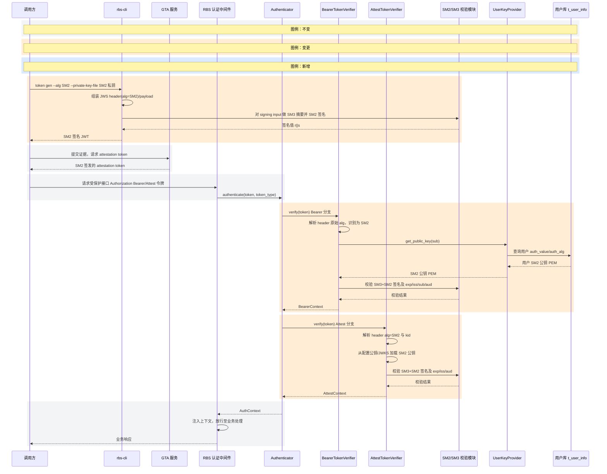
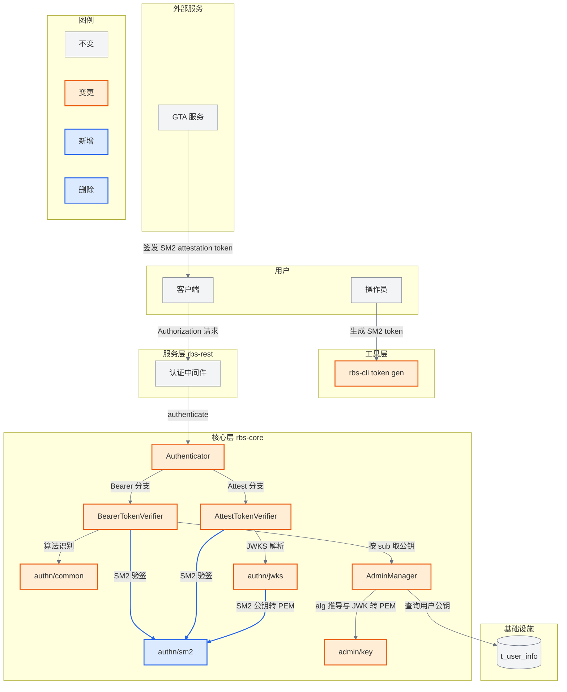

# 功能设计文档


## 文档信息


| 字段     | 内容                          | 取值规则 |

| -------- | ----------------------------- | -------- |

| 功能名称 | SM2 国密算法认证与令牌支持     | 取本次 SR 的功能名称 |

| 版本     | `1.0`                         | 首次生成填 `1.0`；每轮 gate 整改后次版本号 +1（`1.1`、`1.2`…） |

| 作者     | `sr-design skill`             | 固定值，不填人名 |

| 日期     | 2026-09-12                    | 本轮生成日期 |

| 状态     | 草稿                          | 首次生成填「草稿」；第 N 轮 gate 整改后填「整改稿（第 N 轮）」。门禁结论不写在本文档，见 `SR-design-gate.md` |


## 修订记录


| 版本     | 日期     | 作者     | 触发原因 | 变更说明 |

| -------- | -------- | -------- | -------- | -------- |

| `1.0` | 2026-09-12 | `sr-design skill` | 首次生成 | 基于 SR-1 原始需求（用户认证支持 SM2、验证 GTA 签发的 SM2 attestation token、rbs-cli 生成 SM2 token）完成初始设计 |


---


## 1. 需求背景


### 1.1 业务背景


本仓库（globaltrustauthority-rbs）是 Global Trust Authority 体系下的 RBS（Resource Broker Service），通过验证远程证明结果分发密钥、证书等资源，面向 openEuler 等国产化生态交付。当前仓库的签名/验签能力全部基于国际算法：用户认证（BearerToken/AttestToken）只接受 PS256/PS384/PS512/EdDSA，`rbs-cli` 的 `token gen` 也只支持 PS*/ES*/EdDSA。在国密合规场景下，认证链路必须支持 SM2（配套 SM3 摘要），因此本次需求要达成三项目标：


1. **用户认证支持 SM2 算法**：RBS 接受由 SM2 私钥签名的用户 JWT（BearerToken），并支持管理员登记 SM2 公钥。

2. **验证 GTA 签发的 SM2 attestation token**：RBS 能验证由 GTA 用 SM2 签名签发的 attestation token（AttestToken）。

3. **rbs-cli 生成 SM2 token**：`rbs-cli token gen` 支持使用 SM2 私钥生成 SM2 签名 JWT。


**受益方**：使用国密合规环境的 RBS 运维方与客户端；需要在同一套 RBS 中同时满足国密（SM2/SM3）与国际算法（PS*/EdDSA）要求的安全集成方。


**范围**：SM2 作为"新增可接受算法"接入既有认证与令牌生成链路，不替换、不移除任何既有算法。不在本次范围内：资源内容 JWE 加密算法（RSA-OAEP/ECDH-ES，见 `rbc`）、TLS 国密套件、SM2 密钥生成工具的完整国密化。


**前置条件**：GTA 侧能以约定的 SM2/JWS 表示法签发 attestation token，并提供对应的 SM2 验签公钥（PEM 或 JWKS）给 RBS 配置；签发方与验签方对 `alg`、JWK `crv`、签名编码、SM2 用户标识（Z 值）等约定达成一致（见第 3 章）。


### 1.2 现状约束


- 认证核心 `rbs/core/src/auth/authn` 使用 `jsonwebtoken` 做 JWT 验签，算法白名单硬编码为 `PS256/PS384/PS512/EdDSA`（`authn/common.rs`）。`jsonwebtoken` 无 SM2 算法变体，`decode_header` 对未知 `alg` 直接报错，因此 SM2 无法沿用既有解码路径，必须新增独立的"原始 alg 解析 + SM2 验签"分支。

- JWKS 解析 `authn/jwks.rs` 仅支持 `kty=RSA` 与 `kty=OKP(Ed25519)`，`kty=EC` 会被显式拒绝；GTA SM2 验签公钥若以 EC/SM2 JWK 下发需要扩展解析。

- 用户公钥登记 `admin/key.rs` 的 `validate_and_derive_alg` 支持 RSA 与 EC（仅 P-256/P-384/P-521），SM2 曲线会命中 "Unsupported EC curve"；`jwk_to_pem` 的 EC 分支同样不认 `crv=SM2`。用户库 `t_user_info.auth_value/auth_alg` 以 PEM + 算法串存储，无需结构变更，只需扩展算法取值。

- `rbs-cli`（crate `tools`）的 `token gen` 通过 `josekit`/`jsonwebtoken` 签名，二者均不支持 SM2，需要新增基于 OpenSSL 的 SM2 签名路径。

- 仓库已 vendor OpenSSL（`openssl` 0.10.79 / `openssl-sys` 0.9.115，OpenSSL 3.x），SM2/SM3 能力可用，无需新增密码库三方件——这是本次设计的强约束：**优先复用既有 OpenSSL，不引入新密码学依赖**。

- 仓库无 `software_architecture.md`，缺少显式架构文档（详见第 10 章）；本设计以代码现状为架构基线。


---


## 2. 功能设计


> 图例约定：本文件所有 Mermaid 方案图以当前代码为基线，颜色表示变化状态——不变 `fill:#f3f4f6,stroke:#6b7280`、变更 `fill:#ffedd5,stroke:#ea580c`、新增 `fill:#dbeafe,stroke:#2563eb`。业务节点与连线名称不含状态前缀。


### 2.1 主流程


本节描述 SM2 认证的端到端主成功场景：`rbs-cli` 用 SM2 生成 token → 客户端携带 token 访问受保护接口 → RBS 用 SM2/SM3 完成验签。GTA 用 SM2 签发 attestation token 作为外部输入一并纳入。





**关键步骤说明**：


- **步骤（rbs-cli 生成）**：`token gen` 读取 PEM 私钥，校验其为 SM2 曲线 EC 私钥；`alg=SM2` 时对 `base64url(header).base64url(payload)` 的 ASCII 字节做 SM3 摘要并以 SM2 私钥签名。签名值为 `r||s` 各 32 字节拼接后 base64url（JWS 约定）。该行为同步、本地执行，无外部依赖。

- **步骤（GTA 签发）**：attestation token 由 GTA 侧以 SM2 签发，作为外部输入；RBS 不参与其签名，只在下游验签。该步骤为既有 attestation 流程，本次仅约定其 SM2 表示法。

- **步骤（请求进入）**：中间件依据 `Authorization` 前缀判定 token 类型——`Bearer ` 为 BearerToken（在资源 GET 等端点与 Attest 并存），`Attest ` 为 AttestToken（仅资源 GET 类端点允许）。公开端点（`/rbs/v0/challenge`、`/rbs/v0/attest`、`/rbs/v0/{uri}/retrieve`）不鉴权。

- **步骤（Bearer 验签）**：先无签名地解析 payload 取 `sub`，再按 `sub` 从用户库取该用户的 SM2 公钥 PEM，最后用公钥验签并**重新**校验 `exp/iss/sub/aud`。公钥查找失败返回统一"invalid token"以规避用户枚举。全程同步、无网络调用；同一 token 反复校验结果一致（幂等）。

- **步骤（Attest 验签）**：从 JWT header 取 `alg`/`kid`，若配置为直接公钥则用之，否则按 `kid`（缺省取首个）从 JWKS 取公钥并转 PEM，再验签并校验 `exp/iss/aud`。同步、本地、幂等。

- **步骤（放行）**：验签成功后中间件把 `AuthContext` 注入请求扩展，业务处理器据此做授权；失败统一返回 HTTP 401（`ErrorBody.error`）。


**设计意图**：三条目标共享同一条"验签"主干，因此把 SM2 收敛为一个独立的 SM2/SM3 校验模块，Bearer 与 Attest 两条验签路径复用同一模块，避免重复实现密码学逻辑。SM2 不能复用 `jsonwebtoken` 解码路径（未知 alg 直接失败），故在进入既有解码前先做"原始 alg 预解析"，命中 SM2 即切换分支，未命中则保持既有路径——这样对既有算法零改动、零回归风险。主流程选择同步本地验签而非引入外部验证服务，是因为认证在每次请求的热路径上，且公钥来源（用户库/配置文件）已可信，无需外部往返。


### 2.2 功能定位


本次改动落在三处：**工具层** `rbs-cli` 的 token 生成、**服务层** `rbs-rest` 认证中间件（仅复用）、**核心层** `rbs-core` 的认证与用户公钥登记。下图只画与 SM2 变化相关的层级、模块及其调用关系。





**文字说明**：


- **层级划分**：沿用仓库现有三层——工具层（`tools` / rbs-cli）、服务层（`rbs-rest`）、核心层（`rbs-core`）。SM2 是"算法能力"，落在核心层的认证子模块；工具层仅新增签名分支。

- **调用关系**：中间件 → Authenticator（按 token 类型分派）→ 两个 Verifier；两个 Verifier 与 JWKS 解析都汇聚到新增的 `authn/sm2` 模块完成 SM2/SM3 运算；Bearer 经 `UserKeyProvider`（由 `AdminManager` 实现）从用户库取公钥；管理员登记公钥时经 `admin/key` 完成 alg 推导与 JWK→PEM。

- **数据流向**：公钥自 DB/配置文件流入验签模块；令牌自调用方流入 RBS；GTA 仅作为 attestation token 的签发方（外部），不参与验签。


**设计意图**：不新增层级、不新增服务，SM2 作为"新增算法分支"嵌入既有认证模块，最大化复用现有分层与 provider 模式（`TokenVerifier`/`UserKeyProvider` trait）——这是仓库既有扩展方式（`AttestationProvider` 亦为 trait + 多实现）。AuthToken 与 BearerToken 共享 `authn/sm2`，保证 GTA attestation 验签与用户认证的 SM2 语义完全一致。


### 2.3 数据设计


#### 2.3.1 数据模型


本次不新增数据库表，也无 DDL 变更；仅扩展既有用户表 `t_user_info` 的 `auth_alg` 取值语义。


| 表名           | 用途            | 关键字段                   | 变更类型     |

| :------------- | :-------------- | :------------------------- | :----------- |

| `t_user_info` | 存储 RBS 用户账号及其认证公钥 | `username`(PK)、`auth_value`(SM2 公钥 PEM)、`auth_alg`(算法串，新增取值 `SM2`)、`auth_type`(固定 `jwt`)、`role`、`status` | 修改（仅算法取值扩展，无结构与 DDL 变更） |


设计意图：BearerToken 的密钥模型是"每用户一个公钥"，`auth_value` 已为 PEM 文本、`auth_alg` 已为算法串，天然可承载 SM2，无需新增列或新表。选择扩展既有表而非新增 SM2 专表，避免把"算法"这一维度外溢成独立的键空间，保持"一个用户一份认证材料"的既有语义（与 `admin/key.rs` 的 `validate_and_derive_alg` 推导模式一致）。


#### 2.3.2 存储策略


- **持久化方式**：复用 sea-orm 用户表持久化；SM2 公钥以 PEM（SPKI）字符串存 `auth_value`，算法标识 `SM2` 存 `auth_alg`。JWKS/公钥文件为只读配置资料，不落库。

- **保留/清理**：无新增数据，沿用既有用户生命周期（创建/更新/删除）。

- **数据量预估**：单条 SM2 公钥 PEM 约 100–130 字节（SM2 256 位曲线），较 RSA-4096（约 800 字节）更小，用户表体积不增反可能下降。


---


## 3. 外部依赖


| 依赖名称 | 提供方 | 用途 | 接口/资源标识 | 变更类型 | 权威规范及版本 |

| :------- | :----- | :--- | :------------ | :------- | :------------- |

| GTA REST API | GTA 服务 | 取 nonce、提交证据换取 attestation token | `GET /challenge`、`POST /attest` | 复用 | 由 GTA 服务定义；本仓库适配点见 `rbs/core/src/attestation/gta/rest.rs` |

| GTA 验签公钥资料 | GTA 侧签发方 | 为 RBS 验签 SM2 attestation token 提供公钥 | 公钥 PEM 文件（`auth.attest_token.public_key_path`）或 JWKS 文件（`auth.attest_token.jwks_file`） | 修改（JWKS 新增 EC/SM2 支持） | RFC 7517 (JWK)、RFC 7515 (JWS)、GM/T 0003.2（SM2 签名）、GM/T 0004（SM3）；本仓库解析见 `rbs/core/src/auth/authn/jwks.rs` |


### 3.1 GTA REST API — 挑战与证明


#### 3.1.1 基本契约


| 属性 | 内容 |

| :--- | :--- |

| 交互类型 | HTTP |

| 调用方 → 提供方 | RBS（`AttestationRestClient`）→ GTA 服务 |

| 接口标识 | `GET /challenge`；`POST /attest` |

| 协议专属属性 | GET/POST，JSON；自定义头 `User-Id`、`API-Key`；TLS 由 `tls_verify`/`ca_file` 控制 |

| 契约版本 | 与 GTA 服务版本对应（由 GTA 返回的 `service_version` 标识） |

| 变更类型 | 复用（本次不改动请求/响应结构） |

| 权威规范 | GTA 服务接口；本仓库适配点 `rbs/core/src/attestation/gta/rest.rs` |


#### 3.1.2 请求/输入契约


| 字段路径 | 位置 | 类型 | 必填 | 可空 | 默认值 | 枚举/格式/长度/范围约束 | 业务语义 | 敏感级别 | 示例 |

| :------- | :--- | :--- | :--- | :--- | :----- | :--------------------- | :------- | :--------- | :--- |

| `User-Id` | header | string | 是 | 否 | 无 | 非空 | 调用方用户标识 | 内部 | `rbs-agent` |

| `API-Key` | header | string | 否 | 否 | 无 | 非空时携带 | 调用凭据 | 高度敏感 | `***` |

| `measurements[].node_id` | body | string | 否 | 否 | `""` | — | 测量节点标识 | 内部 | `node-1` |

| `measurements[].nonce` | body | string | 是 | 否 | 无 | 非空 | 挑战随机数 | 内部 | `abc123` |

| `measurements[].nonce_type` | body | string | 否 | 是 | 无 | 由 GTA 定义 | 随机数类型 | 内部 | `verifier` |

| `measurements[].token_fmt` | body | string | 否 | 是 | 无 | 由 GTA 定义 | token 格式 | 内部 | `eat` |

| `measurements[].attester_data` | body | object | 否 | 是 | 无 | 任意 JSON | 证明附加数据 | 内部 | `{"runtime_data":{...}}` |

| `measurements[].evidences[].attester_type` | body | string | 是 | 否 | 无 | 非空 | 证据类型 | 内部 | `tpm_boot` |

| `measurements[].evidences[].evidence` | body | object | 是 | 否 | 无 | 非空 | 证据内容 | 内部 | `{"quote":"..."}` |

| `measurements[].evidences[].policy_ids` | body | string[] | 否 | 是 | 无 | — | 关联策略 | 内部 | `["policy-1"]` |


#### 3.1.3 响应/输出契约


| 字段路径 | 状态/结果 | 类型 | 必返 | 可空 | 默认值 | 枚举/格式/长度/范围约束 | 业务语义 | 敏感级别 | 示例 |

| :------- | :-------- | :--- | :--- | :--- | :----- | :--------------------- | :------- | :--------- | :--- |

| `nonce` | 200 | string | 是 | 否 | 无 | 非空 | 挑战随机数 | 内部 | `abc123` |

| `service_version` | 200 | string | 是 | 否 | 无 | 非空 | 服务版本 | 公开 | `1.0.0` |

| `tokens[].node_id` | 200 | string | 是 | 否 | 无 | 非空 | 节点标识 | 内部 | `node-1` |

| `tokens[].token` | 200 | string | 是 | 否 | 无 | JWS 紧凑序列化；**本次约定 alg 可为 `SM2`** | attestation token（JWT，SM2 签发） | 敏感 | `eyJ...` |


#### 3.1.4 错误契约


| 错误码/状态 | 触发条件 | 错误响应字段与语义 | 调用方处理 | 可重试 | 幂等影响 | 部分成功/副作用 |

| :---------- | :------- | :----------------- | :--------- | :----- | :------- | :-------------- |

| 4xx | 请求参数非法 | `{"message":"..."}` | 映射为 `RbsError::InvalidParameter`，透传 400 | 否 | 无 | 无 |

| 5xx | GTA 服务端错误 | `{"message":"..."}` 或 `HTTP <status>` | 在 `retries` 次数内重试（间隔 5s），超限映射 `AttestationProviderUnavailable` | 是（受 `retries` 约束） | 无（attest 无副作用） | 无 |

| 网络/超时 | 连接失败或超时 | 无响应体 | 超时映射 `ProviderTimeout`，网络错误映射 `AttestationProviderUnavailable` | 是（受 `retries` 约束） | 无 | 无 |

| 响应解析失败 | 响应体非预期 JSON | 无 | 映射 `InternalUnexpected` | 否 | 无 | 无 |


#### 3.1.5 接口非功能约束


| 认证与鉴权 | 幂等与去重 | 超时 | 重试 | 限流与配额 | SLA（服务等级协议） | 熔断与降级 | 兼容性策略 |

| :--------- | :--------- | :--- | :--- | :--------- | :------------------ | :--------- | :--------- |

| 自定义头 `User-Id` + 可选 `API-Key`；TLS 校验可配 | 不适用：attest 为只读计算，无去重语义 | `timeout_secs`（配置） | `retries` 次，仅对 5xx/超时 | 由 GTA 侧约束 | 由 GTA 服务承诺 | 超时/不可用即失败，无本地降级 | 复用既有契约，本次不变 |


#### 3.1.6 变更差异


不适用：本次不改动 GTA REST 请求/响应结构（依据：`rbs/core/src/attestation/gta/rest.rs` 现状，SR 仅涉及对返回值 token 的验签）。


#### 3.1.7 完整示例


不适用：字段表示例已完整表达契约。


设计意图：GTA REST 是既有 attestation 依赖，本次不改造它；把 GTA 依赖列入本章是为了明确"SM2 attestation token 由 GTA 签发、RBS 只做验签"的边界，避免误以为 RBS 参与签发。


### 3.2 GTA 验签公钥资料 — attestation token 公钥


#### 3.2.1 基本契约


| 属性 | 内容 |

| :--- | :--- |

| 交互类型 | 文件交换（本地只读文件） |

| 调用方 → 提供方 | RBS（`AttestTokenVerifier`）← GTA 侧签发方提供 |

| 接口标识 | `auth.attest_token.public_key_path`（PEM 公钥文件）或 `auth.attest_token.jwks_file`（JWKS 文件） |

| 协议专属属性 | PEM（SPKI）或 JSON；UTF-8；由运维侧落盘至 RBS 可读路径 |

| 契约版本 | JWK 遵循 RFC 7517；SM2 表示法为本次约定（见 3.2.2） |

| 变更类型 | 修改（JWKS 解析新增 `kty=EC, crv=SM2`） |

| 权威规范 | RFC 7517（JWK）、RFC 7515（JWS）、GM/T 0003.2、GM/T 0004；解析现状 `rbs/core/src/auth/authn/jwks.rs` |


#### 3.2.2 请求/输入契约（公钥资料字段）


| 字段路径 | 位置 | 类型 | 必填 | 可空 | 默认值 | 枚举/格式/长度/范围约束 | 业务语义 | 敏感级别 | 示例 |

| :------- | :--- | :--- | :--- | :--- | :----- | :--------------------- | :------- | :--------- | :--- |

| （PEM 文件） | 文件 | string | 是 | 否 | 无 | X.509 SPKI；SM2 曲线 OID `1.2.156.10197.1.301` | SM2 验签公钥 | 公开 | `-----BEGIN PUBLIC KEY-----...` |

| `keys[].kty` | file(body) | string | 是 | 否 | 无 | `RSA`/`OKP`/`EC`（新增 `EC`） | 密钥类型 | 公开 | `EC` |

| `keys[].crv` | file(body) | string | 条件 | 否 | 无 | `Ed25519`、**`SM2`（新增）**；其他 EC 曲线不支持 | 曲线 | 公开 | `SM2` |

| `keys[].kid` | file(body) | string | 否 | 否 | 无 | 非空 | 密钥标识，用于按 `kid` 选键 | 公开 | `gta-sm2-1` |

| `keys[].x` | file(body) | string | 条件 | 否 | 无 | base64url 无填充；SM2 为 32 字节 | 公钥 X 坐标 | 公开 | `AbC...` |

| `keys[].y` | file(body) | string | 条件 | 否 | 无 | base64url 无填充；SM2 为 32 字节 | 公钥 Y 坐标 | 公开 | `dEf...` |

| `keys[].alg` | file(body) | string | 否 | 否 | 无 | 建议 `SM2` | 建议算法 | 公开 | `SM2` |


> 说明：`kty=EC`/`crv=SM2` 的 `x`/`y` 为坐标，不含私钥；`kty=OKP` 仅 `x`。RSA/OKP 字段语义不变。


#### 3.2.3 响应/输出契约


不适用：该依赖为只读输入资料，无响应输出。


#### 3.2.4 错误契约


| 错误码/状态 | 触发条件 | 错误响应字段与语义 | 调用方处理 | 可重试 | 幂等影响 | 部分成功/副作用 |

| :---------- | :------- | :----------------- | :--------- | :----- | :------- | :-------------- |

| 配置构造失败（启动期） | 文件缺失/不可读，或 JWKS 无法解析 | `AuthError::TokenInvalid{reason}` | 启动失败并记录原因；需运维修正文件 | 否 | 无 | 无 |

| 验签期选键失败 | `kid` 在 JWKS 中不存在，或 `crv` 非 `SM2`/`Ed25519` | 401 `invalid token` | 调用方更换令牌/联系运维 | 否 | 无 | 无 |


#### 3.2.5 接口非功能约束


| 认证与鉴权 | 幂等与去重 | 超时 | 重试 | 限流与配额 | SLA（服务等级协议） | 熔断与降级 | 兼容性策略 |

| :--------- | :--------- | :--- | :--- | :--------- | :------------------ | :--------- | :--------- |

| 不适用：本地只读配置，非网络接口 | 只读，天然幂等 | 不适用：本地文件读取 | 不适用 | 不适用 | 不适用 | 不适用 | 新增 `crv=SM2` 为向后兼容的取值扩展 |


#### 3.2.6 变更差异


| 变更对象 | 变更前 | 变更后 | 兼容性影响 | 调用方适配 |

| :------- | :----- | :----- | :--------- | :--------- |

| JWKS `kty=EC` | 一律拒绝（`unsupported key type: EC`） | `crv=SM2` 接受并转 PEM；其他曲线仍拒绝 | 兼容（仅放宽 SM2） | GTA 下发含 `kty=EC,crv=SM2` 的 JWKS；旧数据不受影响 |

| JWKS `crv` 取值 | 仅 `Ed25519` | 增加 `SM2` | 兼容 | 无 |


#### 3.2.7 完整示例


```json

{

  "keys": [

    {

      "kty": "EC",

      "kid": "gta-sm2-1",

      "crv": "SM2",

      "alg": "SM2",

      "x": "MKBCTNIcKUSDii11ySs3526iDZ8AiTo7Tu6KPAqv7D4",

      "y": "4Etl6SRW2YiLUrN5vfvVHuhp7x8PxltmWWlbbM4IFyM"

    }

  ]

}

```


设计意图：GTA SM2 验签公钥以"可信文件"形式交付，与既有 `public_key_path`/`jwks_file` 配置完全兼容，无需新增配置项或引入 KMS/JWKS 网络拉取；选择同时支持 PEM 与 JWKS 两条既有路径，是因为 GTA 可能以单钥（PEM）或多钥轮换（JWKS，按 `kid` 选键）两种方式下发。


---


## 4. 对外接口


本功能不新增 HTTP 路由；对外接口变化体现为"认证契约扩展"（接受的算法新增 SM2）、"用户公钥登记契约扩展"（接受 SM2 公钥）与"CLI 命令扩展"（rbs-cli 生成 SM2 token）。


| 接口名称 | 用途 | 交互类型 | 接口标识 | 变更类型 | 契约版本 |

| :------- | :--- | :------- | :------- | :------- | :------- |

| 受保护 REST 端点 SM2 认证 | 外部调用方以 SM2 令牌访问受保护接口 | HTTP | `Authorization: Bearer/Attest <JWT>`（作用于 `/rbs/v0/**` 受保护端点） | 修改 | v0 |

| 用户管理 SM2 公钥登记 | 管理员为用户登记 SM2 公钥 | HTTP | `POST /rbs/v0/users`、`PUT /rbs/v0/users/{username}` | 修改 | v0 |

| rbs-cli 生成 SM2 token | 运维/管理员本地生成 SM2 签名 JWT | 命令行（文件交换） | `rbs-cli token gen --alg SM2` | 修改 | 0.1.0（workspace） |


### 4.1 受保护 REST 端点 SM2 认证


#### 4.1.1 基本契约


| 属性 | 内容 |

| :--- | :--- |

| 调用方 → 提供方 | 外部调用方（含 `rbc`/`rbs-cli client`）→ RBS 认证中间件 |

| 交互类型 | HTTP |

| 接口标识 | `Authorization` 请求头；`Bearer <JWT>`（BearerToken）、`Attest <JWT>`（AttestToken） |

| 协议专属属性 | JWT 紧凑序列化；Bearer 适用于受保护端点，Attest 仅适用于资源 GET 类端点；公开端点不鉴权 |

| 契约版本 | v0 |

| 变更类型 | 修改（`alg` 可接受集合新增 `SM2`；令牌为不透明串，端点签名不变） |


#### 4.1.2 请求/输入契约


| 字段路径 | 位置 | 类型 | 必填 | 可空 | 默认值 | 枚举/格式/长度/范围约束 | 业务语义 | 敏感级别 | 示例 |

| :------- | :--- | :--- | :--- | :--- | :----- | :--------------------- | :------- | :--------- | :--- |

| `Authorization` | header | string | 是 | 否 | 无 | `^(Bearer|Attest) <JWT>$` | 认证令牌 | 高度敏感 | `Bearer eyJ...` |

| （JWT）`header.alg` | token | string | 是 | 否 | 无 | `PS256`/`PS384`/`PS512`/`EdDSA`/**`SM2`** | 签名算法 | 公开 | `SM2` |

| （JWT）`header.typ` | token | string | 否 | 否 | 无 | `JWT` | 类型 | 公开 | `JWT` |

| （JWT）`header.kid` | token | string | 否 | 否 | 无 | 非空 | 选键标识（Attest 从 JWKS 选键） | 公开 | `gta-sm2-1` |

| （JWT）`iss` | claim | string | 是 | 否 | 无 | 与配置 `issuer` 一致 | 签发者 | 公开 | `Global Trust Authority` |

| （JWT）`sub` | claim | string | Bearer 必 | 否 | 无 | 非空；需存在于用户库 | 用户标识（`UserKeyProvider` 键） | 内部 | `alice` |

| （JWT）`aud` | claim | string | 否 | 否 | 无 | 与配置一致（配置存在时） | 受众 | 公开 | `rbs` |

| （JWT）`exp` | claim | number | 是 | 否 | 无 | Unix 秒；不得过期 | 过期时间 | 公开 | `9999999999` |

| （JWT）`role` | claim | string | 否 | 否 | `""` | — | 业务角色 | 内部 | `admin` |


#### 4.1.3 响应/输出契约


| 字段路径 | 状态/结果 | 类型 | 必返 | 可空 | 默认值 | 枚举/格式/长度/范围约束 | 业务语义 | 敏感级别 | 示例 |

| :------- | :-------- | :--- | :--- | :--- | :----- | :--------------------- | :------- | :--------- | :--- |

| （业务响应体） | 200 | object | 是 | 否 | 无 | 由各端点定义 | 认证通过后的业务结果 | 视端点 | — |

| `error` | 401/500 | string | 是 | 否 | 无 | 非空 | 失败原因 | 公开 | `invalid token` |


#### 4.1.4 错误契约


| 错误码/状态 | 触发条件 | 错误响应字段与语义 | 调用方处理 | 可重试 | 幂等影响 | 部分成功/副作用 |

| :---------- | :------- | :----------------- | :--------- | :----- | :------- | :-------------- |

| 401 | 缺少/格式错误的 `Authorization` | `{"error":"Unauthorized"}` | 补充正确令牌 | 否 | 无 | 无 |

| 401 | `alg` 不在白名单（含非 SM2 未知算法） | `{"error":"unsupported algorithm: ..."}` | 使用受支持算法 | 否 | 无 | 无 |

| 401 | 签名校验失败 / 公钥不匹配（算法-密钥不一致） | `{"error":"invalid token"}` | 检查密钥与算法 | 否 | 无 | 无 |

| 401 | `exp/nbf/iss/aud` 校验失败 | `{"error":"invalid token"}` / 过期语义 | 重新签发 | 否 | 无 | 无 |

| 401 | Bearer 的 `sub` 在用户库无公钥 | `{"error":"invalid token"}`（掩盖用户枚举） | 登记公钥或更换令牌 | 否 | 无 | 无 |

| 401 | Attest 令牌被用于非资源 GET 端点 | `{"error":"AttestToken not allowed for this endpoint"}` | 改用合适 token 类型 | 否 | 无 | 无 |

| 500 | 认证器未装配 | `{"error":"Internal server error"}` | 联系运维 | 是（服务端修复后） | 无 | 无 |


#### 4.1.5 接口非功能约束


| 认证与鉴权 | 幂等与去重 | 超时 | 重试 | 限流与配额 | SLA（服务等级协议）与性能承诺 | 熔断与降级 | 版本与兼容性 |

| :--------- | :--------- | :--- | :--- | :--------- | :---------------------------- | :--------- | :----------- |

| 接口本身即认证入口；认证在业务前完成 | 纯校验、无副作用，天然幂等 | 本地验签，无网络超时 | 不适用（401 不自动重试） | 复用 `rest.rate_limit`（`per-ip-rate-limit`） | SM2 验签 P99 < 10ms（见 6.1） | 不适用：本地运算，无外部依赖可熔断 | 向后兼容：既有算法与端点不变，仅放宽 `alg` 集合 |


#### 4.1.6 变更差异


| 变更对象 | 变更前 | 变更后 | 兼容性影响 | 调用方适配 |

| :------- | :----- | :----- | :--------- | :--------- |

| 可接受 `alg` | `PS256/PS384/PS512/EdDSA` | 增加 `SM2` | 条件兼容 | 使用 SM2 令牌的调用方需 RBS ≥ 本版本；其余调用方无需改动 |

| 令牌签名算法 | 仅国际算法 | 增加 SM2（SM3 摘要） | 条件兼容 | 同上 |


#### 4.1.7 完整示例


不适用：字段表示例已完整表达契约（令牌为不透明串，认证结果为标准 HTTP 状态）。


设计意图：SM2 通过既有 `Authorization` 头接入，不新增端点、不改变调用方式，把"国密化"对集成方的影响降到最低——调用方只需把令牌签名算法换成 SM2，无需改动 URL/方法/参数。


### 4.2 用户管理 SM2 公钥登记


#### 4.2.1 基本契约


| 属性 | 内容 |

| :--- | :--- |

| 调用方 → 提供方 | 管理员（经 `rbs-cli user` 或直接调用）→ RBS `AdminManager` |

| 交互类型 | HTTP |

| 接口标识 | `POST /rbs/v0/users`；`PUT /rbs/v0/users/{username}` |

| 协议专属属性 | 200/201/400/401/403/409；JSON body；仅 BearerToken 鉴权 |

| 契约版本 | v0 |

| 变更类型 | 修改（`public_key`/`jwk` 接受 SM2 公钥材料） |


#### 4.2.2 请求/输入契约


| 字段路径 | 位置 | 类型 | 必填 | 可空 | 默认值 | 枚举/格式/长度/范围约束 | 业务语义 | 敏感级别 | 示例 |

| :------- | :--- | :--- | :--- | :--- | :----- | :--------------------- | :------- | :--------- | :--- |

| `username` | body | string | 是 | 否 | 无 | 唯一 | 用户名 | 内部 | `alice` |

| `public_key` | body | string | 条件 | 否 | 无 | PEM（SPKI）；**支持 SM2 曲线**；≤10KB | SM2 公钥 | 公开 | `-----BEGIN PUBLIC KEY-----...` |

| `jwk` | body | object | 条件 | 否 | 无 | `kty=EC`、**`crv=SM2`**、`x`/`y` base64url 32B | SM2 公钥（JWK） | 公开 | `{"kty":"EC","crv":"SM2","x":"...","y":"..."}` |

| `role` | body | string | 否 | 否 | `user` | `admin`/`user` | 角色 | 内部 | `user` |

| `enabled` | body | boolean | 否 | 否 | `true` | — | 启用状态 | 内部 | `true` |

| `auth_type` | body | string | 是 | 否 | 无 | `jwt` | 认证类型 | 内部 | `jwt` |


> `public_key` 与 `jwk` 互斥且至少一个（既有约束，见 `rbs/api-types/src/user.rs`）。


#### 4.2.3 响应/输出契约


| 字段路径 | 状态/结果 | 类型 | 必返 | 可空 | 默认值 | 枚举/格式/长度/范围约束 | 业务语义 | 敏感级别 | 示例 |

| :------- | :-------- | :--- | :--- | :--- | :----- | :--------------------- | :------- | :--------- | :--- |

| `id` | 200/201 | string | 是 | 否 | 无 | UUID | 内部用户 id | 内部 | `3f2a...` |

| `username` | 200/201 | string | 是 | 否 | 无 | — | 用户名 | 内部 | `alice` |

| `role` | 200/201 | string | 是 | 否 | 无 | `admin`/`user` | 角色 | 内部 | `user` |

| `enabled` | 200/201 | boolean | 是 | 否 | 无 | — | 状态 | 内部 | `true` |

| `created_at`/`updated_at` | 200/201 | string | 是 | 否 | 无 | UTC 时间 | 时间戳 | 内部 | `2026-09-12T10:00:00Z` |


> 说明：响应不返回 `auth_alg`；SM2 由 `public_key`/`jwk` 推导后落库，不回显。


#### 4.2.4 错误契约


| 错误码/状态 | 触发条件 | 错误响应字段与语义 | 调用方处理 | 可重试 | 幂等影响 | 部分成功/副作用 |

| :---------- | :------- | :----------------- | :--------- | :----- | :------- | :-------------- |

| 400 | `public_key`/`jwk` 非法（含不支持的曲线） | `invalid parameter: Unsupported...` | 修正公钥材料 | 否 | 无 | 无 |

| 400 | 同时提供 `public_key` 与 `jwk` | `public_key and jwk are mutually exclusive` | 只提供其一 | 否 | 无 | 无 |

| 403 | 非管理员且越权 | 权限错误 | 使用管理员令牌 | 否 | 无 | 无 |

| 409 | `username` 重复 | 冲突 | 更换用户名 | 否 | 无 | 无 |

| 400 | 超过 `max_users` | 权限/限额错误 | 调整配额 | 否 | 无 | 无 |


#### 4.2.5 接口非功能约束


| 认证与鉴权 | 幂等与去重 | 超时 | 重试 | 限流与配额 | SLA（服务等级协议）与性能承诺 | 熔断与降级 | 版本与兼容性 |

| :--------- | :--------- | :--- | :--- | :--------- | :---------------------------- | :--------- | :----------- |

| 仅 BearerToken + 管理员角色（`AdminOnly`/`UserScoped`） | `POST` 非幂等（重复即 409）；`PUT` 幂等 | 复用 DB 超时配置 | 不适用 | 复用 `rest.rate_limit` | 受 DB 事务与 `max_users` 约束 | 不适用 | 兼容：新增 SM2 公钥取值，既有 RSA/EC 登记不变 |


#### 4.2.6 变更差异


| 变更对象 | 变更前 | 变更后 | 兼容性影响 | 调用方适配 |

| :------- | :----- | :----- | :--------- | :--------- |

| `public_key`（PEM） | 仅 RSA / EC(P-256/P-384/P-521) | 增加 SM2 曲线（alg 推导为 `SM2`） | 兼容 | 可选：登记 SM2 公钥 |

| `jwk.crv` | `P-256`/`P-384`/`P-521`（`kty=EC`） | 增加 `SM2` | 兼容 | 可选：以 JWK 登记 SM2 公钥 |


#### 4.2.7 完整示例


```json

{

  "username": "alice",

  "role": "user",

  "enabled": true,

  "auth_type": "jwt",

  "jwk": {

    "kty": "EC",

    "crv": "SM2",

    "x": "MKBCTNIcKUSDii11ySs3526iDZ8AiTo7Tu6KPAqv7D4",

    "y": "4Etl6SRW2YiLUrN5vfvVHuhp7x8PxltmWWlbbM4IFyM"

  }

}

```


设计意图：用户登记是"用户认证支持 SM2"的必要前置——没有可登记的 SM2 公钥，BearerToken 的 SM2 验签就无键可用。选择扩展现有 `public_key`/`jwk` 字段而非新增字段，是因为二者已语义化承载"用户认证公钥"，SM2 只是多一种曲线取值。


### 4.3 rbs-cli 生成 SM2 token


#### 4.3.1 基本契约


| 属性 | 内容 |

| :--- | :--- |

| 调用方 → 提供方 | 运维/管理员 → `rbs-cli`（本地进程） |

| 交互类型 | 命令行（本地文件交换） |

| 接口标识 | `rbs-cli token gen --alg SM2 --private-key-file <path>` |

| 协议专属属性 | CLI 参数；输出为格式化文本/JSON 的 JWT |

| 契约版本 | 0.1.0（workspace 版本） |

| 变更类型 | 修改（`--alg` 取值新增 `SM2`） |


#### 4.3.2 请求/输入契约


| 字段路径 | 位置 | 类型 | 必填 | 可空 | 默认值 | 枚举/格式/长度/范围约束 | 业务语义 | 敏感级别 | 示例 |

| :------- | :--- | :--- | :--- | :--- | :----- | :--------------------- | :------- | :--------- | :--- |

| `--alg` | option | string | 否 | 否 | 由私钥推断（RSA→PS256、EC SM2→SM2、Ed25519→EdDSA） | `PS256`/`PS384`/`PS512`/`ES256`/`ES384`/`ES512`/`EdDSA`/**`SM2`** | 签名算法 | 公开 | `SM2` |

| `--private-key-file` | option | string | 是 | 否 | 无 | 可读文件；`alg=SM2` 时为 SM2 曲线 EC 私钥 PEM | SM2 私钥 | 高度敏感 | `/etc/rbs/sm2-key.pem` |
| `--export-private-key` | option | string | 否 | 是 | 无 | 目标路径，可写；导出当前 SM2 私钥为 PEM | 导出的 SM2 私钥 | 高度敏感 | `/tmp/exported-sm2.pem` |

| `--private-key-passphrase` | option | string | 否 | 是 | 无 | `@path` 或交互输入 | 私钥口令 | 高度敏感 | `@/etc/rbs/pw` |

| `--iss` | option | string | 否 | 否 | `rbs-cli` | ≤128 | 签发者 | 公开 | `rbs-cli` |

| `--sub` | option | string | 否 | 否 | `administrator` | ≤64 | 用户标识 | 内部 | `alice` |

| `--aud` | option | string[] | 否 | 否 | `globaltrustauthority-rbs` | ≤128，≤16 项 | 受众 | 公开 | `rbs` |

| `--role` | option | string | 否 | 否 | 无 | ≤64 | 角色 | 内部 | `admin` |

| `--exp` | option | number | 否 | 否 | now+3600s | Unix 秒 | 过期 | 公开 | `9999999999` |

| `--kid` | option | string | 否 | 否 | 无 | ≤128 | 选键标识 | 公开 | `sm2-1` |

| `--claims` | option | string | 否 | 否 | 无 | JSON 或 `@path`；≤64KB | 自定义 claim | 视内容 | `{"k":"v"}` |


#### 4.3.3 响应/输出契约


| 字段路径 | 状态/结果 | 类型 | 必返 | 可空 | 默认值 | 枚举/格式/长度/范围约束 | 业务语义 | 敏感级别 | 示例 |

| :------- | :-------- | :--- | :--- | :--- | :----- | :--------------------- | :------- | :--------- | :--- |

| `token` | 成功 | string | 是 | 否 | 无 | 紧凑 JWS；`header.alg=SM2` | SM2 签名 JWT | 高度敏感 | `eyJ...` |

| 退出码 | 0/非0 | int | 是 | 否 | 无 | 0 成功、非 0 失败 | 命令结果 | 公开 | `0` |


#### 4.3.4 错误契约


| 错误码/状态 | 触发条件 | 错误响应字段与语义 | 调用方处理 | 可重试 | 幂等影响 | 部分成功/副作用 |

| :---------- | :------- | :----------------- | :--------- | :----- | :------- | :-------------- |

| 非 0（InvalidArgument） | `--alg SM2` 但私钥非 SM2 曲线 | `private key type does not match alg 'SM2'` | 更换私钥或算法 | 否 | 无 | 无（不产出令牌） |

| 非 0（FileReadError） | 私钥文件不可读 | `unable to read private key file ...` | 修正路径/权限 | 否 | 无 | 无 |

| 非 0（InvalidArgument） | 口令缺失/错误 | `unable to read the encrypted private key ...` | 提供正确口令 | 否 | 无 | 无 |

| 非 0（InvalidArgument） | 自定义 claim 与内置 claim 冲突 | `claim '<x>' conflicts with a built-in JWT claim` | 修改 claim | 否 | 无 | 无 |


#### 4.3.5 接口非功能约束


| 认证与鉴权 | 幂等与去重 | 超时 | 重试 | 限流与配额 | SLA（服务等级协议）与性能承诺 | 熔断与降级 | 版本与兼容性 |

| :--------- | :--------- | :--- | :--- | :--------- | :---------------------------- | :--------- | :----------- |

| 不适用：本地 CLI，权限由文件系统与调用者身份保证 | 相同输入产出令牌 payload 相同（签名确定），但含时间 claim 时每次可能不同；无去重语义 | 不适用：本地运算 | 不适用 | 不适用 | 单次生成 < 100ms（见 6.1） | 不适用 | 兼容：`--alg` 默认仍由私钥推断，既有用法不变 |


#### 4.3.6 变更差异


| 变更对象 | 变更前 | 变更后 | 兼容性影响 | 调用方适配 |

| :------- | :----- | :----- | :--------- | :--------- |

| `--alg` 枚举 | `PS256/PS384/PS512/ES256/ES384/ES512/EdDSA` | 增加 `SM2` | 兼容 | 可选：`--alg SM2` |

| 支持私钥类型 | RSA / EC(P-256/384/521) / Ed25519/Ed448 | 增加 EC(SM2) | 兼容 | 提供 SM2 私钥 |

| 默认算法推断 | 未覆盖 SM2 | SM2 私钥 → `SM2` | 兼容 | 无 |


#### 4.3.7 完整示例


```text

rbs-cli token gen \

  --private-key-file /etc/rbs/sm2-key.pem \

  --alg SM2 \

  --sub alice \

  --role user \

  --exp 9999999999 \

  --kid sm2-1

=> {"token":"eyJhbGciOiJTTTIiLCJ0eXAiOiJKV1QiLCJraWQiOiJzbTItMSJ9...."}

```


设计意图：`token gen` 是管理员/调用方取得可用令牌的唯一本地入口，SM2 必须在此闭环，否则第 4.1 的 SM2 认证无令牌可验。选择在既有 `--alg` 上增加枚举值（而非新命令），保持 CLI 契约稳定、帮助文档与测试可增量演进。


---


## 5. DFX 设计


### 5.1 异常场景、冲突场景、兼容场景


| 场景分类 | 场景名称 | 触发条件 | 系统表现（功能视角+模块视角） | 处理/恢复方式 |

| :------- | :------- | :------- | :---------------------------- | :------------ |

| 异常 | 签名算法与公钥类型不匹配 | 令牌 `alg=SM2` 但用户库/配置公钥为 RSA 或非 SM2 | 认证模块在选键/验签阶段失败，接口返回 401 `invalid token` | 使用与算法匹配的公钥；防 alg 混淆：算法决定所需密钥类型 |

| 异常 | SM2 签名校验失败 | 令牌被篡改或非对应私钥签发 | `authn/sm2` 验签返回失败，401 | 重新签发令牌 |

| 异常 | claims 非法 | `exp` 过期、`iss` 与配置不符、`aud` 不符、Bearer 缺 `sub` | 验签后 claims 校验失败，401 | 重新签发；检查配置 issuer/audience |

| 异常 | JWKS 无匹配密钥 | `kid` 在 JWKS 中不存在；或 JWKS 为空 | `AttestTokenVerifier` 选键失败，401 | 下发含正确 `kid` 的 JWKS |

| 异常 | 未知/不支持算法 | `alg` 不在白名单（如 `RS256`、`HS256`、`alg=none`） | 预解析阶段即拒绝（jsonwebtoken 解码失败或白名单不通过），401 `unsupported algorithm` | 使用受支持算法；严禁 `none` |

| 冲突 | 用户公钥被替换 | 管理员更新用户公钥后，旧公钥签发的令牌仍在使用 | 旧令牌验签失败（公钥已变），401 | 用新私钥重新签发；下次登录/换 token 恢复 |

| 冲突 | 同一用户多算法并存诉求 | 同一用户既有 PS256 令牌又有 SM2 令牌 | 每用户仅一份 `auth_value`/`auth_alg`，无法同时登记两把钥 | 择一登记；如需多钥并存需另立需求（本次不支持） |

| 兼容 | 既有国际算法令牌 | 客户端继续使用 PS*/EdDSA 令牌 | 走既有 `jsonwebtoken` 路径，行为完全不变 | 无需动作 |

| 兼容 | GTA 尚未支持 SM2 | GTA 仍签发非 SM2 令牌，或未按约定表示法 | 按令牌实际 `alg` 走对应分支；`alg=SM2` 但格式不符则 401 | 与 GTA 对齐表示法后方可验签 |

| 兼容 | 混合版本部署 | 新版 `rbs-cli` 生成 SM2 令牌发给旧版 RBS | 旧版 RBS 白名单不含 SM2，401 `unsupported algorithm` | SM2 场景要求 RBS 与 rbs-cli 同步升级；非 SM2 场景混合部署无影响 |


### 5.2 可靠性


> - **故障检测与恢复机制**：SM2 验签为本地纯计算，无外部依赖，不存在网络抖动；验签失败以 401 返回并记日志，不触发重试或熔断。

> - **数据备份与容灾策略**：复用既有用户库备份；公钥资料（PEM/JWKS）纳入配置管理，启动期加载失败即启动失败（快速失败，避免带病运行）。

> - **降级与熔断策略**：无外部依赖，不做熔断；不做"验签失败即降级放行"（安全底线不允许）。


### 5.3 安全性


> - **认证与授权方案**：鉴权沿用中间件（token 类型判定 + `Authenticator`）；SM2 令牌验签通过后按 `role`/端点做授权。算法严格白名单，禁止 `none`；算法决定必需密钥类型，杜绝算法混淆攻击。

> - **数据加密（传输、存储）**：令牌传输由 REST 侧 TLS 承载（复用既有 HTTPS 配置）；存储侧公钥为公开材料，私钥不落 RBS；口令输入经 `zeroize` 清零（复用既有）。

> - **输入校验与防注入**：JWK/PEM 解析做长度上限（≤10KB）与字段校验；base64url 解码失败即拒绝；`kid` 仅用于选键，不拼接路径。

> - **审计日志**：认证失败记录原因类别（算法不支持/签名失败/claims 失败/选键失败），不记录令牌正文与密钥；日志级别为 `debug`/`warn`（复用既有）。

> - **SM2 参数**：曲线 SM2（256 位，OID `1.2.156.10197.1.301`），摘要 SM3（256 位），签名为 `r||s` 各 32 字节；SM2 用户标识（Z 值）采用标准默认 `1234567812345678`，与 GTA 对齐（见第 3 章）。


### 5.4 可服务性


> - **日志埋点设计**：复用 `log` crate；认证路径补充算法维度字段（`alg`），便于区分 SM2/国际算法失败。

> - **监控指标与告警规则**：建议新增/复用认证失败计数（按 `alg` 与失败原因分类）；401 比例突增告警（复用既有告警体系）。

> - **问题排查路径**：确认令牌 `alg` → 确认公钥来源（用户库 vs 配置）与内容 → 确认 issuer/audience 配置 → 确认 GTA/签发方表示法是否与本文第 3 章约定一致。

> - **配置项与开关**：**不涉及新增配置项**。SM2 通过既有 `auth.attest_token.public_key_path`（SM2 PEM）或 `auth.attest_token.jwks_file`（含 `kty=EC,crv=SM2`）、以及既有用户公钥登记自动生效，无独立开关。


### 5.5 性能设计


> - **核心接口预期 QPS/延迟**：SM2 验签为单次公钥运算 + SM3，目标 P99 < 10ms（详见第 6 章）。

> - **并发控制策略**：验签无共享可变状态，天然并发安全；密钥对象在构造期解析并复用（避免每次请求重复解析 PEM/JWKS）。

> - **缓存策略**：公钥在 `Verifier`/`AdminManager` 构造或首次解析后复用；JWKS 为配置期加载（既有语义），不引入运行时拉取缓存。

> - **资源占用预估**：新增极小（SM2 密钥与摘要均为 256 位，内存占用远低于 RSA-4096）。

> - **数据量**：无新增持久化数据量。


---


## 6. 关键规格


### 6.1 性能规格


| 规格项 | 目标值/阈值 | 测量/适用条件 | 依据 | 验收用例 |

| :--- | :--- | :--- | :--- | :--- |

| SM2 验签耗时 | P99 < 10ms（单次，单核） | SM2 256 位公钥 + SM3；不含网络 | 设计决策（本会话） | TC-005 |

| Bearer 认证端到端新增耗时 | P99 < 15ms | 含用户库查询（本地/低延迟 DB） | 代码现状（`bearer_token.rs` 路径）+ 设计决策 | TC-005 |

| Attest 认证端到端新增耗时 | P99 < 12ms | 含 JWKS 命中选键 | 代码现状（`token.rs` 路径）+ 设计决策 | TC-005 |

| rbs-cli SM2 令牌生成耗时 | < 100ms | 本地单次生成 | 设计决策（本会话） | TC-006 |

| 认证并发能力 | ≥ 500 QPS/worker（无共享锁） | 单 worker，纯 CPU 验签 | 代码现状（无状态验签）+ 设计决策 | TC-005 |


### 6.2 容量与资源规格


| 规格项 | 目标值/阈值 | 测量/适用条件 | 依据 | 验收用例 |

| :--- | :--- | :--- | :--- | :--- |

| SM2 公钥 PEM 大小 | ≤ 130 字节 | SPKI 编码 | 代码现状（`admin/key.rs` 现有 10KB 上限）+ 设计决策 | TC-007 |

| SM2 JWK `x`/`y` 长度 | 各 32 字节（base64url 无填充） | 256 位曲线 | 需求原文（SM2）+ 设计决策 | TC-007 |

| 公钥资料文件上限 | ≤ 10KB | 复用 `MAX_KEY_SIZE` | 代码现状（`admin/key.rs`） | TC-007 |

| 新增持久化数据量 | 0（仅算法取值扩展） | 用户表 | 代码现状（`t_user_info`） | TC-004 |


### 6.3 可靠性与可用性规格


| 规格项 | 目标值/阈值 | 测量/适用条件 | 依据 | 验收用例 |

| :--- | :--- | :--- | :--- | :--- |

| 认证可用性 | 不因 SM2 引入新的可用性风险（无外部依赖） | 单实例 | 代码现状（本地验签） | TC-005 |

| 验签失败可重入性 | 100% 确定性（同输入同结果），无副作用 | 负载/重复调用 | 代码现状（无状态） | TC-004 |

| 配置加载失败行为 | 启动期快速失败并记录原因 | 公钥文件缺失/非法 | 代码现状（`AttestTokenVerifier::new` 返回 Err） | TC-008 |


### 6.4 安全与合规规格


| 规格项 | 目标值/阈值 | 测量/适用条件 | 依据 | 验收用例 |

| :--- | :--- | :--- | :--- | :--- |

| 签名算法 | SM2（曲线 OID `1.2.156.10197.1.301`，256 位） | 令牌 `alg=SM2` | 需求原文 | TC-006 |

| 摘要算法 | SM3（256 位） | SM2 签名/验签 | 需求原文 + 设计决策 | TC-006 |

| 签名编码 | `r||s` 各 32 字节，base64url 无填充 | JWS 第三段 | 设计决策（互操作约定） | TC-003 |

| SM2 用户标识（Z 值） | 标准默认 `1234567812345678` | 与 GTA 对齐 | 设计决策（互操作约定） | TC-003 |

| 算法白名单 | 仅 `PS256/PS384/PS512/EdDSA/SM2`；拒绝 `none`/`RS*`/`HS*` | 所有认证入口 | 代码现状（`common.rs`）+ 需求原文 | TC-002 |

| 算法-密钥一致 | SM2 令牌必须用 SM2 公钥验签，拒绝跨算法 | 所有认证入口 | 设计决策（防 alg 混淆） | TC-002 |

| 密钥材料保护 | 私钥不出 rbs-cli 本地；日志不落令牌/密钥 | 生成与认证全流程 | 代码现状（`zeroize`） | TC-009 |


### 6.5 兼容性与运行环境规格


| 规格项 | 目标值/阈值 | 测量/适用条件 | 依据 | 验收用例 |

| :--- | :--- | :--- | :--- | :--- |

| 既有算法兼容 | PS256/PS384/PS512/EdDSA 行为不变 | 回归既有令牌 | 代码现状（`common.rs`） | TC-002 |

| 既有端点兼容 | `/rbs/v0/**` URL/方法/参数不变 | 全量端点 | 代码现状（`routes`） | TC-003 |

| GTA 互操作 | `alg=SM2`、JWK `kty=EC/crv=SM2`、`r||s` 签名、Z 值默认一致 | 与 GTA 联合验证 | 需求原文 + 设计决策 | TC-006 |

| 运行环境 | 依赖 OpenSSL ≥ 1.1.1（SM2/SM3），本仓库 vendored OpenSSL 3.x 满足 | 构建环境 | 代码现状（`openssl 0.10.79`） | TC-008 |

| 混合版本 | SM2 场景需 RBS 与 rbs-cli 同步升级；非 SM2 场景可混合 | 灰度/滚动发布 | 设计决策 | TC-002 |


### 6.6 接口治理关键值汇总


| 规格项 | 目标值/阈值 | 适用接口范围 | 依据 | 验收用例 |

| :--- | :--- | :--- | :--- | :--- |

| 认证请求限流 | 复用 `rest.rate_limit.requests_per_sec` / `burst` | 4.1 受保护端点 | 代码现状（`RestConfig`） | TC-005 |

| 认证失败不重试 | 401 不自动重试 | 4.1 | 代码现状（中间件） | TC-002 |

| 令牌过期窗口 | 默认 `exp = now + 3600s`（生成侧） | 4.3 | 代码现状（`DEFAULT_EXP_AFTER_SECONDS`） | TC-006 |

| 超时 | 不适用：认证为本地运算，无网络超时 | 4.1 | 代码现状（本地验签） | TC-005 |


---


## 7. 变更影响分析


**分析基线**：本仓库当前 `main` 工作区代码（`rbs-core` authn/admin、`rbs-rest` 中间件、`tools` token 生成），OpenSSL 0.10.79（vendored）、`jsonwebtoken` 10.3.0、`josekit` 0.10.3。


| 维度 | 变更对象 | 变更前 | 变更后 | 影响与所需适配 | 证据 |

|:-----|:---------|:-------|:-------|:---------------|:-----|

| 接口与语义 | `admin::key::validate_and_derive_alg` | EC 公钥仅认 `P-256/P-384/P-521`，SM2 曲线返回 `Unsupported EC curve` | SM2 曲线返回算法串 `SM2` | 新增取值；既有键行为不变；用户可登记 SM2 公钥 | `rbs/core/src/admin/key.rs:39-52` |

| 接口与语义 | `authn::common::SUPPORTED_ALGORITHMS` | 仅 `PS256/PS384/PS512/EdDSA`；`alg=SM2` 在 `decode_header` 阶段即失败 | 识别原始 `alg`，增加 `SM2` 分支；仍拒绝 `RS*`/`HS*`/`none` | 认证接受集合扩展；既有算法路径不变 | `rbs/core/src/auth/authn/common.rs:20-24` |

| 接口与语义 | `authn::jwks::jwk_to_pem` | `kty=EC` 一律 `unsupported key type` | `kty=EC,crv=SM2` 转 PEM；其他 EC 曲线仍拒绝 | GTA JWKS 可含 SM2 键；既有 RSA/OKP 不变 | `rbs/core/src/auth/authn/jwks.rs:66-74` |

| 接口与语义 | `tools::token::TokenAlg` / `--alg` | `PS*/ES*/EdDSA` | 增加 `SM2` | 新增 CLI 取值；默认仍由私钥推断 | `tools/src/token/cmd.rs:49-66` |

| 上层传导 | `rbs-cli token gen` | 无法生成 SM2 令牌 | 可生成 `alg=SM2` 令牌 | 下游 RBS 需 ≥ 本版本；非 SM2 用法无感 | `tools/src/token/cmd.rs` |

| 上层传导 | 受保护 REST 端点 | `alg=SM2` 令牌被拒 401 | 认证通过后进入既有业务逻辑 | 业务处理与授权逻辑无需改动；仅认证算法集合变化 | `rbs/rest/src/middleware/auth.rs`、`rbs/rest/src/server/http.rs:174-175` |

| 边界与异常 | 认证失败语义 | 401 `unsupported algorithm` / `invalid token` | 语义保持不变，SM2 失败归入同类 401 | 调用方错误处理无需改动 | `rbs/core/src/auth/authn/common.rs:91-117` |

| 资源与性能 | 认证热路径 | 仅国际算法验签 | 增加 SM2/SM3（本地 CPU，无网络、无缓存穿透） | 单请求新增极小 CPU 开销；无外部依赖传导 | `rbs/core/src/auth/authn/*`（本地验签） |

| 兼容与发布 | 算法集合 | 旧版 RBS 拒绝 SM2 | 新版接受 SM2 | SM2 场景 RBS 与 rbs-cli 同步升级；非 SM2 场景可混合部署 | 设计决策；`Cargo.toml` workspace 版本一致 |


**无影响项说明**：


- 数据类型无影响：不新增表/列，`t_user_info` 结构不变（证据：`rbs/core/src/admin/entity.rs`）。

- 对外端点无影响：无新增/删除路由，URL/方法/参数不变（证据：`rbs/rest/src/routes/*`）。

- GTA REST 交互无影响：请求/响应结构不改（证据：`rbs/core/src/attestation/gta/rest.rs`）。

- 资源/JWE 加密无影响：不涉及 `rbc` 的 JWE 算法与 TEE 密钥工具（证据：需求范围）。


---


## 8. 模块划分与职责


> 说明：仓库无 `.sdd/software_architecture.md`，模块名以代码 crate/module 为准（见第 10 章）。「变更类型」：`新增`/`修改`/`复用`。


| 模块         | 变更类型         | 职责             | 对外接口            | 不承担的范围            |

| :--------- | :----------- | :------------- | :-------------- | :---------------- |

| `authn/sm2`（`rbs-core`） | 新增 | 提供 SM2/SM3 的 JWS 验签、签名值 `r||s` 编码转换、SM2 公钥解析（PEM/JWK→PEM） | `verify_sm2_jws(alg, key, signing_input, signature)`、`sm2_public_key_from_*` | 不负责算法分派、claims 语义、公钥查找 |

| `authn/common`（`rbs-core`） | 修改 | 原始 `alg` 预解析、算法白名单（纳入 SM2）与错误映射 | `peek_alg`、`validate_algorithm`、`map_jwt_error` | 不实现 SM2 密码学运算 |

| `authn/bearer_token`（`rbs-core`） | 修改 | BearerToken 验签（新增 SM2 分支：取用户公钥→SM2 验签→校验 claims） | `TokenVerifier::verify` | 不负责公钥存储与算法推导 |

| `authn/token`（`AttestTokenVerifier`，`rbs-core`） | 修改 | GTA attestation token 验签（新增 SM2 分支：选键→SM2 验签→校验 claims） | `TokenVerifier::verify` | 不负责向 GTA 发起请求 |

| `authn/jwks`（`rbs-core`） | 修改 | JWKS 解析与按 `kid` 选键（新增 `kty=EC,crv=SM2`→PEM） | `parse_jwks_file`、`find_key_by_kid`、`jwk_to_pem` | 不支持 SM2 以外的 EC 曲线 |

| `authn/authenticator`（`rbs-core`） | 复用 | 按 token 类型分派到 Bearer/Attest 验签器 | `Auth::authenticate` | 不实现具体算法 |

| `admin/key`（`rbs-core`） | 修改 | 公钥校验与 alg 推导、JWK→PEM（新增 SM2） | `validate_and_derive_alg`、`jwk_to_pem` | 不负责验签与用户生命周期 |

| `admin/AdminManager`（`rbs-core`） | 复用 | 实现 `UserKeyProvider`，按 `sub` 提供用户 SM2 公钥；用户 CRUD | `UserKeyProvider::get_public_key`、用户管理方法 | 不判断算法、不验签 |

| `middleware/auth`（`rbs-rest`） | 复用 | 判定 token 类型、限流前鉴权入口、注入 `AuthContext` | `auth_middleware` | 不解析/不验签令牌内容 |

| `token 生成`（`tools`/rbs-cli） | 修改 | 生成 SM2 签名 JWT（新增 `TokenAlg::Sm2` 与 SM2 签名路径） | `TokenGenerate::generate`、`--alg SM2` | 不负责服务端验签、不负责 SM2 密钥生成 |

| `t_user_info`（DB） | 复用 | 存储用户 SM2 公钥（PEM）与算法标识 | sea-orm entity | — |


设计意图：


- **为什么把 SM2 收敛为独立模块 `authn/sm2`**：SM2 无法复用 `jsonwebtoken`，且 Bearer 与 Attest 两条路径都要用它；集中一处可保证两条路径的 SM2 语义（算法、摘要、编码、Z 值）严格一致，避免双份密码学实现漂移。

- **为什么 `admin/key` 与 `authn/jwks` 都要支持 SM2 键解析**：二者面向不同的密钥来源（用户库 PEM vs GTA JWKS），不能互相替代；但都把"转 PEM"作为解析职责，验签统一交给 `authn/sm2`。

- **为什么 `tools` 自带 SM2 签名而不依赖 `rbs-core`**：rbs-cli 的依赖边界（`rbs-api-types`/`rbc`）刻意不引入 `rbs-core`；签名只需 OpenSSL，独立实现规模小、耦合低。

- **是否有替代划分**：曾考虑把 SM2 JWS 工具下沉到共享 crate，但会新增 crate 与依赖，收益不足；也考虑在 L1 层拦截，但无法覆盖 attestation 验签。现有划分复用三个既有扩展点（`TokenVerifier`、`UserKeyProvider`、`AdminManager`），改动面最小。

- **无需用户确认**：本次不新增业务模块（仅新增 `authn/sm2` 这一实现模块，落在既有 `authn` 命名空间下），未改变对外接口边界。


---


## 9. SR 整体验收标准


### 9.1 验收标准总览


> - **正常流程**：`rbs-cli token gen --alg SM2` 生成的令牌可被 RBS 认证通过并访问受保护接口；GTA 用 SM2 签发的 attestation token 可被 RBS 验签通过（TC-001、TC-006）。

> - **异常处理**：算法-密钥不匹配、签名篡改、claims 非法、JWKS 无匹配键、未知算法、混合版本等场景均按 5.1 返回预期 401/失败（TC-002、TC-008）。

> - **接口契约**：`Authorization` 认证契约、用户 SM2 公钥登记、`token gen --alg SM2` 的输入输出与错误返回符合第 4 章（TC-003、TC-007）。

> - **数据一致性**：用户公钥更新后，旧公钥令牌立即失效、新公钥令牌生效，且更新在单事务内完成（TC-004）。

> - **性能指标**：SM2 验签 P99 < 10ms、认证端到端新增耗时与并发满足第 6 章（TC-005）。

> - **DFX**：无法容忍 `none`/跨算法验签通过；日志不泄漏令牌与密钥；限流配置生效（TC-009）。

>

> 本功能验收通过需满足以下全部条件：9.2 中所有测试用例执行通过，对外接口契约校验通过，核心接口性能指标达到预期阈值，DFX 要求（可靠性、可服务性、安全）均已验证且无高危漏洞，跨模块事务场景数据一致性达标，原始需求中所有明确的可验收行为均有用例覆盖。


### 9.2 系统层级黑盒测试用例


| 序号 | 覆盖对象 | 测试场景 | 前置条件 | 测试步骤 | 预期结果 |

|:-------|:---------|:---------|:---------|:---------|:---------|

| TC-001 | 主流程 | SM2 令牌生成 + Bearer 认证全链路 | RBS 已用 SM2 公钥登记用户 `alice`；持有对应 SM2 私钥 | 1. `rbs-cli token gen --alg SM2 --private-key-file sm2.pem --sub alice` 取得令牌<br>2. 携带 `Authorization: Bearer <token>` 调用受保护端点 | 1. 成功输出 `alg=SM2` 的 JWT<br>2. 认证通过，返回业务 200 |

| TC-002 | 异常/冲突/兼容 | 算法-密钥不匹配与既有算法回归 | 已登记 SM2 用户的 RSA 公钥 | 1. 以 RSA/Ed25519 私钥签发 `alg=SM2` 令牌<br>2. 用篡改签名的 SM2 令牌请求<br>3. 用既有 PS256 令牌请求 | 1. 401 `invalid token`<br>2. 401 `invalid token`<br>3. 认证通过（既有算法不受影响） |

| TC-003 | 接口契约 | `Authorization` 认证契约与错误返回符合性 | 无 | 1. 无 `Authorization` 请求受保护端点<br>2. 用 `alg=none` 令牌请求<br>3. 用 `Attest` 令牌请求非资源 GET 端点 | 1. 401 `Unauthorized`<br>2. 401 `unsupported algorithm`<br>3. 401 `AttestToken not allowed for this endpoint` |

| TC-004 | 数据一致性 | 用户 SM2 公钥更新的原子性与即时生效 | 用户 `alice` 已登记 SM2 公钥 A，且已签发令牌 TA | 1. 以新公钥 B 更新 `alice`（`PUT /rbs/v0/users/alice`）<br>2. 用 TA 请求<br>3. 用 B 对应私钥签发的 TB 请求 | 1. 更新成功且单事务完成<br>2. TA 立即失效（401）<br>3. TB 认证通过 |

| TC-005 | DFX 阈值 | SM2 验签延迟与并发观测 | 已登记 SM2 用户；压测环境 | 1. 对认证端点施加负载，测量 SM2 验签 P99<br>2. 观测并发 QPS 与错误率 | 1. P99 < 10ms<br>2. 达到 ≥500 QPS/worker 且无 5xx |

| TC-006 | 原始需求条目 | 「用户认证支持 SM2」「rbs-cli 生成 SM2 token」验收 | SM2 私钥与登记公钥 | 1. 按 TC-001 生成并认证<br>2. 校验令牌 header `alg=SM2`、签名段为 64 字节 | 1. 生成与认证均成功<br>2. 合规（SM2/SM3、`r||s` 编码） |

| TC-007 | 接口契约 | 用户管理接口登记 SM2 公钥（PEM 与 JWK 两种） | 管理员 Bearer 令牌 | 1. `POST /rbs/v0/users` 以 `public_key`(SM2 PEM) 创建用户<br>2. `PUT` 以 `jwk`(`crv=SM2`) 更新<br>3. 提交非法曲线公钥 | 1. 创建成功<br>2. 更新成功<br>3. 400 `Unsupported EC curve` |

| TC-008 | 异常/冲突/兼容 | GTA SM2 attestation token 验签与配置失败 | 配置 `attest_token.public_key_path` 或 `jwks_file` | 1. 配置为 GTA 的 SM2 公钥，携带 `Authorization: Attest <SM2 令牌>` 请求资源 GET 端点<br>2. 将公钥配置指向不存在的文件并重启<br>3. 用 `kid` 不在 JWKS 的令牌请求 | 1. 验签通过，返回资源<br>2. 启动失败并记录原因<br>3. 401 `invalid token` |

| TC-009 | DFX 阈值 | 安全配置与审计生效 | 认证失败可触发 | 1. 触发多次认证失败，检查日志<br>2. 校验限流参数生效 | 1. 日志含失败原因类别且不含令牌/密钥<br>2. 限流按 `requests_per_sec`/`burst` 生效 |


**测试用例说明**：


- 主流程用例（TC-001）覆盖 2.1 中描述的主流程（生成 → 认证）。

- 异常/冲突/兼容用例（TC-002、TC-008）覆盖 5.1 中识别的各场景。

- 接口契约用例（TC-003、TC-007）覆盖第 4 章对外接口。

- 数据一致性用例（TC-004）覆盖 2.3 中涉及的用户公钥更新事务场景。

- DFX 阈值用例（TC-005、TC-009）覆盖第 5 章与第 6 章中可量化的性能、可靠性与安全要求。

- 原始需求条目用例（TC-006）覆盖 `original-requirement.md` 中明确要求的三项可验收行为。


---


## 10. [可选] 软件架构


**情况B：架构基线缺失（存量代码无架构文档）**


`.sdd/software_architecture.md` 不存在，本设计以代码现状为基线，基于代码分析简述模块现状并指出改动点与影响边界：


- **现状模块边界**：三层结构——工具层 `tools`(rbs-cli)、`rbc`；服务层 `rbs-rest`（`middleware`/`routes`/`server`）；核心层 `rbs-core`（`auth`/`attestation`/`admin`/`resource`/`policy`/`infra`）；共享类型 `rbs-api-types`。认证链路为 `middleware/auth` → `auth::Authenticator` → `authn::{BearerTokenVerifier, AttestTokenVerifier}`，公钥来源分别为 `UserKeyProvider`（`AdminManager` 实现）与 `config.attest_token`。近期设计意图是把 `authn` 作为可扩展验签点（`TokenVerifier` trait）。

- **本次改动点**：核心层新增 `authn/sm2` 模块；核心层 `authn/common`、`authn/bearer_token`、`authn/token`、`authn/jwks`、`admin/key` 扩展 SM2；工具层 `tools::token` 扩展 SM2 生成。服务层与基础设施层不改结构。

- **影响边界**：仅认证算法维度；不改变层级划分、模块依赖方向（工具层→类型层、服务层→核心层）与对外端点集合。

- **待补项**：建议后续补齐 `.sdd/software_architecture.md`，显式记录分层约束与 `authn` 扩展点约定；门禁将据此对「模块边界」维度做降级检查并记录该待补项。


---


## 11. 三方件约束


| 名称     | 版本     | 许可证   | 使用目的 | 约束/风险 |

| :------- | :------- | :------- | :------- | :-------- |

| `openssl`（Rust crate） | 0.10.79（vendored，OpenSSL 3.x） | Apache-2.0（OpenSSL 3.x 为 Apache-2.0） | 提供 SM2/SM3 签名与验签、PEM/JWK 转 PEM | 需确保构建的 OpenSSL 启用 SM2/SM3（OpenSSL ≥1.1.1，本仓库满足）；SM2 Z 值默认约定需与 GTA 对齐 |

| `jsonwebtoken` | 10.3.0 | MIT | 既有算法（PS*/EdDSA）JWT 编解码 | 无 SM2 支持，故 SM2 走独立分支；不得因 SM2 引入而弱化其校验 |

| `josekit` | 0.10.3 | MIT/Apache-2.0 | rbs-cli 既有 ES*/EdDSA/PS* 签名 | 无 SM2 支持，SM2 改用 OpenSSL 直接签名 |

| （不新增） | — | — | 本次不引入任何新的密码学三方件 | 约束：优先复用既有 OpenSSL，避免新增依赖与许可证审计成本 |

