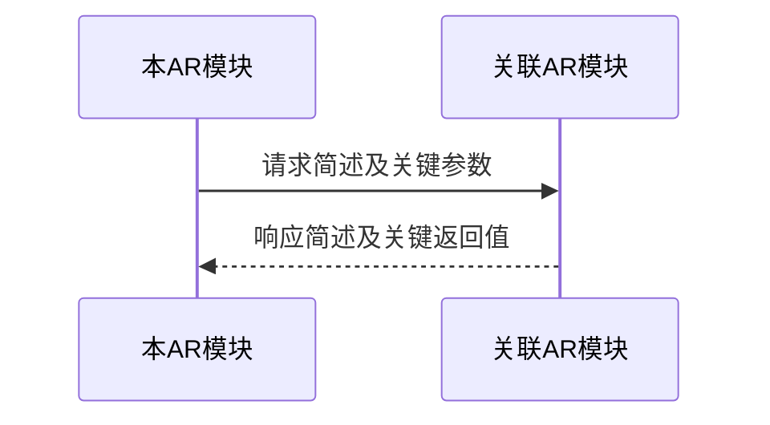

# AR 需求范围说明

## 基本信息

| 字段 | 内容 |
|------|------|
| AR ID | *[填写，如 AR-001]* |
| AR 标题 | *[填写]* |
| 输入模式 | *[新 SR 派生 / 旧 SR 派生 / 直接 AR]* |
| 承接模块 | *[填写]* |
| 来源文档/描述 | *[新 SR 派生填写 AR-split.md 与 SR-design.md；旧 SR 派生填写历史工作单与 SR-design.md；直接 AR 填写 AR 原文、链接或描述来源]* |
| 日期 | *[填写]* |

---

> 模板填写说明：新 SR 派生模式下，AR ID、标题和范围摘要必须从 `AR-split.md` 完整复制；属于该范围的 SR 级技术事实必须从 `SR-design.md` 完整纳入。旧 SR 派生模式下，AR ID、标题来自历史工作单，范围必须标注为“经本次澄清确认”；直接 AR 模式下，将直接 AR 来源中的对应信息和澄清结果写入同一章节。来源没有提供的信息必须标记为"待澄清"或写明已通过澄清补充。

## 1. AR 概述

*[SR 派生模式下，从 `AR-split.md` 复制该 AR 的范围摘要，并结合 `SR-design.md` 的需求背景补充业务上下文。]*

---

## 2. AR 边界说明

*[SR 派生模式下，以 `AR-split.md` 的范围摘要为边界权威；根据 `SR-design.md` 的技术事实补齐功能、数据、接口和异常处理边界。若两者冲突，返回 ar-split，不得自行裁决。]*

| 维度 | 范围内（该 AR 负责） | 范围外（该 AR 不负责） |
|:-----|:---------------------|:-----------------------|
| 功能 | *[具体做什么]* | *[明确不做什么，由哪个 AR 负责]* |
| 数据 | *[管理哪些数据、表]* | *[哪些数据不归该 AR 管，由哪个 AR 负责]* |
| 接口 | *[对外暴露什么接口]* | *[哪些接口由其他 AR 提供]* |
| 异常处理 | *[该 AR 内部处理的异常]* | *[哪些异常应由调用方或依赖方处理]* |

---

## 3. 依赖关系与交互接口

*[从 `SR-design.md` 中提取该 AR 范围涉及的模块依赖和交互接口；AR 间依赖或契约如需新增决策，进入本 AR 的澄清流程，不得反向改写 AR-split.md 的范围。]*

### 3.1 依赖关系

*[该 AR 依赖哪些其他 AR，以及哪些 AR 依赖该 AR。以已确认的范围和 SR 级技术事实为依据；缺少必要决策时进入澄清流程。]*

| 依赖方向 | 关联 AR | 依赖说明 |
|:---------|:--------|:---------|
| 本 AR 依赖 | *[AR ID]* | *[依赖什么]* |
| 依赖本 AR | *[AR ID]* | *[对方依赖本 AR 的什么]* |

### 3.2 交互接口

*[从 SR 设计文档的"AR 间交互接口"章节复制该 AR 涉及的所有交互接口定义，原封不动。每一对依赖关系复制一个子节。]*

#### [本 AR] 与 [关联 AR] 的交互接口

| 交互方向 | 交互方式 | 接口/事件/数据描述 | 关键字段 | 触发条件与时机 | SLA / 超时 |
|:---------|:---------|:-------------------|:---------|:---------------|:-----------|
| *[谁调用谁]* | *[同步接口/异步消息/共享数据]* | *[接口路径或事件名称]* | *[请求关键字段、响应关键字段]* | *[何时调用、调用频率]* | *[填写]* |

**接口契约补充说明**：
- **幂等性要求**：*[哪些接口需要幂等，如何实现]*
- **重试策略**：*[失败后的重试次数、间隔、退避策略]*
- **降级方案**：*[接口不可用时的降级行为]*
- **数据一致性**：*[跨模块或跨需求边界的数据一致性保障方式]*

#### 交互时序图

*[从 SR 设计文档复制该 AR 参与的交互时序图]*

*[文字说明：原封不动复制 SR 设计文档中的时序图说明]*

---

## 4. 功能设计

*[从 SR 设计文档的"功能设计"章节中，提取与该 AR 相关的所有内容，原封不动地复制到以下各子节。]*

### 4.1 主流程

*[复制"功能设计 → 主流程"中该 AR 范围涉及的时序图片段及关键步骤说明；如澄清后存在补充时序图，一并纳入。]*

### 4.2 模块职责

*[复制"模块划分与职责"中该 AR 范围涉及模块的职责描述]*

| 模块 | 变更类型 | 职责 | 对外接口 | 不承担的范围 |
|:-----|:---------|:-----|:---------|:-------------|
| *[该 AR 的承接模块]* | *[复制 SR 原文]* | *[复制 SR 原文]* | *[复制 SR 原文]* | *[复制 SR 原文]* |

### 4.3 功能定位

*[复制"功能设计 → 功能定位"中与该 AR 相关的架构层级与模块位置]*

### 4.4 数据设计

*[复制"功能设计 → 数据设计"中与该 AR 相关的数据模型、存储策略]*

---

## 5. 外部依赖

*[从 SR 设计文档的"外部依赖"章节中，原封不动复制与该 AR 相关的依赖总览及逐接口完整契约，包括基本契约、请求/输入字段、响应/输出字段、错误契约、治理约束、变更差异和条件必填示例。不得压缩回“接口概述”或“关键字段”。]*

---

## 6. 对外接口

*[从 SR 设计文档的"对外接口"章节中，原封不动复制该 AR 范围涉及的接口总览及逐接口完整契约，包括协议专属属性、请求/输入字段、响应/输出字段、错误契约、治理约束、变更差异和条件必填示例。SR 中缺少这些内容时必须返回 SR-design 补齐，不得在本 Skill 中把正式 SR 契约降级为待澄清摘要。]*

---

## 7. DFX 设计

*[从 SR 设计文档的"DFX 设计"章节中，复制与该 AR 相关的内容。]*

### 7.1 异常场景、冲突场景、兼容场景

*[复制"DFX 设计 → 异常场景、冲突场景、兼容场景"中与该 AR 相关的场景]*

### 7.2 可靠性、安全性、可服务性、性能

*[复制"DFX 设计"中与该 AR 相关的可靠性、安全性、可服务性、性能设计要求，含可服务性下与该 AR 相关的配置项与开关。]*

---

## 8. 用例设计

*[基于 SR 中的功能描述和澄清结果，从以下四个维度设计验证场景，用于指导后续详细设计阶段的测试设计。用例聚焦于 AR 的对外行为验证，不涉及内部实现细节。]*

### 8.1 正常用例

*[覆盖主成功场景及正常分支，验证 AR 的核心功能正确性]*

| 用例名称 | 前置条件 | 触发动作 | 预期结果 |
|:---------|:---------|:---------|:---------|
| *[填写]* | *[数据/状态/环境要求]* | *[具体的调用或操作]* | *[系统应有的响应或状态变更]* |

### 8.2 异常用例

*[覆盖 AR 内部处理的异常场景，验证错误处理逻辑]*

| 用例名称 | 前置条件 | 触发动作 | 预期结果 |
|:---------|:---------|:---------|:---------|
| *[填写]* | *[数据/状态/环境要求]* | *[具体的异常触发方式]* | *[系统应有的错误响应或回滚行为]* |

### 8.3 边界用例

*[覆盖边界条件、并发冲突、数据量极限等场景]*

| 用例名称 | 前置条件 | 触发动作 | 预期结果 |
|:---------|:---------|:---------|:---------|
| *[填写]* | *[数据/状态/环境要求]* | *[具体的边界触发方式]* | *[系统应有的行为]* |

### 8.4 依赖交互用例

*[覆盖该 AR 与其他 AR 或外部服务的交互场景，验证接口契约的正确性]*

| 用例名称 | 涉及依赖方 | 前置条件 | 触发动作 | 预期结果 |
|:---------|:-----------|:---------|:---------|:---------|
| *[填写]* | *[依赖的 AR 或外部服务]* | *[数据/状态/环境要求]* | *[具体的调用或消息触发]* | *[系统应有的响应或状态变更]* |

---

## 9. 澄清与补充

*[本章节记录在 AR 澄清过程中，对 SR 设计文档中未明确的内容进行补充和细化的结果。]*

### 9.1 接口定义澄清

*[补充接口的输入输出字段细节、错误码、认证鉴权方式等 SR 中未明确的内容]*

### 9.2 数据模型澄清

*[补充表结构变更细节、字段约束、数据迁移方案等 SR 中未明确的内容]*

### 9.3 业务逻辑澄清

*[补充边界条件、校验规则、异常处理、幂等性等 SR 中未明确的内容]*

### 9.4 模块交互澄清

*[补充调用关系、时序、超时重试策略、降级方案等 SR 中未明确的内容]*

### 9.5 配置与部署澄清

*[补充开关、配置项、环境差异等 SR 中未明确的内容]*

### 9.6 兼容性澄清

*[补充与现有接口/数据的兼容、升级策略等 SR 中未明确的内容]*

---

> **使用说明**：本文件是后续详细设计和开发工作的唯一输入。所有 SR 设计文档中与该 AR 相关的内容已完整复制到本文档，并补充了澄清结果。阅读者无需翻阅 SR 设计文档或其他 AR 的内容。
